Title: LocusQ + Companion Architecture
Document Type: Architecture Specification
Author: APC Codex
Created Date: 2026-03-01
Last Modified Date: 2026-03-01

# LocusQ + Companion Architecture

## 1. Purpose and Audience

This document is the active architecture source of truth for:

- `LocusQ` plugin + standalone runtime (JUCE/C++)
- `LocusQ Head-Tracking Companion` (Swift/macOS)
- associated QA/build/docs governance tooling in this repository

It is written for two readers at once:

- low-context readers who need quick conceptual understanding
- implementation and QA engineers who need contract-level specifics

Normative anchors:

- `.ideas/architecture.md`
- `.ideas/parameter-spec.md`
- `Documentation/invariants.md`
- `Documentation/scene-state-contract.md`
- `Documentation/adr/ADR-0001` through `ADR-0019`

## 2. Executive Snapshot (5-Minute Read)

LocusQ is a tri-mode spatial-audio system with strict real-time constraints and explicit state contracts:

- `CALIBRATE`: measurement, monitoring-path prep, room/profile context
- `EMITTER`: source authoring and scene publication
- `RENDERER`: final spatial output authority and monitoring diagnostics

### 2.1 Reader Lanes

| If you are... | Read first | Then read |
|---|---|---|
| Product/ops/release | Sections 2, 3, 10, 11, 12 | Appendix A |
| Plugin/runtime engineer | Sections 4, 5, 7, 8, 9 | Section 10 |
| Companion engineer | Sections 5, 6, 9, 10, 11 | Section 13 |
| QA engineer | Sections 5, 9, 10, 12 | Appendix B |

### 2.2 Architectural Pillars

1. One process-local `SceneGraph` coordinates inter-instance state.
2. Audio-thread constraints are explicit and non-negotiable.
3. UI path is snapshot-driven with sequence and staleness control.
4. Optional features (`CLAP`, `Steam`, `SOFA`, head tracking) are capability-gated.
5. Claims are evidence-backed through deterministic lane scripts and artifacts.

### 2.3 Current Maturity Snapshot

| Subsystem | Maturity | Notes |
|---|---:|---|
| Plugin mode orchestration | 4/5 | mature, dense transition logic |
| SceneGraph shared-state model | 4/5 | deterministic lock-free patterns |
| Spatial renderer core | 4/5 | broad profile surface, fallback-rich |
| Headphone/HRTF path | 3/5 | good hooks, SOFA completion path active |
| UI bridge and snapshot transport | 4/5 | strong sequencing and stale semantics |
| Companion runtime | 4/5 | clean layering; packet authority migration pending |
| QA/ops gates | 4/5 | broad lane coverage, strong docs gate integration |

## 3. System Context and Container Views

### 3.1 C4 Context View

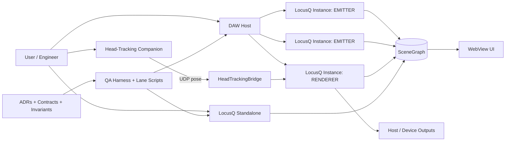

### 3.2 Container View

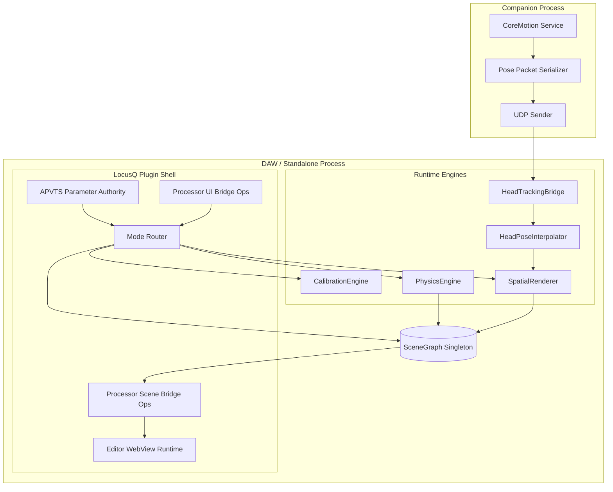

## 4. Runtime Modes and End-to-End Dataflow

### 4.1 Mode Responsibility Table

| Mode | Authority | Typical workload |
|---|---|---|
| `CALIBRATE` | monitoring/calibration control authority | test signals, profile prep, path diagnostics |
| `EMITTER` | emitter-local source state authority | position, motion, physics, scene publish |
| `RENDERER` | final spatial output authority | scene consume, render, profile mapping, diagnostics |

### 4.2 End-to-End Flow

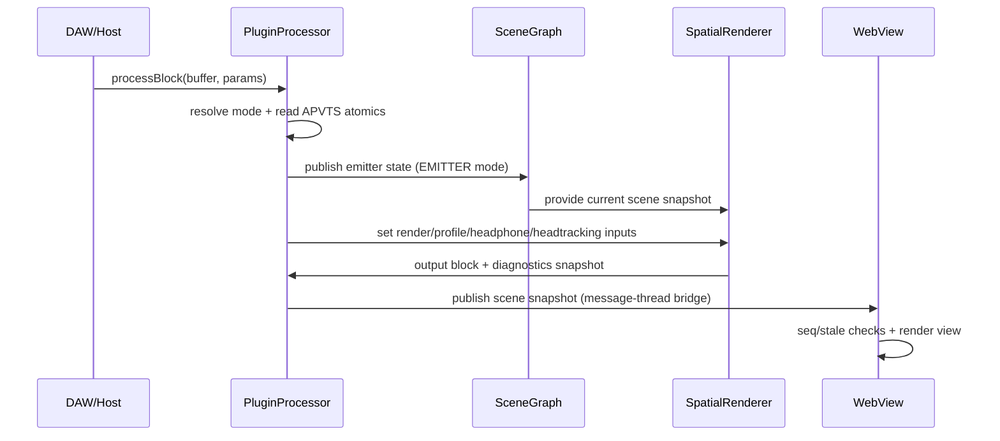

### 4.3 Educational Mental Model

- `EMITTER` authors behavior.
- `SceneGraph` shares state.
- `RENDERER` decides final output behavior.
- UI is an observer/controller, not a DSP authority.

## 5. Core Contracts (Scene, Snapshot, Head-Tracking)

### 5.1 SceneGraph Contract

`Source/SceneGraph.h` defines shared-state rules:

- bounded emitter slots (`MAX_EMITTERS = 256`)
- lock-free per-slot metadata publication
- bounded mono audio handoff snapshot (`MAX_SHARED_AUDIO_SAMPLES = 8192`)
- single renderer registration authority
- atomic room-profile publication

### 5.2 Scene Snapshot Contract (UI Transport)

Source-of-truth:

- `Documentation/scene-state-contract.md`
- `Source/processor_bridge/ProcessorSceneStateBridgeOps.h`

Required semantics:

- schema marker + monotonically increasing sequence
- stale timeout and deterministic stale mode
- additive diagnostics fields tolerated by consumers

Representative payload fragment:

```json
{
  "snapshotSchema": "locusq-scene-snapshot-v1",
  "snapshotSeq": 1482,
  "snapshotCadenceHz": 30,
  "snapshotStaleAfterMs": 500,
  "rendererHeadTrackingEnabled": true,
  "rendererHeadTrackingPoseAvailable": true,
  "rendererHeadTrackingPoseStale": false,
  "rendererSteamAudioAvailable": true
}
```

### 5.3 Head-Tracking Wire Contract

Bridge decode is version-aware (`Source/HeadTrackingBridge.h`):

| Version | Size | Fields |
|---|---:|---|
| v1 | >=36 bytes | quaternion + timestamp + seq |
| v2 | >=52 bytes | v1 + angular velocity xyz + sensor flags |

Transitional architecture state (important):

- companion core model (`PosePacket.swift`) is v2-oriented
- companion executable path still includes explicit v1 packet paths
- plugin bridge intentionally supports both during migration window

### 5.4 Parameter Authority Contract

Authority precedence follows ADR-0003:

1. APVTS/host automation base state
2. timeline-defined rest pose (when enabled)
3. physics additive offsets

## 6. Companion Runtime Architecture

### 6.1 Companion Pipeline

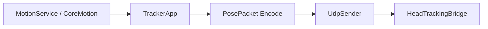

### 6.2 Companion Runtime Sequence

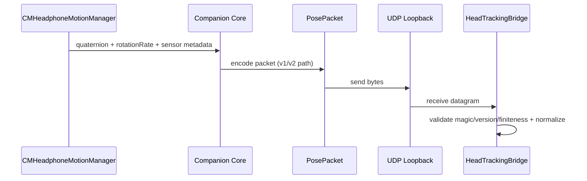

### 6.3 Readiness and Operational States

Companion and bridge diagnostics are expected to express practical operator states:

- `disabled_disconnected`
- `active_not_ready`
- `active_ready`

Gate principle:

- pose streaming and orientation coupling should only be treated as active when readiness and freshness requirements are met.

## 7. Spatial Rendering and Backend Fallbacks

### 7.1 Renderer Chain (Conceptual)

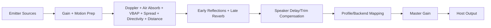

### 7.2 Backend/Capability Summary

| Capability surface | Current architecture stance |
|---|---|
| Steam Audio | compile/runtime gated, explicit init diagnostics |
| SOFA | compile/runtime hook present, staged completion path |
| Headphone profiles | requested/active/fallback telemetry published |
| Output profiles | stereo/quad/surround/ambisonic/codec-placeholder contract surface |

### 7.3 Current Fallback State Machine

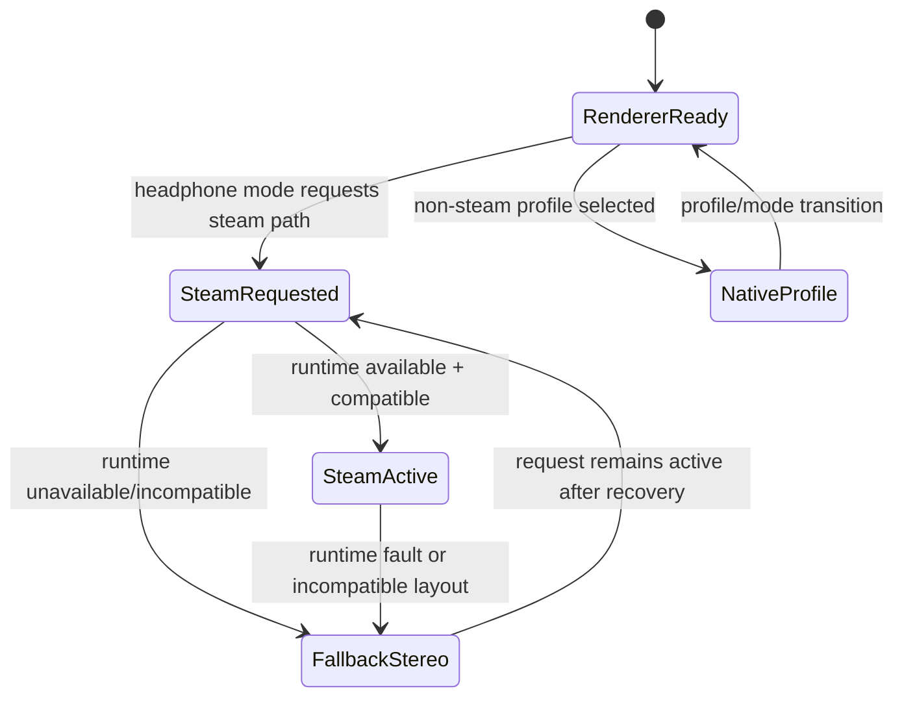

## 8. UI Bridge Architecture and Sequencing

### 8.1 Command and Snapshot Split

Design rule:

- UI sends commands through processor bridge ops.
- processor/runtime publishes snapshots for rendering.
- UI rendering is state-reactive, not authority-owning.

### 8.2 Sequencing and Stale Handling

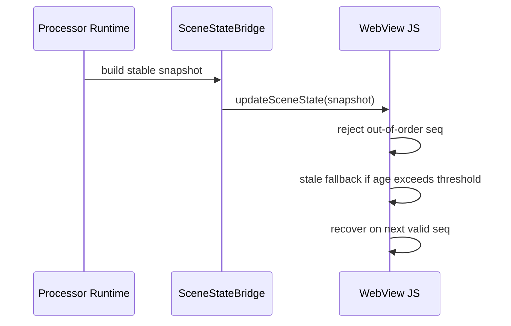

### 8.3 Backend Parity Considerations

| Platform backend | Common parity risk | Mitigation |
|---|---|---|
| `WKWebView` | route/bootstrap timing differences | selftest lanes + deterministic snapshot cadence |
| `WebView2` | bridge callback ordering differences | fallback bridge behavior + parity checks |
| `WebKitGTK` | host integration variance | explicit backend smoke validation |

## 9. Threading, Determinism, and Realtime Invariants

### 9.1 Thread Domain Contracts

| Domain | Responsibilities | Constraints |
|---|---|---|
| Audio thread | DSP render, mode execution, scene publish/consume | no heap alloc, no blocking I/O, avoid lock contention |
| Physics worker | motion integration and publication | bounded cadence, lock-free publication semantics |
| Message/UI thread | bridge serialization and UI dispatch | cannot block audio thread |
| Headtracking receive thread | UDP ingest/decode/ack | publish atomic snapshots, no RT dependencies |

### 9.2 Determinism Rules

1. identical inputs + state should produce equivalent outputs
2. stale/invalid auxiliary data (UI snapshots, pose packets) must degrade deterministically
3. fallback reasons should be explicit in diagnostics

### 9.3 Realtime Budget and Alert Table

| Domain | Budget target | Drift/jitter tolerance | Measurement hook |
|---|---:|---:|---|
| Audio callback | host buffer deadline | 0 misses tolerated in release lanes | host smoke + render traces |
| Physics publish cadence | configured 30/60/120/240 Hz | <=1 tick jitter burst in normal load | scenario replay telemetry |
| UI snapshot cadence | nominal 30 Hz | bounded burst and stale timeout rules | snapshot seq/timing diagnostics |
| Headtracking pose freshness | <=500 ms stale cutoff | stale -> safe fallback immediately | headtracking age/stale fields |

## 10. Operations and Validation Architecture

### 10.1 Architecture-to-Lane Traceability Matrix

| Subsystem | Contract/invariant | Primary lane/script | Artifact anchor | Pass criterion |
|---|---|---|---|---|
| UI snapshot transport | monotonic seq + stale-safe behavior | `scripts/standalone-ui-selftest-production-p0-mac.sh` | `TestEvidence/*selftest*/` | no stale-seq regressions |
| RT safety | no non-allowlisted RT violations | `scripts/rt-safety-audit.sh` | `qa_output/rt_safety/*` | non-allowlisted = 0 |
| Headphone contract | mode/profile requested-active-fallback integrity | `scripts/qa-bl009-headphone-contract-mac.sh` | `TestEvidence/bl009*/` | contract checks PASS |
| Spatial profile matrix | requested/active/stage consistency | `scripts/qa-bl018-profile-matrix-strict-mac.sh` | `TestEvidence/bl018*/` | matrix gates PASS |
| Headtracking fidelity | pose ingest/interp/fallback behavior | `scripts/qa-bl045-headtracking-fidelity-lane-mac.sh` | `TestEvidence/bl045*/` | fidelity gates PASS |
| Orientation injection | companion pose affects virtual path with fallback | `scripts/qa-bl053-head-tracking-orientation-injection-mac.sh` | `TestEvidence/bl053*/` | orientation + fallback gates PASS |
| Docs governance | metadata/tier freshness | `scripts/validate-docs-freshness.sh` | gate log | PASS |

### 10.2 Feature-Gate Coverage Matrix by Platform/Format

| Platform | Formats | CLAP gate | Steam gate | SOFA gate | Headtracking gate |
|---|---|---|---|---|---|
| macOS | VST3, AU, Standalone | `qa-bl011-clap-closeout-mac.sh` | `qa-bl009-*`, `qa-bl052-*` | `qa-bl046-sofa-binaural-lane-mac.sh` | `qa-bl045-*`, `qa-bl053-*` |
| Windows | VST3, Standalone | build/host parity lane (target) | target-state parity lane | target-state parity lane | target-state parity lane |
| Linux | VST3, LV2, Standalone | build parity lane (target) | target-state parity lane | target-state parity lane | target-state parity lane |

Note:

- macOS has the deepest current lane coverage.
- Windows/Linux parity is an explicit forward-looking architecture objective.

### 10.3 Failure Mode and Fallback Observability

| Trigger | Expected fallback | UI/diagnostic signal | Machine field examples | Owner |
|---|---|---|---|---|
| Steam runtime unavailable | deterministic non-steam path | fallback reason shown | `rendererSteamAudioAvailable=false` | renderer |
| Pose stale or missing | identity/safe orientation behavior | stale status + age | `rendererHeadTrackingPoseStale=true` | bridge/renderer |
| Snapshot out-of-order | reject stale snapshot | no visual rollback | `snapshotSeq` monotonic checks | UI bridge |
| Invalid pose packets | ignore packet, keep safe last state | invalid counter increments | `rendererHeadTrackingInvalidPackets` | bridge |
| Profile/layout incompatibility | legal fallback profile/stage | matrix rule status | profile stage + fallback reason fields | renderer |

### 10.4 Determinism and RT Budget Control Table

| Control | Enforcement method | Evidence |
|---|---|---|
| audio-thread hygiene | static/regex audit + lane policy | RT audit outputs |
| replay determinism | multi-run lane replays | validation matrices + replay hashes |
| fallback determinism | explicit taxonomy checks | failure taxonomy tables |
| docs truth consistency | freshness gate | docs freshness log |

### 10.5 Symptom-to-Triage Runbook Table

| Symptom | First command | Likely subsystem | Required artifact | Next escalation |
|---|---|---|---|---|
| UI appears frozen/stale | `scripts/standalone-ui-selftest-production-p0-mac.sh` | UI bridge/snapshot transport | selftest artifact + seq fields | run backend-specific smoke lane |
| Unexpected headphone fallback | `scripts/qa-bl009-headphone-contract-mac.sh` | renderer headphone contract | status + validation matrix | run BL-018 profile matrix lane |
| Headtracking not affecting monitor path | `scripts/qa-bl053-head-tracking-orientation-injection-mac.sh` | bridge/interpolator/renderer integration | BL-053 status + taxonomy | run BL-045 fidelity lane |
| Audio glitch under load | `scripts/rt-safety-audit.sh` | processBlock/RT path | RT report | run host smoke with focused scenario |
| Docs gate blocking closeout | `scripts/validate-docs-freshness.sh` | documentation metadata/tiering | docs freshness log | patch metadata/tier references |

### 10.6 Release Gate Checklist Table

| Gate ID | Must-pass checks | Waiver stance | Evidence packet |
|---|---|---|---|
| RG-01 | build + critical selftest + RT audit | no waiver for RT red | release lane status |
| RG-02 | profile/headphone matrix parity | waiver by owner only | BL-009/BL-018 artifacts |
| RG-03 | headtracking fallback semantics (if enabled) | waiver by owner only | BL-045/BL-053 artifacts |
| RG-04 | docs freshness and status-schema integrity | no waiver for malformed status/docs | docs freshness log + status check |

## 11. Roadmap Architecture (R+1, R+2)

Time horizon assumptions:

- `R+1`: immediate stabilization and contract hardening cycle
- `R+2`: cross-platform parity and capability negotiation hardening cycle

### 11.1 R+1: Head-Tracking Packet Authority Migration

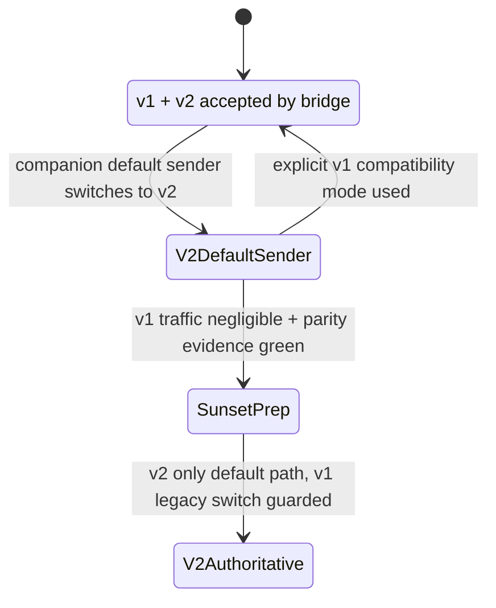

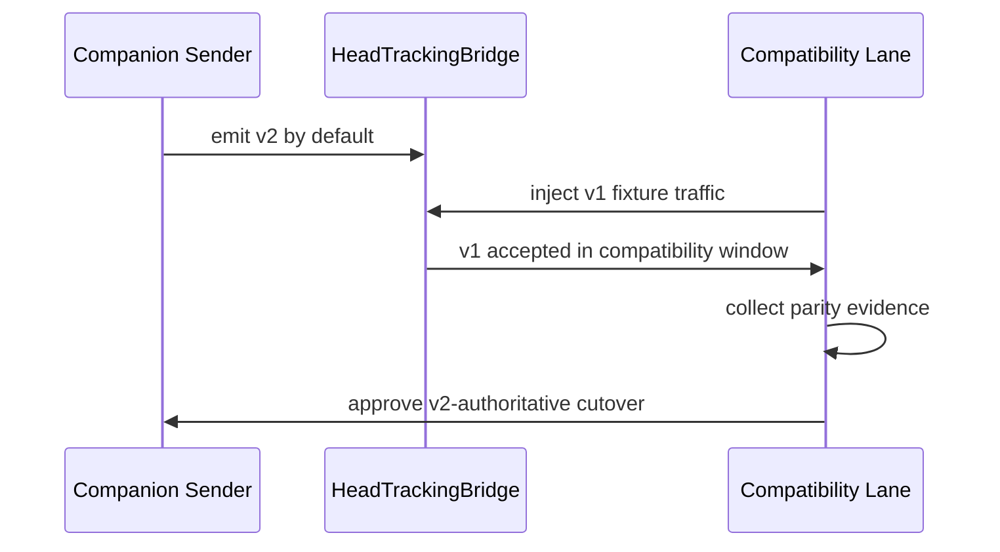

### 11.2 R+1: Renderer Backend Fallback State Machine (Target)

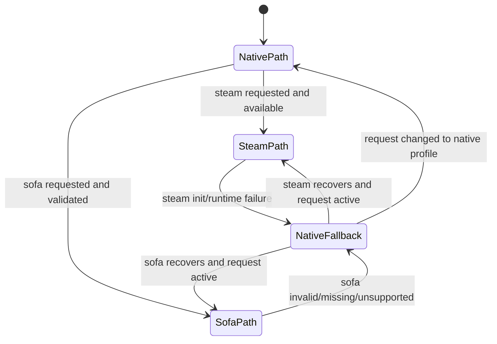

### 11.3 R+2: Capability Negotiation Across Formats

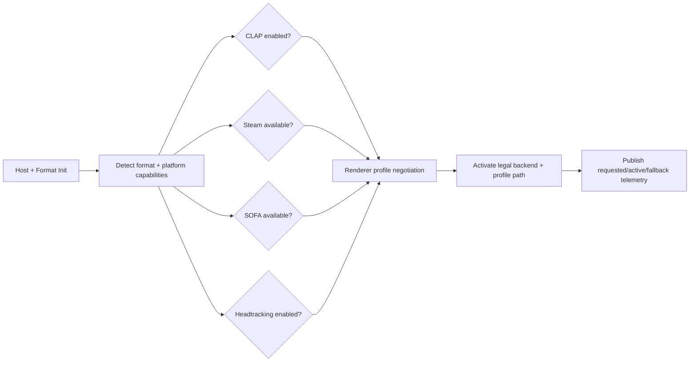

### 11.4 R+2: Contract Versioning Flow

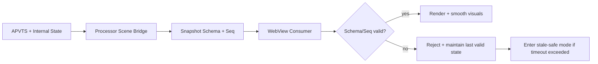

### 11.5 R+2: Validation Topology (Local + CI + Promotion)

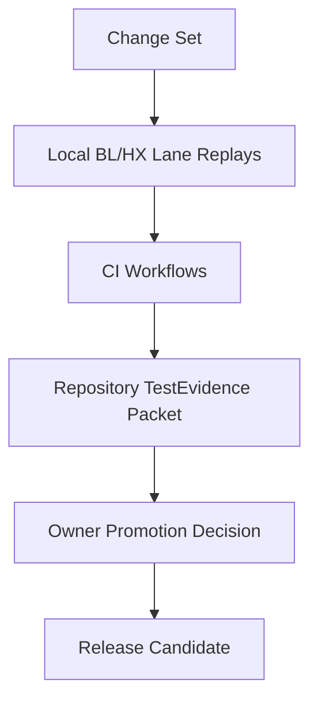

### 11.6 Forward Architecture Deliverables

| Milestone | Deliverable | Acceptance focus |
|---|---|---|
| R+1 | companion v2-authoritative packet path | explicit compatibility evidence for v1 window |
| R+1 | explicit backend fallback reason normalization | consistent telemetry fields across branches |
| R+2 | cross-platform feature-gate parity matrix | macOS/Windows/Linux coverage convergence |
| R+2 | formal schema/version ledger automation | contract-drift prevention in CI |

## 12. Known Tensions and Mitigation Plan

| Tension | Why it matters | Mitigation plan |
|---|---|---|
| packet-version split between companion paths | verification ambiguity across environments | migrate sender default authority to v2 and retain audited compatibility window |
| optional capability combinatorics | large legal state space across platform/format/gate sets | matrix-driven negotiation and lane coverage expansion |
| UI route proliferation risk | contract drift and parity complexity | maintain one canonical production route and explicit legacy status |
| evidence scale and repository weight | cognitive and operational overhead | keep canonical packets local, improve archival and discoverability tooling |

## 13. Research and Ideation Program (Experiment Matrix)

### 13.1 Research-to-Experiment Matrix

| Hypothesis | Experiment design | Metric(s) | Pass threshold | Evidence location |
|---|---|---|---|---|
| adaptive quaternion smoothing improves perceived stability without excess lag | A/B runs: baseline interpolation vs adaptive smoothing | yaw/pitch jitter, onset lag, listener ratings | jitter reduction with no unacceptable lag increase | `TestEvidence/bl053*` and BL-058 manual packets |
| backend fallback transparency reduces triage time | inject deterministic failure triggers (steam unavailable, stale pose, schema reject) | mean time to diagnosis, false diagnosis rate | measurable triage-time reduction across operators | BL-009/018/053 lane artifacts + troubleshooting packet |
| SOFA completion improves profile fidelity for supported devices | compare generic vs device vs SOFA profile output consistency | spectral/phase deltas + listening outcomes | statistically significant fidelity improvement | `TestEvidence/bl046*` + BL-060 protocol outputs |
| cross-platform parity is feasible without contract branching | run equivalent scenario suites across macOS/Windows/Linux | pass-rate parity + fallback parity | contract-level parity within accepted tolerance | future cross-platform parity packets |
| schema drift can be prevented with automated checks | CI schema contract checks against bridge/UI producers/consumers | drift incidents over time | zero unreviewed schema drifts | CI artifacts + release gate evidence |

### 13.2 Lab Note Tone Guidelines for Future Iterations

When extending this architecture doc:

1. include one plain-language explanation and one contract-level explanation per major subsystem
2. include one reproducible experiment entry for each new high-risk feature
3. include explicit pass/fail thresholds and evidence paths for each hypothesis

## Appendix A. ADR Alignment Matrix

| ADR | Decision focus | Architectural enforcement in this document |
|---|---|---|
| ADR-0001 | documentation governance baseline | evidence-backed architecture + metadata discipline |
| ADR-0002 | routing model v1 | SceneGraph-centered inter-instance model |
| ADR-0003 | automation authority precedence | APVTS -> timeline -> physics layering |
| ADR-0004 | v1 AI deferral | no AI in critical audio path |
| ADR-0005 | phase closeout freshness gate | docs/evidence synchronization in operations architecture |
| ADR-0006 | compatibility profiles and monitoring | profile-driven rendering contracts |
| ADR-0007 | emitter directivity/velocity UI exposure | emitter controls and diagnostics in contract tables |
| ADR-0008 | viewport scope staging | staged UI/runtime parity framing |
| ADR-0009 | CLAP closeout consolidation | feature-gate matrix includes CLAP lifecycle surface |
| ADR-0010 | artifact retention policy | canonical vs generated artifact behavior in operations section |
| ADR-0011 | standalone renderer audition source | renderer authority model retained |
| ADR-0012 | renderer domain exclusivity and matrix gating | renderer legal-path contract and fallback gates |
| ADR-0013 | audition authority and cross-mode control | renderer remains DSP authority with proxy control model |
| ADR-0014 | ambisonics/ADM roadmap governance | roadmap architecture explicitly staged |
| ADR-0015 | skill runtime doc standards boundary | docs-governance/runtime boundary reflected in operations contract |
| ADR-0016 | head-tracking wire protocol compatibility and sunset policy | dual-version bridge contract and migration governance |
| ADR-0017 | AUv3 app-extension boundary and lifecycle contract | extension boundary and cross-format parity enforcement posture |
| ADR-0018 | temporal effects realtime architecture contract | temporal DSP safety contract and deterministic guardrails |
| ADR-0019 | custom SOFA profile readiness and fallback contract | requested-vs-active profile governance and fallback semantics |

## Appendix B. Reference Index

Core contracts and architecture inputs:

- `.ideas/architecture.md`
- `.ideas/parameter-spec.md`
- `Documentation/invariants.md`
- `Documentation/scene-state-contract.md`
- `Documentation/spatial-audio-profiles-usage.md`

Primary implementation anchors:

- `CMakeLists.txt`
- `Source/PluginProcessor.h`
- `Source/PluginProcessor.cpp`
- `Source/SceneGraph.h`
- `Source/SpatialRenderer.h`
- `Source/HeadTrackingBridge.h`
- `Source/HeadPoseInterpolator.h`
- `Source/editor_webview/EditorWebViewRuntime.h`
- `Source/processor_bridge/ProcessorSceneStateBridgeOps.h`
- `Source/processor_bridge/ProcessorUiBridgeOps.h`
- `companion/Package.swift`
- `companion/Sources/LocusQHeadTrackingCompanion/main.swift`
- `companion/Sources/LocusQHeadTrackerCore/PosePacket.swift`
- `companion/Sources/LocusQHeadTrackerCore/MotionService.swift`
- `companion/Sources/LocusQHeadTrackerCore/TrackerApp.swift`

Operational lane anchors:

- `scripts/validate-docs-freshness.sh`
- `scripts/rt-safety-audit.sh`
- `scripts/standalone-ui-selftest-production-p0-mac.sh`
- `scripts/qa-bl009-headphone-contract-mac.sh`
- `scripts/qa-bl018-profile-matrix-strict-mac.sh`
- `scripts/qa-bl045-headtracking-fidelity-lane-mac.sh`
- `scripts/qa-bl053-head-tracking-orientation-injection-mac.sh`
- `qa/scenarios/*.json`

## Appendix C. Maintenance Prompts (Agent-Only)

### C.1 Full Fact Refresh Prompt

```text
Goal: refresh ARCHITECTURE.md facts without changing scope claims.

Tasks:
1) Re-audit top-level and major subsystem directories.
2) Re-verify CMake platform/format/gate settings.
3) Re-verify core contract fields in scene snapshot and headtracking transport.
4) Update diagrams/tables where drift is detected.
5) Run ./scripts/validate-docs-freshness.sh and report result.
```

### C.2 Contract Deepening Prompt

```text
Goal: deepen contract and operations sections while preserving reader-lane clarity.

Tasks:
1) Expand fallback observability table with any new diagnostics fields.
2) Update architecture-to-lane matrix for any newly added BL/HX scripts.
3) Update roadmap diagrams if packet/schema/gating strategy changed.
4) Keep statements grounded in repository files only.
5) Run docs freshness gate.
```

## Appendix D. Archived Review Inputs

Archived architecture review sources consolidated into this document:

- `Documentation/archive/2026-03-01-architecture-review-consolidation/reviews/2026-02-26-full-architecture-review.md`
- `Documentation/archive/2026-03-01-architecture-review-consolidation/reviews/LocusQ Repo Review 02262026.md`

## Appendix E. Repo Surface Map (Non-Normative)

This appendix is for orientation only. Canonical architecture behavior is defined by sections 1-13 and appendices A-D.

| Path | File count (audit snapshot) | Role |
|---|---:|---|
| `Source/` | 75 | plugin/runtime/editor source |
| `Source/ui/` | 29 | production + incremental WebView assets |
| `companion/` | 325 | companion source + local outputs |
| `qa/` | 91 | harness adapters + scenarios |
| `scripts/` | 72 | lane/build/governance scripts |
| `Documentation/` | 272 | ADR/backlog/testing/research docs |
| `TestEvidence/` | 61018 | generated validation artifacts |
