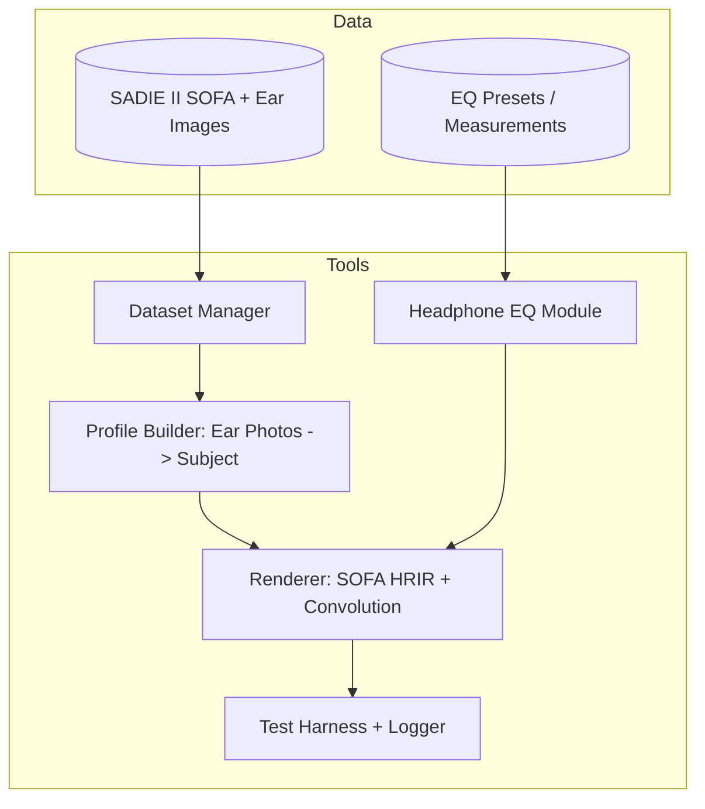

Title: LocusQ Spatial Audio Calibration & Rendering Spec (v0.1)
Document Type: Technical Specification
Author: APC Codex
Created Date: 2026-02-27
Last Modified Date: 2026-02-27

# LocusQ Spatial Audio Calibration & Rendering Spec (v0.1)

**Scope:** Build a reproducible end‑to‑end pipeline for headphone spatial audio that works on *any* headphones by separating:
- **User profile** (HRTF/HRTF-proxy personalization)  
- **Headphone profile** (model-based EQ / HpTF compensation)

This spec covers a **prototype-to-product** path:
1) SOFA-based binaural renderer using **SADIE II** HRTFs  https://zenodo.org/records/10886409, https://zenodo.org/records/12092466, https://www.york.ac.uk/sadie-project/database.html
2) First-pass **ear-photo nearest-neighbor** user profile selection  
3) Separate **Sony WH‑1000XM5** headphone EQ module (model-based; not personalized)  
4) A controlled listening test harness to validate improvements  
5) A roadmap toward morphing / ML personalization once measurement + evaluation loops are proven

---

## 0. Status, owners, deliverables

**Status:** Draft (implementation-ready)

**Primary deliverables**
- A reference **SOFA renderer** (offline WAV → binaural WAV)  
- A **profile selection tool** (ear photos → chosen SADIE II subject HRTF)  
- A **headphone EQ module** with initial **WH‑1000XM5** preset  
- A **test harness** + experiment plan (generic vs personalized, with/without EQ)

**Out of scope for v0.1**
- Real-time head-tracked rendering on mobile (supported by architecture, but not required)  
- On-device photogrammetry / depth fusion (ear photos are enough for first pass)  
- Personalized HpTF (requires in-ear mic or external measurement rig)

---

## 1. Background and key constraints

### 1.1 Why SOFA
SOFA (AES69) is the de-facto standard container for HRTFs/HRIRs and is supported by multiple libraries (e.g., **libmysofa**) and datasets. https://github.com/hoene/libmysofa

### 1.2 Why SADIE II for the baseline
SADIE II includes:
- HRIR/HRTF in **SOFA** and WAV formats  
- Hi-res ear images and 3D head scans (critical for personalization R&D)  
- Public distribution and explicit licensing (Apache 2.0)
https://www.york.ac.uk/sadie-project/database.html
SADIE II also documents its measurement angles and coordinate conventions:
- **Azimuth:** 0° is in front; positive is anti-clockwise (to the listener’s **left**)  
- **Elevation:** positive above the horizontal plane  
These conventions must be preserved end-to-end, or your renderer will “sound wrong” even if the math is correct.

---

## 2. Goals and non-goals

### 2.1 Goals (MVP = “something real”)
1. **Renderer**: Given a mono signal + direction (azimuth/elevation), produce binaural stereo using an HRTF loaded from a SOFA file.
2. **Generic baseline**: Provide a stable default HRTF (a chosen SADIE II subject or computed “median” subject).
3. **User personalization v0**: Choose a subject HRTF via ear-photo nearest-neighbor matching (fast, not perfect).
4. **Headphone EQ module**: Apply a headphone-model EQ (starting with WH‑1000XM5).
5. **Evaluation loop**: Run controlled listening tests to determine if personalization and/or EQ improves:
   - externalization (“out of head”)
   - front/back confusion rate
   - preference
   - perceived timbral naturalness

### 2.2 Non-goals (v0.1)
- “Perfect” personalization. The aim is measurable improvement over generic for a meaningful subset of users.
- Copying private Apple workflows. This is a clean-room, dataset-driven implementation.

---

## 3. Definitions (short, no nonsense)

- **HRTF**: Head-Related Transfer Function (frequency-domain representation of direction cues).
- **HRIR**: Head-Related Impulse Response (time-domain filter; convolve with audio).
- **SOFA**: Spatially Oriented Format for Acoustics (AES69 standard).
- **Binaural rendering**: turning an audio source into left/right ear signals using HRIRs.
- **HpTF**: Headphone Transfer Function (how a headphone colors sound at the eardrum).
- **Headphone EQ compensation**: inverse-ish filter applied to reduce headphone coloration.
- **Personalization**: selecting or morphing an HRTF based on user anatomy and/or perception.

---

## 4. System architecture

### 4.1 High-level data flow

```mermaid
flowchart LR
    A[Audio Source Mono] --> B[Spatial Renderer]
    C[User Profile (HRTF selection)] --> B
    D[Headphone Profile (EQ)] --> B
    B --> E[Binaural Stereo Output]
```

### 4.2 Internal components



---

## 5. Dataset spec: SADIE II ingestion

### 5.1 Required assets
For each SADIE II subject:
- `HRIR_SOFA` file (SimpleFreeFieldHRIR convention)
- left/right ear photos (hi-res images)
- optional anthropometrics (head scan, measurements)

### 5.2 Dataset Manager responsibilities
- Build a **manifest** of subjects and file paths
- Validate SOFA conventions and required fields
- Normalize all audio to a single internal sample rate (recommend: **48 kHz** for v0.1)
- Expose programmatic access:
  - list subjects
  - load HRIRs + angles
  - locate ear images

### 5.3 Manifest format (JSON)
```json
{
  "dataset": "SADIE_II",
  "version": "2-1",
  "license": "Apache-2.0",
  "root": "/path/to/sadie",
  "subjects": [
    {
      "id": "H3",
      "sofa_hrir": "H3_HRIR_SOFA/H3.sofa",
      "ear_left": "H3_EAR/left.jpg",
      "ear_right": "H3_EAR/right.jpg"
    }
  ]
}
```

**Note:** SADIE II folders/filenames can vary by release; do not hardcode assumptions. The manifest is the contract.

---

## 6. Renderer spec (SOFA → binaural)

### 6.1 Renderer modes
- **Offline render (v0.1):** WAV-in → WAV-out (fast to validate)
- **Streaming render (v0.2+):** frame-based audio callback with partitioned convolution

### 6.2 Renderer inputs
- `audio_mono`: float32 array, shape `(N,)`
- `source_direction`: `(az_deg, el_deg)` in SADIE coordinate convention
- `hrtf`: a loaded SOFA dataset (HRIR set for one subject)
- `headphone_profile`: optional parametric EQ applied **per output channel**
- `interp_mode`: `"nearest"` (v0.1), `"barycentric"` or `"libmysofa"` (v0.2+)

### 6.3 Renderer outputs
- `audio_stereo`: float32 array, shape `(N + L - 1, 2)` where `L` is HRIR length

### 6.4 Coordinate conventions (must match SADIE II)
- `az_deg`: 0° front, +90° left, -90° right, ±180° behind
- `el_deg`: 0° horizontal plane, +90° above, -90° below

### 6.5 HRTF selection / interpolation
**v0.1 default:** nearest-neighbor on the sphere
- Convert each measurement position `(az, el)` to a unit vector.
- Convert query `(az, el)` similarly.
- Select index with maximum dot product (smallest angular distance).

**v0.2 option:** use `libmysofa` filter interpolation
- `libmysofa` can look up and interpolate HRIRs for arbitrary orientations.

### 6.6 Convolution approach
**Offline (v0.1):** FFT convolution (scipy)
- `yL = fftconvolve(x, hL)`
- `yR = fftconvolve(x, hR)`

**Streaming (v0.2):** uniformly partitioned convolution
- Partition HRIR into blocks (e.g., 128 or 256 samples)
- Maintain overlap-add buffers
- Update filters when head/source moves (crossfade blocks to avoid zipper noise)

### 6.7 Gain staging and clipping
- Treat all signals as float32
- Apply a conservative **preamp/headroom** (especially when EQ boosts)
- Optional safety limiter in evaluation builds

---

## 7. User personalization v0: ear-photo nearest neighbor

### 7.1 Goal
Given a user’s left/right ear photos, choose the “closest” SADIE II subject and use their SOFA HRIR set as the user profile.

This is explicitly a *proxy* for HRTF personalization (selection, not morphing).

### 7.2 v0 capture requirements (pragmatic)
- Left ear photo + Right ear photo
- Consistent lighting, minimal occlusion (hair, earrings)
- A guided frame overlay (user aligns ear; manual crop acceptable for v0)

### 7.3 Feature extraction (v0 options)
**Option A (recommended): pretrained CNN embedding**
- Use a pretrained image encoder (e.g., MobileNetV3/EfficientNet) to produce embeddings.
- L2-normalize embeddings.
- Similarity metric: cosine similarity.

**Option B (fallback): classic CV embedding**
- HOG / ORB features + bag-of-visual-words (works without PyTorch, lower quality).

v0 should bias toward shipping and collecting real-world data, not chasing perfect models.

### 7.4 Similarity scoring
Compute:
- `sim_left = cos(e_user_left, e_subject_left)`
- `sim_right = cos(e_user_right, e_subject_right)`
- `score = 0.5 * (sim_left + sim_right)`

Pick top-`k` subjects (e.g., `k=5`), then:
- choose top-1, or
- use a small listening test to disambiguate among top-k.

### 7.5 User profile format
```json
{
  "version": "1",
  "created_at": "2026-02-27T00:00:00Z",
  "dataset": "SADIE_II",
  "selection_method": "ear_photo_nearest_neighbor",
  "embedding_model": "mobilenetv3_large_imagenet_v1",
  "selected_subject_id": "H3",
  "topk": [
    {"subject_id": "H3", "score": 0.812},
    {"subject_id": "H7", "score": 0.801}
  ]
}
```

### 7.6 Privacy constraints (product-quality baseline)
- Do not store raw photos by default.
- Store only hashes + derived embeddings (unless user opts in).
- Make “delete profile” immediate and real.

---

## 8. Headphone EQ module (separate from HRTF)

### 8.1 Design principle
Headphone EQ corrects the *headphone*, not the user’s anatomy. It is separate and composable.

### 8.2 Where EQ is applied
Apply **after** binaural rendering, per channel:

```
mono source -> (HRTF convolution -> stereo) -> (headphone EQ L/R) -> headphone -> ears
```

This matches the physical chain (headphone acts after HRTF cues are formed).

### 8.3 Model-based EQ for Sony WH‑1000XM5 (initial preset)
Use an AutoEq parametric preset (oratory1990 measurement source) as a baseline. https://raw.githubusercontent.com/jaakkopasanen/AutoEq/master/results/oratory1990/over-ear/Sony%20WH-1000XM5/Sony%20WH-1000XM5%20ParametricEQ.txt

https://github.com/jaakkopasanen/AutoEq

**Preset (Parametric EQ)**
- Preamp: -6.2 dB
- Filter 1: LSC Fc 105 Hz Gain -3.2 dB Q 0.70
- Filter 2: PK  Fc 2448 Hz Gain  6.9 dB Q 2.46
- Filter 3: PK  Fc 173 Hz Gain -5.6 dB Q 0.96
- Filter 4: PK  Fc 3028 Hz Gain -5.4 dB Q 2.03
- Filter 5: PK  Fc 1327 Hz Gain  3.3 dB Q 0.58
- Filter 6: HSC Fc 10000 Hz Gain 4.9 dB Q 0.70
- Filter 7: PK  Fc 6110 Hz Gain -2.3 dB Q 5.81
- Filter 8: PK  Fc 875 Hz Gain -1.2 dB Q 4.07
- Filter 9: PK  Fc 1197 Hz Gain  1.0 dB Q 3.28
- Filter 10: PK Fc 63 Hz Gain 0.4 dB Q 2.13

**Critical caveat:** Bluetooth/ANC headphones can change response with mode, fit, and seal. For WH‑1000XM5, seal disruption (e.g., glasses) can measurably reduce bass. Your EQ should be treated as “best effort” unless you standardize mode (ANC on/off) and validate it.
https://www.rtings.com/headphones/reviews/sony/wh-1000xm5-wireless
### 8.4 EQ API
```python
class HeadphoneEQ:
    def __init__(self, sample_rate: int, preset: dict): ...
    def process_stereo(self, y: np.ndarray) -> np.ndarray: ...
```

---

## 9. Controlled listening tests (validation loop)

### 9.1 Core comparisons (within-subject)
Four conditions:
1) **Generic HRTF**, no headphone EQ  
2) **Generic HRTF**, with headphone EQ  
3) **Personalized selection**, no headphone EQ  
4) **Personalized selection**, with headphone EQ  

### 9.2 Test stimuli
Use short, repeatable clips:
- Speech (male/female)
- Percussive clicks (localization sensitive)
- Pink noise bursts (timbre + spatial)
- Simple music excerpts (avoid copyrighted distribution; participants can load local files)

Spatial scenes:
- Static source at 0°, ±30°, ±60°, 180° (front/back confusion check)
- Horizontal rotation sweep
- Elevation sweep (optional; elevation is harder)

### 9.3 Task formats
- **ABX** (can participants distinguish A vs B?)
- **MUSHRA-like** preference rating (0–100) for externalization/naturalness
- **Localization pointing** (choose perceived azimuth/elevation)

### 9.4 Randomization and blinding
- Randomize condition order per trial
- Double-blind: hide which profile is active
- Counterbalance to avoid fatigue bias

### 9.5 Logging schema
```json
{
  "participant_id": "anon_123",
  "trial_id": "t045",
  "stimulus": "speech_02",
  "scene": "front_back_static",
  "condition": "personalized+eq",
  "rating_externalization": 73,
  "rating_timbre": 61,
  "choice_front_back": "front",
  "timestamp": "2026-02-27T00:00:00Z"
}
```

### 9.6 “Pass/fail” definition for v0.1
- At least **some** statistically meaningful improvement in externalization and/or preference for a subset of users vs generic.
- No systematic regression (e.g., personalization consistently worse).

---

## 10. Implementation: reference Python prototype

This is an **offline** renderer. It is enough to validate:
- SOFA parsing
- directional HRIR selection
- convolution pipeline
- headphone EQ integration

### 10.1 Dependencies
```bash
pip install numpy scipy soundfile h5py pyyaml
# Optional (ear embedding)
pip install torch torchvision pillow
```

### 10.2 Reference repo layout (suggested)
```
locusq_spatial/
  README.md
  locusq/
    __init__.py
    sofa_loader.py
    hrir_select.py
    renderer_offline.py
    eq_biquad.py
    eq_presets/
      sony_wh1000xm5_autoeq_oratory.yaml
    ear_embed.py
    profile_select.py
  tools/
    build_sadie_manifest.py
    precompute_ear_embeddings.py
```

### 10.3 Code: SOFA loader (SimpleFreeFieldHRIR)
```python
# locusq/sofa_loader.py
from __future__ import annotations
import h5py
import numpy as np
from dataclasses import dataclass
from typing import Tuple

@dataclass(frozen=True)
class SofaHrir:
    sample_rate: int
    ir: np.ndarray           # shape (M, R, N) where R=2 (L,R)
    src_pos_deg_m: np.ndarray # shape (M, 3) [az_deg, el_deg, r_m]

def load_sofa_hrir(path: str) -> SofaHrir:
    with h5py.File(path, "r") as f:
        ir = f["Data.IR"][:]  # (M, R, N)
        fs = int(np.array(f["Data.SamplingRate"][:]).squeeze())
        src_pos = f["SourcePosition"][:]  # (M, 3)
        # Expect spherical coords in degrees, degrees, meter (common in SOFA HRTF files)
        # Robustness: some files may store radians; validate via attrs if present.
        return SofaHrir(sample_rate=fs, ir=ir.astype(np.float32), src_pos_deg_m=src_pos.astype(np.float32))
```

### 10.4 Code: nearest-neighbor HRIR selection
```python
# locusq/hrir_select.py
from __future__ import annotations
import numpy as np
from typing import Tuple
from .sofa_loader import SofaHrir

def _sph_to_unit(az_deg: np.ndarray, el_deg: np.ndarray) -> np.ndarray:
    az = np.deg2rad(az_deg)
    el = np.deg2rad(el_deg)
    # x: front, y: left, z: up
    x = np.cos(el) * np.cos(az)
    y = np.cos(el) * np.sin(az)
    z = np.sin(el)
    v = np.stack([x, y, z], axis=-1)
    # normalize
    return v / (np.linalg.norm(v, axis=-1, keepdims=True) + 1e-12)

def select_hrir_nearest(sofa: SofaHrir, az_deg: float, el_deg: float) -> Tuple[np.ndarray, np.ndarray, int]:
    src = sofa.src_pos_deg_m
    v_all = _sph_to_unit(src[:, 0], src[:, 1])  # (M,3)
    v_q = _sph_to_unit(np.array([az_deg]), np.array([el_deg]))[0]  # (3,)
    # Max dot product => smallest angle
    idx = int(np.argmax(v_all @ v_q))
    hL = sofa.ir[idx, 0, :].copy()
    hR = sofa.ir[idx, 1, :].copy()
    return hL, hR, idx
```

### 10.5 Code: biquad parametric EQ (RBJ cookbook)
```python
# locusq/eq_biquad.py
from __future__ import annotations
import numpy as np
from dataclasses import dataclass
from typing import List, Literal

FilterType = Literal["PK", "LSC", "HSC"]

@dataclass(frozen=True)
class BiquadSpec:
    type: FilterType
    fc_hz: float
    gain_db: float
    q: float

def _db_to_a(gain_db: float) -> float:
    return 10.0 ** (gain_db / 40.0)

def design_biquad(spec: BiquadSpec, fs: int):
    w0 = 2.0 * np.pi * (spec.fc_hz / fs)
    cosw0 = np.cos(w0)
    sinw0 = np.sin(w0)
    alpha = sinw0 / (2.0 * spec.q)
    A = _db_to_a(spec.gain_db)

    if spec.type == "PK":
        b0 = 1 + alpha * A
        b1 = -2 * cosw0
        b2 = 1 - alpha * A
        a0 = 1 + alpha / A
        a1 = -2 * cosw0
        a2 = 1 - alpha / A

    elif spec.type == "LSC":
        # Low shelf, RBJ
        sqrtA = np.sqrt(A)
        beta = np.sqrt(A) / spec.q
        b0 =    A*((A+1) - (A-1)*cosw0 + beta*sinw0)
        b1 =  2*A*((A-1) - (A+1)*cosw0)
        b2 =    A*((A+1) - (A-1)*cosw0 - beta*sinw0)
        a0 =       (A+1) + (A-1)*cosw0 + beta*sinw0
        a1 =   -2*((A-1) + (A+1)*cosw0)
        a2 =       (A+1) + (A-1)*cosw0 - beta*sinw0

    elif spec.type == "HSC":
        # High shelf, RBJ
        sqrtA = np.sqrt(A)
        beta = np.sqrt(A) / spec.q
        b0 =    A*((A+1) + (A-1)*cosw0 + beta*sinw0)
        b1 = -2*A*((A-1) + (A+1)*cosw0)
        b2 =    A*((A+1) + (A-1)*cosw0 - beta*sinw0)
        a0 =       (A+1) - (A-1)*cosw0 + beta*sinw0
        a1 =    2*((A-1) - (A+1)*cosw0)
        a2 =       (A+1) - (A-1)*cosw0 - beta*sinw0

    else:
        raise ValueError(f"Unsupported filter type: {spec.type}")

    b = np.array([b0, b1, b2], dtype=np.float64) / a0
    a = np.array([1.0, a1/a0, a2/a0], dtype=np.float64)
    return b.astype(np.float64), a.astype(np.float64)

def process_biquad(x: np.ndarray, b: np.ndarray, a: np.ndarray) -> np.ndarray:
    # Direct Form I (stable enough for v0); for production prefer DF2T and denorm protection
    y = np.zeros_like(x, dtype=np.float64)
    x1 = x2 = 0.0
    y1 = y2 = 0.0
    b0, b1, b2 = b
    _, a1, a2 = a
    for n in range(len(x)):
        xn = float(x[n])
        yn = b0*xn + b1*x1 + b2*x2 - a1*y1 - a2*y2
        y[n] = yn
        x2, x1 = x1, xn
        y2, y1 = y1, yn
    return y.astype(np.float32)

def apply_peq_stereo(y_stereo: np.ndarray, fs: int, preamp_db: float, filters: List[BiquadSpec]) -> np.ndarray:
    y = y_stereo.astype(np.float32)
    y *= (10.0 ** (preamp_db / 20.0))
    for ch in (0, 1):
        x = y[:, ch]
        for spec in filters:
            b, a = design_biquad(spec, fs)
            x = process_biquad(x, b, a)
        y[:, ch] = x
    return y
```

### 10.6 Code: Offline renderer (mono → binaural)
```python
# locusq/renderer_offline.py
from __future__ import annotations
import numpy as np
import soundfile as sf
from scipy.signal import fftconvolve, resample_poly
import yaml

from .sofa_loader import load_sofa_hrir
from .hrir_select import select_hrir_nearest
from .eq_biquad import BiquadSpec, apply_peq_stereo

def _to_mono(x: np.ndarray) -> np.ndarray:
    if x.ndim == 1:
        return x
    return x.mean(axis=1)

def render_binaural_offline(
    sofa_path: str,
    input_wav: str,
    output_wav: str,
    az_deg: float,
    el_deg: float,
    headphone_preset_yaml: str | None = None,
):
    sofa = load_sofa_hrir(sofa_path)
    x, fs_in = sf.read(input_wav, dtype="float32")
    x = _to_mono(np.asarray(x))
    if fs_in != sofa.sample_rate:
        # Resample to match HRIR sample rate (v0 approach)
        x = resample_poly(x, sofa.sample_rate, fs_in).astype(np.float32)

    hL, hR, idx = select_hrir_nearest(sofa, az_deg, el_deg)

    yL = fftconvolve(x, hL, mode="full").astype(np.float32)
    yR = fftconvolve(x, hR, mode="full").astype(np.float32)
    y = np.stack([yL, yR], axis=1)

    if headphone_preset_yaml:
        preset = yaml.safe_load(open(headphone_preset_yaml, "r"))
        preamp_db = float(preset["preamp_db"])
        filters = [BiquadSpec(**f) for f in preset["filters"]]
        y = apply_peq_stereo(y, sofa.sample_rate, preamp_db=preamp_db, filters=filters)

    # Safety normalization (optional; avoid in lab tests unless you normalize all conditions consistently)
    peak = float(np.max(np.abs(y)) + 1e-12)
    if peak > 0.99:
        y *= (0.99 / peak)

    sf.write(output_wav, y, sofa.sample_rate, subtype="PCM_24")
    return idx
```

### 10.7 WH‑1000XM5 preset file (YAML)
```yaml
# locusq/eq_presets/sony_wh1000xm5_autoeq_oratory.yaml
preamp_db: -6.2
filters:
  - {type: "LSC", fc_hz: 105.0, gain_db: -3.2, q: 0.70}
  - {type: "PK",  fc_hz: 2448.0, gain_db:  6.9, q: 2.46}
  - {type: "PK",  fc_hz: 173.0,  gain_db: -5.6, q: 0.96}
  - {type: "PK",  fc_hz: 3028.0, gain_db: -5.4, q: 2.03}
  - {type: "PK",  fc_hz: 1327.0, gain_db:  3.3, q: 0.58}
  - {type: "HSC", fc_hz: 10000.0,gain_db:  4.9, q: 0.70}
  - {type: "PK",  fc_hz: 6110.0, gain_db: -2.3, q: 5.81}
  - {type: "PK",  fc_hz: 875.0,  gain_db: -1.2, q: 4.07}
  - {type: "PK",  fc_hz: 1197.0, gain_db:  1.0, q: 3.28}
  - {type: "PK",  fc_hz: 63.0,   gain_db:  0.4, q: 2.13}
```

### 10.8 Minimal CLI entrypoint
```python
# tools/render.py
import argparse
from locusq.renderer_offline import render_binaural_offline

def main():
    ap = argparse.ArgumentParser()
    ap.add_argument("--sofa", required=True)
    ap.add_argument("--inwav", required=True)
    ap.add_argument("--outwav", required=True)
    ap.add_argument("--az", type=float, default=0.0)
    ap.add_argument("--el", type=float, default=0.0)
    ap.add_argument("--eq", default=None, help="Path to headphone EQ preset YAML")
    args = ap.parse_args()

    idx = render_binaural_offline(args.sofa, args.inwav, args.outwav, args.az, args.el, args.eq)
    print(f"Rendered using measurement index {idx}")

if __name__ == "__main__":
    main()
```

---

## 11. Ear-photo nearest neighbor (reference implementation sketch)

This is intentionally “v0 pragmatic.” It should be good enough to:
- pick plausible neighbors
- generate user profiles
- fuel the listening test loop

### 11.1 Precompute dataset embeddings
- For each SADIE subject, compute embeddings for left/right ear images.
- Store as `npz` (subject_id → embeddings).

### 11.2 Compute user embeddings and select nearest
- Compute embeddings for user left/right photos.
- Compute similarity to each subject.
- Output a `user_profile.json`.

### 11.3 Code sketch (PyTorch)
```python
# locusq/ear_embed.py (sketch)
import numpy as np
from PIL import Image
import torch
import torchvision.transforms as T
from torchvision.models import mobilenet_v3_large

def build_encoder(device="cpu"):
    model = mobilenet_v3_large(weights="DEFAULT")
    model.classifier = torch.nn.Identity()  # embedding
    model.eval().to(device)
    tfm = T.Compose([
        T.Resize((224,224)),
        T.ToTensor(),
        T.Normalize(mean=[0.485,0.456,0.406], std=[0.229,0.224,0.225]),
    ])
    return model, tfm

@torch.no_grad()
def embed_image(path: str, model, tfm, device="cpu") -> np.ndarray:
    img = Image.open(path).convert("RGB")
    x = tfm(img).unsqueeze(0).to(device)
    e = model(x).cpu().numpy().reshape(-1).astype(np.float32)
    e /= (np.linalg.norm(e) + 1e-12)
    return e
```

---

## 12. Roadmap: morphing / ML personalization (after validation)

Once v0 proves the loop (renderer + profile selection + test harness):
1) **Top‑K + micro-listening test**: use ear-photo to narrow candidates; then pick best via quick perceptual choices.
2) **HRTF morphing**: learn a low-dimensional HRTF basis (e.g., PCA on magnitude + ITD) and predict coefficients from ear features.
3) **Mesh/depth models**: incorporate head/ear 3D if available (LiDAR/TrueDepth equivalents).
4) **Personalized HpTF**: add optional measurement workflow for advanced users (in-ear mic / calibration rig).

---

## 13. Known risks and mitigations

1) **Dataset mismatch** (SADIE subjects differ from your users):  
   Mitigation: allow importing additional SOFA datasets; do not lock to one.
2) **Bluetooth headphone DSP changes response** (ANC / ambient / EQ state):  
   Mitigation: standardize test conditions; document supported modes; consider separate EQ presets per mode.
3) **Ear-photo embeddings are not ear-specific** (ImageNet features are blunt):  
   Mitigation: collect opt-in data, fine-tune an ear-specific embedding model later.
4) **Wrong coordinate conventions** silently ruins everything:  
   Mitigation: include “sanity scenes” (front should sound front; left should be left) as automated tests.

---

## 14. References (primary sources)

- SADIE II Database page (content, coordinate conventions, available assets)  
- SADIE II Zenodo record (versioning + Apache 2.0 license)  
- libmysofa (SOFA/AES69 reader + interpolation)  
- SOFA conventions “Software and APIs” (Python packages, library pointers)  
- AutoEq preset source for WH‑1000XM5 (parametric EQ text)  
- RTINGS guidance + notes on BT headphone EQ challenges and seal/fit consistency

(Include these as links in your internal doc set; avoid scraping/copying large text.)

https://www.york.ac.uk/sadie-project/ambidec.html
