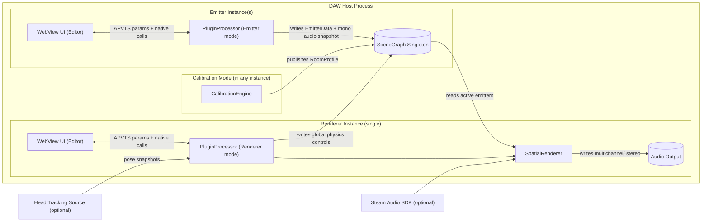
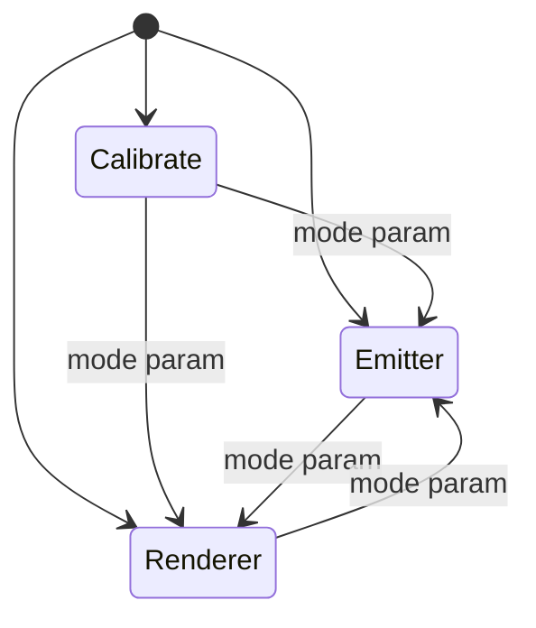
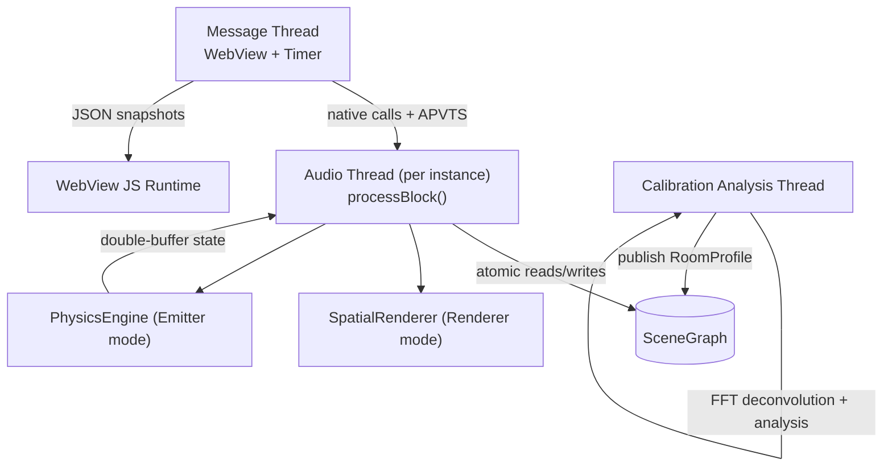
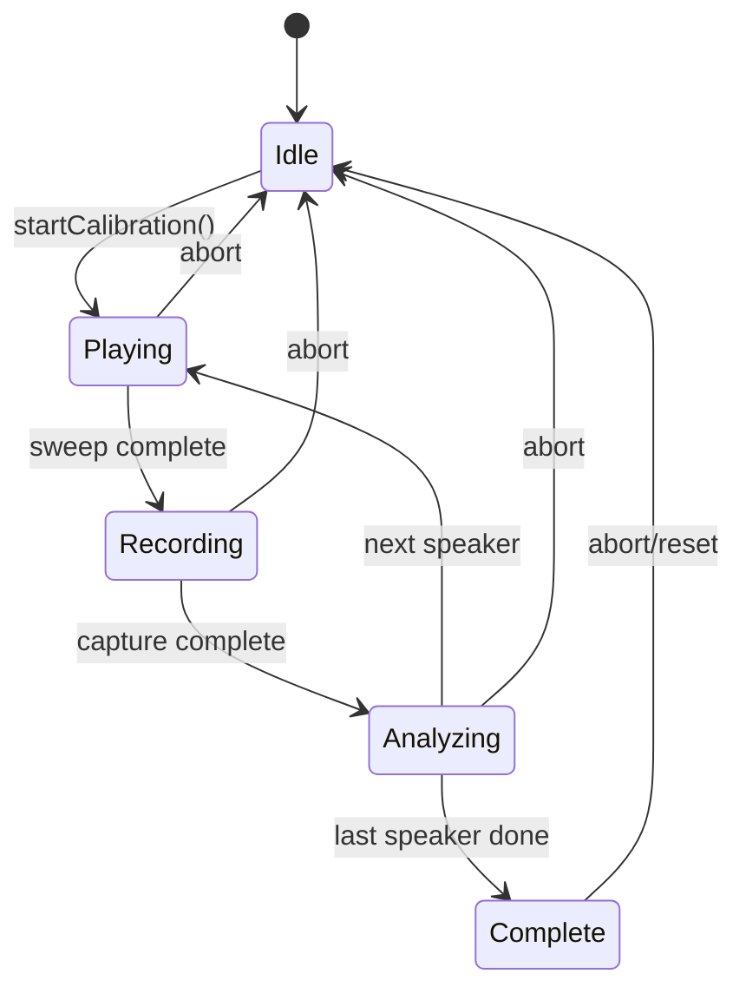

Title: LocusQ Repo Review 02262026
Document Type: Review
Author: APC Codex
Created Date: 2026-02-26
Last Modified Date: 2026-02-26

# LocusQ Repo Review (Architecture, Code, DSP, UI/UX)

> Scope: This review is based on static inspection of the public repo sources (CMake/JUCE plumbing, core C++ DSP/runtime, WebView UI/JS, and the project’s contracts/spec docs). I’m not running the plugin in-host, so anything that depends on host quirks is flagged as “verify in DAW.”
> Repo appears to be a JUCE-based spatial audio plugin with a WebView (Three.js) UI, multi-instance “Emitter/Renderer” workflow, and a built-in room calibration pipeline. ([GitHub][1])

---

## Executive summary

### What’s strong

* **Clear domain separation**: audio-domain responsibilities are largely modular (VBAP, distance, absorption, doppler, directivity/spread, early reflections + FDN late reverb, output mapping). ([GitHub][2])
* **Explicit contracts** (invariants + scene snapshot contract) are unusually good for an audio plugin and will pay dividends if enforced. ([GitHub][3])
* **Inter-instance scene exchange is conceptually solid**: a process-wide singleton SceneGraph with double-buffered emitter state and a safe audio snapshot handoff. ([GitHub][4])
* **WebView UI integration is serious**: you’re not doing “HTML as a skin;” you’re doing an application UI with self-test scaffolding and a JUCE relay bridge. ([GitHub][5])
* **QA harness exists** (optional build target), which is the correct move for DSP regression testing. ([GitHub][1])

### Biggest risks / highest-leverage fixes (blunt version)

1. **P0: Real-time invariant violation risk—locks in the audio thread path.**
   The invariants explicitly forbid locks in `processBlock()`. ([GitHub][3])
   Yet the runtime currently calls `syncSceneGraphRegistrationForMode(mode)` from `processBlock()`, and registration in `SceneGraph` uses a `juce::SpinLock`. That’s a lock on the audio thread, even if “usually uncontended.” ([GitHub][6])
   This is the kind of thing that becomes a once-a-week glitch report you can’t reproduce.
2. **P0/P1: Scaling + CPU predictability risks**: every emitter instance copies audio into a shared mono snapshot each block (by design, for safety). That’s safe, but you should make it conditional and budgeted so “lots of emitters + no renderer” doesn’t waste CPU. ([GitHub][4])
3. **P1: UI maintainability + testability**: the JS is monolithic and feature-dense; you need a modular boundary plan or it will calcify. The fact you already added self-test hooks is a clue you feel this pain too. ([GitHub][7])

---

## Repo anatomy (as-built)

### Build + packaging

* CMake + JUCE; builds VST3/AU/LV2/Standalone depending on platform; embeds Web UI resources as **binary data** via `juce_add_binary_data`. ([GitHub][1])
* Optional features:

  * Steam Audio integration hook (binaural backend) toggled by `LOCUSQ_ENABLE_STEAM_AUDIO`. ([GitHub][1])
  * CLAP target generation via clap-juce-extensions. ([GitHub][1])
  * Head tracking bridge toggle (build option). ([GitHub][1])
* Optional QA harness executable target (`BUILD_LOCUSQ_QA`) that compiles processor/DSP sources without the plugin client. ([GitHub][1])

### Core source set

The CMake target sources list is effectively the project’s “module inventory,” including:

* `Source/PluginProcessor.cpp`, `Source/PluginEditor.cpp`
* Scene/state: `Source/SceneGraph.h`, `SharedPtrAtomicContract.h`
* DSP modules: `VBAPPanner.h`, `DistanceAttenuator.h`, `AirAbsorption.h`, `DopplerProcessor.h`, `DirectivityFilter.h`, `SpreadProcessor.h`, `EarlyReflections.h`, `FDNReverb.h`, `SpatialRenderer.h`
* Calibration: `TestSignalGenerator.h`, `IRCapture.h`, `RoomAnalyzer.h`, `RoomProfileSerializer.h`, `CalibrationEngine.h`
* Physics + animation: `PhysicsEngine.h`, `KeyframeTimeline.*`
  ([GitHub][1])

---

## Architecture review

### 1) High-level component model

This matches both the CMake structure and the runtime behavior visible in `processBlock()` and the renderer pipeline. ([GitHub][1])

---

### 2) Mode-based runtime design

Your processor is essentially a **three-mode machine**:

* **Calibrate**: generate test signal → record mic → analyze on background thread → publish `RoomProfile` to SceneGraph. ([GitHub][8])
* **Emitter**: pass audio through unchanged, but publish **mono snapshot + per-emitter spatial/physics metadata** into a SceneGraph slot. ([GitHub][6])
* **Renderer**: consume all emitters, spatialize + room + output mapping, and (optionally) apply head pose / binaural backend. ([GitHub][6])

The mode switch is currently enforced by calling `syncSceneGraphRegistrationForMode(mode)` inside `processBlock()`. ([GitHub][6])

---

### 3) Contract alignment (the good + the violation)

**What the invariants demand**

* “No heap allocation, locks, or blocking I/O inside `processBlock()`.” ([GitHub][3])
* Lock-free inter-instance exchange, deterministic chain order, stable fallback behavior, and snapshot monotonicity. ([GitHub][3])

**What the implementation does well**

* The **DSP chain order** is implemented in the renderer core: emitter preprocessing → panning/spread/directivity/distance → room chain → speaker compensation → master/output mapping. ([GitHub][2])
* SceneGraph emitter data is **double-buffered** via atomic index switching, and audio handoff uses a **local mono snapshot** so renderer doesn’t dereference host pointers from another instance. ([GitHub][4])
* Calibration analysis runs on a background thread and publishes a room profile via atomic shared_ptr publication. ([GitHub][8])

**The key violation (P0)**

* `SceneGraph::registerEmitter()` / `unregisterEmitter()` uses `juce::SpinLock` (`registrationLock`). ([GitHub][4])
* `processBlock()` calls `syncSceneGraphRegistrationForMode(mode)` which calls those registration functions, i.e., lock in the audio thread. ([GitHub][6])
  This is inconsistent with your own invariants. ([GitHub][3])

**Actionable fix:** either make registration lock-free (recommended), or move all registration to non-RT contexts with a safe handshake.

---

### 4) Threading model

Evidence exists for:

* background analysis thread in `CalibrationEngine` ([GitHub][8])
* editor timer + WebView bridge ([GitHub][5])
* physics integration from processor into per-emitter physics engine ([GitHub][6])

---

## Code review (actionable)

### A) Real-time safety and concurrency

#### A1. **P0: Remove audio-thread locks from SceneGraph registration**

**Problem**: SpinLock inside registration + called from `processBlock()` via `syncSceneGraphRegistrationForMode()`. ([GitHub][4])

**Impact**: rare but catastrophic XRuns/glitches under contention or OS scheduling weirdness (especially with multiple instances, heavy UI, or hosts that call audio callbacks from different threads depending on device state).

**Fix options**

1. **Best**: lock-free slot allocation using CAS:

   * `slotOccupied[i]` is already atomic; you can allocate by scanning and doing `compare_exchange_strong(false -> true)`.
   * Keep `activeEmitterCount` as atomic `fetch_add/sub`.
   * Renderer registration can be `rendererRegistered.compare_exchange_strong(false -> true)`.
   * Remove `registrationLock` entirely from the audio path.
2. **Acceptable**: move registration out of `processBlock()`:

   * Detect mode change on message thread and call a “registration request” method on processor that sets atomics.
   * Audio thread checks a flag and uses `tryLock` once, with “if fail, defer until next block.” This still violates the invariant, but reduces risk. The invariant says “no locks,” so treat this as a temporary bridge, not the end state.

**Acceptance criteria**

* `processBlock()` contains **no SpinLock / mutex acquisition** on any path (including mode changes). ([GitHub][3])
* Multi-instance stress test: 32+ emitters + 1 renderer, rapid mode toggles, no XRuns.

#### A2. **P1: Bound SceneGraph audio snapshot work**

`EmitterSlot::setAudioBuffer()` copies a mono downmix snapshot every block. ([GitHub][4])
This is safe and deterministic, but potentially wasteful.

**Action**

* Only copy audio if a renderer is registered (or if “audition proxy” is active).
* Add an upper budget: if `numSamples` exceeds `MAX_SHARED_AUDIO_SAMPLES`, already clamped; consider also clamping CPU by skipping copy when muted/soloed states make audio irrelevant.

**Acceptance criteria**

* When no renderer is present, emitters do near-zero extra CPU beyond pass-through.

#### A3. **P1: Condition-variable for calibration analysis thread**

Calibration analysis thread loops with a 5ms sleep polling `analysisRequested_`. ([GitHub][8])
Not wrong, but wasteful.

**Action**

* Replace poll loop with `std::condition_variable` signaling when analysis is requested.
* Ensure shutdown is clean and never blocks plugin unload.

---

### B) Maintainability and correctness

#### B1. Parameter/UI relay list is a manual failure magnet (P1)

Editor construction includes a giant chain of `.withOptionsFrom(...)` and then a giant list of attachments created manually. ([GitHub][5])

**Risk**: parameter added/renamed in APVTS but not bridged; JS references mismatched names; “it compiles, UI silently broken.”

**Action**

* Generate the relay + attachment scaffolding from the parameter spec (you already have `.ideas/parameter-spec.md` referenced by invariants). ([GitHub][3])
* At minimum: create a single table/list in C++ (or a macro list) of parameter IDs and iterate it for relays and attachments.

**Acceptance criteria**

* One authoritative list of parameter IDs used by:

  * APVTS layout creation
  * WebView relay binding
  * UI JS `getSliderState/getToggleState/getComboBoxState` declarations (optionally generated)

#### B2. Add hard “finite output” guardrails (P0/P1 depending on your appetite)

You clamp many values already (good), but DSP systems die by NaN propagation.

**Action**

* Add a small utility: `inline float finiteOr(float v, float fallback=0)` used at boundaries:

  * after physics integration
  * before panning math
  * before writing output

**Acceptance criteria**

* If any emitter state becomes non-finite, renderer output remains finite and fails safe.

---

### C) Performance instrumentation (P1)

You already compute perf EMAs in processor for publish/render times. ([GitHub][6])

**Action**

* Expose these metrics via the UI diagnostics payload (if not already).
* Add “over budget” indicator in renderer UI when `eligibleEmitterCount > MAX_RENDER_EMITTERS_PER_BLOCK` guardrail triggers. ([GitHub][2])

---

## DSP review (engine-level)

### 1) Renderer chain correctness

The renderer’s implemented order matches the invariant spec and comments:

* per-emitter preprocessing → VBAP + elevation projection → spread + directivity → distance gain → room ER/FDN → speaker delay + trims → master/output mapping. ([GitHub][2])

That’s coherent and debuggable.

### 2) VBAP panner (good baseline, but validate geometry assumptions)

`VBAPPanner` uses a rectangular quad speaker layout with adjacent-pair VBAP and constant-power normalization. ([GitHub][9])

**Action**

* Add tests for:

  * azimuth on speaker axes gives expected dominant channels
  * continuity at pair boundaries
* Consider supporting non-rectangular angle sets (you already allow custom angles).

### 3) Doppler: “draft quality” is honest; upgrade path is clear

`DopplerProcessor` uses variable delay with linear interpolation and a simple delay trajectory update. ([GitHub][10])

**Likely artifacts**

* zippering / warble under fast velocity changes (time-varying delay)
* high-frequency loss (linear interpolation)
* potential clicks if delay changes too quickly

**Action**

* Upgrade interpolation to 3rd/4th-order Lagrange (still RT-safe).
* Smooth the `ratio` / `currentDelaySamples` with a one-pole filter.
* Add unit tests that verify pitch shift sign/direction under controlled motion.

### 4) Room acoustics: ER + FDN is workable; realism depends on goals

* Early reflections: per-channel multi-tap delay with gain decay and damping scaling. ([GitHub][11])
* Late reverb: quad FDN with draft vs final quality tiers and deterministic modulation. ([GitHub][12])

**Action**

* Tie ER/FDN parameters more explicitly to measured `RoomProfile` (delayComp, gainTrim, RT60-ish estimate) rather than generic knobs.
* Ensure energy compensation when switching quality tiers (avoid “tone jumps” mid-play).

### 5) Multi-output profiles / binaural backend

`SpatialRenderer` includes multiple spatial output profiles and a headphone render mode switch (StereoDownmix vs SteamBinaural) with fallback reasons and Steam init stage tracking. ([GitHub][2])

**Action**

* Codify the fallback matrix in one place (C++ + UI) so “why did it fall back” is always visible and consistent.

---

## Calibration DSP review

`CalibrationEngine` is a state machine: generate → record → analyze in a background thread; publishes `RoomProfile` to SceneGraph at completion. ([GitHub][8])

**What to improve (practical)**

* Replace polling with `condition_variable` (CPU).
* Provide explicit diagnostics payload for:

  * chosen mic channel + output mapping
  * measured peak levels / clipping detection
  * confidence score for delay/polarity estimates
* Verify that `estimatedRT60` isn’t being derived from distance/343 (that’s not RT60—more like time-of-flight proxy). If this is placeholder, label it as such in UI. ([GitHub][8])

---

## UI/UX review

### 1) UI architecture (what you built)

* The editor creates a JUCE WebView, injects native bindings + a resource provider, then wires **a lot** of parameter relays into it. ([GitHub][5])
* The UI JS initializes JUCE slider/toggle/combo states, plus native functions like `locusqStartCalibration`, preset management, timeline get/set, etc. ([GitHub][7])
* There’s a fallback bridge for when `window.Juce` is missing, and production “selftest” hooks via query params. ([GitHub][7])

This is an app UI, not a decorative faceplate. Good.

### 2) UX issues (and what to do)

#### Issue: cognitive overload (P1)

You have Calibrate + Emitter + Renderer + Diagnostics, each with deep settings. The UI text suggests you’re already adding progressive disclosure (“Advanced ▶”, diagnostics panels, etc.). ([GitHub][13])

**Action**

* Make each mode a guided “happy path” first:

  * Calibrate: Step 1 route → Step 2 run → Step 3 validate → Step 4 save/activate
  * Emitter: Position + gain/spread + motion source
  * Renderer: Output profile + room + audition + global physics
* Hide advanced sections behind consistent affordances and remember collapsed state (per mode).

#### Issue: authority/locking needs to be visually unmissable (P0/P1)

Your scene-state contract discusses authority precedence and safe UI behavior under stale snapshots. ([GitHub][14])
Your JS includes “authority locks” and element lock checks. ([GitHub][7])

**Action**

* Add a single top-level “Authority Status” badge with:

  * who owns audition (renderer/emitter)
  * whether the viewport is stale (snapshot age vs `snapshotStaleAfterMs`)
  * whether controls are locked (and why)

#### Issue: long-term maintainability of JS (P1)

The JS file is large and doing: bridge, state, rendering, controls, self-test, timeline, etc. ([GitHub][7])

**Action**

* Without introducing a heavyweight bundler, you can still modularize:

  * `bridge/juceBridge.ts|js`
  * `state/store.ts|js`
  * `ui/bindings.ts|js`
  * `viewport/renderer.ts|js`
  * `selftest/selftest.ts|js`
* If you want zero tooling, use multiple JS files and concatenate in CMake at build time (simple script) so runtime stays “single file.”

### 3) UI performance (P1)

* You run a 30 Hz editor timer. ([GitHub][5])
* Ensure UI updates are **diff-based**, not “re-render everything,” especially Three.js scene graphs.

**Action**

* Only send deltas for emitter positions/velocities.
* In JS, batch DOM updates and avoid layout thrash.

### 4) Accessibility & host integration (P2)

* Ensure keyboard navigation for primary controls, proper ARIA labels, focus trapping, and scaled UI for HiDPI.
* Make host resize behavior robust; you already notify host on resize. ([GitHub][5])

---

## Prioritized action plan

### P0 (ship-stoppers / glitch-class)

1. **Eliminate SpinLock usage from audio thread paths** (SceneGraph registration + any mode switching path). ([GitHub][3])
2. **Add NaN/Inf guardrails** at key DSP boundaries (physics → renderer, renderer → output).
3. **Enforce contracts with tests**: monotonic snapshot acceptance, renderer fallback behavior, multi-instance invariants.

### P1 (high ROI)

1. Conditionalize emitter audio snapshot copying (only when renderer exists / needed). ([GitHub][4])
2. Replace calibration polling thread with condition_variable. ([GitHub][8])
3. Generate the parameter/relay/attachment wiring from a single spec source. ([GitHub][5])
4. Modularize UI JS into maintainable units. ([GitHub][7])

### P2 (quality upgrades / feature growth)

1. Higher-quality doppler interpolation + smoothing. ([GitHub][10])
2. Make room acoustics more data-driven from calibrated `RoomProfile`. ([GitHub][8])
3. Tighten “Authority UX” and guided workflows per mode. ([GitHub][14])

---

# AI coding agent agnostic “mega prompts”

These are designed to be pasted into **any** coding agent (Copilot, Cursor, Claude Code, Devin-style agents, etc.). They assume the agent can edit files, run builds/tests, and open PRs.

---

## Mega Prompt 1 — P0 Real-time safety hardening (no locks in processBlock)

**Goal:** Make the code comply with `Documentation/invariants.md`: no locks or heap allocs in `processBlock()`, including mode changes. ([GitHub][3])

**Repository context (files):**

* `Source/PluginProcessor.cpp` (calls `syncSceneGraphRegistrationForMode` from `processBlock`) ([GitHub][6])
* `Source/SceneGraph.h` (uses `juce::SpinLock` for registration) ([GitHub][4])

**Tasks:**

1. Refactor `SceneGraph::registerEmitter/unregisterEmitter/registerRenderer/unregisterRenderer` to be **lock-free**:

   * Use `compare_exchange_strong` on `slotOccupied[i]` to claim a slot.
   * Update `activeEmitterCount` with `fetch_add/fetch_sub`.
   * For renderer, use `rendererRegistered.compare_exchange_strong(false,true)`.
   * Remove/stop using `registrationLock` in all audio-path code (it may remain for non-RT ops if necessary, but the audio path must not touch it).
2. Update `PluginProcessor::syncSceneGraphRegistrationForMode` and `processBlock` logic to:

   * Only perform registration transitions when mode changed, and never acquire a lock.
   * Guarantee correct cleanup on destruction (still OK to lock off-audio-thread if required).
3. Add a **unit/regression test** (or QA harness scenario) that:

   * Spawns N “emitter processors” + 1 “renderer processor” (test harness style)
   * Rapidly toggles mode parameters while processing audio buffers
   * Asserts no deadlocks, no crashes, and output remains finite.
4. Update documentation:

   * Add an ADR or a short note in invariants/traceability explaining the new lock-free registration mechanism.

**Acceptance criteria:**

* No `juce::SpinLock` or any other lock acquisition occurs in any `processBlock()` call path.
* Multi-instance stress test runs for 60 seconds without glitches, hangs, or NaNs.
* Build passes for all supported platforms in CI (or local matrix if CI is not yet present).

Deliver a single PR with clear commits.

---

## Mega Prompt 2 — P1 CPU scaling: conditional emitter audio snapshots

**Goal:** Reduce wasted CPU when many emitters exist but no renderer consumes them.

**Context:**

* Emitter mode publishes mono audio snapshots into `EmitterSlot::setAudioBuffer`. ([GitHub][4])
* Renderer is single-registered; `SceneGraph` tracks rendererRegistered. ([GitHub][4])

**Tasks:**

1. Change emitter `processBlock` path so it only calls `setAudioBuffer(...)` if:

   * a renderer is currently registered, OR
   * an explicit “audition proxy / debugging” flag is enabled (if such a concept exists).
2. Add a lightweight metric counter to confirm:

   * how many emitters published audio snapshots this block
   * how many were skipped due to no renderer
3. Add QA harness performance test:

   * Compare CPU time with 32 emitters, renderer absent vs present.
4. Ensure behavior stays correct when renderer appears mid-stream:

   * emitters begin publishing without requiring restart.

**Acceptance criteria:**

* In “no renderer” scenario, emitter mode adds negligible overhead.
* When renderer registers, audio snapshots start within 1 block.

---

## Mega Prompt 3 — DSP guardrails: finite-only audio + improved Doppler

**Goals:**

1. Ensure output never becomes NaN/Inf.
2. Improve Doppler quality while staying RT-safe.

**Context files:**

* `Source/SpatialRenderer.h` (core render loop and output writing) ([GitHub][2])
* `Source/DopplerProcessor.h` (draft variable delay) ([GitHub][10])
* `Source/PluginProcessor.cpp` (physics + state publish) ([GitHub][6])

**Tasks:**

1. Implement `sanitizeFinite(float)` and `sanitizeFinite(Vec3)` helpers in a small shared header.
2. Apply sanitization at:

   * physics state ingestion
   * panner input (azimuth/elevation computation)
   * final output write stage
3. Doppler upgrade:

   * Replace linear interpolation with 3rd or 4th order Lagrange fractional delay interpolation.
   * Add smoothing to `currentDelaySamples` or the effective ratio to prevent rapid jumps.
4. Add unit tests:

   * Controlled radial velocity yields expected pitch shift direction
   * No discontinuities when velocity changes sign
   * Sanitization clamps NaNs to safe defaults

**Acceptance criteria:**

* Fuzz test: random emitter states never produce NaNs in output buffer.
* Doppler audible artifacts reduced (manual verification) and measurable spectral preservation improved (optional).

---

## Mega Prompt 4 — UI refactor without breaking shipping constraints

**Goal:** Make JS maintainable without introducing a complicated toolchain.

**Context:**

* `Source/ui/public/js/index.js` is monolithic and handles bridge + UI + selftest + timeline. ([GitHub][7])
* JUCE bridge code exists in `Source/ui/public/js/juce/index.js`. ([GitHub][15])

**Tasks:**

1. Split `index.js` into multiple files by domain:

   * `bridge.js`, `state.js`, `controls.js`, `timeline.js`, `viewport.js`, `selftest.js`
2. Add a simple build step (CMake custom command or script) to concatenate into a single shipped `index.js` (so runtime remains unchanged).
3. Add a small “UI smoke test” mode:

   * loads UI with fallback JUCE bridge and verifies DOM can bind without native backend
4. Improve “Authority Status” UX:

   * one global badge showing stale/locked state and why.

**Acceptance criteria:**

* No functional regressions in UI.
* New modules are independently readable and testable.
* Still embeds as binary data via CMake without extra runtime dependencies. ([GitHub][1])

---

## Mega Prompt 5 — CI + QA harness activation

**Goal:** Make regressions hard.

**Context:**

* CMake includes `BUILD_LOCUSQ_QA` target with harness integration. ([GitHub][1])

**Tasks:**

1. Add CI workflow(s) that:

   * Build plugin targets (per platform)
   * Build and run `locusq_qa` (at least on one platform initially)
2. Add tests:

   * VBAP continuity + energy preservation
   * Doppler correctness
   * Renderer output mapping correctness for stereo/quad fallbacks
3. Produce a “golden audio” regression test (small):

   * fixed emitter states + input signal
   * compare rendered output hash within tolerance

**Acceptance criteria:**

* PRs cannot merge if QA harness fails.
* At least one DSP regression test prevents accidental sound changes.

---

## Closing opinion (straight talk)

You’ve got the bones of a legitimately ambitious spatial audio tool: multi-instance scene graph, renderer pipeline, calibration, physics, head pose, and a WebView UI that isn’t a toy. ([GitHub][6])

But you’re currently living dangerously on the one thing audio plugins can’t hand-wave: **RT purity**. The lock-in-audio-thread issue will bite you eventually, and it’s the first thing I’d fix before polishing DSP or UI. ([GitHub][3])

Once that’s resolved, the next best payoff is **automation of the parameter/bridge wiring** and **UI modularization** so your velocity doesn’t collapse under your own feature set. ([GitHub][5])

[1]: https://raw.githubusercontent.com/joshband/LocusQ/main/CMakeLists.txt "raw.githubusercontent.com"
[2]: https://raw.githubusercontent.com/joshband/LocusQ/main/Source/SpatialRenderer.h "raw.githubusercontent.com"
[3]: https://raw.githubusercontent.com/joshband/LocusQ/main/Documentation/invariants.md "raw.githubusercontent.com"
[4]: https://raw.githubusercontent.com/joshband/LocusQ/main/Source/SceneGraph.h "raw.githubusercontent.com"
[5]: https://raw.githubusercontent.com/joshband/LocusQ/main/Source/PluginEditor.cpp "raw.githubusercontent.com"
[6]: https://raw.githubusercontent.com/joshband/LocusQ/main/Source/PluginProcessor.cpp "raw.githubusercontent.com"
[7]: https://raw.githubusercontent.com/joshband/LocusQ/main/Source/ui/public/js/index.js "raw.githubusercontent.com"
[8]: https://raw.githubusercontent.com/joshband/LocusQ/main/Source/CalibrationEngine.h "raw.githubusercontent.com"
[9]: https://raw.githubusercontent.com/joshband/LocusQ/main/Source/VBAPPanner.h "raw.githubusercontent.com"
[10]: https://raw.githubusercontent.com/joshband/LocusQ/main/Source/DopplerProcessor.h "raw.githubusercontent.com"
[11]: https://raw.githubusercontent.com/joshband/LocusQ/main/Source/EarlyReflections.h "raw.githubusercontent.com"
[12]: https://raw.githubusercontent.com/joshband/LocusQ/main/Source/FDNReverb.h "raw.githubusercontent.com"
[13]: https://raw.githubusercontent.com/joshband/LocusQ/main/Source/ui/public/index.html "LocusQ"
[14]: https://raw.githubusercontent.com/joshband/LocusQ/main/Documentation/scene-state-contract.md "raw.githubusercontent.com"
[15]: https://raw.githubusercontent.com/joshband/LocusQ/main/Source/ui/public/js/juce/index.js "raw.githubusercontent.com"
