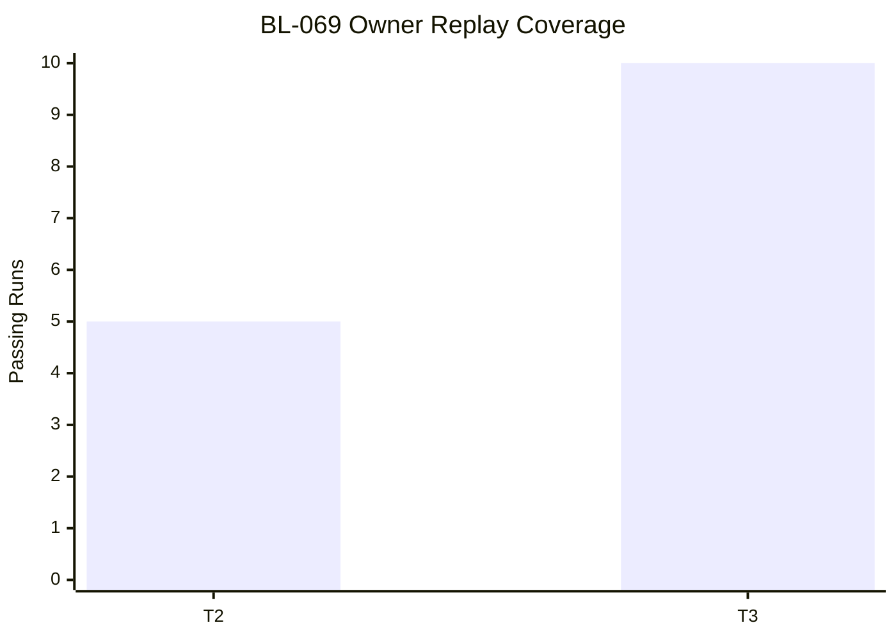

Title: BL-069 RT-Safe Headphone Preset Pipeline and Failure Backoff
Document Type: Backlog Runbook
Author: APC Codex
Created Date: 2026-03-01
Last Modified Date: 2026-03-04

# BL-069 RT-Safe Headphone Preset Pipeline and Failure Backoff

## Plain-Language Summary

BL-069 in plain terms: Remove RT-unsafe file/config loading from the headphone preset path by moving preset hydration and parse work out of processBlock(), introducing atomic runtime handoff for prepared coefficients, and enforcing retry backoff semantics when preset assets are missing or invalid. Current state: Done (owner T2 `5/5` + T3 `10/10` execute replay PASS; closeout sync complete). For technical detail, see `## Objective` and `## Validation Plan`.

## 6W Snapshot (Who/What/Why/How/When/Where)

| Question | Plain-language answer |
|---|---|
| Who is this for? | QA owners, release owners, and engineering maintainers who depend on deterministic evidence. |
| What is changing? | Remove realtime-unsafe file/config loading from the headphone preset path by moving preset hydration and parse work out of the realtime audio processing path, introducing atomic runtime handoff for prepared coefficients, and enforcing retry backoff semantics when preset assets are missing or invalid. |
| Why is this important? | It reduces risk and keeps related backlog lanes from being blocked by unclear behavior or missing evidence. |
| How will we deliver it? | Deliver in slices, run the required replay/validation lanes, and capture evidence in TestEvidence before owner promotion decisions. |
| When is it done? | Current state: Done (owner T2 `5/5` + T3 `10/10` execute replay PASS; closeout sync complete). |
| Where is the source of truth? | Runbook `Documentation/backlog/done/bl-069-rt-safe-headphone-preset-pipeline-and-failure-backoff.md`, backlog authority `Documentation/backlog/index.md`, and evidence under `TestEvidence/...`. |

## Visual Aid Index

Use visuals only when they materially improve understanding.

| Visual Aid | Why it helps | Where to find it |
|---|---|---|
| Status ledger | Fast state/priority/dependency scan for humans and agents. | `## Status Ledger` |
| Validation and evidence tables | Shows pass/fail criteria and artifact contract. | `## Validation Plan` |
| Evidence visual snapshot | Consolidated replay/evidence view for promotion decisions. | `## Evidence Visual Snapshot` |
| Optional item-specific diagram | Include only when it clarifies behavior better than prose/tables. | Adjacent to the relevant section |

## Delivery Flow Diagram

Include a runbook-specific diagram only when it clarifies behavior not already obvious from `Status Ledger`, `Implementation Slices`, and `Validation Plan`.

Canonical lifecycle flow is governed by `Documentation/backlog/index.md` (`Backlog Lifecycle Contract`).

## Evidence Visual Snapshot

| Replay Stage | Result | Evidence |
|---|---|---|
| Owner intake execute replay | PASS | `TestEvidence/bl069_owner_intake_execute_20260302T011436Z/` |
| Owner verify execute replay | PASS | `TestEvidence/bl069_owner_verify_execute_20260302T032812Z/` |
| T2 candidate replay | PASS (`5/5`) | `TestEvidence/bl069_owner_t2_candidate_20260302T034928Z/t2_summary.tsv` |
| T3 promotion replay | PASS (`10/10`) | `TestEvidence/bl069_owner_t3_promotion_20260302T035658Z/t3_summary.tsv` |

## Status Ledger

| Field | Value |
|---|---|
| ID | BL-069 |
| Priority | P0 |
| Status | Done (owner T2 `5/5` + T3 `10/10` execute replay PASS; closeout sync complete) |
| Track | F - Hardening |
| Effort | Med / M |
| Depends On | BL-050 |
| Blocks | — |
| Annex Spec | `(no annex spec — self-contained runbook)` |
| Default Replay Tier | T1 (dev-loop deterministic replay; escalate per Global Replay Cadence Policy) |
| Heavy Lane Budget | Standard (apply heavy-wrapper containment when wrapper cost is high) |
| SHARED_FILES_TOUCHED | no |
| Promotion Decision Packet | `TestEvidence/bl069_owner_t3_promotion_20260302T035658Z/promotion_readiness.md` |
| Final Evidence Root | `TestEvidence/bl069_owner_t3_promotion_20260302T035658Z/` |
| Archived Runbook Path | `Documentation/backlog/done/bl-069-rt-safe-headphone-preset-pipeline-and-failure-backoff.md` |

## Objective

Remove RT-unsafe file/config loading from the headphone preset path by moving preset hydration and parse work out of `processBlock()`, introducing atomic runtime handoff for prepared coefficients, and enforcing retry backoff semantics when preset assets are missing or invalid.

## Acceptance IDs

- No filesystem access, parse work, or blocking I/O is executed from `processBlock()` during profile changes.
- Missing/invalid preset assets do not retrigger load attempts every callback block.
- Prepared preset coefficients are atomically swapped into audio path without discontinuities.
- Failure/backoff diagnostics are visible in scene/runtime status payloads.

## Validation Plan

QA harness script: `scripts/qa-bl069-rt-safe-preset-pipeline-mac.sh`.
Evidence schema: `TestEvidence/bl069_*/status.tsv`.

Minimum evidence additions:
- `rt_access_audit.tsv`
- `preset_retry_backoff.tsv`
- `coefficient_swap_stability.tsv`
- `failure_taxonomy.tsv`

## Replay Cadence Plan (Required)

Reference policy: `Documentation/backlog/index.md` -> `Global Replay Cadence Policy`.

| Stage | Tier | Runs | Command Pattern | Evidence |
|---|---|---|---|---|
| Dev loop | T1 | 3 | runbook primary lane command at dev-loop depth | validation matrix + replay summary |
| Candidate intake | T2 | 5 (or heavy-wrapper 2-run cap) | runbook candidate replay command set | contract/execute artifacts + taxonomy |
| Promotion | T3 | 10 (or owner-approved heavy-wrapper 3-run equivalent) | owner-selected promotion replay command set | owner packet + deterministic replay evidence |
| Sentinel | T4 | 20+ (explicit only) | long-run sentinel drill when explicitly requested | parity/sentinel artifacts |

### Cost/Flake Policy

- Diagnose failing run index before repeating full multi-run sweeps.
- Heavy wrappers (`>=20` binary launches per wrapper run) use targeted reruns, candidate at 2 runs, and promotion at 3 runs unless owner requests broader coverage.
- Document cadence overrides with rationale in `lane_notes.md` or `owner_decisions.md`.

## Handoff Return Contract

Use the canonical handoff block in `Documentation/backlog/index.md` (`Owner Sync Packet Contract`) and include `SHARED_FILES_TOUCHED: no|yes`.

Only add runbook-specific handoff fields if they differ from the canonical contract.

## Governance Alignment (2026-03-01)

Canonical lifecycle/evidence rules are defined in:
- `Documentation/backlog/index.md` (`Backlog Lifecycle Contract`, `Global Replay Cadence Policy`)
- `Documentation/standards.md` (`Backlog Lifecycle Governance Standard`)

This runbook should list only item-specific exceptions or additions.

## Execution Notes (2026-03-01)

- Initial remediation landed in runtime code:
  - `Source/SpatialRenderer.h` now preloads bundled PEQ presets during `prepare()`.
  - `loadPeqPresetForProfile()` now uses cache-only preset data (no filesystem access on callback path).
  - Failed/missing preset states are now cached through invalid preset entries and no longer trigger per-block file retries.
- Remaining BL-069 scope:
  - Promotion cadence replay (T2/T3) and owner promotion packet.

## Owner Intake Snapshot (2026-03-02)

- Execute-mode probe upgrades landed in:
  - `scripts/qa-bl069-rt-safe-preset-pipeline-mac.sh`
- Worker intake evidence (PASS):
  - `TestEvidence/bl069_owner_intake_contract_20260302T011436Z/`
  - `TestEvidence/bl069_owner_intake_execute_20260302T011436Z/`
- Owner verification replay (PASS):
  - `TestEvidence/bl069_owner_verify_contract_20260302T032812Z/`
  - `TestEvidence/bl069_owner_verify_execute_20260302T032812Z/`
- Validation highlights:
  - execute mode now emits zero TODO rows in `preset_retry_backoff.tsv` and `coefficient_swap_stability.tsv`,
  - `lane_result=PASS` in contract and execute modes,
  - docs freshness gate PASS.

## Owner T2/T3 Replay Snapshot (2026-03-02)

- T2 candidate replay (5 execute runs): `PASS`
  - `TestEvidence/bl069_owner_t2_candidate_20260302T034928Z/`
  - `t2_summary.tsv`: `5/5` runs with `exit_code=0`, `lane_result=PASS`, execute TODO gate `PASS`, `todo_count=0`.
- T3 promotion replay (10 execute runs): `PASS`
  - `TestEvidence/bl069_owner_t3_promotion_20260302T035658Z/`
  - `t3_summary.tsv`: `10/10` runs with `exit_code=0`, `lane_result=PASS`, execute TODO gate `PASS`, `todo_count=0`.
- Docs freshness:
  - `./scripts/validate-docs-freshness.sh` passes after metadata normalization of promotion packet docs.

## Closeout Checklist (Done Transition)

- [x] T2 candidate (`5/5`) and T3 promotion (`10/10`) execute replays are PASS.
- [x] Execute-mode TODO gate is PASS (`todo_count=0` across promotion packet runs).
- [x] Promotion packet docs-freshness validation is PASS.
- [x] Resolve `Annex Spec` status (marked self-contained / no annex spec).
- [x] Move runbook to `Documentation/backlog/done/bl-069-rt-safe-headphone-preset-pipeline-and-failure-backoff.md`.
- [x] Update `Documentation/backlog/index.md` row to `Done` and switch runbook link to `done/` path.
- [x] Add closeout sync entries to `TestEvidence/build-summary.md` and `TestEvidence/validation-trend.md`.
- [x] Run `./scripts/validate-docs-freshness.sh` after done/archive sync.
