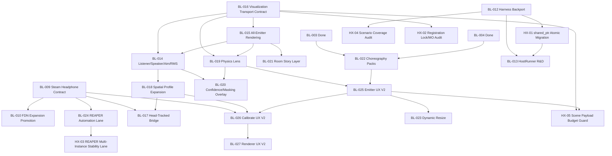
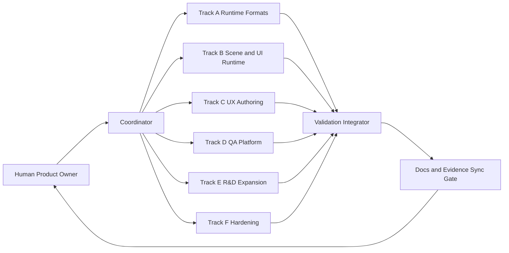

Title: LocusQ Post-v1 Holistic Backlog, Prioritization, and Agent Execution Spec
Document Type: Backlog and Execution Spec
Author: APC Codex
Created Date: 2026-02-20
Last Modified Date: 2026-02-23

# LocusQ Post-v1 Holistic Backlog, Prioritization, and Agent Execution Spec

## Purpose
Define one canonical, codebase-aligned backlog that includes:
- Fresh P0-P2 reprioritization.
- Dependency ordering and parallelization rules.
- Multi-agent Codex and Claude execution tracks.
- Full task breakdown and per-task mega-prompts.
- Explicit coverage mapping for recommended work, enhancements, and code-tightening gaps.
- Validation and closeout contracts tied to current LocusQ evidence surfaces.

## Scope
This spec supersedes prior fragmented kickoff notes by combining review findings, planning docs, implementation state, and test evidence into one execution artifact.

## Canonical Inputs
Primary requested sources:
- `Documentation/archive/2026-02-23-historical-review-bundles/full-project-review-2026-02-20.md`
- `Documentation/archive/2026-02-23-historical-review-bundles/full-project-review-design-2026-02-20.md`
- `Documentation/lessons-learned.md`
- `Documentation/archive/2026-02-23-historical-review-bundles/stage14-comprehensive-review-2026-02-20.md`
- `Documentation/plans/2026-02-20-full-project-review.md`
- `Documentation/plans/reaper-host-automation-plan-2026-02-22.md`
- `Documentation/plans/bl-017-head-tracked-monitoring-companion-bridge-plan-2026-02-22.md`
- `Documentation/plans/bl-025-emitter-uiux-v2-spec-2026-02-22.md`
- `Documentation/plans/bl-026-calibrate-uiux-v2-spec-2026-02-23.md`
- `Documentation/plans/bl-027-renderer-uiux-v2-spec-2026-02-23.md`
- `Documentation/plans/bl-011-clap-contract-closeout-2026-02-23.md`
- `Documentation/plans/LocusQClapContract.h`
- `Documentation/archive/2026-02-23-clap-reference-bundle/CLAP_References.md`
- `Documentation/archive/2026-02-23-clap-reference-bundle/DSP_UI_CONTRACT_CLAP md.pdf`
- `Documentation/archive/2026-02-23-clap-reference-bundle/JUCE to CLAP adapter design patterns.pdf`

Alignment and governance sources:
- `status.json`
- `Documentation/scene-state-contract.md`
- `Documentation/invariants.md`
- `Documentation/implementation-traceability.md`
- `Documentation/standards.md`
- `Documentation/README.md`
- `Documentation/skill-selection-matrix.md`
- `Documentation/adr/ADR-0002-routing-model-v1.md`
- `Documentation/adr/ADR-0003-automation-authority-precedence.md`
- `Documentation/adr/ADR-0005-phase-closeout-docs-freshness-gate.md`
- `Documentation/adr/ADR-0006-device-compatibility-profiles-and-monitoring-contract.md`
- `Documentation/adr/ADR-0008-viewport-scope-v1-vs-post-v1.md`
- `Documentation/adr/ADR-0009-clap-closeout-documentation-consolidation.md`
- `Documentation/research/section0-integration-recommendations-2026-02-20.md`
- `Documentation/testing/bl-025-emitter-resize-manual-qa-2026-02-23.md`
- `TestEvidence/build-summary.md`
- `TestEvidence/validation-trend.md`
- `TestEvidence/clap-validation-report-2026-02-22.md`
- `TestEvidence/bl011_clap_closeout_20260223T032730Z/report.md`

## PDF Skill Notes
Applied `pdf` skill workflow with local fallback constraints:
- `pypdf` and `pdfplumber` install attempts failed in this sandbox due restricted network.
- Extracted first-page OCR from both PDF inputs using local conversion plus OCR (`sips` + `tesseract`).
- OCR artifacts:
  - `tmp/pdfs/dsp_clap_page1_ocr.txt`
  - `tmp/pdfs/juce_clap_patterns_page1_ocr.txt`

PDF-derived recommendations integrated into BL-011 execution:
1. Keep deterministic DSP behavior and no-allocation audio-thread invariants explicit.
2. Keep CLAP adapter boundary separate from core spatial DSP.
3. Use `clap-juce-extensions` for format enablement and extension capability path.
4. Use lock-free per-voice telemetry snapshots from DSP to UI at bounded cadence.

Confidence level for PDF extraction: medium (first-page OCR only).

## Operating Constraints
1. Audio thread remains lock-free and allocation-free.
2. Scene-state transport contract is authoritative for UI/runtime synchronization.
3. CLAP/Steam capabilities are initialization-time negotiated and deterministic at runtime.
4. Closeout claims must sync `status.json`, `TestEvidence/build-summary.md`, `TestEvidence/validation-trend.md`, and this backlog.

## Skill Composition Order
Default specialist composition order for mixed tasks:
1. `skill_docs`
2. `skill_plan`
3. `juce-webview-runtime`
4. `reactive-av`
5. `physics-reactive-audio`
6. `spatial-audio-engineering`
7. `steam-audio-capi`
8. `clap-plugin-lifecycle`
9. `threejs`
10. `skill_dream`
11. `skill_design`
12. Supporting execution and closure: `skill_impl`, `skill_test`, `skill_testing`, `skill_troubleshooting`

## Status Snapshot (2026-02-23)
- `Done`: BL-001..BL-011, BL-015, BL-016, BL-024
- `In Progress`: BL-025
- `In Validation`: BL-012, BL-014, BL-018, BL-019, BL-022
- `In Planning`: BL-017, BL-026, BL-027
- `Todo`: BL-013, BL-020, BL-021, BL-023
- `HX`: HX-01 and HX-03 are done; HX-02/HX-04/HX-05 remain open.

## UI/UX V2 Status Ledger (2026-02-23)
| BL | Surface | State | Complete | In Review | Remaining |
|---|---|---|---|---|---|
| BL-025 | EMITTER v2 | In Progress (closeout lane active) | Slices 1-5 landed; `UI-06` and `UI-07` pass; `UI-P1-025A..E` pass in isolated rerun; resize and headless host artifacts recorded. | Preset lifecycle wording clarity and final closeout narrative sync. | Fresh deterministic rerun + host-side preset spot-check + transition row to `Done`. |
| BL-026 | CALIBRATE v2 | In Planning (spec complete) | Full v2 spec authored with IA, contracts, slices A-E, and validation lanes (`UI-P1-026A..E`). | Priority/dependency confirmation against BL-025/BL-009/BL-018 stability. | Implement slices A-E, wire profile library, run automation + manual headphone checks, move to `In Validation`. |
| BL-027 | RENDERER v2 | In Planning (spec complete) | Full BL-027 v2 spec is authored; next focus is first implementation slice and validation lane bring-up. | Full-scope contract review against BL-026 shared profile dictionary and diagnostics chips. | Implement first slice, run renderer v2 lanes, and promote to `In Validation`. |

## Reprioritization Method
Priority score inputs:
- Impact (1-5)
- Dependency criticality (1-5)
- Risk reduction (1-5)
- Validation readiness (1-5)
- Effort cost (1-5, inverse)

Band mapping:
- `P0`: immediate closeout blockers or graph-critical prerequisites.
- `P1`: near-term value after P0 gates, including promotion and automation expansion.
- `P2`: strategic expansion and larger UX/R&D slices.

## Fresh P0-P2 Backlog
| Order | Priority | BL | State | Why Now | Depends On | Unblocks |
|---:|---|---|---|---|---|---|
| 1 | P0 | BL-009 | Done (2026-02-23) | Deterministic headphone contract + profile contract reruns are green with fresh production self-test evidence. | none | BL-010, BL-024, BL-017 stability |
| 2 | P0 | BL-011 | Done (2026-02-23) | CLAP closeout bundle is fully green: build/install, `clap-info`, `clap-validator`, QA smoke + phase 2.6 suite, `UI-P2-011`, non-CLAP guard, and REAPER discoverability evidence (`TestEvidence/bl011_clap_closeout_20260223T032730Z/status.tsv`). | none | Platform expansion stability and release confidence |
| 3 | P0 | BL-016 | Done (2026-02-23) | Transport sequencing/cadence/stale fallback bundle refreshed: production self-test PASS, spatial smoke WARN-only baseline retained, phase 2.6 suite PASS, docs freshness PASS. | none | BL-014, BL-019 |
| 4 | P0 | BL-015 | Done (2026-02-23) | All-emitter render baseline is locked with fresh `UI-P1-015` pass (`selected vs non-selected emitter styling verified`) and companion smoke-suite rerun (`3 PASS / 1 WARN / 0 FAIL`). | BL-016 (Done) | BL-014, BL-019, BL-021 |
| 5 | P0 | BL-014 | In Validation | Needed for listener/speaker/aim/RMS confidence and BL-018/BL-020 sequencing. | BL-015, BL-016 | BL-018, BL-020, BL-021 |
| 6 | P0 | BL-025 | In Progress (closeout lane active) | Current active UX consolidation; complete while regression context is hot. | keep BL-019/BL-022 green | BL-023, BL-026 and authoring-flow stability |
| 7 | P1 | BL-018 | In Validation | Strict lane exists; finalize clean pass baseline after BL-014 stabilization. | BL-014 stable | BL-017 integration confidence |
| 8 | P1 | BL-010 | Done (2026-02-23) | Validation bundle was already green; promotion completed once BL-009 closed. | none | DSP roadmap tranche |
| 9 | P1 | BL-022 | In Validation | Existing validation green; guard against BL-025 regressions and close cleanly. | BL-003/004 done | BL-025 confidence |
| 10 | P1 | BL-019 | In Validation | Existing validation green; keep deterministic visual diagnostics stable. | BL-015, BL-016 | BL-020 |
| 11 | P1 | BL-024 | Done (2026-02-23) | Strict REAPER automation wrapper passed (`3/3`), manual runbook evidence row is logged, and HX-03 clean/warm multi-instance lane passed (`TestEvidence/hx03_reaper_multi_instance_20260223T031450Z/status.tsv`). | BL-009 Done | QA platform maturity and ongoing host-stability regression |
| 12 | P1 | BL-012 | In Validation (2026-02-23 tranche-1 lane green) | Tranche-1 backport lane now passes with harness sanity + contract-pack coverage + runtime-config precedence + perf auto-profile checks (`TestEvidence/bl012_harness_backport_20260223T032945Z/status.tsv`). | none | BL-013 |
| 13 | P1 | BL-026 | In Planning (spec complete) | CALIBRATE surface currently handles baseline 4-speaker flows but needs profile-driven multi-topology workflow. | BL-025 baseline + BL-009/BL-018 diagnostics stability | Multi-configuration calibration reliability (mono/stereo/quad/surround/ambisonic/binaural/downmix) |
| 14 | P2 | BL-017 | In Planning | Architecture is defined; implementation should start only after core lane stability. | BL-009 and BL-018 stable | Head-tracking roadmap |
| 15 | P2 | BL-013 | Todo | HostRunner R&D depends on BL-012 baseline contracts. | BL-012 | Future format-validation lane |
| 16 | P2 | BL-020 | Todo | Confidence/masking overlay requires stable listener/physics overlays first. | BL-014, BL-019 | Perception layer |
| 17 | P2 | BL-021 | Todo | Room story visuals require stable scene and speaker/listener foundations. | BL-014, BL-015 | Advanced visualization |
| 18 | P2 | BL-023 | Todo | Resize hardening should follow BL-025 finalized responsive architecture. | BL-025 baseline | Windowing/DPI resilience |
| 19 | P2 | BL-027 | In Planning (spec complete) | RENDERER v2 should follow CALIBRATE v2 contracts for shared topology/profile semantics and diagnostics chips. | BL-026 contract definitions + BL-025 stable UX patterns | Cross-panel profile coherence and monitoring clarity |

## Comprehensive Coverage Matrix (Recommendations, Gaps, and Enhancements)
| Domain | Source Findings and Ideas | Backlog Coverage | Remaining Tightening |
|---|---|---|---|
| DSP architecture | FDN expansion, deterministic RT safety, no-allocation audio thread | BL-010, BL-011, BL-012 | Keep HX-01 migration guard discipline; HX-04 drift guard is now enforced in-lane |
| CLAP lifecycle and format expansion | CLAP adapter path, host validation, CI readiness, telemetry contract | BL-011 | Keep BL-011 closeout tied to docs/test evidence sync |
| Headphone/spatial quality | Steam runtime contract, profile fallback, head-tracked expansion path | BL-009, BL-017, BL-018 | Keep HX-03 REAPER multi-instance lane in recurring regression cadence while BL-017 expands |
| Spatial 3D support and layout coverage | surround/ambisonics/binaural profile matrix + companion bridge | BL-018, BL-017 | Maintain BL-018 strict warning-free gate before BL-017 promotion |
| Audio-reactive and physics-reactive visualization | RMS overlays, physics lens, confidence/masking overlays | BL-019, BL-020, BL-021, BL-008 (done) | HX-05 scene payload budget guard to avoid UI-frame regressions |
| UX/UI authoring flow | Emitter UX v2, choreography packs, resize hardening | BL-025, BL-022, BL-023 | Ensure BL-023 follows finalized BL-025 authority/responsive contracts |
| Calibration and renderer UX coherence | CALIBRATE v2 and RENDERER v2 profile/topology workflows | BL-026, BL-027 | Keep shared topology alias dictionary and diagnostics chip semantics aligned across panels |
| WebView runtime and host interaction | resize behavior, callback ordering, stale-state fallbacks | BL-016, BL-023, BL-025, BL-026, BL-027 | HX-02 transport/registration contract audit |
| QA and automation maturity | REAPER headless lane, manual listening gates, harness unification | BL-024, BL-012, BL-013 | HX-03 and HX-04 closed; keep HX-04 parity guard active in BL-012 reruns |
| Code-level tightening from reviews | deprecated `shared_ptr` atomic free funcs, lock scope semantics, host instability findings | HX-01, HX-02, HX-03 | Keep tied to BL-012/BL-016 contracts and recurring HX-03 regression runs |
| Docs and governance discipline | status/evidence freshness and invariant traceability | all BL/HX items | Enforced by DoD + docs freshness gate |

## Cross-Cutting Hardening Sub-Slices (HX)
| Order | Priority | HX | Scope | Primary BL Anchor | Depends On | Skills |
|---:|---|---|---|---|---|---|
| 1 | P1 | HX-01 | Done (2026-02-23): migrated SceneGraph room-profile publication to a C++20-safe contract wrapper (`Source/SharedPtrAtomicContract.h`) and removed direct deprecated call sites from SceneGraph (`TestEvidence/hx01_sharedptr_atomic_build_20260223T034848Z.log`, `TestEvidence/hx01_sharedptr_atomic_qa_smoke_20260223T034918Z.log`, `TestEvidence/hx01_sharedptr_atomic_deprecation_scan_excluding_wrapper_20260223T034931Z.log`). | BL-012 | none | `skill_impl`, `skill_testing`, `skill_docs` |
| 2 | P1 | HX-02 | Audit/lock contract for renderer registration semantics and memory-order expectations | BL-016 | BL-016 baseline | `skill_plan`, `skill_impl`, `skill_docs` |
| 3 | P1 | HX-03 | Done (2026-02-23): deterministic clean/warm REAPER multi-instance crash regression lane added (`scripts/qa-hx03-reaper-multi-instance-mac.sh`) with passing evidence (`TestEvidence/hx03_reaper_multi_instance_20260223T031450Z/status.tsv`) | BL-024 | BL-009 Done + BL-024 scaffold | `skill_test`, `skill_testing`, `skill_troubleshooting` |
| 4 | P1 | HX-04 | Audit and enforce scenario coverage for AirAbsorption/Calibration/directivity parity | BL-012 | none | `skill_testing`, `skill_docs`, `skill_plan` |
| 5 | P2 | HX-05 | Add scene-state payload budget and throttle contract for UI responsiveness | BL-025 and BL-016 | BL-016 stable | `juce-webview-runtime`, `reactive-av`, `skill_impl` |

## Dependency and Ordering

### Rule Set
1. Close BL-009 before promoting BL-010 and activating BL-024 acceptance.
2. Keep BL-016 authoritative before closing BL-015/BL-014/BL-019.
3. Treat BL-025 as current UX stream; protect BL-019 and BL-022 assertions during every slice.
4. Start BL-018 strict closeout only after BL-014 behavior is stable.
5. Keep BL-017 implementation behind stable BL-009 and BL-018 lanes.
6. Start BL-023 only after BL-025 final responsive and authority contracts are fixed.
7. Close HX-04 before BL-013 feasibility decisions are finalized (HX-01 closed on 2026-02-23).
8. BL-024 closure gate on HX-03 is complete (`2026-02-23`); keep HX-03 in recurring host-stability regression cadence.
9. Keep HX-05 tied to BL-016 and BL-025 closeout so scene payload growth stays bounded.
10. Start BL-026 implementation after BL-025 baseline is stable and BL-009/BL-018 diagnostics are deterministic.
11. Start BL-027 implementation only after BL-026 shared profile alias and diagnostics contracts are established.

### Dependency Graph


### Ordered Waves
| Wave | Objective | Items |
|---|---|---|
| Wave A | Close core runtime and transport blockers | BL-009, BL-011, BL-016, BL-015, BL-014, BL-025, HX-02 |
| Wave B | Promote near-term validation and QA expansion | BL-018, BL-010, BL-022, BL-019, BL-024, BL-012, BL-026, HX-01, HX-03, HX-04 |
| Wave C | Strategic features and platform investments | BL-017, BL-013, BL-020, BL-021, BL-023, BL-027, HX-05 |

## Parallel AI Agent Tracks

### Track Layout
| Track | Scope | Preferred Agents | Skills |
|---|---|---|---|
| Track A Runtime Formats | BL-009, BL-011, BL-010, BL-018 | Codex implementer + Claude architecture reviewer | `steam-audio-capi`, `clap-plugin-lifecycle`, `spatial-audio-engineering`, `skill_docs` |
| Track B Scene and UI Runtime | BL-016, BL-015, BL-014, BL-019 | Codex implementer + Claude QA reviewer | `juce-webview-runtime`, `threejs`, `reactive-av`, `physics-reactive-audio` |
| Track C UX Authoring | BL-025, BL-026, BL-027, BL-022, BL-023 | Codex implementer + Claude design/contract reviewer | `skill_design`, `juce-webview-runtime`, `skill_plan`, `skill_docs`, `threejs`, `spatial-audio-engineering` |
| Track D QA Platform | BL-024, BL-012, BL-013 | Codex implementer + Claude testing strategy reviewer | `skill_test`, `skill_testing`, `skill_troubleshooting`, `skill_plan` |
| Track E R&D Expansion | BL-017, BL-020, BL-021 | Codex prototyper + Claude architecture reviewer | `skill_plan`, `skill_dream`, `reactive-av`, `threejs` |
| Track F Hardening | HX-01, HX-02, HX-03, HX-04, HX-05 | Codex implementer + Claude architecture/QA reviewer | `skill_impl`, `skill_testing`, `skill_troubleshooting`, `skill_docs`, `juce-webview-runtime` |

### Orchestration Graph


## Execution Cards and Mega-Prompts (Per Task and Hardening Slice)

### BL-009 - Steam Headphone Contract Closeout (P0-01)
- Objective: move BL-009 from `In Validation` to `Done` with deterministic contract evidence refreshed.
- Dependencies: none.
- Skills: `steam-audio-capi`, `physics-reactive-audio`, `skill_testing`, `skill_docs`.
- Validation bundle:
  - `./scripts/qa-bl009-headphone-contract-mac.sh`
  - `./scripts/qa-bl009-headphone-profile-contract-mac.sh`
  - `./scripts/standalone-ui-selftest-production-p0-mac.sh`
  - `./scripts/validate-docs-freshness.sh`

#### Codex Mega-Prompt - BL-009
```text
CONTEXT: LocusQ BL-009 is in validation with deterministic lanes already present.
GOAL: Re-run headphone contract and profile contract lanes, fix any regression, and close BL-009.
SKILLS: steam-audio-capi, physics-reactive-audio, skill_testing, skill_docs.
READ FIRST: scripts/qa-bl009-headphone-contract-mac.sh; scripts/qa-bl009-headphone-profile-contract-mac.sh; Documentation/scene-state-contract.md; status.json.
IMPLEMENT: Resolve any failing assertions in renderer mode/profile diagnostics and scene-state publication.
VALIDATE: Run both BL-009 scripts and production self-test; ensure PASS artifacts in TestEvidence.
OUTPUT: Updated backlog row status, status.json notes, build-summary and validation-trend entries.
```

#### Claude Mega-Prompt - BL-009
```text
CONTEXT: BL-009 closeout requires deterministic behavior and explicit fallback semantics.
GOAL: Review BL-009 evidence for contract completeness and residual risk.
SKILLS: steam-audio-capi, physics-reactive-audio, skill_docs.
READ FIRST: latest BL-009 status.tsv/report.md artifacts and scene-state-contract BL-009 fields.
DELIVER: Pass/fail review, any missing acceptance gates, and exact doc/evidence updates needed for Done.
```

### BL-011 - CLAP Lifecycle and CI/Host Closeout (P0-02)
- Status: `Done (2026-02-23)`.
- Objective: closed with deterministic CLAP contract/host evidence and synchronized status/docs surfaces.
- Dependencies: none.
- Skills: `clap-plugin-lifecycle`, `skill_test`, `skill_testing`, `skill_docs`.
- Validation bundle:
  - `./scripts/qa-bl011-clap-closeout-mac.sh`
  - `./scripts/validate-docs-freshness.sh`
- Closeout evidence:
  - `TestEvidence/bl011_clap_closeout_20260223T032730Z/status.tsv`
  - `TestEvidence/bl011_clap_closeout_20260223T032730Z/report.md`
  - `TestEvidence/locusq_production_p0_selftest_20260223T032004Z.json`
  - `TestEvidence/reaper_clap_discovery_probe_20260223T023314Z.json`
  - `Documentation/plans/bl-011-clap-contract-closeout-2026-02-23.md`

#### Codex Mega-Prompt - BL-011
```text
CONTEXT: BL-011 is closed with deterministic CLAP closeout evidence and host discovery verification.
GOAL: keep BL-011 in Done while rerunning regression checks when CLAP-related code changes.
SKILLS: clap-plugin-lifecycle, skill_test, skill_testing, skill_docs.
READ FIRST: Documentation/plans/bl-011-clap-contract-closeout-2026-02-23.md; Documentation/plans/LocusQClapContract.h; scripts/qa-bl011-clap-closeout-mac.sh.
IMPLEMENT: resolve any CLAP lifecycle, host-discovery, or scene-state diagnostics regressions.
VALIDATE: run BL-011 closeout lane, then docs freshness.
OUTPUT: append-only evidence/status updates while keeping BL-011 state `Done` unless a regression is proven.
```

#### Claude Mega-Prompt - BL-011
```text
CONTEXT: BL-011 is in steady-state Done and now acts as a recurring CLAP contract lane.
GOAL: review CLAP architectural integrity and risk when code or host tooling changes.
SKILLS: clap-plugin-lifecycle, skill_docs.
READ FIRST: Documentation/plans/bl-011-clap-contract-closeout-2026-02-23.md; LocusQClapContract.h; latest BL-011 closeout artifact status/report.
DELIVER: explicit regression risk notes and go/no-go for retaining BL-011 as Done.
```

### BL-016 - Visualization Transport Contract Closure (P0-03)
- Objective: close transport sequencing/cadence/stale fallback gates across target host backends.
- Dependencies: none.
- Skills: `juce-webview-runtime`, `skill_impl`, `skill_testing`, `skill_docs`.
- Validation bundle:
  - `./scripts/standalone-ui-selftest-production-p0-mac.sh`
  - `build_local/locusq_qa_artefacts/Release/locusq_qa --spatial qa/scenarios/locusq_smoke_suite.json`
  - `./scripts/validate-docs-freshness.sh`

#### Codex Mega-Prompt - BL-016
```text
CONTEXT: BL-016 defines snapshot sequence/cadence/stale-mode behavior for scene transport.
GOAL: close BL-016 by verifying cross-backend deterministic transport handling and final docs sync.
SKILLS: juce-webview-runtime, skill_impl, skill_testing, skill_docs.
READ FIRST: Documentation/scene-state-contract.md (BL-016 section); Source/PluginProcessor.cpp scene-state publish; Source/ui/public/js/index.js updateSceneState/updateSceneTransportHealth.
IMPLEMENT: fix any sequence guard, stale fallback, or cadence mismatch defects.
VALIDATE: production self-test + smoke suite + docs freshness.
OUTPUT: BL-016 closure evidence and row update.
```

#### Claude Mega-Prompt - BL-016
```text
CONTEXT: BL-016 is the core transport contract for BL-015/014/019.
GOAL: review transport correctness and acceptance evidence sufficiency.
SKILLS: juce-webview-runtime, skill_docs.
READ FIRST: scene-state-contract, recent self-test artifacts, BL-016 backlog row.
DELIVER: acceptance review and any residual backend risk.
```

### BL-015 - All-Emitter Realtime Rendering Closure (P0-04)
- Status: `Done (2026-02-23)`.
- Objective: closed with deterministic all-emitter selection/styling baseline evidence and synchronized status docs.
- Dependencies: BL-016.
- Skills: `juce-webview-runtime`, `reactive-av`, `skill_testing`, `skill_docs`.
- Validation bundle:
  - `./scripts/standalone-ui-selftest-production-p0-mac.sh`
  - `build_local/locusq_qa_artefacts/Release/locusq_qa --spatial qa/scenarios/locusq_smoke_suite.json`
- Closeout evidence:
  - `TestEvidence/locusq_production_p0_selftest_20260223T034704Z.json`
  - `TestEvidence/locusq_smoke_suite_spatial_bl015_20260223T034751Z.log`

#### Codex Mega-Prompt - BL-015
```text
CONTEXT: BL-015 is closed and now serves as a recurring all-emitter baseline regression lane.
GOAL: preserve deterministic emitter selection/styling behavior while downstream overlay lanes evolve.
SKILLS: juce-webview-runtime, reactive-av, skill_testing, skill_docs.
READ FIRST: Source/ui/public/js/index.js `UI-P1-015` checks; scene-state contract viewport payload fields; latest BL-015 artifacts.
IMPLEMENT: fix any regression in all-emitter rendering, selected-vs-non-selected styling, or stale snapshot fallback behavior.
VALIDATE: production self-test (`UI-P1-015`) and smoke suite.
OUTPUT: append-only evidence updates while keeping BL-015 state `Done` unless a regression is proven.
```

#### Claude Mega-Prompt - BL-015
```text
CONTEXT: BL-015 is a closed visualization baseline dependency for BL-014/BL-019/BL-021.
GOAL: review regression risk and confirm BL-015 can remain in `Done`.
SKILLS: reactive-av, juce-webview-runtime, skill_docs.
READ FIRST: latest BL-015 evidence artifacts and scene-state payload contract.
DELIVER: go/no-go with explicit unresolved risks and any required follow-up lanes.
```

### BL-014 - Listener/Speaker/Aim/RMS Overlay Closure (P0-05)
- Objective: close listener/speaker overlay lane with stable aim and RMS behavior in host and standalone flows.
- Dependencies: BL-015 and BL-016.
- Skills: `threejs`, `reactive-av`, `juce-webview-runtime`, `skill_design`.
- Validation bundle:
  - `./scripts/standalone-ui-selftest-production-p0-mac.sh`
  - `build_local/locusq_qa_artefacts/Release/locusq_qa --spatial qa/scenarios/locusq_smoke_suite.json`

#### Codex Mega-Prompt - BL-014
```text
CONTEXT: BL-014 provides listener/speaker/aim/RMS overlays and is prerequisite for BL-018 and BL-020.
GOAL: close BL-014 with deterministic overlay behavior and complete evidence.
SKILLS: threejs, reactive-av, juce-webview-runtime, skill_design.
READ FIRST: scene-state contract BL-014 payload fields; UI overlay implementation in Source/ui/public/js/index.js.
IMPLEMENT: fix any overlay desync, clamp, or fallback behavior issues.
VALIDATE: production self-test (UI-P1-014), smoke suite, docs freshness.
OUTPUT: BL-014 ready for Done with linked artifacts.
```

#### Claude Mega-Prompt - BL-014
```text
CONTEXT: BL-014 closure quality affects spatial profile and perception overlays.
GOAL: perform UX and contract-level review of overlay semantics and acceptance coverage.
SKILLS: reactive-av, threejs, skill_design, skill_docs.
READ FIRST: BL-014 artifacts and scene-state payload requirements.
DELIVER: closure recommendation and any remaining edge-case concerns.
```

### BL-025 - Emitter UX V2 Finalization (P0-06)
- Objective: complete final BL-025 slice and close the UX consolidation stream.
- Dependencies: keep BL-019 and BL-022 green.
- Skills: `skill_design`, `skill_plan`, `juce-webview-runtime`, `reactive-av`, `physics-reactive-audio`, `skill_docs`.
- Validation bundle:
  - `./scripts/standalone-ui-selftest-production-p0-mac.sh`
  - `./scripts/reaper-headless-render-smoke-mac.sh --auto-bootstrap`
  - `./scripts/validate-docs-freshness.sh`
  - Verify artifacts:
    - `TestEvidence/locusq_production_p0_selftest_20260223T010422Z.json`
    - `Documentation/testing/bl-025-emitter-resize-manual-qa-2026-02-23.md`
    - `TestEvidence/reaper_headless_render_20260223T010307Z/status.json`

#### Codex Mega-Prompt - BL-025
```text
CONTEXT: BL-025 has shipped slices A-E and must be finalized without regressing BL-019/BL-022.
GOAL: complete BL-025 closure with responsive/authority/preset/motion contracts fully accepted.
SKILLS: skill_design, skill_plan, juce-webview-runtime, reactive-av, physics-reactive-audio, skill_docs.
READ FIRST: Documentation/plans/bl-025-emitter-uiux-v2-spec-2026-02-22.md; Source/ui/public/index.html; Source/ui/public/js/index.js.
IMPLEMENT: close any remaining acceptance gaps from resize, authority cue, and host behavior checks.
VALIDATE: production self-test with UI-P1-025 lanes; REAPER headless smoke; docs freshness.
OUTPUT: BL-025 closure state and synchronized evidence surfaces.
```

#### Claude Mega-Prompt - BL-025
```text
CONTEXT: BL-025 is a major UX architecture stream with multi-slice implementation.
GOAL: run a closure review focused on workflow coherence, host safety, and regression risk.
SKILLS: skill_design, juce-webview-runtime, skill_plan, skill_docs.
READ FIRST: BL-025 spec and latest self-test/manual resize artifacts.
DELIVER: final acceptance decision checklist and any deferred items for BL-023.
```

### BL-026 - CALIBRATE UX V2 Multi-Topology Rollout (P1-07)
- Objective: move BL-026 from planning spec to implemented Slice A-E lane with deterministic validation.
- Dependencies: BL-025 baseline stable, BL-009 diagnostics stable, BL-018 profile diagnostics stable.
- Skills: `skill_design`, `skill_plan`, `juce-webview-runtime`, `reactive-av`, `spatial-audio-engineering`, `skill_docs`.
- Validation bundle:
  - `./scripts/standalone-ui-selftest-production-p0-mac.sh`
  - `./scripts/reaper-headless-render-smoke-mac.sh --auto-bootstrap`
  - `./scripts/validate-docs-freshness.sh`
  - Verify `UI-P1-026A..UI-P1-026E` lanes in latest self-test artifact.

#### Codex Mega-Prompt - BL-026
```text
CONTEXT: BL-026 spec is authored and defines CALIBRATE v2 profile-first UX with topology/mapping/validation/library slices.
GOAL: implement BL-026 Slice A-E incrementally and move BL-026 to In Validation.
SKILLS: skill_design, skill_plan, juce-webview-runtime, reactive-av, spatial-audio-engineering, skill_docs.
READ FIRST: Documentation/plans/bl-026-calibrate-uiux-v2-spec-2026-02-23.md; Source/ui/public/index.html; Source/ui/public/js/index.js; scene-state-contract calibration/spatial fields.
IMPLEMENT: add profile setup IA, topology alias model, dynamic mapping matrix, CALIBRATE validation diagnostics block, and calibration profile library.
VALIDATE: production self-test includes UI-P1-026A..E, headless REAPER smoke, docs freshness.
OUTPUT: BL-026 In Validation transition with linked artifacts and backlog/status sync.
```

#### Claude Mega-Prompt - BL-026
```text
CONTEXT: BL-026 introduces a multi-topology calibration workflow that must stay deterministic and host-safe.
GOAL: perform architecture/UX review on profile authority, mapping safety, and diagnostics clarity before Done promotion.
SKILLS: skill_design, skill_plan, juce-webview-runtime, spatial-audio-engineering, skill_docs.
READ FIRST: BL-026 spec, self-test artifact lanes UI-P1-026A..E, and any manual headphone validation notes.
DELIVER: acceptance checklist with explicit residual risk and BL-027 handoff notes.
```

### BL-027 - RENDERER UX V2 Consolidation (P2-06)
- Objective: implement first renderer v2 coherence slice from completed spec and move BL-027 to validation.
- Dependencies: BL-026 shared topology/profile alias and diagnostics chip contracts.
- Skills: `skill_design`, `skill_plan`, `threejs`, `juce-webview-runtime`, `reactive-av`, `spatial-audio-engineering`, `skill_docs`.
- Validation bundle:
  - `./scripts/standalone-ui-selftest-production-p0-mac.sh`
  - `build_local/locusq_qa_artefacts/Release/locusq_qa --spatial qa/scenarios/locusq_smoke_suite.json`
  - `./scripts/validate-docs-freshness.sh`

#### Codex Mega-Prompt - BL-027
```text
CONTEXT: BL-027 full spec is authored and is the RENDERER v2 companion to BL-025 and BL-026.
GOAL: implement first renderer v2 slice and move BL-027 to In Validation.
SKILLS: skill_design, skill_plan, threejs, juce-webview-runtime, reactive-av, spatial-audio-engineering, skill_docs.
READ FIRST: Documentation/plans/bl-027-renderer-uiux-v2-spec-2026-02-23.md; BL-025 and BL-026 specs; renderer sections in Source/ui/public/index.html/js.
IMPLEMENT: establish profile authority UX, diagnostics chips (requested/active/fallback), compact-layout clarity, and cross-panel profile synchronization behavior.
VALIDATE: production self-test extensions for renderer v2 contracts, smoke suite, docs freshness.
OUTPUT: BL-027 In Validation transition with evidence links.
```

#### Claude Mega-Prompt - BL-027
```text
CONTEXT: BL-027 is the renderer-side contract completion for the BL-025/BL-026 UX v2 family.
GOAL: review profile coherence, diagnostics semantics, and compact host readability risk before promotion.
SKILLS: skill_design, threejs, reactive-av, juce-webview-runtime, skill_docs.
READ FIRST: BL-027 full spec, shared profile alias dictionary, and renderer evidence artifacts.
DELIVER: go/no-go review and required refinements for final closure.
```

### BL-018 - Spatial Profile Expansion Final Validation (P1-01)
- Objective: finish strict ambisonic/layout lane and integrated spatial wrapper closeout.
- Dependencies: BL-014 stable.
- Skills: `spatial-audio-engineering`, `threejs`, `skill_plan`, `skill_docs`.
- Validation bundle:
  - `bash scripts/qa-bl018-ambisonic-contract-mac.sh --strict-integration`
  - `./.codex/skills/spatial-audio-engineering/scripts/run_spatial_lanes.sh`
  - `./scripts/validate-docs-freshness.sh`

#### Codex Mega-Prompt - BL-018
```text
CONTEXT: BL-018 has passing artifacts but needs strict no-warning closeout baseline after BL-014 stabilization.
GOAL: finalize BL-018 to Done with strict integration and profile matrix confidence.
SKILLS: spatial-audio-engineering, threejs, skill_plan, skill_docs.
READ FIRST: scripts/qa-bl018-ambisonic-contract-mac.sh; Documentation/spatial-audio-profiles-usage.md; scene-state contract ambisonic/spatial fields.
IMPLEMENT: remediate any remaining strict integration warnings/failures and ensure deterministic diagnostics.
VALIDATE: strict BL-018 lane + integrated spatial lanes + docs freshness.
OUTPUT: Done-ready evidence and backlog/state sync updates.
```

#### Claude Mega-Prompt - BL-018
```text
CONTEXT: BL-018 spans layout, ambisonic, and binaural profile matrix behavior.
GOAL: review acceptance completeness and risk posture for BL-018 promotion.
SKILLS: spatial-audio-engineering, skill_docs, skill_plan.
READ FIRST: latest BL-018 status.tsv/report and profile usage guide.
DELIVER: closure review with explicit residual-risk statement.
```

### BL-010 - FDN Expansion Promotion (P1-02)
- Objective: closed. BL-010 is promoted to `Done` on 2026-02-23 after BL-009 closeout unblocked policy gating.
- Dependencies: none (resolved).
- Skills: `physics-reactive-audio`, `skill_impl`, `skill_testing`.
- Closure evidence:
  - `TestEvidence/bl010_validation_20260222T191102Z/status.tsv`
  - `TestEvidence/bl010_validation_20260222T191102Z/qa_210c_determinism_hashes.txt`
- Validation bundle:
  - `./build_bl010/locusq_qa_artefacts/Release/locusq_qa --spatial qa/scenarios/locusq_210c_fdn_modulated_deterministic.json --sample-rate 48000 --block-size 512`
  - `./build_bl010/locusq_qa_artefacts/Release/locusq_qa --spatial qa/scenarios/locusq_210c_fdn_modulated_deterministic.json --sample-rate 96000 --block-size 512 --channels 4`
  - `./build_bl010/locusq_qa_artefacts/Release/locusq_qa --spatial qa/scenarios/locusq_phase_2_10b_renderer_cpu_trend_suite.json --sample-rate 48000 --block-size 512`
  - `/Applications/pluginval.app/Contents/MacOS/pluginval --strictness-level 5 --validate-in-process --skip-gui-tests --random-seed 0x2a331c6 build_bl010/LocusQ_artefacts/Release/VST3/LocusQ.vst3`

#### Codex Mega-Prompt - BL-010
```text
CONTEXT: BL-010 is closed (Done 2026-02-23) with a green isolated validation bundle.
GOAL: only rerun this lane when regression suspicion appears; otherwise treat as closed.
SKILLS: physics-reactive-audio, skill_impl, skill_testing.
READ FIRST: qa/scenarios/locusq_210c_fdn_modulated_deterministic.json; TestEvidence/bl010_validation_20260222T191102Z.
IMPLEMENT: only regression fixes required by reruns; keep DSP deterministic and allocation-free.
VALIDATE: deterministic scenario matrix, trend suite, seeded pluginval.
OUTPUT: updated evidence append-only notes if rerun occurs; keep BL-010 state as Done unless regression is proven.
```

#### Claude Mega-Prompt - BL-010
```text
CONTEXT: BL-010 modifies high-order/modulated FDN behavior under RT constraints.
GOAL: periodic regression review only; confirm no contract drift from renderer invariants.
SKILLS: physics-reactive-audio, skill_testing, skill_docs.
READ FIRST: BL-010 evidence bundle and invariants.
DELIVER: promote/hold recommendation with exact blockers if any.
```

### BL-022 - Choreography Packs Final Closure (P1-03)
- Objective: finalize BL-022 and protect from BL-025 side effects.
- Dependencies: BL-003 and BL-004 done.
- Skills: `skill_design`, `skill_impl`, `juce-webview-runtime`, `skill_docs`.
- Validation bundle:
  - `./scripts/standalone-ui-selftest-production-p0-mac.sh`
  - `build_local/locusq_qa_artefacts/Release/locusq_qa --spatial qa/scenarios/locusq_smoke_suite.json`
  - confirm `TestEvidence/bl022_validation_20260222T213204Z/status.tsv`

#### Codex Mega-Prompt - BL-022
```text
CONTEXT: BL-022 is in validation with multipass evidence and must remain stable through BL-025 completion.
GOAL: close BL-022 with deterministic choreography pack behavior and no regression.
SKILLS: skill_design, skill_impl, juce-webview-runtime, skill_docs.
READ FIRST: BL-022 validation bundle; Source/ui/public/js/index.js choreography sections; Source/PluginProcessor.cpp preset path.
IMPLEMENT: resolve any choreography save/load or timeline sync regressions.
VALIDATE: production self-test UI-P1-022, smoke suite, docs freshness.
OUTPUT: BL-022 Done transition and linked artifacts.
```

#### Claude Mega-Prompt - BL-022
```text
CONTEXT: BL-022 is a creative-workflow feature with deterministic timeline requirements.
GOAL: review choreography-pack contract correctness and closure readiness.
SKILLS: skill_design, juce-webview-runtime, skill_docs.
READ FIRST: BL-022 artifacts and choreography sections in source.
DELIVER: closure recommendation and any required follow-on notes for BL-025.
```

### BL-019 - Physics Interaction Lens Closure (P1-04)
- Objective: finalize BL-019 visual diagnostics and maintain deterministic behavior.
- Dependencies: BL-015 and BL-016.
- Skills: `threejs`, `reactive-av`, `physics-reactive-audio`, `juce-webview-runtime`.
- Validation bundle:
  - `./scripts/standalone-ui-selftest-production-p0-mac.sh`
  - smoke suite rerun

#### Codex Mega-Prompt - BL-019
```text
CONTEXT: BL-019 has passing self-test evidence and must stay stable under ongoing UI work.
GOAL: close BL-019 with deterministic force/collision/trajectory overlay behavior.
SKILLS: threejs, reactive-av, physics-reactive-audio, juce-webview-runtime.
READ FIRST: Source/ui/public/js/index.js physics lens sections; scene-state contract physics lens fields.
IMPLEMENT: fix any overlay jitter/clamp/fallback issues without touching audio-thread behavior.
VALIDATE: UI-P1-019 pass, smoke suite, docs freshness.
OUTPUT: BL-019 Done transition.
```

#### Claude Mega-Prompt - BL-019
```text
CONTEXT: BL-019 is a diagnostics visualization on top of scene-state transport.
GOAL: review deterministic mapping quality and closure evidence.
SKILLS: reactive-av, threejs, physics-reactive-audio.
READ FIRST: BL-019 artifacts and physics lens mapping code.
DELIVER: closure signoff checklist and residual-risk note.
```

### BL-024 - REAPER Automation Lane Acceptance (P1-05)
- Status: `Done (2026-02-23)` with BL-024 wrapper pass (`3/3`), manual runbook evidence row, and HX-03 multi-instance stability evidence.
- Objective: keep BL-024 as a maintained host-automation lane while HX-03 runs as the recurring host-stability regression contract.
- Dependencies: BL-009 Done baseline.
- Skills: `skill_plan`, `skill_test`, `skill_docs`, `skill_dream`.
- Validation bundle:
  - `./scripts/qa-bl024-reaper-automation-lane-mac.sh`
  - `./scripts/reaper-headless-render-smoke-mac.sh --auto-bootstrap`
  - `./scripts/qa-hx03-reaper-multi-instance-mac.sh`
  - manual template: `Documentation/testing/reaper-manual-qa-session.md`
  - script: `qa/reaper/reascripts/LocusQ_Create_Manual_QA_Session.lua`

#### Codex Mega-Prompt - BL-024
```text
CONTEXT: BL-024 is Done with automation + manual + HX-03 evidence and now serves as a maintained host-automation contract.
GOAL: keep BL-024 stable by rerunning and refreshing evidence when transport/layout/host code changes.
SKILLS: skill_plan, skill_test, skill_docs, skill_dream.
READ FIRST: reaper-host-automation-plan, reaper-headless-render-smoke script, manual QA session template.
IMPLEMENT: keep bootstrap/render assertions strict and refresh operator evidence flow docs as needed.
VALIDATE: wrapper lane PASS, manual session evidence row present, and HX-03 multi-instance lane PASS.
OUTPUT: BL-024 remains Done with refreshed synchronized docs/evidence updates.
```

#### Claude Mega-Prompt - BL-024
```text
CONTEXT: BL-024 is a QA platform expansion lane bridging automated and manual host validation.
GOAL: review lane completeness and identify missing reliability checks.
SKILLS: skill_plan, skill_test, skill_docs.
READ FIRST: BL-024 plan, script status.json artifacts, manual runbook.
DELIVER: acceptance review and recommended final gate wording for backlog closure.
```

### BL-012 - Harness Backport Tranche 1 (P1-06)
- Status: `In Validation (2026-02-23)` with deterministic tranche-1 lane pass at `TestEvidence/bl012_harness_backport_20260223T032945Z/status.tsv`.
- Objective: deliver first concrete upstream/backport integration slice.
- Dependencies: none.
- Skills: `skill_testing`, `skill_test`, `skill_troubleshooting`, `skill_docs`.
- Validation bundle:
  - `./scripts/qa-bl012-harness-backport-tranche1-mac.sh`
  - `TestEvidence/bl012_harness_backport_20260223T032945Z/status.tsv`
  - `TestEvidence/bl012_harness_backport_20260223T032945Z/report.md`

#### Codex Mega-Prompt - BL-012
```text
CONTEXT: BL-012 is In Validation after tranche-1 harness contract unification evidence landed.
GOAL: keep tranche-1 lane stable and close any residual gaps needed to unlock BL-013 HostRunner R&D quality.
SKILLS: skill_testing, skill_test, skill_troubleshooting, skill_docs.
READ FIRST: Documentation/research/qa-harness-upstream-backport-opportunities-2026-02-20.md; existing qa scripts and scenarios.
IMPLEMENT: apply smallest high-value backport set to runner/perf/runtime-config contract alignment.
VALIDATE: targeted harness lanes and docs freshness.
OUTPUT: refreshed BL-012 In Validation artifacts and explicit closeout gap list for BL-013 readiness.
```

#### Claude Mega-Prompt - BL-012
```text
CONTEXT: BL-012 is QA infrastructure work with architectural implications for future lanes.
GOAL: review tranche-1 design and ensure it is sufficient to unlock BL-013.
SKILLS: skill_testing, skill_plan, skill_docs.
READ FIRST: BL-012 implementation diff and evidence artifacts.
DELIVER: acceptance report and tranche-2 recommendation.
```

### BL-017 - Head-Tracked Companion Bridge Slice A (P2-01)
- Objective: implement bridge skeleton and synthetic contract lane.
- Dependencies: BL-009 and BL-018 stable.
- Skills: `skill_plan`, `physics-reactive-audio`, `juce-webview-runtime`, `skill_dream`.

#### Codex Mega-Prompt - BL-017
```text
CONTEXT: BL-017 planning doc defines Slice A bridge skeleton and deterministic contract checks.
GOAL: implement Slice A without audio-thread IPC/blocking and publish scene diagnostics.
SKILLS: skill_plan, physics-reactive-audio, juce-webview-runtime, skill_dream.
READ FIRST: Documentation/plans/bl-017-head-tracked-monitoring-companion-bridge-plan-2026-02-22.md; scene-state-contract.
IMPLEMENT: add bridge skeleton and deterministic synthetic replay check path behind feature flag.
VALIDATE: synthetic contract lane PASS + no regression in BL-009/BL-018 lanes.
OUTPUT: BL-017 moved to In Validation with Slice A evidence.
```

#### Claude Mega-Prompt - BL-017
```text
CONTEXT: BL-017 introduces app-bridge architecture constraints and RT safety risks.
GOAL: review Slice A design fidelity to plan and realtime invariants.
SKILLS: skill_plan, physics-reactive-audio, skill_docs.
READ FIRST: BL-017 plan and implemented bridge code.
DELIVER: architecture acceptance review with explicit next-slice gates.
```

### BL-013 - HostRunner Productionization Feasibility (P2-02)
- Objective: produce feasibility package after BL-012 tranche.
- Dependencies: BL-012.
- Skills: `skill_plan`, `skill_testing`, `skill_debug`.

#### Codex Mega-Prompt - BL-013
```text
CONTEXT: BL-013 is a follow-on R&D lane blocked on BL-012 contract alignment.
GOAL: produce HostRunner feasibility package with scope, prototype lane, and risk map.
SKILLS: skill_plan, skill_testing, skill_debug.
READ FIRST: BL-012 output, harness research docs, existing CI validation lanes.
IMPLEMENT: prototype one minimal HostRunner-style validation pathway and document gaps.
VALIDATE: reproducible script run and feasibility report completeness.
OUTPUT: BL-013 moved from Todo to In Planning/In Validation with artifact links.
```

#### Claude Mega-Prompt - BL-013
```text
CONTEXT: BL-013 determines whether HostRunner path is worth productizing.
GOAL: assess feasibility package quality and recommend proceed/defer decision.
SKILLS: skill_plan, skill_testing.
READ FIRST: BL-013 prototype artifacts and BL-012 outcomes.
DELIVER: strategic recommendation with effort/risk estimate.
```

### BL-020 - Localization Confidence and Masking Overlay (P2-03)
- Objective: define and implement confidence mapping contract.
- Dependencies: BL-014 and BL-019.
- Skills: `reactive-av`, `physics-reactive-audio`, `skill_impl`, `skill_testing`.

#### Codex Mega-Prompt - BL-020
```text
CONTEXT: BL-020 is a perception-layer visualization feature not yet started.
GOAL: define deterministic feature-to-visual mapping and implement first stable slice.
SKILLS: reactive-av, physics-reactive-audio, skill_impl, skill_testing.
READ FIRST: full-project-review section 0e and BL-020 row dependencies.
IMPLEMENT: mapping contract for confidence and masking-risk bands with clamp/smoothing/deadband rules.
VALIDATE: repeatable stimuli checks and no frame-time regressions.
OUTPUT: BL-020 moved to In Planning or In Validation with mapping table and tests.
```

#### Claude Mega-Prompt - BL-020
```text
CONTEXT: BL-020 requires perceptual model interpretation and deterministic UX behavior.
GOAL: review mapping contract quality before broad implementation.
SKILLS: reactive-av, physics-reactive-audio, skill_plan.
READ FIRST: BL-020 mapping spec and test evidence.
DELIVER: acceptance and risk review plus tuning recommendations.
```

### BL-021 - Adaptive Room Story Layer (P2-04)
- Objective: implement room narrative overlays after baseline overlays are stable.
- Dependencies: BL-014 and BL-015.
- Skills: `threejs`, `reactive-av`, `skill_impl`, `skill_testing`.

#### Codex Mega-Prompt - BL-021
```text
CONTEXT: BL-021 extends viewport narrative with early-reflection hit points and late-field density cues.
GOAL: implement first adaptive room story slice with deterministic rendering and bounded cost.
SKILLS: threejs, reactive-av, skill_impl, skill_testing.
READ FIRST: BL-021 backlog notes and scene-state payload capabilities.
IMPLEMENT: add overlays with quality tiers and safe fallback for stale/missing data.
VALIDATE: smoke plus deterministic scenario checks and frame-time budget guard.
OUTPUT: BL-021 moved to In Planning/In Validation with artifacted evidence.
```

#### Claude Mega-Prompt - BL-021
```text
CONTEXT: BL-021 is visual storytelling layered over existing spatial telemetry.
GOAL: review design for clarity, non-overload, and correctness under host constraints.
SKILLS: threejs, reactive-av, skill_design.
READ FIRST: BL-021 implementation proposal and validation outputs.
DELIVER: quality review with recommended adjustments.
```

### BL-023 - Dynamic Window Resize and DPI Hardening (P2-05)
- Objective: implement robust host resize and scaling behavior.
- Dependencies: BL-025 baseline complete.
- Skills: `juce-webview-runtime`, `skill_design`, `skill_impl`, `skill_test`.

#### Codex Mega-Prompt - BL-023
```text
CONTEXT: BL-023 remains todo and should follow finalized BL-025 responsive architecture.
GOAL: implement dynamic resize and DPI-safe layout contracts across host callbacks.
SKILLS: juce-webview-runtime, skill_design, skill_impl, skill_test.
READ FIRST: Source/PluginEditor.cpp size handling; Source/ui/public/index.html/css layout tokens; scene-state-contract constraints.
IMPLEMENT: min/max bounds, host callback synchronization, and layout stability protections.
VALIDATE: standalone plus host resize matrix with manual checklist and self-test extensions.
OUTPUT: BL-023 moved to In Validation with evidence and regression summary.
```

#### Claude Mega-Prompt - BL-023
```text
CONTEXT: BL-023 is host-integration-sensitive and can regress UI interactions quickly.
GOAL: review resize hardening design and cross-backend risk.
SKILLS: juce-webview-runtime, skill_design, skill_docs.
READ FIRST: BL-023 implementation diff and resize evidence matrix.
DELIVER: go/no-go review and any backend-specific mitigation notes.
```

### HX-01 - shared_ptr Atomic Migration Guard (P1-HX01)
- Status: `Done (2026-02-23)` with closure evidence:
  - `TestEvidence/hx01_sharedptr_atomic_build_20260223T034848Z.log`
  - `TestEvidence/hx01_sharedptr_atomic_qa_smoke_20260223T034918Z.log`
  - `TestEvidence/hx01_sharedptr_atomic_deprecation_scan_excluding_wrapper_20260223T034931Z.log`
- Objective: close C++20 deprecation risk by migrating `shared_ptr` atomic free-function usage to contract-safe wrappers.
- Dependencies: none.
- Skills: `skill_impl`, `skill_testing`, `skill_docs`.

#### Codex Mega-Prompt - HX-01
```text
CONTEXT: Architecture review flagged deprecated std::atomic_store/load(shared_ptr) usage under C++20 toolchains.
GOAL: migrate to explicit contract wrappers or std::atomic<std::shared_ptr<T>> where safe, preserving lock-free semantics guarantees.
SKILLS: skill_impl, skill_testing, skill_docs.
READ FIRST: Source/PluginProcessor.cpp and any SceneGraph/shared_ptr publication sites; invariants.md RT requirements.
IMPLEMENT: replace deprecated APIs, add concise comments on memory ordering, and keep behavior unchanged.
VALIDATE: build + QA adapter smoke + docs freshness.
OUTPUT: HX-01 closure evidence and linked diff summary.
```

#### Claude Mega-Prompt - HX-01
```text
CONTEXT: HX-01 is a safety/compatibility hardening task with concurrency implications.
GOAL: review migration for correctness and hidden memory-order regressions.
SKILLS: skill_plan, skill_docs, skill_testing.
READ FIRST: HX-01 diff, invariants, and any concurrency notes in architecture review.
DELIVER: acceptance decision plus risk notes and follow-up if needed.
```

### HX-02 - Registration Lock and Memory-Order Contract Audit (P1-HX02)
- Objective: make renderer registration/consumption semantics explicit and deterministic.
- Dependencies: BL-016 baseline.
- Skills: `skill_plan`, `skill_impl`, `skill_docs`.

#### Codex Mega-Prompt - HX-02
```text
CONTEXT: Architecture review noted lock-scope and state publication ambiguity around renderer registration.
GOAL: codify and enforce deterministic registration contract with explicit memory-order expectations.
SKILLS: skill_plan, skill_impl, skill_docs.
READ FIRST: Source/PluginProcessor.cpp registration path; scene-state-contract transport section; invariants.
IMPLEMENT: tighten lock boundaries and state transitions only if required; document decisions in contract docs.
VALIDATE: transport self-test lanes and docs freshness.
OUTPUT: HX-02 closure with contract update and evidence.
```

#### Claude Mega-Prompt - HX-02
```text
CONTEXT: HX-02 affects core synchronization guarantees for renderer/emitter visibility.
GOAL: verify proposed contract is race-safe and practical across host backends.
SKILLS: skill_plan, skill_docs, skill_testing.
READ FIRST: HX-02 code/doc diff and BL-016 validation artifacts.
DELIVER: pass/fail review with specific concurrency concerns if any.
```

### HX-03 - REAPER Multi-Instance Stability Lane (P1-HX03)
- Status: `Done (2026-02-23)` with deterministic clean/warm multi-instance pass evidence at `TestEvidence/hx03_reaper_multi_instance_20260223T031450Z/status.tsv`.
- Objective: convert prior multi-instance crash finding into a deterministic regression lane.
- Dependencies: BL-009 Done and BL-024 scaffold.
- Skills: `skill_test`, `skill_testing`, `skill_troubleshooting`.

#### Codex Mega-Prompt - HX-03
```text
CONTEXT: HX-03 lane exists and is the recurring host-stability guard for REAPER multi-instance behavior.
GOAL: rerun/maintain the lane so regressions fail loudly on crash/process-leak/output failures.
SKILLS: skill_test, skill_testing, skill_troubleshooting.
READ FIRST: reaper-host-automation plan, existing reaper headless scripts, TestEvidence crash notes.
IMPLEMENT: refine scripted lane and runbook notes as needed for deterministic triage.
VALIDATE: execute lane twice (clean and warm cache) and record PASS evidence.
OUTPUT: refreshed HX-03 evidence and BL-024 regression-gate update.
```

#### Claude Mega-Prompt - HX-03
```text
CONTEXT: HX-03 is a host-stability contract, not a one-off manual fix.
GOAL: review lane design for determinism, reproducibility, and troubleshooting depth.
SKILLS: skill_testing, skill_troubleshooting, skill_docs.
READ FIRST: HX-03 script changes, status artifacts, and runbook notes.
DELIVER: go/no-go and reliability improvements if coverage is weak.
```

### HX-04 - Scenario Coverage Audit and Drift Guard (P1-HX04)
- Objective: ensure component-level scenarios remain complete for AirAbsorption/Calibration/directivity paths.
- Dependencies: none.
- Skills: `skill_testing`, `skill_docs`, `skill_plan`.

#### Codex Mega-Prompt - HX-04
```text
CONTEXT: Review history identified scenario gaps that can drift back without explicit guardrails.
GOAL: audit scenario set and add CI/documentation guard that required component scenarios exist and run.
SKILLS: skill_testing, skill_docs, skill_plan.
READ FIRST: QA coverage matrix in full-project-review and current qa/scenarios inventory.
IMPLEMENT: add manifest/check script for required scenarios and update traceability docs.
VALIDATE: run audit command and sample scenario lane; ensure docs freshness pass.
OUTPUT: HX-04 closure with manifest artifact and updated coverage matrix.
```

#### Claude Mega-Prompt - HX-04
```text
CONTEXT: HX-04 protects long-term QA completeness as backlog expands.
GOAL: review guard design to prevent false confidence and stale manifests.
SKILLS: skill_testing, skill_docs.
READ FIRST: HX-04 audit outputs and updated QA documentation.
DELIVER: acceptance decision and recommendations.
```

### HX-05 - Scene Payload Budget and Throttle Contract (P2-HX05)
- Objective: keep UI responsiveness predictable as BL-020/BL-021 and future telemetry fields expand.
- Dependencies: BL-016 stable and BL-025 baseline.
- Skills: `juce-webview-runtime`, `reactive-av`, `skill_impl`.

#### Codex Mega-Prompt - HX-05
```text
CONTEXT: Visualization and telemetry scope is expanding; unbounded scene payload growth risks UI regressions.
GOAL: define and enforce scene payload budget, update cadence limits, and stale-data fallbacks.
SKILLS: juce-webview-runtime, reactive-av, skill_impl.
READ FIRST: scene-state-contract transport/payload sections and BL-025 UI runtime behavior.
IMPLEMENT: add payload budget checks + throttle semantics + telemetry for over-budget events.
VALIDATE: self-test + smoke suite under high-emitter scenarios and docs freshness.
OUTPUT: HX-05 contract update with evidence and performance notes.
```

#### Claude Mega-Prompt - HX-05
```text
CONTEXT: HX-05 is a scaling contract for future viewport and telemetry feature growth.
GOAL: review budget thresholds and fallback semantics for practical host behavior.
SKILLS: juce-webview-runtime, reactive-av, skill_docs.
READ FIRST: HX-05 contract diff and validation artifacts.
DELIVER: approval/risk notes and tuning recommendations.
```

## Closed Archive
| BL | Summary | Status |
|---|---|---|
| BL-001 | README standards and structure | Done (2026-02-21) |
| BL-002 | Physics preset host reversion fix | Done (2026-02-21) |
| BL-003 | Timeline transport controls restore | Done (2026-02-21) |
| BL-004 | Keyframe editor gestures in production UI | Done (2026-02-21) |
| BL-005 | Preset save host path fix | Done (2026-02-21) |
| BL-006 | Motion trail overlays | Done (2026-02-21) |
| BL-007 | Velocity vector overlays | Done (2026-02-21) |
| BL-008 | Audio-reactive RMS overlays | Done (2026-02-21) |
| BL-009 | Steam headphone contract closeout | Done (2026-02-23) |
| BL-010 | FDN expansion promotion | Done (2026-02-23) |
| BL-011 | CLAP lifecycle and CI/host closeout | Done (2026-02-23) |
| BL-015 | All-emitter realtime rendering closure | Done (2026-02-23) |

## Definition of Ready
1. BL objective and scope are explicit.
2. Dependency gate status is explicit.
3. Skills and model pairing are assigned.
4. Validation commands and artifact paths are specified.
5. Backlog status transition criteria are explicit.

## Definition of Done
1. Code and docs changes merged.
2. Required validations passed with artifacts.
3. `status.json`, `TestEvidence/build-summary.md`, `TestEvidence/validation-trend.md`, and this backlog synchronized when claims changed.
4. `./scripts/validate-docs-freshness.sh` passes.

## Maintenance Rule
This file is the canonical post-v1 execution spec. Any backlog-related decision made in plan, implementation, validation, or ADR updates must be reflected here in the same change set.

## Related Sources
- `Documentation/archive/2026-02-23-historical-review-bundles/full-project-review-2026-02-20.md`
- `Documentation/archive/2026-02-23-historical-review-bundles/stage14-comprehensive-review-2026-02-20.md`
- `Documentation/plans/bl-017-head-tracked-monitoring-companion-bridge-plan-2026-02-22.md`
- `Documentation/plans/bl-025-emitter-uiux-v2-spec-2026-02-22.md`
- `Documentation/plans/reaper-host-automation-plan-2026-02-22.md`
- `Documentation/plans/bl-011-clap-contract-closeout-2026-02-23.md`
- `Documentation/plans/LocusQClapContract.h`
- `Documentation/adr/ADR-0009-clap-closeout-documentation-consolidation.md`
- `Documentation/archive/2026-02-23-clap-reference-bundle/README.md`
- `Documentation/spatial-audio-profiles-usage.md`
- `Documentation/testing/reaper-manual-qa-session.md`
- `Documentation/testing/bl-025-emitter-resize-manual-qa-2026-02-23.md`
- `TestEvidence/build-summary.md`
- `TestEvidence/validation-trend.md`
- `TestEvidence/clap-validation-report-2026-02-22.md`
