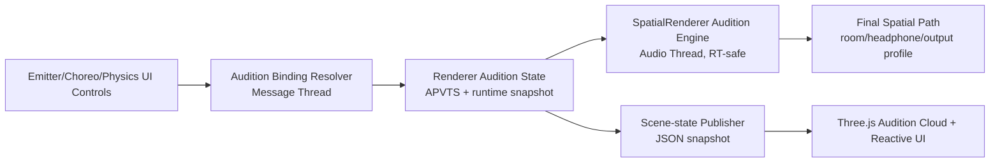
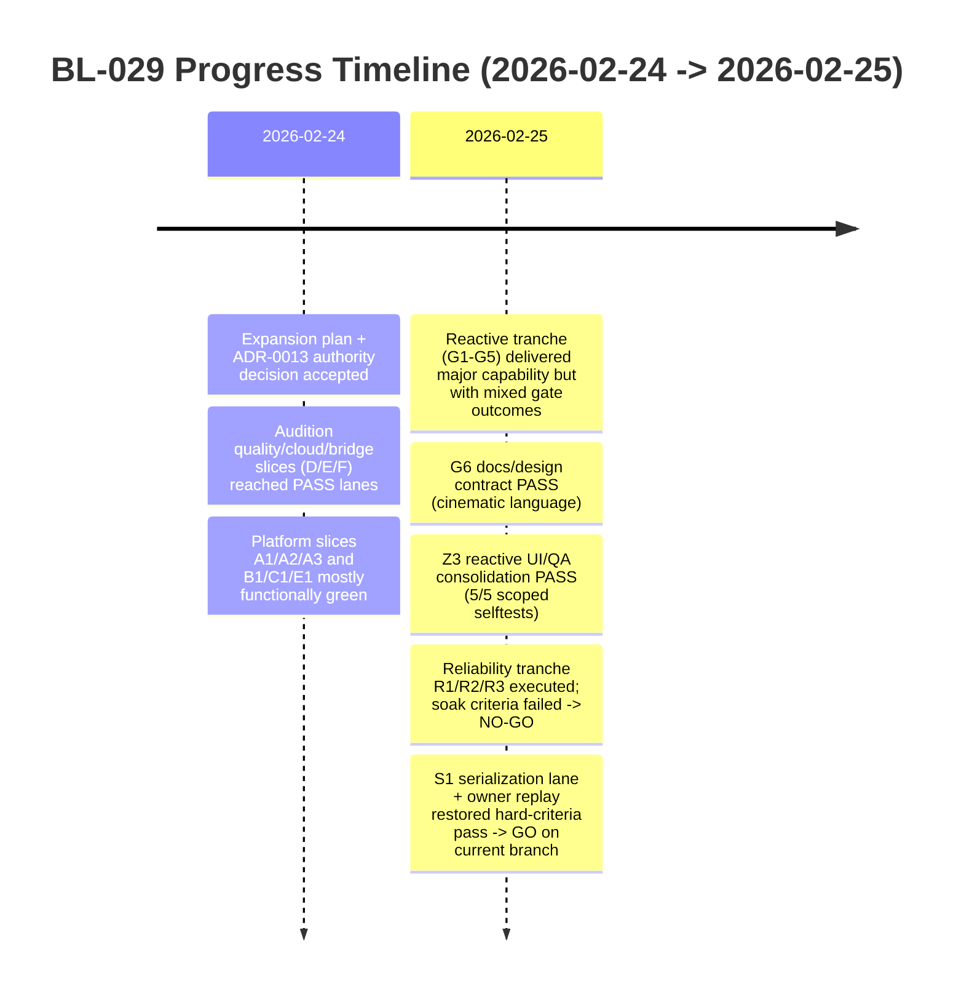
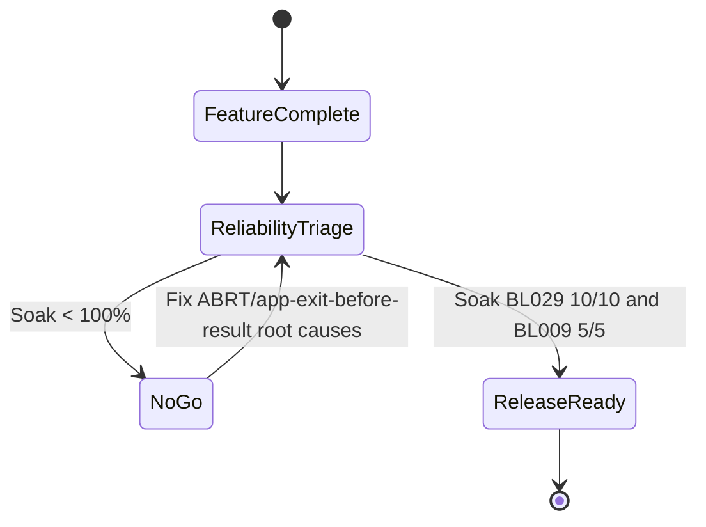

# BL-029 Audition Platform Retrospective (What, Why, How, When, Where)

## 1) Executive Summary

BL-029 started as a visualization/tooling backlog item and evolved into a larger **Audition Platform** initiative:
1. Make audition sources useful without a DAW input (standalone demo/diagnostic mode).
2. Keep renderer-domain authority for correctness (room/headphone/spatial profile path stays canonical).
3. Add deterministic multi-emitter cloud behavior, reactive telemetry, and cinematic preset language.

Current status:
1. **Feature delivery is strong** (major native/UI/contract/QA slices landed and validated).
2. **Reliability recovered on latest branch replay** (`S1` + `S3` + owner hard-criteria replay reached GO), while earlier `R1/R2/R3` NO-GO evidence is retained as historical regression context.

---

## 2) Why This Work Happened

Primary product reasons:
1. Audition needed to demonstrate spatial audio quality even when no host track/input exists.
2. Users wanted richer rain/snow/chimes/impact behavior with both visual and audio coherence.
3. Team needed deterministic behavior for QA/replay/selftest (not “looks good once”).

Architectural reason:
1. Keep audition rendering in **Renderer** to preserve domain correctness and avoid split authority.
2. Let Emitter/Choreography/Physics act as proxy controls into renderer-owned audition state.

References:
1. `Documentation/adr/ADR-0013-audition-authority-and-cross-mode-control.md`
2. `Documentation/plans/bl-029-audition-platform-expansion-plan-2026-02-24.md`

---

## 3) Where Changes Landed (Code and Contracts)

### Native runtime
1. `Source/SpatialRenderer.h`
2. `Source/PluginProcessor.cpp`

### UI/runtime bridge and rendering
1. `Source/ui/public/js/index.js`
2. `Source/ui/public/index.html`

### QA and harness
1. `qa/scenarios/locusq_audition_platform_showcase.json`
2. `scripts/qa-bl029-audition-platform-lane-mac.sh`
3. `scripts/standalone-ui-selftest-production-p0-mac.sh`
4. `scripts/qa-bl009-headphone-contract-mac.sh`

### Documentation and contracts
1. `Documentation/scene-state-contract.md`
2. `Documentation/implementation-traceability.md`
3. `Documentation/testing/bl-029-audition-platform-qa.md`
4. `Documentation/plans/bl-029-cinematic-reactive-preset-language-2026-02-24.md`
5. `Documentation/backlog/bl-029-dsp-visualization.md`

---

## 4) How The System Works Now (Conceptual)

Key contract behavior:
1. Schema expansion was additive and backward-compatible.
2. Legacy fallback paths were preserved (single glyph/safe defaults).
3. Reactive values were clamped and guarded (`[0..1]`, finite checks, deterministic fallback reasons).

---

## 5) Timeline: Start To Current State

Detailed interpretation:
1. **Early tranche**: major capability implementation completed across native, bridge, and UI.
2. **Middle tranche**: many “FAIL” outcomes were gate-related (RT allowlist drift or transient selftest aborts), not raw feature absence.
3. **Latest tranche**: early reliability tranche failed, then later harness/runtime stabilization replay met hard criteria on current branch.

---

## 6) What Was Completed (By Capability)

### A) Audition-cloud and multi-emitter platform
Completed:
1. Deterministic cloud metadata contract (`rendererAuditionCloud`), including mode/emitterCount/emitters[].
2. UI multi-emitter rendering path with bounded pooled geometry and fallback safety.
3. Cross-mode authority metadata (requested/resolved/binding/fallback reason).

Why it matters:
1. Enables rain/snow/chimes/impact-style audition experiences that act like distributed sources.
2. Keeps deterministic behavior for replay and debugging.

### B) Reactive and physics-coupled telemetry
Completed:
1. Additive `rendererAuditionReactive` publication with envelope/coupling/parity fields.
2. Guard rails for sanitize/clamp/fallback and bounded source-energy arrays.
3. UI contract checks for rain/snow semantics and reactive bounds in QA lanes.

Why it matters:
1. Visual behavior can track audio/reactive state instead of only position.
2. Failure modes are explicit and debuggable (`rendererAuditionFallbackReason` etc.).

### C) QA lanes and docs authority
Completed:
1. BL-029 audition platform QA lane with deterministic replay checks.
2. Cinematic preset language contract (G6) with acceptance IDs (v1/v2/v3).
3. Traceability and scene-state docs synchronized for additive schema expansion.

Why it matters:
1. Prevents feature drift and untestable “art-only” behavior.
2. Establishes release-grade acceptance language.

---

## 7) Validation Story (What Passed vs What Didn’t)

### Strongly passing areas
1. Build and QA smoke lanes frequently passed across slices.
2. BL-029 scoped selftest had multiple stable PASS windows (for example Z3 pass x5).
3. Contract/documentation freshness gates reached PASS states in key closeout moments.

### Recurrent failures
1. Standalone selftest instability in soak loops:
   - `app_exited_before_result`
   - exit `134`
   - signal `6` (`SIGABRT`)
2. BL-009 parity lane intermittency in reliability tranche.
3. Historical RT audit allowlist drift during high parallel-churn windows (owner refreshed several times).

---

## 8) What Still Blocks Done

The primary blocker is no longer functional reliability criteria; current replay is green. The remaining blocker is closeout hygiene and promotion discipline.

Hard criteria (from QA contract) require:
1. BL-029 selftest soak: **100% pass** (`10/10`)
2. BL-009 parity soak: **100% pass** (`5/5`)
3. Contract lane pass with deterministic artifacts

Historical R3 recorded:
1. BL-029 soak `1/10`
2. BL-009 soak `1/5`
3. Decision: **NO-GO**

Recovery evidence (current branch):
1. `S1` pass: `TestEvidence/bl029_selftest_serialization_s1_20260225T033732Z/status.tsv`
2. Owner hard-criteria replay GO: `TestEvidence/owner_bl029_reliability_resume_20260225T150335Z/status.tsv`

Reference evidence:
1. `TestEvidence/bl029_reliability_native_r1_20260225T031132Z/status.tsv`
2. `TestEvidence/bl029_selftest_harness_r2_20260225T030714Z/status.tsv`
3. `TestEvidence/bl029_reliability_soak_r3_20260225T030749Z/status.tsv`

---

## 9) Remaining Work To Reach Done

Remaining completion checklist:
1. Preserve current reliability (keep soak replay green on integration branch, not only worker branch).
2. Keep RT/docs gates green at final integrated replay and record synchronized owner evidence.
3. Finalize BL-029 promotion packet (status/doc sync + closeout decision) once owner signs off no active blockers.
4. Continue monitoring ABRT taxonomy tooling (S2) as regression guard even after green runs.

---

## 10) Practical “What We Learned”

1. Additive schema + fallback-first design worked well for fast iteration without breaking older UI paths.
2. Feature velocity can hide reliability debt unless soak criteria are treated as hard release gates.
3. Renderer authority decision (ADR-0013) was correct: it allowed rich cross-mode behavior without architecture fork.
4. Operational robustness gates can recover quickly when harness ownership and launch serialization are treated as first-class features.

---

## 11) Canonical Evidence and Status Surfaces

Primary status docs:
1. `Documentation/backlog/bl-029-dsp-visualization.md`
2. `Documentation/backlog/index.md`
3. `Documentation/testing/bl-029-audition-platform-qa.md`
4. `Documentation/scene-state-contract.md`
5. `Documentation/implementation-traceability.md`

Representative evidence bundles:
1. `TestEvidence/bl029_audition_quality_slice_d_20260224T205057Z/`
2. `TestEvidence/bl029_audition_cloud_slice_e_20260224T205041Z/`
3. `TestEvidence/bl029_audition_platform_slice_a3_20260224T225104Z/`
4. `TestEvidence/bl029_reactive_ui_z3_20260225T004027Z/`
5. `TestEvidence/bl029_reliability_native_r1_20260225T031132Z/`
6. `TestEvidence/bl029_selftest_harness_r2_20260225T030714Z/`
7. `TestEvidence/bl029_reliability_soak_r3_20260225T030749Z/`
8. `TestEvidence/bl029_selftest_serialization_s1_20260225T033732Z/`
9. `TestEvidence/owner_bl029_reliability_resume_20260225T150335Z/`
