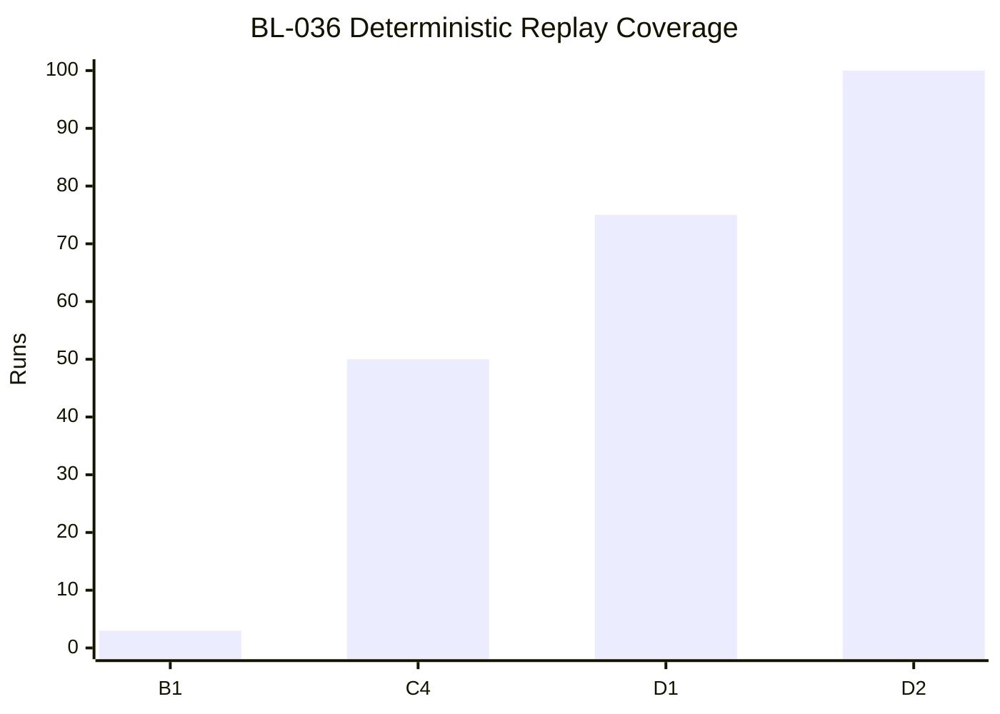

Title: BL-036 DSP Finite Output Guardrails
Document Type: Backlog Runbook
Author: APC Codex
Created Date: 2026-02-26
Last Modified Date: 2026-03-02

# BL-036 DSP Finite Output Guardrails

## Plain-Language Summary

BL-036 focuses on a clear, operator-visible outcome: Guarantee finite-only audio and reactive state propagation by enforcing deterministic NaN/Inf/denormal containment at DSP boundaries, with explicit limiter and fallback behavior before host-buffer publication. This matters because it improves reliability and decision confidence for nearby release lanes. Current state: Done-candidate (Z10 owner D2 intake accepted; deterministic 100-run replay, strict usage semantics, and docs freshness are green).


## 6W Snapshot (Who/What/Why/How/When/Where)

| Question | Plain-language answer |
|---|---|
| Who is this for? | QA owners, release owners, and engineering maintainers who depend on deterministic evidence. |
| What is changing? | Guarantee finite-only audio and reactive state propagation by enforcing deterministic NaN/Inf/denormal containment at DSP boundaries, with explicit limiter and fallback behavior before host-buffer publication. |
| Why is this important? | It reduces risk and keeps related backlog lanes from being blocked by unclear behavior or missing evidence. |
| How will we deliver it? | Deliver in slices, run the required replay/validation lanes, and capture evidence in TestEvidence before owner promotion decisions. |
| When is it done? | Current state: Done-candidate (Z10 owner D2 intake accepted; deterministic 100-run replay, strict usage semantics, and docs freshness are green). This item is done when required acceptance checks pass and promotion evidence is complete. |
| Where is the source of truth? | Runbook `Documentation/backlog/bl-036-dsp-finite-output-guardrails.md`, backlog authority `Documentation/backlog/index.md`, and evidence under `TestEvidence/...`. |


## Visual Aid Index

Use visuals only when they improve understanding; prefer compact tables first.

| Visual Aid | Why it helps | Where to find it |
|---|---|---|
| Status Ledger table | Gives a fast plain-language view of priority, state, dependencies, and ownership. | `## Status Ledger` |
| Validation table | Shows exactly how we verify success and safety. | `## Validation Plan` |
| Implementation slices table | Explains step-by-step delivery order and boundaries. | `## Implementation Slices` |
| Optional diagram/screenshot/chart | Use only when it makes complex behavior easier to understand than text alone. | Link under the most relevant section (usually validation or evidence). |
| Evidence visual snapshot | Shows latest evidence packets and replay outcomes in one glance. | `## Evidence Visual Snapshot` |


## Delivery Flow Diagram


## Evidence Visual Snapshot

| Replay Stage | Result | Evidence |
|---|---|---|
| B1 contract replay (`runs=3`) | PASS (`3/3`) | `TestEvidence/bl036_slice_b1_lane_20260227T005722Z/status.tsv` |
| C4 sentinel replay (`runs=50`) | PASS (`50/50`) | `TestEvidence/bl036_slice_c4_soak_20260227T013722Z/status.tsv` |
| D1 done-candidate replay (`runs=75`) | PASS (`75/75`) | `TestEvidence/bl036_slice_d1_done_candidate_20260227T183420Z/status.tsv` |
| D2 done-promotion replay (`runs=100`) | PASS (`100/100`) | `TestEvidence/bl036_slice_d2_done_promotion_20260227T201716Z/status.tsv` |



## Status Ledger

| Field | Value |
|---|---|
| ID | BL-036 |
| Priority | P0 |
| Status | Done-candidate (Owner Z10 accepted D2 done-promotion readiness intake; deterministic 100-run replay, strict usage semantics, and docs freshness are green) |
| Track | F - Hardening |
| Effort | Med / M |
| Depends On | BL-035 |
| Blocks | BL-030 |
| Default Replay Tier | T1 (dev-loop deterministic replay; escalate per Global Replay Cadence Policy) |
| Heavy Lane Budget | Standard (apply heavy-wrapper containment when wrapper cost is high) |

## Objective

Guarantee finite-only audio and reactive state propagation by enforcing deterministic NaN/Inf/denormal containment at DSP boundaries, with explicit limiter and fallback behavior before host-buffer publication.

## Scope

In scope:
- Finite-output guardrail contract for scalar/vector/sample containment.
- Limiter and hard-safety fallback behavior contract.
- Deterministic failure taxonomy and acceptance IDs.
- Replay-ready QA artifact schema for owner intake.

Out of scope:
- New spatial rendering features.
- UI redesign or visualization-only work.
- Release-governance policy changes unrelated to finite-output enforcement.

## A1 Finite-Output Contract (Authoritative)

### Protected Boundaries

The finite-output contract applies at all DSP boundaries that can influence host output:
1. Input/parameter/reactive ingress consumed by DSP math.
2. Intermediate renderer/physics accumulation stages.
3. Limiter/output-protection stage before final host buffer write.
4. Published diagnostics values used for finite-safety observability.

### NaN/Inf Containment Rules

1. Any non-finite scalar input (`NaN`, `+Inf`, `-Inf`) is replaced with a deterministic finite fallback before downstream use.
2. Any non-finite vector component invalidates only that component and applies component-local fallback (not global engine shutdown).
3. Any non-finite audio sample after limiter/protection stage is replaced with deterministic silence (`0.0f`) before final write.
4. Every containment action emits a deterministic taxonomy token.

### Denormal Containment Rules

1. Denormal-range values are normalized to `0.0f` at guardrail boundaries.
2. Contract threshold: `abs(value) < 1.0e-30` is treated as denormal for containment reporting.
3. Denormal containment is counted separately from NaN/Inf containment.

### Limiter and Fallback Rules

1. Output protection is two-stage and deterministic:
   - preferred output envelope: limiter-targeted `abs(sample) <= 1.0`
   - hard safety clamp: `abs(sample) <= 4.0` before host write
2. If limiter state/coefficients become non-finite, affected samples fail closed to `0.0f` and emit fallback taxonomy.
3. Guardrails must be additive and not alter unrelated contract surfaces when no containment event occurs.

### Additive Diagnostics Contract

A1 defines additive publication requirements for implementation slices:
- `finiteGuardrailsActive`
- `finiteGuardrailsFallbackReason`
- `finiteGuardrailsNonFiniteCount`
- `finiteGuardrailsDenormalCount`
- `finiteGuardrailsLimiterClampCount`
- `finiteGuardrailsHardClampCount`

## Acceptance IDs (A1)

| ID | Requirement | Pass Signal | Evidence |
|---|---|---|---|
| `BL036-A1-001` | Protected finite-output boundaries are explicitly enumerated | runbook + QA doc parity | `finite_output_contract.md`, `acceptance_matrix.tsv` |
| `BL036-A1-002` | NaN/Inf containment behavior is deterministic and fail-safe | explicit rule + taxonomy mapping | `finite_output_contract.md`, `failure_taxonomy.tsv` |
| `BL036-A1-003` | Denormal containment threshold and handling are explicit | threshold + handling rule documented | `finite_output_contract.md` |
| `BL036-A1-004` | Limiter + hard-clamp fallback behavior is bounded | limiter target + hard clamp range documented | `finite_output_contract.md`, `Documentation/testing/bl-036-dsp-finite-output-guardrails-qa.md` |
| `BL036-A1-005` | Failure taxonomy is machine-readable and deterministic | taxonomy table complete and parseable | `failure_taxonomy.tsv` |
| `BL036-A1-006` | Replay-ready QA artifact contract is explicit | required artifact schema documented | `Documentation/testing/bl-036-dsp-finite-output-guardrails-qa.md` |
| `BL036-A1-007` | Docs freshness gate passes for contract surfaces | validation exit `0` | `docs_freshness.log` |

## Failure Taxonomy Contract

| Code | Class | Trigger | Expected Behavior |
|---|---|---|---|
| `BL036-FX-001` | non_finite_input_scalar | NaN/Inf scalar reaches guarded boundary | apply finite fallback scalar; count event |
| `BL036-FX-002` | non_finite_input_vector_component | NaN/Inf vector component detected | sanitize component only; count event |
| `BL036-FX-003` | denormal_contained | denormal-range value at guard boundary | flush to zero; count event |
| `BL036-FX-004` | limiter_state_non_finite | limiter state/coefficient non-finite | fail closed for affected samples; emit fallback reason |
| `BL036-FX-005` | output_sample_non_finite_post_limiter | non-finite sample detected before host write | force `0.0f`; count event |
| `BL036-FX-006` | output_hard_clamp_applied | sample exceeds hard safety bound | clamp to bound; count event |
| `BL036-FX-007` | fallback_reason_missing_or_invalid | fallback token absent/unknown | set deterministic fallback token `contract_violation` |
| `BL036-FX-900` | harness_or_environment_blocker | contract validation blocked by environment | fail slice with explicit blocker |

## Implementation Slices

| Slice | Description | Exit Criteria |
|---|---|---|
| A1 | Contract + taxonomy + QA schema definition | Acceptance IDs `BL036-A1-001..007` documented and freshness green |
| A2 | Native finite-guardrail integration | No non-finite host-output writes in deterministic lane |
| B1 | QA lane harness + scenario contract bootstrap | Lane script + scenario contract pass deterministic `--contract-only --runs 3` replay with machine-readable outputs |
| B2 | Diagnostics publication + fallback telemetry | Additive finite diagnostics published with stable schema |
| C2 | Deterministic contract-lane soak evidence | `--contract-only --runs 10` replay remains hash-stable and taxonomy-clean |
| C3 | Deterministic replay sentinel evidence | `--contract-only --runs 20` replay remains hash-stable, row-stable, and taxonomy-clean |
| C4 | Deterministic replay sentinel soak evidence | `--contract-only --runs 50` replay remains hash-stable, row-stable, and taxonomy-clean |
| C5 | Exit-semantics guard + replay sentinel evidence | `--contract-only --runs 20` replay remains stable and usage-error probes return strict exit `2` |
| C5b | Exit-semantics recheck after hygiene handoff | Same deterministic/exit-semantics checks rerun; contract remains stable while docs gate is re-evaluated |
| C5c | Exit-semantics recheck after H2 hygiene handoff | Same deterministic/exit-semantics checks rerun post-H2; contract remains stable while docs gate is re-evaluated |
| C6 | Release-sentinel replay + strict exit-semantics evidence | `--contract-only --runs 50` replay remains hash/row stable and usage-error probes return strict exit `2` |
| D1 | Done-candidate readiness replay + strict exit-semantics evidence | `--contract-only --runs 75` replay remains hash/row stable and usage-error probes return strict exit `2` |
| D2 | Done-promotion readiness replay + strict exit-semantics evidence | `--contract-only --runs 100` replay remains hash/row stable and usage-error probes return strict exit `2` |
| C1 | Fuzz/soak replay validation | Deterministic replay shows zero non-contained NaN/Inf leaks |

## TODOs

- [x] Define A1 finite-output contract with explicit acceptance IDs.
- [x] Define deterministic failure taxonomy for finite-output guardrails.
- [x] Create replay-ready QA contract surface for BL-036.
- [x] Bootstrap deterministic B1 lane harness + scenario contract (`qa-bl036-finite-output-lane-mac.sh` + `locusq_bl036_finite_output_suite.json`).
- [x] Execute deterministic contract-lane soak evidence run (`--contract-only --runs 10`) for C2.
- [x] Execute deterministic replay sentinel evidence run (`--contract-only --runs 20`) for C3.
- [x] Execute deterministic replay sentinel soak evidence run (`--contract-only --runs 50`) for C4.
- [x] Execute C5 exit-semantics guard probes (`--runs 0`, `--unknown-flag`) with strict usage exit `2`.
- [x] Execute C5b recheck replay/exit probes after docs-hygiene handoff.
- [x] Execute C5c post-H2 recheck replay/exit probes and recapture docs-freshness status.
- [x] Execute C6 release-sentinel replay (`--contract-only --runs 50`) plus strict usage-exit probes (`--runs 0`, `--unknown-flag`).
- [x] Execute D1 done-candidate readiness replay (`--contract-only --runs 75`) plus strict usage-exit probes (`--runs 0`, `--unknown-flag`).
- [x] Execute D2 done-promotion readiness replay (`--contract-only --runs 100`) plus strict usage-exit probes (`--runs 0`, `--unknown-flag`).
- [ ] Implement native finite guardrails in runtime DSP paths.
- [ ] Publish additive finite-output diagnostics from processor surfaces.
- [ ] Execute runtime finite-output fuzz/soak lane and owner replay.


## Validation Plan

A1 (contract slice):
- `./scripts/validate-docs-freshness.sh`

B1 (lane bootstrap slice):
- `bash -n scripts/qa-bl036-finite-output-lane-mac.sh`
- `./scripts/qa-bl036-finite-output-lane-mac.sh --help`
- `./scripts/qa-bl036-finite-output-lane-mac.sh --contract-only --runs 3 --out-dir TestEvidence/bl036_slice_b1_lane_<timestamp>/contract_runs`
- `./scripts/validate-docs-freshness.sh`

C2 (determinism soak slice):
- `bash -n scripts/qa-bl036-finite-output-lane-mac.sh`
- `./scripts/qa-bl036-finite-output-lane-mac.sh --help`
- `./scripts/qa-bl036-finite-output-lane-mac.sh --contract-only --runs 10 --out-dir TestEvidence/bl036_slice_c2_soak_<timestamp>/contract_runs`
- `./scripts/validate-docs-freshness.sh`

C3 (replay sentinel slice):
- `bash -n scripts/qa-bl036-finite-output-lane-mac.sh`
- `./scripts/qa-bl036-finite-output-lane-mac.sh --help`
- `./scripts/qa-bl036-finite-output-lane-mac.sh --contract-only --runs 20 --out-dir TestEvidence/bl036_slice_c3_replay_sentinel_<timestamp>/contract_runs`
- `./scripts/validate-docs-freshness.sh`

C4 (replay sentinel soak slice):
- `bash -n scripts/qa-bl036-finite-output-lane-mac.sh`
- `./scripts/qa-bl036-finite-output-lane-mac.sh --help`
- `./scripts/qa-bl036-finite-output-lane-mac.sh --contract-only --runs 50 --out-dir TestEvidence/bl036_slice_c4_soak_<timestamp>/contract_runs`
- `./scripts/validate-docs-freshness.sh`

C5 (exit-semantics guard slice):
- `bash -n scripts/qa-bl036-finite-output-lane-mac.sh`
- `./scripts/qa-bl036-finite-output-lane-mac.sh --help`
- `./scripts/qa-bl036-finite-output-lane-mac.sh --contract-only --runs 20 --out-dir TestEvidence/bl036_slice_c5_semantics_<timestamp>/contract_runs`
- `./scripts/qa-bl036-finite-output-lane-mac.sh --runs 0` (expect exit `2`)
- `./scripts/qa-bl036-finite-output-lane-mac.sh --unknown-flag` (expect exit `2`)
- `./scripts/validate-docs-freshness.sh`

C5b (exit-semantics recheck slice):
- `bash -n scripts/qa-bl036-finite-output-lane-mac.sh`
- `./scripts/qa-bl036-finite-output-lane-mac.sh --help`
- `./scripts/qa-bl036-finite-output-lane-mac.sh --contract-only --runs 20 --out-dir TestEvidence/bl036_slice_c5b_semantics_<timestamp>/contract_runs`
- `./scripts/qa-bl036-finite-output-lane-mac.sh --runs 0` (expect exit `2`)
- `./scripts/qa-bl036-finite-output-lane-mac.sh --unknown-flag` (expect exit `2`)
- `./scripts/validate-docs-freshness.sh`

C5c (exit-semantics recheck post-H2 slice):
- `bash -n scripts/qa-bl036-finite-output-lane-mac.sh`
- `./scripts/qa-bl036-finite-output-lane-mac.sh --help`
- `./scripts/qa-bl036-finite-output-lane-mac.sh --contract-only --runs 20 --out-dir TestEvidence/bl036_slice_c5c_semantics_<timestamp>/contract_runs`
- `./scripts/qa-bl036-finite-output-lane-mac.sh --runs 0` (expect exit `2`)
- `./scripts/qa-bl036-finite-output-lane-mac.sh --unknown-flag` (expect exit `2`)
- `./scripts/validate-docs-freshness.sh`

C6 (release sentinel slice):
- `bash -n scripts/qa-bl036-finite-output-lane-mac.sh`
- `./scripts/qa-bl036-finite-output-lane-mac.sh --help`
- `./scripts/qa-bl036-finite-output-lane-mac.sh --contract-only --runs 50 --out-dir TestEvidence/bl036_slice_c6_release_sentinel_<timestamp>/contract_runs`
- `./scripts/qa-bl036-finite-output-lane-mac.sh --runs 0` (expect exit `2`)
- `./scripts/qa-bl036-finite-output-lane-mac.sh --unknown-flag` (expect exit `2`)
- `./scripts/validate-docs-freshness.sh`

D1 (done-candidate readiness slice):
- `bash -n scripts/qa-bl036-finite-output-lane-mac.sh`
- `./scripts/qa-bl036-finite-output-lane-mac.sh --help`
- `./scripts/qa-bl036-finite-output-lane-mac.sh --contract-only --runs 75 --out-dir TestEvidence/bl036_slice_d1_done_candidate_<timestamp>/contract_runs`
- `./scripts/qa-bl036-finite-output-lane-mac.sh --runs 0` (expect exit `2`)
- `./scripts/qa-bl036-finite-output-lane-mac.sh --unknown-flag` (expect exit `2`)
- `./scripts/validate-docs-freshness.sh`

D2 (done-promotion readiness slice):
- `bash -n scripts/qa-bl036-finite-output-lane-mac.sh`
- `./scripts/qa-bl036-finite-output-lane-mac.sh --help`
- `./scripts/qa-bl036-finite-output-lane-mac.sh --contract-only --runs 100 --out-dir TestEvidence/bl036_slice_d2_done_promotion_<timestamp>/contract_runs`
- `./scripts/qa-bl036-finite-output-lane-mac.sh --runs 0` (expect exit `2`)
- `./scripts/qa-bl036-finite-output-lane-mac.sh --unknown-flag` (expect exit `2`)
- `./scripts/validate-docs-freshness.sh`

Runtime implementation slices (A2/B2/C1):
- `cmake --build build_local --config Release --target LocusQ_Standalone locusq_qa -j 8`
- `./build_local/locusq_qa_artefacts/Release/locusq_qa --spatial qa/scenarios/locusq_smoke_suite.json`
- `LOCUSQ_UI_SELFTEST_SCOPE=bl029 ./scripts/standalone-ui-selftest-production-p0-mac.sh`
- `./scripts/rt-safety-audit.sh --print-summary --output TestEvidence/bl036_<slice>_<timestamp>/rt_audit.tsv`

## Evidence Contract

A1 required outputs:
- `status.tsv`
- `finite_output_contract.md`
- `acceptance_matrix.tsv`
- `failure_taxonomy.tsv`
- `docs_freshness.log`

B1 required outputs:
- `status.tsv`
- `validation_matrix.tsv`
- `contract_runs/validation_matrix.tsv`
- `contract_runs/replay_hashes.tsv`
- `contract_runs/failure_taxonomy.tsv`
- `lane_notes.md`
- `docs_freshness.log`

C2 required outputs:
- `status.tsv`
- `validation_matrix.tsv`
- `contract_runs/validation_matrix.tsv`
- `contract_runs/replay_hashes.tsv`
- `contract_runs/failure_taxonomy.tsv`
- `soak_summary.tsv`
- `lane_notes.md`
- `docs_freshness.log`

C3 required outputs:
- `status.tsv`
- `validation_matrix.tsv`
- `contract_runs/validation_matrix.tsv`
- `contract_runs/replay_hashes.tsv`
- `contract_runs/failure_taxonomy.tsv`
- `replay_sentinel_summary.tsv`
- `lane_notes.md`
- `docs_freshness.log`

C4 required outputs:
- `status.tsv`
- `validation_matrix.tsv`
- `contract_runs/validation_matrix.tsv`
- `contract_runs/replay_hashes.tsv`
- `contract_runs/failure_taxonomy.tsv`
- `replay_sentinel_summary.tsv`
- `lane_notes.md`
- `docs_freshness.log`

C5 required outputs:
- `status.tsv`
- `validation_matrix.tsv`
- `contract_runs/validation_matrix.tsv`
- `contract_runs/replay_hashes.tsv`
- `contract_runs/failure_taxonomy.tsv`
- `replay_sentinel_summary.tsv`
- `exit_semantics_probe.tsv`
- `lane_notes.md`
- `docs_freshness.log`

C5b required outputs:
- `status.tsv`
- `validation_matrix.tsv`
- `contract_runs/validation_matrix.tsv`
- `contract_runs/replay_hashes.tsv`
- `contract_runs/failure_taxonomy.tsv`
- `replay_sentinel_summary.tsv`
- `exit_semantics_probe.tsv`
- `lane_notes.md`
- `docs_freshness.log`

C5c required outputs:
- `status.tsv`
- `validation_matrix.tsv`
- `contract_runs/validation_matrix.tsv`
- `contract_runs/replay_hashes.tsv`
- `contract_runs/failure_taxonomy.tsv`
- `replay_sentinel_summary.tsv`
- `exit_semantics_probe.tsv`
- `lane_notes.md`
- `docs_freshness.log`

C6 required outputs:
- `status.tsv`
- `validation_matrix.tsv`
- `contract_runs/validation_matrix.tsv`
- `contract_runs/replay_hashes.tsv`
- `contract_runs/failure_taxonomy.tsv`
- `replay_sentinel_summary.tsv`
- `exit_semantics_probe.tsv`
- `lane_notes.md`
- `docs_freshness.log`

D1 required outputs:
- `status.tsv`
- `validation_matrix.tsv`
- `contract_runs/validation_matrix.tsv`
- `contract_runs/replay_hashes.tsv`
- `contract_runs/failure_taxonomy.tsv`
- `replay_sentinel_summary.tsv`
- `exit_semantics_probe.tsv`
- `lane_notes.md`
- `docs_freshness.log`

D2 required outputs:
- `status.tsv`
- `validation_matrix.tsv`
- `contract_runs/validation_matrix.tsv`
- `contract_runs/replay_hashes.tsv`
- `contract_runs/failure_taxonomy.tsv`
- `replay_sentinel_summary.tsv`
- `exit_semantics_probe.tsv`
- `promotion_readiness.md`
- `docs_freshness.log`

Runtime implementation slice outputs (additive):
- `build.log`
- `qa_smoke.log`
- `finite_fuzz.tsv`
- `rt_audit.tsv`
- `validation_matrix.tsv`

## A1 Execution Snapshot (2026-02-27)

- Evidence packet:
  - `TestEvidence/bl036_slice_a1_contract_20260227T002904Z/status.tsv`
  - `finite_output_contract.md`
  - `acceptance_matrix.tsv`
  - `failure_taxonomy.tsv`
  - `docs_freshness.log`
- Validation:
  - `./scripts/validate-docs-freshness.sh` => `PASS`
- Result:
  - A1 contract definition complete; BL-036 remains in planning pending implementation slices.

## B1 Execution Snapshot (2026-02-27)

- Evidence packet:
  - `TestEvidence/bl036_slice_b1_lane_20260227T005722Z/status.tsv`
  - `validation_matrix.tsv`
  - `contract_runs/validation_matrix.tsv`
  - `contract_runs/replay_hashes.tsv`
  - `contract_runs/failure_taxonomy.tsv`
  - `lane_notes.md`
  - `docs_freshness.log`
- Validation:
  - `bash -n scripts/qa-bl036-finite-output-lane-mac.sh` => `PASS`
  - `./scripts/qa-bl036-finite-output-lane-mac.sh --help` => `PASS`
  - `./scripts/qa-bl036-finite-output-lane-mac.sh --contract-only --runs 3 --out-dir TestEvidence/bl036_slice_b1_lane_20260227T005722Z/contract_runs` => `PASS`
  - `./scripts/validate-docs-freshness.sh` => `PASS`
- Result:
  - B1 deterministic lane harness + scenario contract bootstrap complete.

## C2 Execution Snapshot (2026-02-27)

- Evidence packet:
  - `TestEvidence/bl036_slice_c2_soak_20260227T010555Z/status.tsv`
  - `validation_matrix.tsv`
  - `contract_runs/validation_matrix.tsv`
  - `contract_runs/replay_hashes.tsv`
  - `contract_runs/failure_taxonomy.tsv`
  - `soak_summary.tsv`
  - `lane_notes.md`
  - `docs_freshness.log`
- Validation:
  - `bash -n scripts/qa-bl036-finite-output-lane-mac.sh` => `PASS`
  - `./scripts/qa-bl036-finite-output-lane-mac.sh --help` => `PASS`
  - `./scripts/qa-bl036-finite-output-lane-mac.sh --contract-only --runs 10 --out-dir TestEvidence/bl036_slice_c2_soak_20260227T010555Z/contract_runs` => `PASS`
  - `./scripts/validate-docs-freshness.sh` => `PASS`
- Result:
  - C2 determinism soak is stable (10/10 PASS, zero replay divergence, zero taxonomy failures).

## C3 Execution Snapshot (2026-02-27)

- Evidence packet:
  - `TestEvidence/bl036_slice_c3_replay_sentinel_20260227T011846Z/status.tsv`
  - `validation_matrix.tsv`
  - `contract_runs/validation_matrix.tsv`
  - `contract_runs/replay_hashes.tsv`
  - `contract_runs/failure_taxonomy.tsv`
  - `replay_sentinel_summary.tsv`
  - `lane_notes.md`
  - `docs_freshness.log`
- Validation:
  - `bash -n scripts/qa-bl036-finite-output-lane-mac.sh` => `PASS`
  - `./scripts/qa-bl036-finite-output-lane-mac.sh --help` => `PASS`
  - `./scripts/qa-bl036-finite-output-lane-mac.sh --contract-only --runs 20 --out-dir TestEvidence/bl036_slice_c3_replay_sentinel_20260227T011846Z/contract_runs` => `PASS`
  - `./scripts/validate-docs-freshness.sh` => `PASS`
- Result:
  - C3 replay sentinel is stable (20/20 PASS, zero replay divergence, zero taxonomy failures).

## C4 Execution Snapshot (2026-02-27)

- Evidence packet:
  - `TestEvidence/bl036_slice_c4_soak_20260227T013722Z/status.tsv`
  - `validation_matrix.tsv`
  - `contract_runs/validation_matrix.tsv`
  - `contract_runs/replay_hashes.tsv`
  - `contract_runs/failure_taxonomy.tsv`
  - `replay_sentinel_summary.tsv`
  - `lane_notes.md`
  - `docs_freshness.log`
- Validation:
  - `bash -n scripts/qa-bl036-finite-output-lane-mac.sh` => `PASS`
  - `./scripts/qa-bl036-finite-output-lane-mac.sh --help` => `PASS`
  - `./scripts/qa-bl036-finite-output-lane-mac.sh --contract-only --runs 50 --out-dir TestEvidence/bl036_slice_c4_soak_20260227T013722Z/contract_runs` => `PASS`
  - `./scripts/validate-docs-freshness.sh` => `PASS`
- Result:
  - C4 replay sentinel soak is stable (50/50 PASS, zero replay divergence, zero taxonomy failures).

## C5 Execution Snapshot (2026-02-27)

- Evidence packet:
  - `TestEvidence/bl036_slice_c5_semantics_20260227T015144Z/status.tsv`
  - `validation_matrix.tsv`
  - `contract_runs/validation_matrix.tsv`
  - `contract_runs/replay_hashes.tsv`
  - `contract_runs/failure_taxonomy.tsv`
  - `replay_sentinel_summary.tsv`
  - `exit_semantics_probe.tsv`
  - `lane_notes.md`
  - `docs_freshness.log`
- Validation:
  - `bash -n scripts/qa-bl036-finite-output-lane-mac.sh` => `PASS`
  - `./scripts/qa-bl036-finite-output-lane-mac.sh --help` => `PASS`
  - `./scripts/qa-bl036-finite-output-lane-mac.sh --contract-only --runs 20 --out-dir TestEvidence/bl036_slice_c5_semantics_20260227T015144Z/contract_runs` => `PASS`
  - negative probe `./scripts/qa-bl036-finite-output-lane-mac.sh --runs 0` => exit `2` (PASS)
  - negative probe `./scripts/qa-bl036-finite-output-lane-mac.sh --unknown-flag` => exit `2` (PASS)
  - `./scripts/validate-docs-freshness.sh` => `PASS`
- Result:
  - C5 replay + exit semantics guard is stable (20/20 PASS and strict usage exit semantics verified).

## C5b Execution Snapshot (2026-02-27)

- Evidence packet:
  - `TestEvidence/bl036_slice_c5b_semantics_20260227T025149Z/status.tsv`
  - `validation_matrix.tsv`
  - `contract_runs/validation_matrix.tsv`
  - `contract_runs/replay_hashes.tsv`
  - `contract_runs/failure_taxonomy.tsv`
  - `replay_sentinel_summary.tsv`
  - `exit_semantics_probe.tsv`
  - `lane_notes.md`
  - `docs_freshness.log`
- Validation:
  - `bash -n scripts/qa-bl036-finite-output-lane-mac.sh` => `PASS`
  - `./scripts/qa-bl036-finite-output-lane-mac.sh --help` => `PASS`
  - `./scripts/qa-bl036-finite-output-lane-mac.sh --contract-only --runs 20 --out-dir TestEvidence/bl036_slice_c5b_semantics_20260227T025149Z/contract_runs` => `PASS`
  - negative probe `./scripts/qa-bl036-finite-output-lane-mac.sh --runs 0` => exit `2` (PASS)
  - negative probe `./scripts/qa-bl036-finite-output-lane-mac.sh --unknown-flag` => exit `2` (PASS)
  - `./scripts/validate-docs-freshness.sh` => `FAIL` (out-of-scope metadata debt)
- Result:
  - C5b confirms deterministic replay and strict exit semantics, but slice remains blocked on external docs freshness debt under `Documentation/Calibration POC/`.

## C5c Execution Snapshot (2026-02-27)

- Evidence packet:
  - `TestEvidence/bl036_slice_c5c_semantics_20260227T031011Z/status.tsv`
  - `validation_matrix.tsv`
  - `contract_runs/validation_matrix.tsv`
  - `contract_runs/replay_hashes.tsv`
  - `contract_runs/failure_taxonomy.tsv`
  - `replay_sentinel_summary.tsv`
  - `exit_semantics_probe.tsv`
  - `lane_notes.md`
  - `docs_freshness.log`
- Validation:
  - `bash -n scripts/qa-bl036-finite-output-lane-mac.sh` => `PASS`
  - `./scripts/qa-bl036-finite-output-lane-mac.sh --help` => `PASS`
  - `./scripts/qa-bl036-finite-output-lane-mac.sh --contract-only --runs 20 --out-dir TestEvidence/bl036_slice_c5c_semantics_20260227T031011Z/contract_runs` => `PASS`
  - negative probe `./scripts/qa-bl036-finite-output-lane-mac.sh --runs 0` => exit `2` (PASS)
  - negative probe `./scripts/qa-bl036-finite-output-lane-mac.sh --unknown-flag` => exit `2` (PASS)
  - `./scripts/validate-docs-freshness.sh` => `PASS`
- Result:
  - C5c confirms deterministic replay and strict exit semantics with docs freshness green.

## C6 Execution Snapshot (2026-02-27)

- Evidence packet:
  - `TestEvidence/bl036_slice_c6_release_sentinel_20260227T033705Z/status.tsv`
  - `validation_matrix.tsv`
  - `contract_runs/validation_matrix.tsv`
  - `contract_runs/replay_hashes.tsv`
  - `contract_runs/failure_taxonomy.tsv`
  - `replay_sentinel_summary.tsv`
  - `exit_semantics_probe.tsv`
  - `lane_notes.md`
  - `docs_freshness.log`
- Validation:
  - `bash -n scripts/qa-bl036-finite-output-lane-mac.sh` => `PASS`
  - `./scripts/qa-bl036-finite-output-lane-mac.sh --help` => `PASS`
  - `./scripts/qa-bl036-finite-output-lane-mac.sh --contract-only --runs 50 --out-dir TestEvidence/bl036_slice_c6_release_sentinel_20260227T033705Z/contract_runs` => `PASS`
  - negative probe `./scripts/qa-bl036-finite-output-lane-mac.sh --runs 0` => exit `2` (PASS)
  - negative probe `./scripts/qa-bl036-finite-output-lane-mac.sh --unknown-flag` => exit `2` (PASS)
  - `./scripts/validate-docs-freshness.sh` => `PASS`
- Result:
  - C6 confirms release-sentinel depth is stable (50/50 PASS), replay signatures remain deterministic, and strict usage-exit semantics remain enforced.

## D1 Execution Snapshot (2026-02-27)

- Evidence packet:
  - `TestEvidence/bl036_slice_d1_done_candidate_20260227T183420Z/status.tsv`
  - `validation_matrix.tsv`
  - `contract_runs/validation_matrix.tsv`
  - `contract_runs/replay_hashes.tsv`
  - `contract_runs/failure_taxonomy.tsv`
  - `replay_sentinel_summary.tsv`
  - `exit_semantics_probe.tsv`
  - `lane_notes.md`
  - `docs_freshness.log`
- Validation:
  - `bash -n scripts/qa-bl036-finite-output-lane-mac.sh` => `PASS`
  - `./scripts/qa-bl036-finite-output-lane-mac.sh --help` => `PASS`
  - `./scripts/qa-bl036-finite-output-lane-mac.sh --contract-only --runs 75 --out-dir TestEvidence/bl036_slice_d1_done_candidate_20260227T183420Z/contract_runs` => `PASS`
  - negative probe `./scripts/qa-bl036-finite-output-lane-mac.sh --runs 0` => exit `2` (PASS)
  - negative probe `./scripts/qa-bl036-finite-output-lane-mac.sh --unknown-flag` => exit `2` (PASS)
  - `./scripts/validate-docs-freshness.sh` => `PASS`
- Result:
  - D1 confirms done-candidate readiness depth is stable (75/75 PASS), replay signatures remain deterministic, and strict usage-exit semantics remain enforced.

## D2 Execution Snapshot (2026-02-27)

- Evidence packet:
  - `TestEvidence/bl036_slice_d2_done_promotion_20260227T201716Z/status.tsv`
  - `validation_matrix.tsv`
  - `contract_runs/validation_matrix.tsv`
  - `contract_runs/replay_hashes.tsv`
  - `contract_runs/failure_taxonomy.tsv`
  - `replay_sentinel_summary.tsv`
  - `exit_semantics_probe.tsv`
  - `promotion_readiness.md`
  - `docs_freshness.log`
- Validation:
  - `bash -n scripts/qa-bl036-finite-output-lane-mac.sh` => `PASS`
  - `./scripts/qa-bl036-finite-output-lane-mac.sh --help` => `PASS`
  - `./scripts/qa-bl036-finite-output-lane-mac.sh --contract-only --runs 100 --out-dir TestEvidence/bl036_slice_d2_done_promotion_20260227T201716Z/contract_runs` => `PASS`
  - negative probe `./scripts/qa-bl036-finite-output-lane-mac.sh --runs 0` => exit `2` (PASS)
  - negative probe `./scripts/qa-bl036-finite-output-lane-mac.sh --unknown-flag` => exit `2` (PASS)
  - `./scripts/validate-docs-freshness.sh` => `PASS`
- Result:
  - D2 confirms done-promotion readiness depth is stable (100/100 PASS), replay signatures remain deterministic, and strict usage-exit semantics remain enforced.

### Owner Intake Sync Z1 (2026-02-27)

- Owner packet:
  - `TestEvidence/owner_sync_bl036_bl037_bl038_bl039_bl040_z1_20260227T003434Z/status.tsv`
  - `validation_matrix.tsv`
  - `owner_decisions.md`
  - `handoff_resolution.md`
- Owner replay:
  - `./scripts/validate-docs-freshness.sh` => `PASS`
  - `jq empty status.json` => `PASS`
- Disposition:
  - BL-036 remains `In Planning`; A1 contract intake is complete and implementation slices remain pending.

### Owner Intake Sync Z6 (2026-02-27)

- Owner packet:
  - `TestEvidence/owner_sync_bl036_bl037_bl038_bl039_bl040_bl041_z6_20260227T021108Z/status.tsv`
  - `validation_matrix.tsv`
  - `owner_decisions.md`
  - `handoff_resolution.md`
- Owner replay:
  - `./scripts/qa-bl041-doppler-vbap-lane-mac.sh --contract-only --runs 3 --out-dir TestEvidence/owner_sync_bl036_bl037_bl038_bl039_bl040_bl041_z6_20260227T021108Z/bl041_recheck` => `PASS`
  - `./scripts/qa-bl040-ui-authority-diagnostics-mac.sh --contract-only --runs 3 --out-dir TestEvidence/owner_sync_bl036_bl037_bl038_bl039_bl040_bl041_z6_20260227T021108Z/bl040_recheck` => `PASS`
  - `./scripts/validate-docs-freshness.sh` => `PASS`
  - `jq empty status.json` => `PASS`
- Disposition:
  - BL-036 remains `In Implementation`; C5 packet is accepted and the external docs-freshness blocker is cleared by H1 metadata repair.

### Owner Intake Sync Z7 (2026-02-27)

- Owner packet:
  - `TestEvidence/owner_sync_bl036_bl037_bl038_bl039_bl040_bl041_z7_20260227T032802Z/status.tsv`
  - `validation_matrix.tsv`
  - `owner_decisions.md`
  - `handoff_resolution.md`
- Owner replay:
  - `./scripts/qa-bl041-doppler-vbap-lane-mac.sh --contract-only --runs 3 --out-dir TestEvidence/owner_sync_bl036_bl037_bl038_bl039_bl040_bl041_z7_20260227T032802Z/bl041_recheck` => `PASS`
  - `./scripts/qa-bl040-ui-authority-diagnostics-mac.sh --contract-only --runs 3 --out-dir TestEvidence/owner_sync_bl036_bl037_bl038_bl039_bl040_bl041_z7_20260227T032802Z/bl040_recheck` => `PASS`
  - `./scripts/validate-docs-freshness.sh` => `PASS`
  - `jq empty status.json` => `PASS`
- Disposition:
  - BL-036 remains `In Implementation`; C5c packet is accepted and H2 metadata hygiene closure is integrated.

### Owner Intake Sync Z8 (2026-02-27)

- Owner packet:
  - `TestEvidence/owner_sync_bl036_bl037_bl038_bl039_bl040_bl041_z8_20260227T042149Z/status.tsv`
  - `validation_matrix.tsv`
  - `owner_decisions.md`
  - `handoff_resolution.md`
- Owner replay:
  - `./scripts/qa-bl041-doppler-vbap-lane-mac.sh --contract-only --runs 3 --out-dir TestEvidence/owner_sync_bl036_bl037_bl038_bl039_bl040_bl041_z8_20260227T042149Z/bl041_recheck` => `PASS`
  - `./scripts/qa-bl040-ui-authority-diagnostics-mac.sh --contract-only --runs 3 --out-dir TestEvidence/owner_sync_bl036_bl037_bl038_bl039_bl040_bl041_z8_20260227T042149Z/bl040_recheck` => `PASS`
  - `./scripts/validate-docs-freshness.sh` => `PASS`
  - `jq empty status.json` => `PASS`
- Disposition:
  - BL-036 remains `In Implementation`; C6 long-run release-sentinel packet is accepted.

### Owner Intake Sync Z9 (2026-02-27)

- Owner packet:
  - `TestEvidence/owner_sync_bl036_bl037_bl038_bl039_bl040_bl041_z9_20260227T195521Z/status.tsv`
  - `validation_matrix.tsv`
  - `owner_decisions.md`
  - `handoff_resolution.md`
- Owner replay:
  - `./scripts/qa-bl041-doppler-vbap-lane-mac.sh --contract-only --runs 5 --out-dir TestEvidence/owner_sync_bl036_bl037_bl038_bl039_bl040_bl041_z9_20260227T195521Z/bl041_recheck` => `PASS`
  - `./scripts/qa-bl040-ui-authority-diagnostics-mac.sh --contract-only --runs 5 --out-dir TestEvidence/owner_sync_bl036_bl037_bl038_bl039_bl040_bl041_z9_20260227T195521Z/bl040_recheck` => `PASS`
  - `./scripts/validate-docs-freshness.sh` => `PASS`
  - `jq empty status.json` => `PASS`
- Disposition:
  - BL-036 advances to `In Validation`; D1 done-candidate readiness intake is accepted.

### Owner Intake Sync Z10 (2026-02-27)

- Owner packet:
  - `TestEvidence/owner_sync_bl036_bl037_bl038_bl039_bl040_bl041_z10_20260227T203004Z/status.tsv`
  - `validation_matrix.tsv`
  - `owner_decisions.md`
  - `handoff_resolution.md`
- Owner replay:
  - `./scripts/qa-bl041-doppler-vbap-lane-mac.sh --contract-only --runs 5 --out-dir TestEvidence/owner_sync_bl036_bl037_bl038_bl039_bl040_bl041_z10_20260227T203004Z/bl041_recheck` => `PASS`
  - `./scripts/qa-bl040-ui-authority-diagnostics-mac.sh --contract-only --runs 5 --out-dir TestEvidence/owner_sync_bl036_bl037_bl038_bl039_bl040_bl041_z10_20260227T203004Z/bl040_recheck` => `PASS`
  - `./scripts/validate-docs-freshness.sh` => `PASS`
  - `jq empty status.json` => `PASS`
- Disposition:
  - BL-036 advances to `Done-candidate`; D2 done-promotion readiness intake is accepted.

## Replay Cadence Plan (Required)

Reference policy: `Documentation/backlog/index.md` -> `Global Replay Cadence Policy`.

| Stage | Tier | Runs | Command Pattern | Evidence |
|---|---|---|---|---|
| Dev loop | T1 | 3 | runbook primary lane command at dev-loop depth | validation matrix + replay summary |
| Candidate intake | T2 | 5 (or heavy-wrapper 2-run cap) | runbook candidate replay command set | contract/execute artifacts + taxonomy |
| Promotion | T3 | 10 (or owner-approved heavy-wrapper 3-run equivalent) | owner-selected promotion replay command set | owner packet + deterministic replay evidence |
| Sentinel | T4 | 20+ (explicit only) | long-run sentinel drill when explicitly requested | parity/sentinel artifacts |

### Cost/Flake Policy

- Diagnose failing run index before repeating full multi-run sweeps.
- Heavy wrappers (`>=20` binary launches per wrapper run) use targeted reruns, candidate at 2 runs, and promotion at 3 runs unless owner requests broader coverage.
- Document cadence overrides with rationale in `lane_notes.md` or `owner_decisions.md`.


## Handoff Return Contract

All worker and owner handoffs for this runbook must include:
- `SHARED_FILES_TOUCHED: no|yes`

Required return block:
```
HANDOFF_READY
TASK: <BL ID + Title>
RESULT: PASS|FAIL
FILES_TOUCHED: ...
VALIDATION: ...
ARTIFACTS: ...
SHARED_FILES_TOUCHED: no|yes
BLOCKERS: ...
```


## Governance Alignment (2026-02-28)

This additive section aligns the runbook with current backlog lifecycle and evidence governance without altering historical execution notes.

- Done transition contract: when this item reaches Done, move the runbook from `Documentation/backlog/` to `Documentation/backlog/done/bl-XXX-*.md` in the same change set as index/status/evidence sync.
- Evidence localization contract: canonical promotion and closeout evidence must be repo-local under `TestEvidence/` (not `/tmp`-only paths).
- Ownership safety contract: worker/owner handoffs must explicitly report `SHARED_FILES_TOUCHED: no|yes`.
- Cadence authority: replay tiering and overrides are governed by `Documentation/backlog/index.md` (`Global Replay Cadence Policy`).
