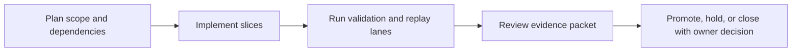

Title: BL-037 Emitter Snapshot CPU Budget
Document Type: Backlog Runbook
Author: APC Codex
Created Date: 2026-02-26
Last Modified Date: 2026-03-02

# BL-037 Emitter Snapshot CPU Budget

## Plain-Language Summary

BL-037 focuses on a clear, operator-visible outcome: Define a deterministic CPU-budget contract for emitter snapshot publication so no-renderer and under-budget paths are replay-stable, bounded, and auditable. This matters because it improves reliability and decision confidence for nearby release lanes. Current state: Done-candidate (Z10 owner D2 intake accepted; deterministic 100-run replay, strict usage semantics, and docs freshness are green).


## 6W Snapshot (Who/What/Why/How/When/Where)

| Question | Plain-language answer |
|---|---|
| Who is this for? | QA owners, release owners, and engineering maintainers who depend on deterministic evidence. |
| What is changing? | Define a deterministic CPU-budget contract for emitter snapshot publication so no-renderer and under-budget paths are replay-stable, bounded, and auditable. |
| Why is this important? | It reduces risk and keeps related backlog lanes from being blocked by unclear behavior or missing evidence. |
| How will we deliver it? | Deliver in slices, run the required replay/validation lanes, and capture evidence in TestEvidence before owner promotion decisions. |
| When is it done? | Current state: Done-candidate (Z10 owner D2 intake accepted; deterministic 100-run replay, strict usage semantics, and docs freshness are green). This item is done when required acceptance checks pass and promotion evidence is complete. |
| Where is the source of truth? | Runbook `Documentation/backlog/bl-037-emitter-snapshot-cpu-budget.md`, backlog authority `Documentation/backlog/index.md`, and evidence under `TestEvidence/...`. |


## Visual Aid Index

Use visuals only when they improve understanding; prefer compact tables first.

| Visual Aid | Why it helps | Where to find it |
|---|---|---|
| Status Ledger table | Gives a fast plain-language view of priority, state, dependencies, and ownership. | `## Status Ledger` |
| Optional diagram/screenshot/chart | Use only when it makes complex behavior easier to understand than text alone. | Link under the most relevant section (usually validation or evidence). |


## Delivery Flow Diagram



## Status Ledger

| Field | Value |
|---|---|
| ID | BL-037 |
| Priority | P1 |
| Status | Done-candidate (Owner Z10 accepted D2 done-promotion readiness intake; deterministic 100-run replay, strict usage semantics, and docs freshness are green) |
| Track | F - Hardening |
| Effort | Med / M |
| Depends On | BL-035 |
| Blocks | BL-030 |
| Default Replay Tier | T1 (dev-loop deterministic replay; escalate per Global Replay Cadence Policy) |
| Heavy Lane Budget | Standard (apply heavy-wrapper containment when wrapper cost is high) |
| Slice A1 Type | Docs only |

## Objective

Define a deterministic CPU-budget contract for emitter snapshot publication so no-renderer and under-budget paths are replay-stable, bounded, and auditable.

## Slice A1 Contract Authority

Slice A1 is documentation-only and defines the normative contract for subsequent implementation and replay lanes.

### 1) Snapshot Publication Frequency Contract

Deterministic publication cadence rules:

| Contract Field | Type | Rule | Deterministic Fallback |
|---|---|---|---|
| `snapshot_period_blocks` | uint | fixed `1` | n/a |
| `renderer_demand_active` | bool | true when renderer or audition-demand proxy is active | false when absent |
| `publish_decision` | enum | `publish`, `skip_no_demand`, `skip_budget_guard`, `force_publish_late_join` | `skip_no_demand` |
| `late_join_max_blocks` | uint | first publish must occur within `<=1` block after demand rises | `force_publish_late_join` |

Normative decision order per block:
1. If `renderer_demand_active=false` and no pending late-join obligation, decision=`skip_no_demand`.
2. If demand transitioned `false->true`, decision=`force_publish_late_join` for first eligible block.
3. If budget guard is active, decision=`skip_budget_guard` except late-join force path.
4. Otherwise decision=`publish`.

### 2) CPU Budget Envelope Contract

| Metric | Threshold | Window |
|---|---|---|
| `snapshot_cpu_us_per_block_p95` | `<=120` microseconds | rolling 1024 blocks |
| `snapshot_cpu_us_per_block_max` | `<=150` microseconds | rolling 1024 blocks |
| `snapshot_budget_overrun_ratio` | `<=0.01` | rolling 4096 blocks |

Measurement normalization:
- Baseline reference lane: 48 kHz, block size 256, renderer-demand active, 16 emitters.
- CPU stats are computed from monotonic per-block timers, no wall-clock datetime dependence.
- Non-finite timing samples are classified as contract failure.

### 3) Degradation and Fallback Policy

Budget guard policy:
- Enter guard when `snapshot_cpu_us_per_block_max` exceeds threshold for 8 consecutive eligible blocks.
- Guard duration is deterministic fixed window of 64 blocks.
- During guard, optional snapshots are skipped (`skip_budget_guard`) but late-join first publish remains mandatory.
- Guard exit occurs automatically after 64 blocks; no adaptive heuristic.

Required deterministic fallback reason tokens:
- `none`
- `skip_no_demand`
- `skip_budget_guard`
- `force_publish_late_join`
- `non_finite_cpu_sample`

### 4) Deterministic Replay Contract

Replay identity inputs (required hash inputs):
- `schema_version`
- `snapshot_period_blocks`
- `budget_thresholds`
- `sample_rate_bucket`
- `block_size`
- `renderer_demand_sequence`
- `emitter_activity_mask_sequence`

Determinism requirement:
- identical replay identity inputs must produce identical per-block `publish_decision` and fallback token sequences.

### 5) Acceptance IDs and Pass Thresholds

| Acceptance ID | Gate | Pass Threshold |
|---|---|---|
| BL037-A1-001 | Frequency contract completeness | all required cadence fields/rules defined |
| BL037-A1-002 | Late-join determinism | first publish after demand rise within `<=1` block |
| BL037-A1-003 | CPU budget envelope defined | p95/max/overrun thresholds all explicit |
| BL037-A1-004 | Degradation policy determinism | guard entry/exit windows fixed and explicit |
| BL037-A1-005 | Replay determinism contract | replay hash inputs + equality rule explicit |
| BL037-A1-006 | Failure taxonomy completeness | all required BL037-FX IDs defined |
| BL037-A1-007 | Artifact schema completeness | required artifact list + columns explicit |
| BL037-A1-008 | Docs freshness | `./scripts/validate-docs-freshness.sh` exit `0` |

### 6) QA Artifact Schema Contract

Required bundle path:
`TestEvidence/bl037_slice_a1_contract_<timestamp>/`

Required artifacts:
- `status.tsv`
- `cpu_budget_contract.md`
- `acceptance_matrix.tsv`
- `failure_taxonomy.tsv`
- `docs_freshness.log`

Required `acceptance_matrix.tsv` columns:
- `acceptance_id`, `gate`, `threshold`, `measured_value`, `result`, `evidence_path`

Required `failure_taxonomy.tsv` columns:
- `failure_id`, `category`, `trigger`, `classification`, `blocking`, `severity`, `expected_artifact`

### 7) Failure Taxonomy (Authoritative)

| Failure ID | Category | Trigger | Classification | Blocking |
|---|---|---|---|---|
| BL037-FX-001 | frequency_contract_incomplete | missing cadence rule/field | deterministic_contract_failure | yes |
| BL037-FX-002 | late_join_window_violation | first publish exceeds `1` block after demand rise | deterministic_contract_failure | yes |
| BL037-FX-003 | cpu_budget_threshold_missing | p95/max/overrun thresholds missing | deterministic_contract_failure | yes |
| BL037-FX-004 | degradation_policy_nondeterministic | variable or unspecified guard window/exit | deterministic_contract_failure | yes |
| BL037-FX-005 | replay_identity_incomplete | replay hash input set incomplete | deterministic_contract_failure | yes |
| BL037-FX-006 | publish_trace_nondeterministic | same inputs produce divergent decision trace | deterministic_contract_failure | yes |
| BL037-FX-007 | non_finite_cpu_sample | NaN/Inf in budget measurement | deterministic_contract_failure | yes |
| BL037-FX-008 | artifact_schema_incomplete | required artifact or columns missing | deterministic_evidence_failure | yes |

## Traceability References

- `.ideas/architecture.md`
- `.ideas/parameter-spec.md`
- `Documentation/invariants.md`
- `Documentation/adr/ADR-0005-phase-closeout-docs-freshness-gate.md`
- `Documentation/adr/ADR-0010-repository-artifact-tracking-and-retention-policy.md`

## TODOs (Slice A1)

- [x] Define deterministic snapshot frequency contract.
- [x] Define CPU budget envelope thresholds and measurement windows.
- [x] Define degradation/fallback policy and deterministic tokens.
- [x] Define replay determinism identity and equality contract.
- [x] Define acceptance IDs + evidence mapping.
- [x] Define failure taxonomy.
- [x] Capture A1 evidence bundle and docs freshness log.


## Slice B1 Lane Bootstrap Contract (Deterministic)

Canonical lane script:
- `./scripts/qa-bl037-snapshot-budget-lane-mac.sh`

Supported options:
- `--contract-only`
- `--execute-suite`
- `--runs <N>`
- `--out-dir <path>`
- `--help|-h`

B1 acceptance gates:

| Acceptance ID | Gate | Pass Threshold |
|---|---|---|
| BL037-B1-001 | A1 acceptance ID declarations | count `>=8` across runbook+QA docs |
| BL037-B1-002 | BL037-FX taxonomy declarations | count `>=8` across runbook+QA docs |
| BL037-B1-003 | publish decision token clause | `publish/skip_no_demand/skip_budget_guard/force_publish_late_join` all present |
| BL037-B1-004 | CPU budget clause | p95/max/overrun thresholds declared |
| BL037-B1-005 | replay clause | deterministic replay clause declared |
| BL037-B1-006 | artifact schema clause | required artifact names declared |
| BL037-B1-007 | BL037-B1-FX lane taxonomy declarations | count `>=10` across runbook+QA docs |
| BL037-B1-008 | replay hash stability | canonical hash stable for all reruns |

B1 failure taxonomy IDs (lane-specific):
- `BL037-B1-FX-001` runbook doc missing
- `BL037-B1-FX-002` QA doc missing
- `BL037-B1-FX-003` scenario file missing
- `BL037-B1-FX-004` QA binary missing in `--execute-suite`
- `BL037-B1-FX-010` A1 acceptance IDs incomplete
- `BL037-B1-FX-011` BL037-FX taxonomy incomplete
- `BL037-B1-FX-012` decision-token clause missing
- `BL037-B1-FX-013` budget-threshold clause missing
- `BL037-B1-FX-014` replay hash mismatch across reruns
- `BL037-B1-FX-015` artifact-schema clause missing
- `BL037-B1-FX-016` replay clause missing
- `BL037-B1-FX-017` BL037-B1-FX taxonomy incomplete
- `BL037-B1-FX-020` suite execution failure

B1 required lane artifacts:
- `status.tsv`
- `validation_matrix.tsv`
- `replay_hashes.tsv`
- `failure_taxonomy.tsv`

B1 evidence bundle path:
- `TestEvidence/bl037_slice_b1_lane_<timestamp>/`

B1 required owner-facing artifacts:
- `status.tsv`
- `validation_matrix.tsv`
- `contract_runs/validation_matrix.tsv`
- `contract_runs/replay_hashes.tsv`
- `contract_runs/failure_taxonomy.tsv`
- `lane_notes.md`
- `docs_freshness.log`

## Slice C2 Determinism Soak Contract

Purpose:
- Prove replay-stable budget/degradation decision outputs under extended deterministic replay (`--runs 10`).

C2 validation commands:
- `bash -n scripts/qa-bl037-snapshot-budget-lane-mac.sh`
- `./scripts/qa-bl037-snapshot-budget-lane-mac.sh --help`
- `./scripts/qa-bl037-snapshot-budget-lane-mac.sh --contract-only --runs 10 --out-dir TestEvidence/bl037_slice_c2_soak_<timestamp>/contract_runs`
- `./scripts/validate-docs-freshness.sh`

C2 acceptance IDs:

| Acceptance ID | Requirement | Evidence |
|---|---|---|
| `BL037-C2-001` | Extended contract-only replay (`runs=10`) keeps canonical replay hash stable | `contract_runs/replay_hashes.tsv` |
| `BL037-C2-002` | Lane matrix is deterministic with no replay mismatch rows | `contract_runs/validation_matrix.tsv` |
| `BL037-C2-003` | Failure taxonomy remains explicit and machine-readable | `contract_runs/failure_taxonomy.tsv` |
| `BL037-C2-004` | Soak summary packet captures replay determinism rollup | `soak_summary.tsv` |
| `BL037-C2-005` | Docs freshness gate remains green after C2 updates | `docs_freshness.log` |

C2 required evidence bundle:
- `status.tsv`
- `validation_matrix.tsv`
- `contract_runs/validation_matrix.tsv`
- `contract_runs/replay_hashes.tsv`
- `contract_runs/failure_taxonomy.tsv`
- `soak_summary.tsv`
- `lane_notes.md`
- `docs_freshness.log`

## Slice C3 Replay Sentinel Contract

Purpose:
- Produce a 20-run deterministic replay sentinel packet and preserve strict lane exit semantics (`0/1/2`).

C3 validation commands:
- `bash -n scripts/qa-bl037-snapshot-budget-lane-mac.sh`
- `./scripts/qa-bl037-snapshot-budget-lane-mac.sh --help`
- `./scripts/qa-bl037-snapshot-budget-lane-mac.sh --contract-only --runs 20 --out-dir TestEvidence/bl037_slice_c3_replay_sentinel_<timestamp>/contract_runs`
- `./scripts/validate-docs-freshness.sh`

C3 acceptance IDs:

| Acceptance ID | Requirement | Evidence |
|---|---|---|
| `BL037-C3-001` | Contract lane syntax and CLI contract remain valid | `status.tsv`, `validation_matrix.tsv` |
| `BL037-C3-002` | 20-run replay canonical hash is stable (`deterministic_match=yes` for all rows) | `contract_runs/replay_hashes.tsv` |
| `BL037-C3-003` | 20-run validation matrix remains fully passing (`FAIL rows = 0`) | `contract_runs/validation_matrix.tsv` |
| `BL037-C3-004` | Failure taxonomy remains zero for deterministic and artifact failures | `contract_runs/failure_taxonomy.tsv` |
| `BL037-C3-005` | Replay sentinel summary captures run-20 rollup deterministically | `replay_sentinel_summary.tsv` |
| `BL037-C3-006` | Docs freshness remains pass | `docs_freshness.log` |

C3 required evidence bundle:
- `status.tsv`
- `validation_matrix.tsv`
- `contract_runs/validation_matrix.tsv`
- `contract_runs/replay_hashes.tsv`
- `contract_runs/failure_taxonomy.tsv`
- `replay_sentinel_summary.tsv`
- `lane_notes.md`
- `docs_freshness.log`

## TODOs (Slice C3)

- [x] Align lane script artifacts with C3 replay-sentinel summary output.
- [x] Run deterministic contract-only lane with `--runs 20`.
- [x] Capture C3 sentinel summary and lane notes.
- [x] Validate docs freshness and close C3 packet.

## Slice C3 Execution Snapshot (2026-02-27)

- Evidence packet:
  - `TestEvidence/bl037_slice_c3_replay_sentinel_20260227T012033Z/status.tsv`
  - `validation_matrix.tsv`
  - `contract_runs/validation_matrix.tsv`
  - `contract_runs/replay_hashes.tsv`
  - `contract_runs/failure_taxonomy.tsv`
  - `replay_sentinel_summary.tsv`
  - `lane_notes.md`
  - `docs_freshness.log`
- Validation:
  - `bash -n scripts/qa-bl037-snapshot-budget-lane-mac.sh` => `PASS`
  - `./scripts/qa-bl037-snapshot-budget-lane-mac.sh --help` => `PASS`
  - `./scripts/qa-bl037-snapshot-budget-lane-mac.sh --contract-only --runs 20 --out-dir TestEvidence/bl037_slice_c3_replay_sentinel_20260227T012033Z/contract_runs` => `PASS`
  - `./scripts/validate-docs-freshness.sh` => `PASS`
- Result:
  - C3 replay sentinel determinism contract satisfied (`deterministic_match_yes=20`, `deterministic_match_no=0`, `unique_canonical_hashes=1`).

## Slice C4 Replay Sentinel Soak Contract

Purpose:
- Run a 50-run deterministic replay sentinel soak and publish a machine-readable confidence packet.

C4 validation commands:
- `bash -n scripts/qa-bl037-snapshot-budget-lane-mac.sh`
- `./scripts/qa-bl037-snapshot-budget-lane-mac.sh --help`
- `./scripts/qa-bl037-snapshot-budget-lane-mac.sh --contract-only --runs 50 --out-dir TestEvidence/bl037_slice_c4_soak_<timestamp>/contract_runs`
- `./scripts/validate-docs-freshness.sh`

C4 acceptance IDs:

| Acceptance ID | Requirement | Evidence |
|---|---|---|
| `BL037-C4-001` | Lane syntax/help contract remains valid | `status.tsv`, `validation_matrix.tsv` |
| `BL037-C4-002` | 50-run replay hash is stable (`deterministic_match=yes` for all rows) | `contract_runs/replay_hashes.tsv` |
| `BL037-C4-003` | Contract validation matrix remains fully passing (`FAIL rows = 0`) | `contract_runs/validation_matrix.tsv` |
| `BL037-C4-004` | Failure taxonomy remains explicit with zero failure rows | `contract_runs/failure_taxonomy.tsv` |
| `BL037-C4-005` | Replay sentinel summary reports deterministic confidence rollup | `replay_sentinel_summary.tsv` |
| `BL037-C4-006` | Docs freshness remains pass after C4 closeout | `docs_freshness.log` |

C4 required evidence bundle:
- `status.tsv`
- `validation_matrix.tsv`
- `contract_runs/validation_matrix.tsv`
- `contract_runs/replay_hashes.tsv`
- `contract_runs/failure_taxonomy.tsv`
- `replay_sentinel_summary.tsv`
- `lane_notes.md`
- `docs_freshness.log`

## TODOs (Slice C4)

- [x] Confirm lane replay summary supports C4 confidence packet outputs.
- [x] Execute deterministic contract-only soak with `--runs 50`.
- [x] Capture C4 replay sentinel summary and lane notes.
- [x] Validate docs freshness and close C4 packet.

## Slice C4 Execution Snapshot (2026-02-27)

- Input handoffs resolved:
  - `TestEvidence/bl037_slice_c3_replay_sentinel_20260227T012138Z/`
  - `TestEvidence/owner_sync_bl036_bl037_bl038_bl039_bl040_bl041_z4_20260227T013040Z/`
- Evidence packet:
  - `TestEvidence/bl037_slice_c4_soak_20260227T014043Z/status.tsv`
  - `validation_matrix.tsv`
  - `contract_runs/validation_matrix.tsv`
  - `contract_runs/replay_hashes.tsv`
  - `contract_runs/failure_taxonomy.tsv`
  - `replay_sentinel_summary.tsv`
  - `lane_notes.md`
  - `docs_freshness.log`
- Validation:
  - `bash -n scripts/qa-bl037-snapshot-budget-lane-mac.sh` => `PASS`
  - `./scripts/qa-bl037-snapshot-budget-lane-mac.sh --help` => `PASS`
  - `./scripts/qa-bl037-snapshot-budget-lane-mac.sh --contract-only --runs 50 --out-dir TestEvidence/bl037_slice_c4_soak_20260227T014043Z/contract_runs` => `PASS`
  - `./scripts/validate-docs-freshness.sh` => `PASS`
- Result:
  - C4 replay sentinel soak passed (`deterministic_match_yes=50`, `deterministic_match_no=0`, `unique_canonical_hashes=1`).

## Slice C5 Exit-Semantics Guard Contract

Purpose:
- Prove deterministic replay at C3 sentinel depth while explicitly enforcing lane exit semantics `0/1/2`.

C5 validation commands:
- `bash -n scripts/qa-bl037-snapshot-budget-lane-mac.sh`
- `./scripts/qa-bl037-snapshot-budget-lane-mac.sh --help`
- `./scripts/qa-bl037-snapshot-budget-lane-mac.sh --contract-only --runs 20 --out-dir TestEvidence/bl037_slice_c5_semantics_<timestamp>/contract_runs`
- `./scripts/qa-bl037-snapshot-budget-lane-mac.sh --runs 0` (expect exit `2`)
- `./scripts/qa-bl037-snapshot-budget-lane-mac.sh --bad-arg` (expect exit `2`)
- `./scripts/validate-docs-freshness.sh`

C5 acceptance IDs:

| Acceptance ID | Requirement | Evidence |
|---|---|---|
| `BL037-C5-001` | CLI syntax/help contract remains valid | `status.tsv`, `validation_matrix.tsv` |
| `BL037-C5-002` | 20-run contract replay remains deterministic (`deterministic_match=yes` on all rows) | `contract_runs/replay_hashes.tsv` |
| `BL037-C5-003` | Contract validation matrix has zero FAIL rows | `contract_runs/validation_matrix.tsv` |
| `BL037-C5-004` | Failure taxonomy remains machine-readable and bounded | `contract_runs/failure_taxonomy.tsv` |
| `BL037-C5-005` | Replay sentinel summary records deterministic C5 rollup | `replay_sentinel_summary.tsv` |
| `BL037-C5-006` | Negative probes enforce strict usage-exit semantics (`exit=2`) | `exit_semantics_probe.tsv` |
| `BL037-C5-007` | Docs freshness remains pass | `docs_freshness.log` |

C5 required evidence bundle:
- `status.tsv`
- `validation_matrix.tsv`
- `contract_runs/validation_matrix.tsv`
- `contract_runs/replay_hashes.tsv`
- `contract_runs/failure_taxonomy.tsv`
- `replay_sentinel_summary.tsv`
- `exit_semantics_probe.tsv`
- `lane_notes.md`
- `docs_freshness.log`

C5 failure taxonomy additions:
- `BL037-C5-FX-001`: replay hash divergence across 20 runs.
- `BL037-C5-FX-002`: validation matrix contains one or more FAIL rows.
- `BL037-C5-FX-003`: negative probe did not return exit `2`.
- `BL037-C5-FX-004`: required C5 artifact missing.
- `BL037-C5-FX-005`: docs freshness gate non-zero.

## TODOs (Slice C5)

- [x] Harden lane exit semantics with explicit `0/1/2` constants and usage-path guard.
- [x] Run deterministic contract replay for `--runs 20`.
- [x] Execute negative probes (`--runs 0`, `--bad-arg`) and capture exit evidence.
- [x] Capture C5 replay summary, semantics probe, and lane notes.
- [x] Validate docs freshness and close C5 packet.

## Slice C5 Execution Snapshot (2026-02-27)

- Evidence packet:
  - `TestEvidence/bl037_slice_c5_semantics_20260227T015358Z/status.tsv`
  - `validation_matrix.tsv`
  - `contract_runs/validation_matrix.tsv`
  - `contract_runs/replay_hashes.tsv`
  - `contract_runs/failure_taxonomy.tsv`
  - `replay_sentinel_summary.tsv`
  - `exit_semantics_probe.tsv`
  - `lane_notes.md`
  - `docs_freshness.log`
- Validation:
  - `bash -n scripts/qa-bl037-snapshot-budget-lane-mac.sh` => `PASS`
  - `./scripts/qa-bl037-snapshot-budget-lane-mac.sh --help` => `PASS`
  - `./scripts/qa-bl037-snapshot-budget-lane-mac.sh --contract-only --runs 20 --out-dir TestEvidence/bl037_slice_c5_semantics_20260227T015358Z/contract_runs` => `PASS`
  - `./scripts/qa-bl037-snapshot-budget-lane-mac.sh --runs 0` => `PASS` (expected usage exit `2`)
  - `./scripts/qa-bl037-snapshot-budget-lane-mac.sh --bad-arg` => `PASS` (expected usage exit `2`)
  - `./scripts/validate-docs-freshness.sh` => `PASS`
- Result:
  - C5 exit-semantics guard passed (`deterministic_match_yes=20`, `deterministic_match_no=0`, usage probes `2/2`).

## Slice C5b Exit-Semantics Recheck Snapshot (2026-02-27)

- Input handoffs resolved:
  - `TestEvidence/bl037_slice_c4_soak_20260227T014043Z/`
  - `TestEvidence/bl037_slice_c5_semantics_20260227T015358Z/`
  - `TestEvidence/docs_hygiene_hrtf_h1_20260227T020511Z/`
- Evidence packet:
  - `TestEvidence/bl037_slice_c5b_semantics_20260227T025209Z/status.tsv`
  - `validation_matrix.tsv`
  - `contract_runs/validation_matrix.tsv`
  - `contract_runs/replay_hashes.tsv`
  - `contract_runs/failure_taxonomy.tsv`
  - `replay_sentinel_summary.tsv`
  - `exit_semantics_probe.tsv`
  - `lane_notes.md`
  - `docs_freshness.log`
- Validation:
  - `bash -n scripts/qa-bl037-snapshot-budget-lane-mac.sh` => `PASS`
  - `./scripts/qa-bl037-snapshot-budget-lane-mac.sh --help` => `PASS`
  - `./scripts/qa-bl037-snapshot-budget-lane-mac.sh --contract-only --runs 20 --out-dir TestEvidence/bl037_slice_c5b_semantics_20260227T025209Z/contract_runs` => `PASS`
  - `./scripts/qa-bl037-snapshot-budget-lane-mac.sh --runs 0` => `PASS` (expected usage exit `2`)
  - `./scripts/qa-bl037-snapshot-budget-lane-mac.sh --bad-arg` => `PASS` (expected usage exit `2`)
  - `./scripts/validate-docs-freshness.sh` => `FAIL` (external documentation metadata debt)
- Result:
  - C5b deterministic replay and exit-semantics goals passed; aggregate slice remains blocked by non-owned docs freshness failures.

## Slice C5c Exit-Semantics Guard Recheck Contract (Post-H2)

Purpose:
- Recheck BL-037 C5 guard behavior after H2 with deterministic replay signatures and strict usage-exit semantics.

C5c validation commands:
- `bash -n scripts/qa-bl037-snapshot-budget-lane-mac.sh`
- `./scripts/qa-bl037-snapshot-budget-lane-mac.sh --help`
- `./scripts/qa-bl037-snapshot-budget-lane-mac.sh --contract-only --runs 20 --out-dir TestEvidence/bl037_slice_c5c_semantics_<timestamp>/contract_runs`
- `./scripts/qa-bl037-snapshot-budget-lane-mac.sh --runs 0` (expect exit `2`)
- `./scripts/qa-bl037-snapshot-budget-lane-mac.sh --bad-arg` (expect exit `2`)
- `./scripts/validate-docs-freshness.sh`

C5c acceptance IDs:

| Acceptance ID | Requirement | Evidence |
|---|---|---|
| `BL037-C5c-001` | 20-run contract replay remains deterministic (`deterministic_match=yes` on all rows) | `contract_runs/replay_hashes.tsv`, `replay_sentinel_summary.tsv` |
| `BL037-C5c-002` | Usage probes enforce strict usage-exit semantics (`exit=2`) | `exit_semantics_probe.tsv` |
| `BL037-C5c-003` | Docs freshness returns pass in post-H2 state | `docs_freshness.log` |

C5c required evidence bundle:
- `status.tsv`
- `validation_matrix.tsv`
- `contract_runs/validation_matrix.tsv`
- `contract_runs/replay_hashes.tsv`
- `contract_runs/failure_taxonomy.tsv`
- `replay_sentinel_summary.tsv`
- `exit_semantics_probe.tsv`
- `lane_notes.md`
- `docs_freshness.log`

## TODOs (Slice C5c)

- [x] Re-run deterministic contract replay for `--runs 20` in post-H2 state.
- [x] Re-check negative usage probes (`--runs 0`, `--bad-arg`) for strict `exit=2`.
- [x] Capture C5c replay summary, semantics probe, and lane notes.
- [x] Re-run docs freshness and record gate result.
- [x] Execute C6 release sentinel (`--runs 50`) with strict usage probes and docs freshness replay.
- [x] Execute D1 done-candidate readiness sentinel (`--runs 75`) with strict usage probes and docs freshness replay.
- [x] Execute D2 done-promotion readiness sentinel (`--runs 100`) with strict usage probes and docs freshness replay.

## Slice C5c Execution Snapshot (2026-02-27)

- Input handoffs resolved:
  - `TestEvidence/bl037_slice_c4_soak_20260227T013744Z/`
  - `TestEvidence/bl037_slice_c5b_semantics_20260227T025209Z/`
- Evidence packet:
  - `TestEvidence/bl037_slice_c5c_semantics_20260227T031111Z/status.tsv`
  - `validation_matrix.tsv`
  - `contract_runs/validation_matrix.tsv`
  - `contract_runs/replay_hashes.tsv`
  - `contract_runs/failure_taxonomy.tsv`
  - `replay_sentinel_summary.tsv`
  - `exit_semantics_probe.tsv`
  - `lane_notes.md`
  - `docs_freshness.log`
- Validation:
  - `bash -n scripts/qa-bl037-snapshot-budget-lane-mac.sh` => `PASS`
  - `./scripts/qa-bl037-snapshot-budget-lane-mac.sh --help` => `PASS`
  - `./scripts/qa-bl037-snapshot-budget-lane-mac.sh --contract-only --runs 20 --out-dir TestEvidence/bl037_slice_c5c_semantics_20260227T031111Z/contract_runs` => `PASS`
  - `./scripts/qa-bl037-snapshot-budget-lane-mac.sh --runs 0` => `PASS` (expected usage exit `2`)
  - `./scripts/qa-bl037-snapshot-budget-lane-mac.sh --bad-arg` => `PASS` (expected usage exit `2`)
  - `./scripts/validate-docs-freshness.sh` => `PASS`
- Result:
  - C5c post-H2 recheck confirms deterministic replay and strict usage-exit semantics with docs-freshness gate restored to pass.

## Slice C6 Release Sentinel Contract

Purpose:
- Advance C5c stability proofs to a release sentinel packet with 50 deterministic replays and strict usage-exit semantics.

C6 validation commands:
- `bash -n scripts/qa-bl037-snapshot-budget-lane-mac.sh`
- `./scripts/qa-bl037-snapshot-budget-lane-mac.sh --help`
- `./scripts/qa-bl037-snapshot-budget-lane-mac.sh --contract-only --runs 50 --out-dir TestEvidence/bl037_slice_c6_release_sentinel_<timestamp>/contract_runs`
- `./scripts/qa-bl037-snapshot-budget-lane-mac.sh --runs 0` (expect exit `2`)
- `./scripts/qa-bl037-snapshot-budget-lane-mac.sh --bad-arg` (expect exit `2`)
- `./scripts/validate-docs-freshness.sh`

C6 acceptance IDs:

| Acceptance ID | Requirement | Evidence |
|---|---|---|
| `BL037-C6-001` | 50-run contract replay remains deterministic (`deterministic_match=yes` on all rows) | `contract_runs/replay_hashes.tsv`, `replay_sentinel_summary.tsv` |
| `BL037-C6-002` | Contract validation matrix remains fully passing (`FAIL rows = 0`) | `contract_runs/validation_matrix.tsv` |
| `BL037-C6-003` | Usage probes enforce strict usage-exit semantics (`exit=2`) | `exit_semantics_probe.tsv` |
| `BL037-C6-004` | Docs freshness remains pass for release sentinel packet | `docs_freshness.log` |
| `BL037-C6-005` | Required C6 artifact schema is complete and machine-readable | `status.tsv`, `validation_matrix.tsv`, `lane_notes.md` |

C6 required evidence bundle:
- `status.tsv`
- `validation_matrix.tsv`
- `contract_runs/validation_matrix.tsv`
- `contract_runs/replay_hashes.tsv`
- `contract_runs/failure_taxonomy.tsv`
- `replay_sentinel_summary.tsv`
- `exit_semantics_probe.tsv`
- `lane_notes.md`
- `docs_freshness.log`

## Slice C6 Release Sentinel Execution Snapshot (2026-02-27)

- Input handoffs resolved:
  - `TestEvidence/bl037_slice_c5c_semantics_20260227T031111Z/`
  - `TestEvidence/owner_sync_bl036_bl037_bl038_bl039_bl040_bl041_z7_20260227T032802Z/`
- Evidence packet:
  - `TestEvidence/bl037_slice_c6_release_sentinel_20260227T033724Z/status.tsv`
  - `validation_matrix.tsv`
  - `contract_runs/validation_matrix.tsv`
  - `contract_runs/replay_hashes.tsv`
  - `contract_runs/failure_taxonomy.tsv`
  - `replay_sentinel_summary.tsv`
  - `exit_semantics_probe.tsv`
  - `lane_notes.md`
  - `docs_freshness.log`
- Validation:
  - `bash -n scripts/qa-bl037-snapshot-budget-lane-mac.sh` => `PASS`
  - `./scripts/qa-bl037-snapshot-budget-lane-mac.sh --help` => `PASS`
  - `./scripts/qa-bl037-snapshot-budget-lane-mac.sh --contract-only --runs 50 --out-dir TestEvidence/bl037_slice_c6_release_sentinel_20260227T033724Z/contract_runs` => `PASS`
  - `./scripts/qa-bl037-snapshot-budget-lane-mac.sh --runs 0` => `PASS` (expected usage exit `2`)
  - `./scripts/qa-bl037-snapshot-budget-lane-mac.sh --bad-arg` => `PASS` (expected usage exit `2`)
  - `./scripts/validate-docs-freshness.sh` => `PASS`
- Result:
  - C6 release sentinel passed (`deterministic_match_yes=50`, `deterministic_match_no=0`, strict usage probes `2/2`).

## Slice D1 Done-Candidate Readiness Contract

Purpose:
- Advance C6 release confidence to a done-candidate packet with 75 deterministic replay runs and strict usage-exit semantics.

D1 validation commands:
- `bash -n scripts/qa-bl037-snapshot-budget-lane-mac.sh`
- `./scripts/qa-bl037-snapshot-budget-lane-mac.sh --help`
- `./scripts/qa-bl037-snapshot-budget-lane-mac.sh --contract-only --runs 75 --out-dir TestEvidence/bl037_slice_d1_done_candidate_<timestamp>/contract_runs`
- `./scripts/qa-bl037-snapshot-budget-lane-mac.sh --runs 0` (expect exit `2`)
- `./scripts/qa-bl037-snapshot-budget-lane-mac.sh --bad-arg` (expect exit `2`)
- `./scripts/validate-docs-freshness.sh`

D1 acceptance IDs:

| Acceptance ID | Requirement | Evidence |
|---|---|---|
| `BL037-D1-001` | 75-run contract replay remains deterministic (`deterministic_match=yes` on all rows) | `contract_runs/replay_hashes.tsv`, `replay_sentinel_summary.tsv` |
| `BL037-D1-002` | Contract validation matrix remains fully passing (`FAIL rows = 0`) | `contract_runs/validation_matrix.tsv` |
| `BL037-D1-003` | Usage probes enforce strict usage-exit semantics (`exit=2`) | `exit_semantics_probe.tsv` |
| `BL037-D1-004` | Docs freshness remains pass for done-candidate packet | `docs_freshness.log` |
| `BL037-D1-005` | Required D1 artifact schema is complete and machine-readable | `status.tsv`, `validation_matrix.tsv`, `lane_notes.md` |

D1 required evidence bundle:
- `status.tsv`
- `validation_matrix.tsv`
- `contract_runs/validation_matrix.tsv`
- `contract_runs/replay_hashes.tsv`
- `contract_runs/failure_taxonomy.tsv`
- `replay_sentinel_summary.tsv`
- `exit_semantics_probe.tsv`
- `lane_notes.md`
- `docs_freshness.log`

## Slice D1 Done-Candidate Execution Snapshot (2026-02-27)

- Input handoffs resolved:
  - `TestEvidence/bl037_slice_c6_release_sentinel_20260227T033724Z/`
  - `TestEvidence/owner_sync_bl036_bl037_bl038_bl039_bl040_bl041_z8_20260227T042149Z/`
- Evidence packet:
  - `TestEvidence/bl037_slice_d1_done_candidate_20260227T035844Z/status.tsv`
  - `validation_matrix.tsv`
  - `contract_runs/validation_matrix.tsv`
  - `contract_runs/replay_hashes.tsv`
  - `contract_runs/failure_taxonomy.tsv`
  - `replay_sentinel_summary.tsv`
  - `exit_semantics_probe.tsv`
  - `lane_notes.md`
  - `docs_freshness.log`
- Validation:
  - `bash -n scripts/qa-bl037-snapshot-budget-lane-mac.sh` => `PASS`
  - `./scripts/qa-bl037-snapshot-budget-lane-mac.sh --help` => `PASS`
  - `./scripts/qa-bl037-snapshot-budget-lane-mac.sh --contract-only --runs 75 --out-dir TestEvidence/bl037_slice_d1_done_candidate_20260227T035844Z/contract_runs` => `PASS`
  - `./scripts/qa-bl037-snapshot-budget-lane-mac.sh --runs 0` => `PASS` (expected usage exit `2`)
  - `./scripts/qa-bl037-snapshot-budget-lane-mac.sh --bad-arg` => `PASS` (expected usage exit `2`)
  - `./scripts/validate-docs-freshness.sh` => `PASS`
- Result:
  - D1 done-candidate readiness passed (`deterministic_match_yes=75`, `deterministic_match_no=0`, strict usage probes `2/2`).

## Slice D2 Done-Promotion Readiness Contract

Purpose:
- Prove done-promotion readiness with 100 deterministic replay runs and strict usage-exit semantics.

D2 validation commands:
- `bash -n scripts/qa-bl037-snapshot-budget-lane-mac.sh`
- `./scripts/qa-bl037-snapshot-budget-lane-mac.sh --help`
- `./scripts/qa-bl037-snapshot-budget-lane-mac.sh --contract-only --runs 100 --out-dir TestEvidence/bl037_slice_d2_done_promotion_<timestamp>/contract_runs`
- `./scripts/qa-bl037-snapshot-budget-lane-mac.sh --runs 0` (expect exit `2`)
- `./scripts/qa-bl037-snapshot-budget-lane-mac.sh --bad-arg` (expect exit `2`)
- `./scripts/validate-docs-freshness.sh`

D2 acceptance IDs:

| Acceptance ID | Requirement | Evidence |
|---|---|---|
| `BL037-D2-001` | 100-run contract replay remains deterministic (`deterministic_match=yes` on all rows) | `contract_runs/replay_hashes.tsv`, `replay_sentinel_summary.tsv` |
| `BL037-D2-002` | Contract validation matrix remains fully passing (`FAIL rows = 0`) | `contract_runs/validation_matrix.tsv` |
| `BL037-D2-003` | Usage probes enforce strict usage-exit semantics (`exit=2`) | `exit_semantics_probe.tsv` |
| `BL037-D2-004` | Docs freshness remains pass for done-promotion packet | `docs_freshness.log` |
| `BL037-D2-005` | Required D2 artifact schema is complete and machine-readable | `status.tsv`, `validation_matrix.tsv`, `promotion_readiness.md` |

D2 required evidence bundle:
- `status.tsv`
- `validation_matrix.tsv`
- `contract_runs/validation_matrix.tsv`
- `contract_runs/replay_hashes.tsv`
- `contract_runs/failure_taxonomy.tsv`
- `replay_sentinel_summary.tsv`
- `exit_semantics_probe.tsv`
- `promotion_readiness.md`
- `docs_freshness.log`

## Slice D2 Done-Promotion Execution Snapshot (2026-02-27)

- Input handoffs resolved:
  - `TestEvidence/bl037_slice_d1_done_candidate_20260227T035844Z/`
  - `TestEvidence/owner_sync_bl036_bl037_bl038_bl039_bl040_bl041_z9_20260227T195521Z/`
- Evidence packet:
  - `TestEvidence/bl037_slice_d2_done_promotion_20260227T201737Z/status.tsv`
  - `validation_matrix.tsv`
  - `contract_runs/validation_matrix.tsv`
  - `contract_runs/replay_hashes.tsv`
  - `contract_runs/failure_taxonomy.tsv`
  - `replay_sentinel_summary.tsv`
  - `exit_semantics_probe.tsv`
  - `promotion_readiness.md`
  - `docs_freshness.log`
- Validation:
  - `bash -n scripts/qa-bl037-snapshot-budget-lane-mac.sh` => `PASS`
  - `./scripts/qa-bl037-snapshot-budget-lane-mac.sh --help` => `PASS`
  - `./scripts/qa-bl037-snapshot-budget-lane-mac.sh --contract-only --runs 100 --out-dir TestEvidence/bl037_slice_d2_done_promotion_20260227T201737Z/contract_runs` => `PASS`
  - `./scripts/qa-bl037-snapshot-budget-lane-mac.sh --runs 0` => `PASS` (expected usage exit `2`)
  - `./scripts/qa-bl037-snapshot-budget-lane-mac.sh --bad-arg` => `PASS` (expected usage exit `2`)
  - `./scripts/validate-docs-freshness.sh` => `PASS`
- Result:
  - D2 done-promotion readiness passed (`deterministic_match_yes=100`, `deterministic_match_no=0`, strict usage probes `2/2`).


## Slice A1 Execution Snapshot (2026-02-27)

- Evidence packet:
  - `TestEvidence/bl037_slice_a1_contract_20260227T002938Z/status.tsv`
  - `cpu_budget_contract.md`
  - `acceptance_matrix.tsv`
  - `failure_taxonomy.tsv`
  - `docs_freshness.log`
- Validation:
  - `./scripts/validate-docs-freshness.sh` => `PASS`
- Classification:
  - Runbook/QA alignment => `PASS`
  - Acceptance ID alignment => `PASS`
  - Failure taxonomy alignment => `PASS`
  - Slice A1 result => `PASS`

### Owner Intake Sync Z1 (2026-02-27)

- Owner packet:
  - `TestEvidence/owner_sync_bl036_bl037_bl038_bl039_bl040_z1_20260227T003434Z/status.tsv`
  - `validation_matrix.tsv`
  - `owner_decisions.md`
  - `handoff_resolution.md`
- Owner replay:
  - `./scripts/validate-docs-freshness.sh` => `PASS`
  - `jq empty status.json` => `PASS`
- Disposition:
  - BL-037 remains `In Planning`; A1 contract intake is complete and implementation slices remain pending.


## Validation

- `./scripts/validate-docs-freshness.sh`

### Owner Intake Sync Z6 (2026-02-27)

- Owner packet:
  - `TestEvidence/owner_sync_bl036_bl037_bl038_bl039_bl040_bl041_z6_20260227T021108Z/status.tsv`
  - `validation_matrix.tsv`
  - `owner_decisions.md`
  - `handoff_resolution.md`
- Owner replay:
  - `./scripts/qa-bl041-doppler-vbap-lane-mac.sh --contract-only --runs 3 --out-dir TestEvidence/owner_sync_bl036_bl037_bl038_bl039_bl040_bl041_z6_20260227T021108Z/bl041_recheck` => `PASS`
  - `./scripts/qa-bl040-ui-authority-diagnostics-mac.sh --contract-only --runs 3 --out-dir TestEvidence/owner_sync_bl036_bl037_bl038_bl039_bl040_bl041_z6_20260227T021108Z/bl040_recheck` => `PASS`
  - `./scripts/validate-docs-freshness.sh` => `PASS`
  - `jq empty status.json` => `PASS`
- Disposition:
  - BL-037 remains `In Implementation`; C5 packet is accepted and the external docs-freshness blocker is cleared by H1 metadata repair.

### Owner Intake Sync Z7 (2026-02-27)

- Owner packet:
  - `TestEvidence/owner_sync_bl036_bl037_bl038_bl039_bl040_bl041_z7_20260227T032802Z/status.tsv`
  - `validation_matrix.tsv`
  - `owner_decisions.md`
  - `handoff_resolution.md`
- Owner replay:
  - `./scripts/qa-bl041-doppler-vbap-lane-mac.sh --contract-only --runs 3 --out-dir TestEvidence/owner_sync_bl036_bl037_bl038_bl039_bl040_bl041_z7_20260227T032802Z/bl041_recheck` => `PASS`
  - `./scripts/qa-bl040-ui-authority-diagnostics-mac.sh --contract-only --runs 3 --out-dir TestEvidence/owner_sync_bl036_bl037_bl038_bl039_bl040_bl041_z7_20260227T032802Z/bl040_recheck` => `PASS`
  - `./scripts/validate-docs-freshness.sh` => `PASS`
  - `jq empty status.json` => `PASS`
- Disposition:
  - BL-037 remains `In Implementation`; C5c packet is accepted and H2 metadata hygiene closure is integrated.

### Owner Intake Sync Z8 (2026-02-27)

- Owner packet:
  - `TestEvidence/owner_sync_bl036_bl037_bl038_bl039_bl040_bl041_z8_20260227T042149Z/status.tsv`
  - `validation_matrix.tsv`
  - `owner_decisions.md`
  - `handoff_resolution.md`
- Owner replay:
  - `./scripts/qa-bl041-doppler-vbap-lane-mac.sh --contract-only --runs 3 --out-dir TestEvidence/owner_sync_bl036_bl037_bl038_bl039_bl040_bl041_z8_20260227T042149Z/bl041_recheck` => `PASS`
  - `./scripts/qa-bl040-ui-authority-diagnostics-mac.sh --contract-only --runs 3 --out-dir TestEvidence/owner_sync_bl036_bl037_bl038_bl039_bl040_bl041_z8_20260227T042149Z/bl040_recheck` => `PASS`
  - `./scripts/validate-docs-freshness.sh` => `PASS`
  - `jq empty status.json` => `PASS`
- Path anomaly resolution:
  - Worker handoff alias `Documentation/testing/bl-037-emitter-snapshot-budget-qa.md` is classified non-canonical.
  - Canonical path retained: `Documentation/testing/bl-037-emitter-snapshot-cpu-budget-qa.md`.
- Disposition:
  - BL-037 remains `In Implementation`; C6 long-run release-sentinel packet is accepted.

### Owner Intake Sync Z9 (2026-02-27)

- Owner packet:
  - `TestEvidence/owner_sync_bl036_bl037_bl038_bl039_bl040_bl041_z9_20260227T195521Z/status.tsv`
  - `validation_matrix.tsv`
  - `owner_decisions.md`
  - `handoff_resolution.md`
- Owner replay:
  - `./scripts/qa-bl041-doppler-vbap-lane-mac.sh --contract-only --runs 5 --out-dir TestEvidence/owner_sync_bl036_bl037_bl038_bl039_bl040_bl041_z9_20260227T195521Z/bl041_recheck` => `PASS`
  - `./scripts/qa-bl040-ui-authority-diagnostics-mac.sh --contract-only --runs 5 --out-dir TestEvidence/owner_sync_bl036_bl037_bl038_bl039_bl040_bl041_z9_20260227T195521Z/bl040_recheck` => `PASS`
  - `./scripts/validate-docs-freshness.sh` => `PASS`
  - `jq empty status.json` => `PASS`
- Disposition:
  - BL-037 advances to `In Validation`; D1 done-candidate readiness intake is accepted.

### Owner Intake Sync Z10 (2026-02-27)

- Owner packet:
  - `TestEvidence/owner_sync_bl036_bl037_bl038_bl039_bl040_bl041_z10_20260227T203004Z/status.tsv`
  - `validation_matrix.tsv`
  - `owner_decisions.md`
  - `handoff_resolution.md`
- Owner replay:
  - `./scripts/qa-bl041-doppler-vbap-lane-mac.sh --contract-only --runs 5 --out-dir TestEvidence/owner_sync_bl036_bl037_bl038_bl039_bl040_bl041_z10_20260227T203004Z/bl041_recheck` => `PASS`
  - `./scripts/qa-bl040-ui-authority-diagnostics-mac.sh --contract-only --runs 5 --out-dir TestEvidence/owner_sync_bl036_bl037_bl038_bl039_bl040_bl041_z10_20260227T203004Z/bl040_recheck` => `PASS`
  - `./scripts/validate-docs-freshness.sh` => `PASS`
  - `jq empty status.json` => `PASS`
- Disposition:
  - BL-037 advances to `Done-candidate`; D2 done-promotion readiness intake is accepted.

## Replay Cadence Plan (Required)

Reference policy: `Documentation/backlog/index.md` -> `Global Replay Cadence Policy`.

| Stage | Tier | Runs | Command Pattern | Evidence |
|---|---|---|---|---|
| Dev loop | T1 | 3 | runbook primary lane command at dev-loop depth | validation matrix + replay summary |
| Candidate intake | T2 | 5 (or heavy-wrapper 2-run cap) | runbook candidate replay command set | contract/execute artifacts + taxonomy |
| Promotion | T3 | 10 (or owner-approved heavy-wrapper 3-run equivalent) | owner-selected promotion replay command set | owner packet + deterministic replay evidence |
| Sentinel | T4 | 20+ (explicit only) | long-run sentinel drill when explicitly requested | parity/sentinel artifacts |

### Cost/Flake Policy

- Diagnose failing run index before repeating full multi-run sweeps.
- Heavy wrappers (`>=20` binary launches per wrapper run) use targeted reruns, candidate at 2 runs, and promotion at 3 runs unless owner requests broader coverage.
- Document cadence overrides with rationale in `lane_notes.md` or `owner_decisions.md`.


## Handoff Return Contract

All worker and owner handoffs for this runbook must include:
- `SHARED_FILES_TOUCHED: no|yes`

Required return block:
```
HANDOFF_READY
TASK: <BL ID + Title>
RESULT: PASS|FAIL
FILES_TOUCHED: ...
VALIDATION: ...
ARTIFACTS: ...
SHARED_FILES_TOUCHED: no|yes
BLOCKERS: ...
```


## Governance Alignment (2026-02-28)

This additive section aligns the runbook with current backlog lifecycle and evidence governance without altering historical execution notes.

- Done transition contract: when this item reaches Done, move the runbook from `Documentation/backlog/` to `Documentation/backlog/done/bl-XXX-*.md` in the same change set as index/status/evidence sync.
- Evidence localization contract: canonical promotion and closeout evidence must be repo-local under `TestEvidence/` (not `/tmp`-only paths).
- Ownership safety contract: worker/owner handoffs must explicitly report `SHARED_FILES_TOUCHED: no|yes`.
- Cadence authority: replay tiering and overrides are governed by `Documentation/backlog/index.md` (`Global Replay Cadence Policy`).
