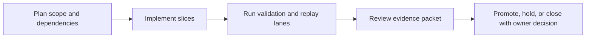
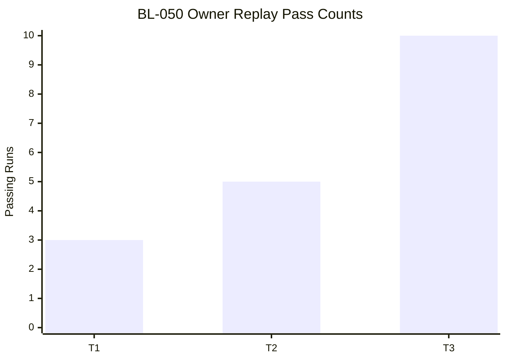

Title: BL-050 High-Rate Delay and FIR Hardening
Document Type: Backlog Runbook
Author: APC Codex
Created Date: 2026-02-26
Last Modified Date: 2026-03-02

# BL-050 High-Rate Delay and FIR Hardening

## Plain-Language Summary

BL-050 focuses on a clear, operator-visible outcome: Harden high-sample-rate behavior by expanding delay headroom and defining a path from direct FIR convolution toward partitioned FIR for scalability. This matters because it improves reliability and decision confidence for nearby release lanes. Current state: Done-candidate (owner T1/T2/T3 replay PASS; final T3 10/10 lane_result/docs_freshness PASS; fir_profile WARN tracked).


## 6W Snapshot (Who/What/Why/How/When/Where)

| Question | Plain-language answer |
|---|---|
| Who is this for? | DSP/engine maintainers, QA owners, and release owners protecting realtime safety. |
| What is changing? | Harden high-sample-rate behavior by expanding delay headroom and defining a path from direct FIR convolution toward partitioned FIR for scalability. |
| Why is this important? | It reduces risk and keeps related backlog lanes from being blocked by unclear behavior or missing evidence. |
| How will we deliver it? | Deliver in slices, run the required replay/validation lanes, and capture evidence in TestEvidence before owner promotion decisions. |
| When is it done? | Current state: Done-candidate (owner T1/T2/T3 replay PASS; final T3 10/10 lane_result/docs_freshness PASS; fir_profile WARN tracked). This item is done when required acceptance checks pass and promotion evidence is complete. |
| Where is the source of truth? | Runbook `Documentation/backlog/bl-050-high-rate-delay-and-fir-hardening.md`, backlog authority `Documentation/backlog/index.md`, and evidence under `TestEvidence/...`. |


## Visual Aid Index

Use visuals only when they improve understanding; prefer compact tables first.

| Visual Aid | Why it helps | Where to find it |
|---|---|---|
| Status Ledger table | Gives a fast plain-language view of priority, state, dependencies, and ownership. | `## Status Ledger` |
| Validation table | Shows exactly how we verify success and safety. | `## Validation Plan` |
| Implementation slices table | Explains step-by-step delivery order and boundaries. | `## Implementation Slices` |
| Optional diagram/screenshot/chart | Use only when it makes complex behavior easier to understand than text alone. | Link under the most relevant section (usually validation or evidence). |
| Evidence visual snapshot | Shows latest evidence packets and replay outcomes in one glance. | `## Evidence Visual Snapshot` |


## Delivery Flow Diagram



## Evidence Visual Snapshot

| Replay Stage | Result | Evidence |
|---|---|---|
| Owner T1 replay | PASS (`3/3`) | `TestEvidence/bl050_owner_t1_20260301T234531Z/` |
| Owner T2 candidate replay | PASS (`5/5`) | `TestEvidence/bl050_owner_t2_candidate_20260302T035502Z/` |
| Owner T3 final replay | PASS (`10/10`) | `TestEvidence/bl050_owner_t3_final_20260302T041920Z/` |



## Status Ledger

| Field | Value |
|---|---|
| ID | BL-050 |
| Priority | P0 |
| Status | Done-candidate (owner T1/T2/T3 replay PASS; Slice C promotion packet refreshed after docs-freshness drift remediation) |
| Track | F - Hardening |
| Effort | Med / M |
| Depends On | BL-043, BL-046 |
| Blocks | — |
| Default Replay Tier | T1 (dev-loop deterministic replay; escalate per Global Replay Cadence Policy) |
| Heavy Lane Budget | Standard (apply heavy-wrapper containment when wrapper cost is high) |

## Objective

Harden high-sample-rate behavior by expanding delay headroom and defining a path from direct FIR convolution toward partitioned FIR for scalability.

## Scope

In scope:
- Delay max bounds suitable for 192kHz operation.
- FIR path profiling and partitioned FIR migration contract.
- Deterministic high-rate stress validation.

Out of scope:
- Full ambisonics architecture shift.
- New UI features.

## Implementation Slices

| Slice | Description | Exit Criteria |
|---|---|---|
| A | Delay-range hardening for high-rate operation | Delay range validation passes at 192kHz |
| B | Partitioned FIR migration contract and prototype lane | FIR scalability metrics captured |
| C | High-rate soak and evidence closeout | High-rate replay lane passes deterministically |

## TODOs

- [x] Validate and adjust delay max bounds for 192kHz support.
- [x] Define partitioned FIR migration contract (latency/cpu/quality bounds).
- [x] Add high-rate soak lane for delay + FIR paths.
- [x] Add deterministic failure taxonomy for high-rate regressions.
- [x] Capture promotion evidence and update runbook status.

## Slice A Execution Snapshot (2026-03-01)

- Code hardening landed in `Source/SpatialRenderer.h`: speaker-delay ring buffer headroom now preserves a full 50.00 ms delay at 192 kHz (`MAX_DELAY_SAMPLES=9601`, with compile-time guard).
- Added deterministic BL-050 lane script: `scripts/qa-bl050-highrate-lane-mac.sh`.
- Latest execution packet: `TestEvidence/bl050_slice_a_lane_20260301T233154Z/`.
- Packet highlights: build PASS; high-rate delay matrix PASS across 44.1/48/88.2/96/192 kHz; FIR profile runs completed with WARN rows at 44.1/48/88.2 kHz from allocation metrics.
- Docs-freshness blocker from BL-035 evidence metadata debt was resolved by owner reconciliation (`b446af5b`).
- Owner T1 replay packet: `TestEvidence/bl050_owner_t1_20260301T234531Z/` with `3/3` lane passes (`run_01..run_03` all `lane_result=PASS`, `docs_freshness=PASS`, `fir_profile=PASS`).

## Slice B Contract Snapshot (2026-03-01)

- Partitioned FIR migration bounds are now defined in:
  - `Documentation/plans/bl-050-partitioned-fir-migration-contract-2026-03-01.md`
- Contract includes:
  - engine-selection threshold (`<=256` direct, `>256` partitioned),
  - latency reporting semantics (`0` direct, `nextPow2(blockSize)` partitioned),
  - hard realtime/performance/quality bounds,
  - Slice B evidence additions and exit criteria.

## Slice C Owner Replay Snapshot (2026-03-02)

- T2 candidate replay packet: `TestEvidence/bl050_owner_t2_candidate_20260302T035502Z/`
  - `t2_summary.tsv`: `5/5` runs `PASS` (`exit_code=0`, `lane_result=PASS`, `docs_freshness=PASS`, `fir_profile=PASS`).
- T3 promotion replay packet: `TestEvidence/bl050_owner_t3_promotion_20260302T035618Z/`
  - `t3_summary.tsv`: runs `01-04` and `10` `PASS`; runs `05-09` `FAIL` due `docs_freshness=FAIL`.
  - `run_05/docs_freshness.log` attributes failures to missing metadata in:
    - `TestEvidence/bl069_owner_t3_promotion_20260302T035658Z/promotion_readiness.md`
    - `TestEvidence/bl070_owner_t3_promotion_20260302T035658Z/promotion_readiness.md`
- Standalone docs-freshness recheck after metadata normalization:
  - `TestEvidence/bl050_owner_t3_promotion_20260302T035618Z/docs_freshness_recheck_20260302T035829Z.log` -> `PASS`.
- Promotion readiness remains blocked until BL-050 T3 is rerun with stable docs-freshness throughout all runs.

## Slice C Final Owner Replay Snapshot (2026-03-02)

- Interim reruns that remained blocked:
  - `TestEvidence/bl050_owner_t3_rerun_20260302T041205Z/`
  - `TestEvidence/bl050_owner_t3_rerun2_20260302T041513Z/`
  - Both failed only on `docs_freshness` due missing metadata in generated headtracking capture summaries.
- Root-cause remediation:
  - Added metadata headers to existing `TestEvidence/headtracking_rotation_capture_*/capture_summary.md` artifacts.
  - Updated generator script `scripts/capture-headtracking-rotation-mac.sh` so future capture summaries include required metadata fields by default.
- Canary confirmation:
  - `TestEvidence/bl050_owner_t3_canary_20260302T041838Z/` -> `lane_result=PASS`, `docs_freshness=PASS`.
- Final T3 promotion replay packet:
  - `TestEvidence/bl050_owner_t3_final_20260302T041920Z/`
  - `t3_summary.tsv`: `10/10` runs with `exit_code=0`, `lane_result=PASS`, `docs_freshness=PASS`.
  - `promotion_readiness.md`: verdict `PASS` under configured gate rule (exit code + lane_result + docs_freshness).
- Observed warning profile (non-blocking for current lane rule):
  - `fir_profile=WARN` in `10/10` runs, driven by allocation markers at selected sample rates (tracked for follow-on profiling hardening).


## Validation Plan

- `cmake --build build_local --config Release --target locusq_qa LocusQ_Standalone -j 8`
- `./scripts/qa-bl050-highrate-lane-mac.sh --out-dir TestEvidence/bl050_<slice>_<timestamp>`
- `./scripts/validate-docs-freshness.sh`

## Evidence Contract

- `status.tsv`
- `build.log`
- `highrate_matrix.tsv`
- `fir_profile.tsv`
- `failure_taxonomy.tsv`
- `docs_freshness.log`

## Replay Cadence Plan (Required)

Reference policy: `Documentation/backlog/index.md` -> `Global Replay Cadence Policy`.

| Stage | Tier | Runs | Command Pattern | Evidence |
|---|---|---|---|---|
| Dev loop | T1 | 3 | runbook primary lane command at dev-loop depth | validation matrix + replay summary |
| Candidate intake | T2 | 5 (or heavy-wrapper 2-run cap) | runbook candidate replay command set | contract/execute artifacts + taxonomy |
| Promotion | T3 | 10 (or owner-approved heavy-wrapper 3-run equivalent) | owner-selected promotion replay command set | owner packet + deterministic replay evidence |
| Sentinel | T4 | 20+ (explicit only) | long-run sentinel drill when explicitly requested | parity/sentinel artifacts |

### Cost/Flake Policy

- Diagnose failing run index before repeating full multi-run sweeps.
- Heavy wrappers (`>=20` binary launches per wrapper run) use targeted reruns, candidate at 2 runs, and promotion at 3 runs unless owner requests broader coverage.
- Document cadence overrides with rationale in `lane_notes.md` or `owner_decisions.md`.


## Handoff Return Contract

All worker and owner handoffs for this runbook must include:
- `SHARED_FILES_TOUCHED: no|yes`

Required return block:
```
HANDOFF_READY
TASK: <BL ID + Title>
RESULT: PASS|FAIL
FILES_TOUCHED: ...
VALIDATION: ...
ARTIFACTS: ...
SHARED_FILES_TOUCHED: no|yes
BLOCKERS: ...
```


## Governance Alignment (2026-02-28)

This additive section aligns the runbook with current backlog lifecycle and evidence governance without altering historical execution notes.

- Done transition contract: when this item reaches Done, move the runbook from `Documentation/backlog/` to `Documentation/backlog/done/bl-XXX-*.md` in the same change set as index/status/evidence sync.
- Evidence localization contract: canonical promotion and closeout evidence must be repo-local under `TestEvidence/` (not `/tmp`-only paths).
- Ownership safety contract: worker/owner handoffs must explicitly report `SHARED_FILES_TOUCHED: no|yes`.
- Cadence authority: replay tiering and overrides are governed by `Documentation/backlog/index.md` (`Global Replay Cadence Policy`).
