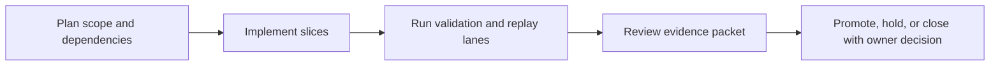

Title: BL-053 Head Tracking Orientation Injection
Document Type: Backlog Runbook
Author: APC Codex
Created Date: 2026-02-28
Last Modified Date: 2026-03-02

# BL-053 Head Tracking Orientation Injection

## Plain-Language Summary

BL-053 focuses on a clear, operator-visible outcome: Inject head pose quaternion from the companion bridge into SteamAudioVirtualSurround as an IPLCoordinateSpace3. This matters because it improves reliability and decision confidence for nearby release lanes. Current state: In Validation (structural lane + T1 replay PASS; manual operator sync evidence captured; owner promotion packet pending).


## 6W Snapshot (Who/What/Why/How/When/Where)

| Question | Plain-language answer |
|---|---|
| Who is this for? | Headphone users, companion-app operators, QA/release owners, and audio-engine maintainers. |
| What is changing? | Inject head pose quaternion from the companion bridge into SteamAudioVirtualSurround as an IPLCoordinateSpace3. |
| Why is this important? | It reduces risk and keeps related backlog lanes from being blocked by unclear behavior or missing evidence. |
| How will we deliver it? | Deliver in slices, run the required replay/validation lanes, and capture evidence in TestEvidence before owner promotion decisions. |
| When is it done? | Current state: In Validation (structural lane + T1 replay PASS; manual operator sync evidence captured; owner promotion packet pending). This item is done when required acceptance checks pass and promotion evidence is complete. |
| Where is the source of truth? | Runbook `Documentation/backlog/bl-053-head-tracking-orientation-injection.md`, backlog authority `Documentation/backlog/index.md`, and evidence under `TestEvidence/...`. |


## Visual Aid Index

Use visuals only when they improve understanding; prefer compact tables first.

| Visual Aid | Why it helps | Where to find it |
|---|---|---|
| Status Ledger table | Gives a fast plain-language view of priority, state, dependencies, and ownership. | `## Status Ledger` |
| Validation table | Shows exactly how we verify success and safety. | `## Validation Plan` |
| Optional diagram/screenshot/chart | Use only when it makes complex behavior easier to understand than text alone. | Link under the most relevant section (usually validation or evidence). |


## Delivery Flow Diagram



## Status Ledger

| Field | Value |
|---|---|
| ID | BL-053 |
| Priority | P1 |
| Status | In Validation (structural replay PASS; manual operator verification synced; owner promotion packet pending) |
| Track | E - R&D Expansion |
| Effort | Med / M |
| Depends On | BL-052, BL-045 |
| Blocks | BL-059 |
| Default Replay Tier | T1 (dev-loop deterministic replay; escalate per Global Replay Cadence Policy) |
| Heavy Lane Budget | Standard (apply heavy-wrapper containment when wrapper cost is high) |

## Objective

Inject head pose quaternion from the companion bridge into `SteamAudioVirtualSurround` as an `IPLCoordinateSpace3`. Apply yaw offset from `CalibrationProfile.json`. Fallback to identity when companion is disconnected.

## Acceptance IDs

- head rotation updates HRTF direction within one processBlock
- null fallback is silent (no glitch)
- yaw offset is applied correctly
- stale pose fallback does not continue orientation animation/routing
- orientation pointer is both provided and consumed in `virtual_binaural` monitoring path

## Methodology Reference

- Canonical methodology: `Documentation/research/locusq-headtracking-binaural-methodology-2026-02-28.md`.
- Manual listening acceptance for this item must explicitly verify post-restore orientation behavior in `virtual_binaural` mode.
- Reconciliation review: `Documentation/reviews/2026-03-01-headtracking-research-backlog-reconciliation.md`.


## Validation Plan

QA harness script: `scripts/qa-bl053-head-tracking-orientation-injection-mac.sh`.
Evidence schema: `TestEvidence/bl053_*/status.tsv`.

## Implementation Snapshot (2026-02-28)

- Added optional `IPLCoordinateSpace3` orientation plumbing through:
  - `Source/SteamAudioVirtualSurround.h`
  - `Source/SpatialRenderer.h`
  - `Source/PluginProcessor.h`
  - `Source/PluginProcessor.cpp`
- `virtual_binaural` calibration monitoring path now:
  - consumes companion head pose when available and fresh,
  - applies composed yaw offset (`tracking.hp_yaw_offset_deg` + runtime recenter),
  - falls back to identity orientation when tracking is disabled/disconnected/stale.
- Follow-up restore (2026-02-28, orientation mix path):
  - `SpatialRenderer::renderVirtualSurroundForMonitoring` now applies listener-orientation-derived quad rotation mix when `listenerOrientation` is provided.
  - Prior temporary bypass (`ignoreUnused(listenerOrientation)`) was removed so virtual binaural tracking affects rendered monitoring output again.
- Structural QA lane PASS:
  - Command: `./scripts/qa-bl053-head-tracking-orientation-injection-mac.sh`
  - Evidence: `TestEvidence/bl053_20260228_182422/status.tsv`
- Post-restore structural QA lane PASS:
  - Command: `./scripts/qa-bl053-head-tracking-orientation-injection-mac.sh`
  - Evidence: `TestEvidence/bl053_20260228_211320/status.tsv`
- T1 replay cadence PASS (3/3):
  - Summary: `TestEvidence/bl053_t1_replay_20260228T183235Z/status.tsv`
  - Runs: `bl053_20260228_183235`, `bl053_20260228_183236`, `bl053_20260228_183237`
- Manual listening note captured:
  - `TestEvidence/bl053_manual_listening_note_20260228T183250Z/manual_listening.md`
  - Outcome: not run in this session; subjective acceptance checks still pending.
- Manual checklist packet prepared for operator walk-through:
  - `TestEvidence/bl053_manual_listening_checklist_20260228T183523Z/checklist.md`
  - `TestEvidence/bl053_manual_listening_checklist_20260228T183523Z/results.tsv`
- Live operator sync evidence (companion + plugin behavior):
  - `TestEvidence/bl053_manual_acceptance_sync_20260301T000100Z/status.tsv`
  - `TestEvidence/bl053_manual_acceptance_sync_20260301T000100Z/manual_acceptance.md`
  - `TestEvidence/bl053_manual_acceptance_sync_20260301T000100Z/results.tsv`

## Replay Cadence Plan (Required)

Reference policy: `Documentation/backlog/index.md` -> `Global Replay Cadence Policy`.

| Stage | Tier | Runs | Command Pattern | Evidence |
|---|---|---|---|---|
| Dev loop | T1 | 3 | runbook primary lane command at dev-loop depth | validation matrix + replay summary |
| Candidate intake | T2 | 5 (or heavy-wrapper 2-run cap) | runbook candidate replay command set | contract/execute artifacts + taxonomy |
| Promotion | T3 | 10 (or owner-approved heavy-wrapper 3-run equivalent) | owner-selected promotion replay command set | owner packet + deterministic replay evidence |
| Sentinel | T4 | 20+ (explicit only) | long-run sentinel drill when explicitly requested | parity/sentinel artifacts |

### Cost/Flake Policy

- Diagnose failing run index before repeating full multi-run sweeps.
- Heavy wrappers (`>=20` binary launches per wrapper run) use targeted reruns, candidate at 2 runs, and promotion at 3 runs unless owner requests broader coverage.
- Document cadence overrides with rationale in `lane_notes.md` or `owner_decisions.md`.


## Handoff Return Contract

All worker and owner handoffs for this runbook must include:
- `SHARED_FILES_TOUCHED: no|yes`

Required return block:
```
HANDOFF_READY
TASK: <BL ID + Title>
RESULT: PASS|FAIL
FILES_TOUCHED: ...
VALIDATION: ...
ARTIFACTS: ...
SHARED_FILES_TOUCHED: no|yes
BLOCKERS: ...
```

## Governance Alignment (2026-02-28)

This additive section aligns the runbook with current backlog lifecycle and evidence governance without altering historical execution notes.

- Done transition contract: when this item reaches Done, move the runbook from `Documentation/backlog/` to `Documentation/backlog/done/bl-XXX-*.md` in the same change set as index/status/evidence sync.
- Evidence localization contract: canonical promotion and closeout evidence must be repo-local under `TestEvidence/` (not `/tmp`-only paths).
- Ownership safety contract: worker/owner handoffs must explicitly report `SHARED_FILES_TOUCHED: no|yes`.
- Cadence authority: replay tiering and overrides are governed by `Documentation/backlog/index.md` (`Global Replay Cadence Policy`).
