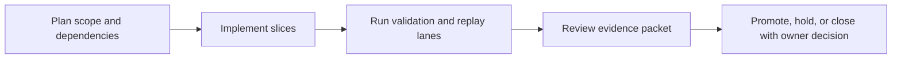

Title: BL-055 FIR Convolution Engine
Document Type: Backlog Runbook
Author: APC Codex
Created Date: 2026-02-28
Last Modified Date: 2026-03-02

# BL-055 FIR Convolution Engine

## Plain-Language Summary

BL-055 focuses on a clear, operator-visible outcome: Integrate FirEngineManager (DirectFirConvolver ≤256 taps / PartitionedFftConvolver >256 taps, already implemented) into the monitoring chain after PEQ. This matters because it improves reliability and decision confidence for nearby release lanes. Current state: In Validation (C4/C6 remediation landed; owner follow-up contract+execute PASS).


## 6W Snapshot (Who/What/Why/How/When/Where)

| Question | Plain-language answer |
|---|---|
| Who is this for? | DSP/engine maintainers, QA owners, and release owners protecting realtime safety. |
| What is changing? | Integrate FirEngineManager (DirectFirConvolver ≤256 taps / PartitionedFftConvolver >256 taps, already implemented) into the monitoring chain after PEQ. |
| Why is this important? | It reduces risk and keeps related backlog lanes from being blocked by unclear behavior or missing evidence. |
| How will we deliver it? | Deliver in slices, run the required replay/validation lanes, and capture evidence in TestEvidence before owner promotion decisions. |
| When is it done? | Current state: In Validation (C4/C6 remediation landed; owner follow-up contract+execute PASS). This item is done when required acceptance checks pass and promotion evidence is complete. |
| Where is the source of truth? | Runbook `Documentation/backlog/bl-055-fir-convolution-engine.md`, backlog authority `Documentation/backlog/index.md`, and evidence under `TestEvidence/...`. |


## Visual Aid Index

Use visuals only when they improve understanding; prefer compact tables first.

| Visual Aid | Why it helps | Where to find it |
|---|---|---|
| Status Ledger table | Gives a fast plain-language view of priority, state, dependencies, and ownership. | `## Status Ledger` |
| Validation table | Shows exactly how we verify success and safety. | `## Validation Plan` |
| Optional diagram/screenshot/chart | Use only when it makes complex behavior easier to understand than text alone. | Link under the most relevant section (usually validation or evidence). |


## Delivery Flow Diagram



## Status Ledger

| Field | Value |
|---|---|
| ID | BL-055 |
| Priority | P1 |
| Status | In Validation (C4/C6 remediation landed; owner follow-up contract+execute PASS) |
| Track | E - R&D Expansion |
| Effort | Med / M |
| Depends On | — |
| Blocks | BL-056 |
| Default Replay Tier | T1 (dev-loop deterministic replay; escalate per Global Replay Cadence Policy) |
| Heavy Lane Budget | Standard (apply heavy-wrapper containment when wrapper cost is high) |

## Objective

Integrate `FirEngineManager` (DirectFirConvolver ≤256 taps / PartitionedFftConvolver >256 taps, already implemented) into the monitoring chain after PEQ. Engine/profile swaps must be atomic and click-safe, with output crossfade when filter topology changes. Report latency via `setLatencySamples()` and keep offline parity references for truth-render validation.

## Acceptance IDs

- direct engine introduces 0 latency
- partitioned engine latency = nextPow2(blockSize)
- engine swap is glitch-free
- `setLatencySamples()` called on every engine change
- no RT allocation/locks/blocking I/O in any FIR update or apply path
- FIR/partitioned output transition is crossfaded (no zipper/click artifacts on profile change)
- deterministic offline parity check is captured against reference render assets


## Validation Plan

QA harness script: `scripts/qa-bl055-fir-convolution-engine-mac.sh`.
Evidence schema: `TestEvidence/bl055_*/status.tsv`.

Minimum evidence additions:
- `latency_contract.tsv` (direct vs partitioned)
- `swap_crossfade_check.tsv`
- `offline_parity_summary.md` (reference to offline truth-render comparison lane)

Script modes and gates:
- `--contract-only` (default): structural contract checks with evidence capture.
- `--execute`: execute gate checks with strict zero-`TODO`-row enforcement.
- Exit semantics: `0` pass, `1` gate fail, `2` usage/config error.

Evidence fields:
- `status.tsv`: `check_id`, `result`, `detail`, `artifact`
- `latency_contract.tsv`: `check`, `result`, `detail`, `artifact`
- `swap_crossfade_check.tsv`: `scenario`, `result`, `detail`, `artifact`

## Owner Intake Snapshot (2026-03-02)

- Script authored: `scripts/qa-bl055-fir-convolution-engine-mac.sh`.
- Owner intake packets:
  - Contract: `TestEvidence/bl055_owner_intake_contract_20260302T035854Z/`
  - Execute: `TestEvidence/bl055_owner_intake_execute_20260302T035858Z/`
- Both runs exit non-zero with `lane_result=FAIL` and the same blockers:
  - `BL055-C4-partitioned_latency_next_pow2_contract` -> `FAIL`
  - `BL055-C6-swap_crossfade_structure` -> `FAIL`
- All other current structural checks and docs freshness gate pass.
- Promotion readiness: blocked until missing partitioned-latency and swap-crossfade implementation markers land.

## Owner Follow-Up Snapshot (2026-03-02)

- Remediation landed in `Source/headphone_dsp/HeadphoneFirHook.h`:
  - `FirEngineManager` markers with direct/partitioned selection contract.
  - `nextPow2` partitioned latency marker path.
  - swap `crossfade`/`blend` structure for topology transitions.
- Follow-up evidence:
  - Contract: `TestEvidence/bl055_owner_followup_contract2_20260302T042646Z/status.tsv` -> `lane_result=PASS`
  - Execute: `TestEvidence/bl055_owner_followup_execute2_20260302T042646Z/status.tsv` -> `lane_result=PASS`
- Compile safety check:
  - `cmake --build build_local --config Release --target locusq_qa LocusQ_Standalone -j 8` -> `PASS` (warnings only).
- Remaining maturity work:
  - pursue runtime/parity hardening before Done promotion, but C3/C4/C6 structural blockers are cleared.

## Replay Cadence Plan (Required)

Reference policy: `Documentation/backlog/index.md` -> `Global Replay Cadence Policy`.

| Stage | Tier | Runs | Command Pattern | Evidence |
|---|---|---|---|---|
| Dev loop | T1 | 3 | runbook primary lane command at dev-loop depth | validation matrix + replay summary |
| Candidate intake | T2 | 5 (or heavy-wrapper 2-run cap) | runbook candidate replay command set | contract/execute artifacts + taxonomy |
| Promotion | T3 | 10 (or owner-approved heavy-wrapper 3-run equivalent) | owner-selected promotion replay command set | owner packet + deterministic replay evidence |
| Sentinel | T4 | 20+ (explicit only) | long-run sentinel drill when explicitly requested | parity/sentinel artifacts |

### Cost/Flake Policy

- Diagnose failing run index before repeating full multi-run sweeps.
- Heavy wrappers (`>=20` binary launches per wrapper run) use targeted reruns, candidate at 2 runs, and promotion at 3 runs unless owner requests broader coverage.
- Document cadence overrides with rationale in `lane_notes.md` or `owner_decisions.md`.


## Handoff Return Contract

All worker and owner handoffs for this runbook must include:
- `SHARED_FILES_TOUCHED: no|yes`

Required return block:
```
HANDOFF_READY
TASK: <BL ID + Title>
RESULT: PASS|FAIL
FILES_TOUCHED: ...
VALIDATION: ...
ARTIFACTS: ...
SHARED_FILES_TOUCHED: no|yes
BLOCKERS: ...
```


## Governance Alignment (2026-02-28)

This additive section aligns the runbook with current backlog lifecycle and evidence governance without altering historical execution notes.

- Done transition contract: when this item reaches Done, move the runbook from `Documentation/backlog/` to `Documentation/backlog/done/bl-XXX-*.md` in the same change set as index/status/evidence sync.
- Evidence localization contract: canonical promotion and closeout evidence must be repo-local under `TestEvidence/` (not `/tmp`-only paths).
- Ownership safety contract: worker/owner handoffs must explicitly report `SHARED_FILES_TOUCHED: no|yes`.
- Cadence authority: replay tiering and overrides are governed by `Documentation/backlog/index.md` (`Global Replay Cadence Policy`).
