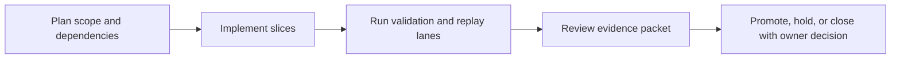
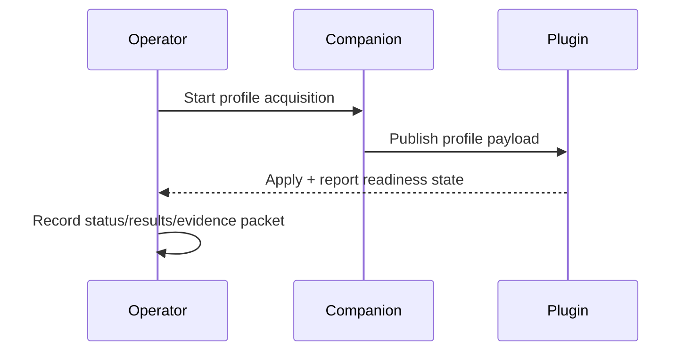

Title: BL-058 Companion Profile Acquisition UI + HRTF Matching
Document Type: Backlog Runbook
Author: APC Codex
Created Date: 2026-02-28
Last Modified Date: 2026-03-02

# BL-058 Companion Profile Acquisition UI + HRTF Matching

## Plain-Language Summary

BL-058 focuses on a clear, operator-visible outcome: Build guided ear-photo capture UI in companion app (left ear + right ear + frontal), then ship a deterministic nearest-neighbor subject selection baseline for SADIE II mapping. This matters because it improves reliability and decision confidence for nearby release lanes. Current state: In Implementation (reprioritized from code-review protocol/gating risk packet; QA harness authored).


## 6W Snapshot (Who/What/Why/How/When/Where)

| Question | Plain-language answer |
|---|---|
| Who is this for? | Headphone users, companion-app operators, QA/release owners, and audio-engine maintainers. |
| What is changing? | Build guided ear-photo capture UI in companion app (left ear + right ear + frontal), then ship a deterministic nearest-neighbor subject selection baseline for SADIE II mapping. |
| Why is this important? | It reduces risk and keeps related backlog lanes from being blocked by unclear behavior or missing evidence. |
| How will we deliver it? | Deliver in slices, run the required replay/validation lanes, and capture evidence in TestEvidence before owner promotion decisions. |
| When is it done? | Current state: In Implementation (reprioritized from code-review protocol/gating risk packet; QA harness authored). This item is done when required acceptance checks pass and promotion evidence is complete. |
| Where is the source of truth? | Runbook `Documentation/backlog/bl-058-companion-profile-acquisition.md`, backlog authority `Documentation/backlog/index.md`, and evidence under `TestEvidence/...`. |


## Visual Aid Index

Use visuals only when they improve understanding; prefer compact tables first.

| Visual Aid | Why it helps | Where to find it |
|---|---|---|
| Status Ledger table | Gives a fast plain-language view of priority, state, dependencies, and ownership. | `## Status Ledger` |
| Validation table | Shows exactly how we verify success and safety. | `## Validation Plan` |
| Optional diagram/screenshot/chart | Use only when it makes complex behavior easier to understand than text alone. | Link under the most relevant section (usually validation or evidence). |
| Evidence visual snapshot | Shows latest evidence packets and replay outcomes in one glance. | `## Evidence Visual Snapshot` |


## Delivery Flow Diagram



## Evidence Visual Snapshot

| Evidence Artifact | Purpose | Path |
|---|---|---|
| Runtime status packet | Capture pass/fail gate outcomes per run | `TestEvidence/bl058_manual_runtime_<timestamp>/status.tsv` |
| Runtime results matrix | Capture per-step acquisition outcomes | `TestEvidence/bl058_manual_runtime_<timestamp>/results.tsv` |
| Axis sweep notes | Capture operator-observed orientation behavior | `TestEvidence/bl058_manual_runtime_<timestamp>/axis_sweeps.md` |
| Readiness decision | Capture promotion/no-go reasoning | `TestEvidence/bl058_manual_runtime_<timestamp>/readiness_gate.md` |



## Status Ledger

| Field | Value |
|---|---|
| ID | BL-058 |
| Priority | P0 |
| Status | In Implementation (Wave 1 kickoff: QA harness authored with contract/execute semantics) |
| Track | E - R&D Expansion |
| Effort | Med / M |
| Depends On | BL-057 |
| Blocks | BL-059 |
| Default Replay Tier | T1 (dev-loop deterministic replay; escalate per Global Replay Cadence Policy) |
| Heavy Lane Budget | Standard (apply heavy-wrapper containment when wrapper cost is high) |

## Objective

Build guided ear-photo capture UI in companion app (left ear + right ear + frontal), then ship a deterministic nearest-neighbor subject selection baseline for SADIE II mapping. Write selected `subject_id` and `sofa_ref` to `CalibrationProfile.json`, discard images after embedding, and enforce readiness/sync gating so pose streaming only starts from a known-good state.

## Acceptance IDs

- matching completes in <50ms on M-series Mac
- fallback subject used when similarity <0.6
- images not persisted to disk after embedding
- privacy: no network calls
- readiness state machine is explicit and testable:
  - `disabled_disconnected`
  - `active_not_ready`
  - `active_ready`
- send gate remains closed until `active_ready` + explicit `Center/Sync`
- top/T viewport head-tracking arrow is derived from quaternion forward projected onto XZ plane (not serialized yaw only)
- stale pose packets do not continue rotating head/arrow visuals; stale state renders explicit fallback orientation
- synthetic axis sweeps are captured and pass principal-axis checks:
  - pure yaw -> dominant left/right heading motion
  - pure pitch -> dominant up/down motion
  - pure roll -> dominant roll/tilt motion

## Methodology Reference

- Canonical methodology: `Documentation/research/locusq-headtracking-binaural-methodology-2026-02-28.md`.
- Reconciliation review: `Documentation/reviews/2026-03-01-headtracking-research-backlog-reconciliation.md`.
- Additional review baselines:
  - `Documentation/archive/2026-03-01-architecture-review-consolidation/reviews/2026-02-26-full-architecture-review.md`
  - `Documentation/archive/2026-03-01-architecture-review-consolidation/reviews/LocusQ Repo Review 02262026.md`
- Companion execution for this backlog item must include math/visualization sanity checks:
  - synthetic pure yaw/pitch/roll axis sweeps,
  - sensor-location transition diagnostics,
  - Three.js frame-contract verification (+X right, +Y up, -Z ahead).


## Validation Plan

QA harness script: `scripts/qa-bl058-companion-profile-acquisition-mac.sh`.
Evidence schema: `TestEvidence/bl058_*/status.tsv`.

Required manual packet (companion runtime):
- `TestEvidence/bl058_manual_runtime_<timestamp>/status.tsv`
- `TestEvidence/bl058_manual_runtime_<timestamp>/results.tsv`
- `TestEvidence/bl058_manual_runtime_<timestamp>/axis_sweeps.md`
- `TestEvidence/bl058_manual_runtime_<timestamp>/readiness_gate.md`

## Replay Cadence Plan (Required)

Reference policy: `Documentation/backlog/index.md` -> `Global Replay Cadence Policy`.

| Stage | Tier | Runs | Command Pattern | Evidence |
|---|---|---|---|---|
| Dev loop | T1 | 3 | runbook primary lane command at dev-loop depth | validation matrix + replay summary |
| Candidate intake | T2 | 5 (or heavy-wrapper 2-run cap) | runbook candidate replay command set | contract/execute artifacts + taxonomy |
| Promotion | T3 | 10 (or owner-approved heavy-wrapper 3-run equivalent) | owner-selected promotion replay command set | owner packet + deterministic replay evidence |
| Sentinel | T4 | 20+ (explicit only) | long-run sentinel drill when explicitly requested | parity/sentinel artifacts |

### Cost/Flake Policy

- Diagnose failing run index before repeating full multi-run sweeps.
- Heavy wrappers (`>=20` binary launches per wrapper run) use targeted reruns, candidate at 2 runs, and promotion at 3 runs unless owner requests broader coverage.
- Document cadence overrides with rationale in `lane_notes.md` or `owner_decisions.md`.


## Handoff Return Contract

All worker and owner handoffs for this runbook must include:
- `SHARED_FILES_TOUCHED: no|yes`

Required return block:
```
HANDOFF_READY
TASK: <BL ID + Title>
RESULT: PASS|FAIL
FILES_TOUCHED: ...
VALIDATION: ...
ARTIFACTS: ...
SHARED_FILES_TOUCHED: no|yes
BLOCKERS: ...
```


## Governance Alignment (2026-02-28)

This additive section aligns the runbook with current backlog lifecycle and evidence governance without altering historical execution notes.

- Done transition contract: when this item reaches Done, move the runbook from `Documentation/backlog/` to `Documentation/backlog/done/bl-XXX-*.md` in the same change set as index/status/evidence sync.
- Evidence localization contract: canonical promotion and closeout evidence must be repo-local under `TestEvidence/` (not `/tmp`-only paths).
- Ownership safety contract: worker/owner handoffs must explicitly report `SHARED_FILES_TOUCHED: no|yes`.
- Cadence authority: replay tiering and overrides are governed by `Documentation/backlog/index.md` (`Global Replay Cadence Policy`).
