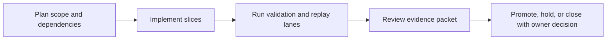
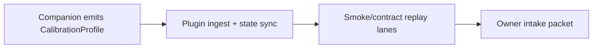

Title: BL-059 CalibrationProfile Integration Handoff
Document Type: Backlog Runbook
Author: APC Codex
Created Date: 2026-02-28
Last Modified Date: 2026-03-02

# BL-059 CalibrationProfile Integration Handoff

## Plain-Language Summary

BL-059 focuses on a clear, operator-visible outcome: Wire CalibrationProfile.json from companion to plugin state end-to-end. This matters because it improves reliability and decision confidence for nearby release lanes. Current state: In Implementation (reprioritized from code-review calibration correctness/race risk packet; smoke harness upgraded).


## 6W Snapshot (Who/What/Why/How/When/Where)

| Question | Plain-language answer |
|---|---|
| Who is this for? | Headphone users, companion-app operators, QA/release owners, and audio-engine maintainers. |
| What is changing? | Wire CalibrationProfile.json from companion to plugin state end-to-end. |
| Why is this important? | It reduces risk and keeps related backlog lanes from being blocked by unclear behavior or missing evidence. |
| How will we deliver it? | Deliver in slices, run the required replay/validation lanes, and capture evidence in TestEvidence before owner promotion decisions. |
| When is it done? | Current state: In Implementation (reprioritized from code-review calibration correctness/race risk packet; smoke harness upgraded). This item is done when required acceptance checks pass and promotion evidence is complete. |
| Where is the source of truth? | Runbook `Documentation/backlog/bl-059-calibration-profile-integration-handoff.md`, backlog authority `Documentation/backlog/index.md`, and evidence under `TestEvidence/...`. |


## Visual Aid Index

Use visuals only when they improve understanding; prefer compact tables first.

| Visual Aid | Why it helps | Where to find it |
|---|---|---|
| Status Ledger table | Gives a fast plain-language view of priority, state, dependencies, and ownership. | `## Status Ledger` |
| Validation table | Shows exactly how we verify success and safety. | `## Validation Plan` |
| Optional diagram/screenshot/chart | Use only when it makes complex behavior easier to understand than text alone. | Link under the most relevant section (usually validation or evidence). |
| Evidence visual snapshot | Shows latest evidence packets and replay outcomes in one glance. | `## Evidence Visual Snapshot` |


## Delivery Flow Diagram



## Evidence Visual Snapshot

| Evidence Artifact | Purpose | Path |
|---|---|---|
| Integration status packet | Single run-level pass/fail and blockers | `TestEvidence/bl059_<slice>_<timestamp>/status.tsv` |
| Contract matrix | Verify handoff invariants remain deterministic | `TestEvidence/bl059_<slice>_<timestamp>/contract_matrix.tsv` |
| Replay hashes | Verify run-to-run deterministic shape | `TestEvidence/bl059_<slice>_<timestamp>/replay_hashes.tsv` |



## Status Ledger

| Field | Value |
|---|---|
| ID | BL-059 |
| Priority | P0 |
| Status | In Implementation (Wave 1 kickoff: smoke harness upgraded with contract/execute semantics) |
| Track | E - R&D Expansion |
| Effort | Med / M |
| Depends On | BL-052, BL-053, BL-054, BL-055, BL-056, BL-057, BL-058 |
| Blocks | BL-060 |
| Default Replay Tier | T1 (dev-loop deterministic replay; escalate per Global Replay Cadence Policy) |
| Heavy Lane Budget | Standard (apply heavy-wrapper containment when wrapper cost is high) |

## Objective

Wire `CalibrationProfile.json` from companion to plugin state end-to-end. Primitive fields → APVTS parameters. Blob fields (sofa_ref, hp_fir_taps) → base64 in state. Plugin reloads profile on file change without glitches.

## Acceptance IDs

- profile load/unload cycle is stable (no glitches)
- SOFA swap is atomic
- APVTS params update on profile change
- smoke test `qa-bl059-calibration-integration-smoke-mac.sh` exits 0
- orientation/tracking fields preserve BL-053 invariants (stale fallback, yaw composition, deterministic behavior)
- profile reload path preserves packet-age/sequence diagnostics visibility for companion handoff debugging

## Methodology Reference

- Canonical methodology: `Documentation/research/locusq-headtracking-binaural-methodology-2026-02-28.md`.
- Reconciliation review: `Documentation/reviews/2026-03-01-headtracking-research-backlog-reconciliation.md`.
- Integration acceptance should preserve the orientation-path invariants validated by BL-053 (stale fallback, yaw offset composition, deterministic behavior).


## Validation Plan

QA harness script: `scripts/qa-bl059-calibration-integration-smoke-mac.sh`.
Evidence schema: `TestEvidence/bl059_*/status.tsv`.

## Replay Cadence Plan (Required)

Reference policy: `Documentation/backlog/index.md` -> `Global Replay Cadence Policy`.

| Stage | Tier | Runs | Command Pattern | Evidence |
|---|---|---|---|---|
| Dev loop | T1 | 3 | runbook primary lane command at dev-loop depth | validation matrix + replay summary |
| Candidate intake | T2 | 5 (or heavy-wrapper 2-run cap) | runbook candidate replay command set | contract/execute artifacts + taxonomy |
| Promotion | T3 | 10 (or owner-approved heavy-wrapper 3-run equivalent) | owner-selected promotion replay command set | owner packet + deterministic replay evidence |
| Sentinel | T4 | 20+ (explicit only) | long-run sentinel drill when explicitly requested | parity/sentinel artifacts |

### Cost/Flake Policy

- Diagnose failing run index before repeating full multi-run sweeps.
- Heavy wrappers (`>=20` binary launches per wrapper run) use targeted reruns, candidate at 2 runs, and promotion at 3 runs unless owner requests broader coverage.
- Document cadence overrides with rationale in `lane_notes.md` or `owner_decisions.md`.


## Handoff Return Contract

All worker and owner handoffs for this runbook must include:
- `SHARED_FILES_TOUCHED: no|yes`

Required return block:
```
HANDOFF_READY
TASK: <BL ID + Title>
RESULT: PASS|FAIL
FILES_TOUCHED: ...
VALIDATION: ...
ARTIFACTS: ...
SHARED_FILES_TOUCHED: no|yes
BLOCKERS: ...
```


## Governance Alignment (2026-02-28)

This additive section aligns the runbook with current backlog lifecycle and evidence governance without altering historical execution notes.

- Done transition contract: when this item reaches Done, move the runbook from `Documentation/backlog/` to `Documentation/backlog/done/bl-XXX-*.md` in the same change set as index/status/evidence sync.
- Evidence localization contract: canonical promotion and closeout evidence must be repo-local under `TestEvidence/` (not `/tmp`-only paths).
- Ownership safety contract: worker/owner handoffs must explicitly report `SHARED_FILES_TOUCHED: no|yes`.
- Cadence authority: replay tiering and overrides are governed by `Documentation/backlog/index.md` (`Global Replay Cadence Policy`).
