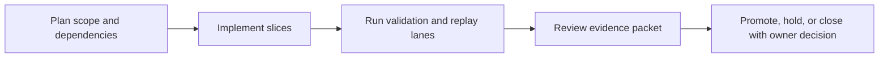

Title: BL-060 Phase B Listening Test Harness + Evaluation
Document Type: Backlog Runbook
Author: APC Codex
Created Date: 2026-02-28
Last Modified Date: 2026-03-02

# BL-060 Phase B Listening Test Harness + Evaluation

## Plain-Language Summary

BL-060 focuses on a clear, operator-visible outcome: Execute Phase B 2×2 blind listening test (generic vs personalized HrealtimeF × no EQ vs WH-1000XM5 EQ) across >=5 participants x >=10 scenes. This matters because it improves reliability and decision confidence for nearby release lanes. Current state: Open.


## 6W Snapshot (Who/What/Why/How/When/Where)

| Question | Plain-language answer |
|---|---|
| Who is this for? | QA owners, release owners, and engineering maintainers who depend on deterministic evidence. |
| What is changing? | Execute Phase B 2×2 blind listening test (generic vs personalized HrealtimeF × no EQ vs WH-1000XM5 EQ) across >=5 participants x >=10 scenes. |
| Why is this important? | It reduces risk and keeps related backlog lanes from being blocked by unclear behavior or missing evidence. |
| How will we deliver it? | Deliver in slices, run the required replay/validation lanes, and capture evidence in TestEvidence before owner promotion decisions. |
| When is it done? | Current state: Open. This item is done when required acceptance checks pass and promotion evidence is complete. |
| Where is the source of truth? | Runbook `Documentation/backlog/bl-060-phase-b-listening-test-harness.md`, backlog authority `Documentation/backlog/index.md`, and evidence under `TestEvidence/...`. |


## Visual Aid Index

Use visuals only when they improve understanding; prefer compact tables first.

| Visual Aid | Why it helps | Where to find it |
|---|---|---|
| Status Ledger table | Gives a fast plain-language view of priority, state, dependencies, and ownership. | `## Status Ledger` |
| Validation table | Shows exactly how we verify success and safety. | `## Validation Plan` |
| Optional diagram/screenshot/chart | Use only when it makes complex behavior easier to understand than text alone. | Link under the most relevant section (usually validation or evidence). |


## Delivery Flow Diagram



## Status Ledger

| Field | Value |
|---|---|
| ID | BL-060 |
| Priority | P1 |
| Status | Open |
| Track | E - R&D Expansion |
| Effort | Med / M |
| Depends On | BL-059 |
| Blocks | BL-061 (conditional) |
| Default Replay Tier | T1 (dev-loop deterministic replay; escalate per Global Replay Cadence Policy) |
| Heavy Lane Budget | Standard (apply heavy-wrapper containment when wrapper cost is high) |

## Objective

Execute Phase B 2×2 blind listening test (generic vs personalized HRTF × no EQ vs WH-1000XM5 EQ) across >=5 participants x >=10 scenes. Run reproducible statistical analysis and persist machine-readable results. Gate: >=20% mean externalization improvement OR p<0.05 localization gain.

## Acceptance IDs

- ≥5 participants complete full session
- analysis script exits 0
- Phase B gate result recorded in `verification` fields of CalibrationProfile
- result documented in TestEvidence
- blind trial logs contain at minimum: condition, true angle, response angle, absolute error, reaction time
- per-condition metrics are exported: MAE, front/back confusion rate, externalization summary
- run-to-run reproducibility packet exists (same input session => stable stats output)

## Methodology Reference

- Canonical methodology: `Documentation/research/locusq-headtracking-binaural-methodology-2026-02-28.md`.
- Reconciliation review: `Documentation/reviews/2026-03-01-headtracking-research-backlog-reconciliation.md`.
- This backlog item must follow the blinded 2x2 protocol and gate criteria defined in that methodology.


## Validation Plan

QA harness script: `scripts/qa-bl060-phase-b-listening-test-mac.sh` (to be authored).
Evidence schema: `TestEvidence/bl060_*/status.tsv`.

Required analysis artifacts:
- `trial_log.csv`
- `metrics_summary.tsv`
- `stats_report.md`
- `gate_decision.md`
- `reproducibility_check.tsv`

## Replay Cadence Plan (Required)

Reference policy: `Documentation/backlog/index.md` -> `Global Replay Cadence Policy`.

| Stage | Tier | Runs | Command Pattern | Evidence |
|---|---|---|---|---|
| Dev loop | T1 | 3 | runbook primary lane command at dev-loop depth | validation matrix + replay summary |
| Candidate intake | T2 | 5 (or heavy-wrapper 2-run cap) | runbook candidate replay command set | contract/execute artifacts + taxonomy |
| Promotion | T3 | 10 (or owner-approved heavy-wrapper 3-run equivalent) | owner-selected promotion replay command set | owner packet + deterministic replay evidence |
| Sentinel | T4 | 20+ (explicit only) | long-run sentinel drill when explicitly requested | parity/sentinel artifacts |

### Cost/Flake Policy

- Diagnose failing run index before repeating full multi-run sweeps.
- Heavy wrappers (`>=20` binary launches per wrapper run) use targeted reruns, candidate at 2 runs, and promotion at 3 runs unless owner requests broader coverage.
- Document cadence overrides with rationale in `lane_notes.md` or `owner_decisions.md`.


## Handoff Return Contract

All worker and owner handoffs for this runbook must include:
- `SHARED_FILES_TOUCHED: no|yes`

Required return block:
```
HANDOFF_READY
TASK: <BL ID + Title>
RESULT: PASS|FAIL
FILES_TOUCHED: ...
VALIDATION: ...
ARTIFACTS: ...
SHARED_FILES_TOUCHED: no|yes
BLOCKERS: ...
```


## Governance Alignment (2026-02-28)

This additive section aligns the runbook with current backlog lifecycle and evidence governance without altering historical execution notes.

- Done transition contract: when this item reaches Done, move the runbook from `Documentation/backlog/` to `Documentation/backlog/done/bl-XXX-*.md` in the same change set as index/status/evidence sync.
- Evidence localization contract: canonical promotion and closeout evidence must be repo-local under `TestEvidence/` (not `/tmp`-only paths).
- Ownership safety contract: worker/owner handoffs must explicitly report `SHARED_FILES_TOUCHED: no|yes`.
- Cadence authority: replay tiering and overrides are governed by `Documentation/backlog/index.md` (`Global Replay Cadence Policy`).
