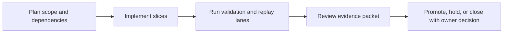

Title: BL-067 AUv3 App-Extension Lifecycle and Host Validation
Document Type: Backlog Runbook
Author: APC Codex
Created Date: 2026-03-01
Last Modified Date: 2026-03-02

# BL-067 AUv3 App-Extension Lifecycle and Host Validation

## Plain-Language Summary

BL-067 focuses on a clear, operator-visible outcome: Add production-ready AUv3 format support for LocusQ with deterministic extension lifecycle behavior, sandbox-safe runtime boundaries, and explicit parity validation against existing AU/VST3/CLAP formats. This matters because it improves reliability and decision confidence for nearby release lanes. Current state: Open (no promotion while any execute evidence row is TODO; BL-073 gate required).


## 6W Snapshot (Who/What/Why/How/When/Where)

| Question | Plain-language answer |
|---|---|
| Who is this for? | QA owners, release owners, and engineering maintainers who depend on deterministic evidence. |
| What is changing? | Add production-ready AUv3 format support for LocusQ with deterministic extension lifecycle behavior, sandbox-safe runtime boundaries, and explicit parity validation against existing AU/VST3/CLAP formats. |
| Why is this important? | It reduces risk and keeps related backlog lanes from being blocked by unclear behavior or missing evidence. |
| How will we deliver it? | Deliver in slices, run the required replay/validation lanes, and capture evidence in TestEvidence before owner promotion decisions. |
| When is it done? | Current state: Open (no promotion while any execute evidence row is TODO; BL-073 gate required). This item is done when required acceptance checks pass and promotion evidence is complete. |
| Where is the source of truth? | Runbook `Documentation/backlog/bl-067-auv3-app-extension-lifecycle-and-host-validation.md`, backlog authority `Documentation/backlog/index.md`, and evidence under `TestEvidence/...`. |


## Visual Aid Index

Use visuals only when they improve understanding; prefer compact tables first.

| Visual Aid | Why it helps | Where to find it |
|---|---|---|
| Status Ledger table | Gives a fast plain-language view of priority, state, dependencies, and ownership. | `## Status Ledger` |
| Validation table | Shows exactly how we verify success and safety. | `## Validation Plan` |
| Implementation slices table | Explains step-by-step delivery order and boundaries. | `## Implementation Slices` |
| Optional diagram/screenshot/chart | Use only when it makes complex behavior easier to understand than text alone. | Link under the most relevant section (usually validation or evidence). |


## Delivery Flow Diagram



## Status Ledger

| Field | Value |
|---|---|
| ID | BL-067 |
| Priority | P1 |
| Status | Open (promotion blocked: no promotion while any execute evidence row is `TODO`; BL-073 execute-mode gate required) |
| Track | A - Runtime Formats |
| Effort | High / L |
| Depends On | BL-048 |
| Blocks | — |
| Annex Spec | `Documentation/plans/bl-067-auv3-app-extension-lifecycle-and-host-validation-spec-2026-03-01.md` |
| Default Replay Tier | T1 (dev-loop deterministic replay; escalate per Global Replay Cadence Policy) |
| Heavy Lane Budget | High-cost wrapper (host matrix + extension lifecycle sweeps) |

## Objective

Add production-ready AUv3 format support for LocusQ with deterministic extension lifecycle behavior, sandbox-safe runtime boundaries, and explicit parity validation against existing AU/VST3/CLAP formats.

## Acceptance IDs

- AUv3 build target and packaging pipeline are reproducible and code-signed for host execution.
- Extension lifecycle transitions (cold start, reload, suspend/resume, state restore) complete without crashes or stale state.
- Audio-thread invariants remain intact (no allocation/locks/blocking I/O in realtime callbacks).
- AUv3-specific constraints degrade deterministically without host-name branching behavior.
- AU/VST3/CLAP regression lanes remain green after AUv3 enablement.
- Execute-mode QA evidence contains zero `TODO` rows (BL-073 scaffold-truthfulness gate).

## Implementation Slices

| Slice | Description | Exit Criteria |
|---|---|---|
| A | AUv3 target wiring and build/packaging contracts | AUv3 target builds and launches in baseline host smoke lane |
| B | Extension-safe runtime boundaries and lifecycle handling | lifecycle transition matrix passes with deterministic state restore |
| C | Cross-format parity and ship evidence packet | AUv3 + AU/VST3/CLAP parity matrix is green and evidence-complete |

## Validation Plan

QA harness script: `scripts/qa-bl067-auv3-lifecycle-mac.sh`.
Evidence schema: `TestEvidence/bl067_*/status.tsv`.

Minimum evidence additions:
- `host_matrix.tsv` (AUv3 host coverage and outcomes)
- `lifecycle_transitions.tsv` (cold/warm/reload/suspend-resume results)
- `parity_regression.tsv` (AUv3 vs AU/VST3/CLAP contract outcomes)
- `packaging_manifest.md` (targets, signing, packaging notes)

## Replay Cadence Plan (Required)

Reference policy: `Documentation/backlog/index.md` -> `Global Replay Cadence Policy`.

| Stage | Tier | Runs | Command Pattern | Evidence |
|---|---|---|---|---|
| Dev loop | T1 | 3 | runbook primary lane command at dev-loop depth | validation matrix + replay summary |
| Candidate intake | T2 | 5 (or heavy-wrapper 2-run cap) | runbook candidate replay command set | contract/execute artifacts + taxonomy |
| Promotion | T3 | 10 (or owner-approved heavy-wrapper 3-run equivalent) | owner-selected promotion replay command set | owner packet + deterministic replay evidence |
| Sentinel | T4 | 20+ (explicit only) | long-run sentinel drill when explicitly requested | parity/sentinel artifacts |

### Cost/Flake Policy

- Diagnose failing run index before repeating full multi-run sweeps.
- Heavy wrappers (`>=20` binary launches per wrapper run) use targeted reruns, candidate at 2 runs, and promotion at 3 runs unless owner requests broader coverage.
- Document cadence overrides with rationale in `lane_notes.md` or `owner_decisions.md`.

## Handoff Return Contract

All worker and owner handoffs for this runbook must include:
- `SHARED_FILES_TOUCHED: no|yes`

Required return block:
```
HANDOFF_READY
TASK: <BL ID + Title>
RESULT: PASS|FAIL
FILES_TOUCHED: ...
VALIDATION: ...
ARTIFACTS: ...
SHARED_FILES_TOUCHED: no|yes
BLOCKERS: ...
```

## Governance Alignment (2026-03-01)

This additive section aligns the runbook with current backlog lifecycle and evidence governance without altering historical execution notes.

- Done transition contract: when this item reaches Done, move the runbook from `Documentation/backlog/` to `Documentation/backlog/done/bl-XXX-*.md` in the same change set as index/status/evidence sync.
- Evidence localization contract: canonical promotion and closeout evidence must be repo-local under `TestEvidence/` (not `/tmp`-only paths).
- Ownership safety contract: worker/owner handoffs must explicitly report `SHARED_FILES_TOUCHED: no|yes`.
- Cadence authority: replay tiering and overrides are governed by `Documentation/backlog/index.md` (`Global Replay Cadence Policy`).
- Immediate promotion blocker policy (2026-03-01): contract-only evidence is non-promotable; execute-mode packets with any `TODO` rows are automatic `NO-GO`.
