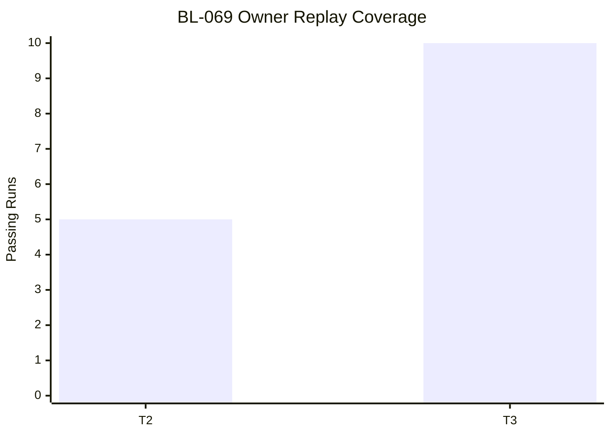

Title: BL-069 RT-Safe Headphone Preset Pipeline and Failure Backoff
Document Type: Backlog Runbook
Author: APC Codex
Created Date: 2026-03-01
Last Modified Date: 2026-03-02

# BL-069 RT-Safe Headphone Preset Pipeline and Failure Backoff

## Plain-Language Summary

BL-069 focuses on a clear, operator-visible outcome: Remove realtime-unsafe file/config loading from the headphone preset path by moving preset hydration and parse work out of the realtime audio processing path, introducing atomic runtime handoff for prepared coefficients, and enforcing retry backoff semantics when preset assets are missing or invalid. This matters because it improves reliability and decision confidence for nearby release lanes. Current state: Done-candidate (owner T2 5/5 + T3 10/10 execute replay PASS; closeout sync pending).


## 6W Snapshot (Who/What/Why/How/When/Where)

| Question | Plain-language answer |
|---|---|
| Who is this for? | QA owners, release owners, and engineering maintainers who depend on deterministic evidence. |
| What is changing? | Remove realtime-unsafe file/config loading from the headphone preset path by moving preset hydration and parse work out of the realtime audio processing path, introducing atomic runtime handoff for prepared coefficients, and enforcing retry backoff semantics when preset assets are missing or invalid. |
| Why is this important? | It reduces risk and keeps related backlog lanes from being blocked by unclear behavior or missing evidence. |
| How will we deliver it? | Deliver in slices, run the required replay/validation lanes, and capture evidence in TestEvidence before owner promotion decisions. |
| When is it done? | Current state: Done-candidate (owner T2 5/5 + T3 10/10 execute replay PASS; closeout sync pending). This item is done when required acceptance checks pass and promotion evidence is complete. |
| Where is the source of truth? | Runbook `Documentation/backlog/bl-069-rt-safe-headphone-preset-pipeline-and-failure-backoff.md`, backlog authority `Documentation/backlog/index.md`, and evidence under `TestEvidence/...`. |


## Visual Aid Index

Use visuals only when they improve understanding; prefer compact tables first.

| Visual Aid | Why it helps | Where to find it |
|---|---|---|
| Status Ledger table | Gives a fast plain-language view of priority, state, dependencies, and ownership. | `## Status Ledger` |
| Validation table | Shows exactly how we verify success and safety. | `## Validation Plan` |
| Optional diagram/screenshot/chart | Use only when it makes complex behavior easier to understand than text alone. | Link under the most relevant section (usually validation or evidence). |
| Evidence visual snapshot | Shows latest evidence packets and replay outcomes in one glance. | `## Evidence Visual Snapshot` |


## Delivery Flow Diagram


## Evidence Visual Snapshot

| Replay Stage | Result | Evidence |
|---|---|---|
| Owner intake execute replay | PASS | `TestEvidence/bl069_owner_intake_execute_20260302T011436Z/` |
| Owner verify execute replay | PASS | `TestEvidence/bl069_owner_verify_execute_20260302T032812Z/` |
| T2 candidate replay | PASS (`5/5`) | `TestEvidence/bl069_owner_t2_candidate_20260302T034928Z/t2_summary.tsv` |
| T3 promotion replay | PASS (`10/10`) | `TestEvidence/bl069_owner_t3_promotion_20260302T035658Z/t3_summary.tsv` |



## Status Ledger

| Field | Value |
|---|---|
| ID | BL-069 |
| Priority | P0 |
| Status | Done-candidate (owner T2 + T3 replay PASS; closeout sync pending) |
| Track | F - Hardening |
| Effort | Med / M |
| Depends On | BL-050 |
| Blocks | — |
| Annex Spec | `(pending annex spec)` |
| Default Replay Tier | T1 (dev-loop deterministic replay; escalate per Global Replay Cadence Policy) |
| Heavy Lane Budget | Standard (apply heavy-wrapper containment when wrapper cost is high) |

## Objective

Remove RT-unsafe file/config loading from the headphone preset path by moving preset hydration and parse work out of `processBlock()`, introducing atomic runtime handoff for prepared coefficients, and enforcing retry backoff semantics when preset assets are missing or invalid.

## Acceptance IDs

- No filesystem access, parse work, or blocking I/O is executed from `processBlock()` during profile changes.
- Missing/invalid preset assets do not retrigger load attempts every callback block.
- Prepared preset coefficients are atomically swapped into audio path without discontinuities.
- Failure/backoff diagnostics are visible in scene/runtime status payloads.

## Validation Plan

QA harness script: `scripts/qa-bl069-rt-safe-preset-pipeline-mac.sh`.
Evidence schema: `TestEvidence/bl069_*/status.tsv`.

Minimum evidence additions:
- `rt_access_audit.tsv`
- `preset_retry_backoff.tsv`
- `coefficient_swap_stability.tsv`
- `failure_taxonomy.tsv`

## Replay Cadence Plan (Required)

Reference policy: `Documentation/backlog/index.md` -> `Global Replay Cadence Policy`.

| Stage | Tier | Runs | Command Pattern | Evidence |
|---|---|---|---|---|
| Dev loop | T1 | 3 | runbook primary lane command at dev-loop depth | validation matrix + replay summary |
| Candidate intake | T2 | 5 (or heavy-wrapper 2-run cap) | runbook candidate replay command set | contract/execute artifacts + taxonomy |
| Promotion | T3 | 10 (or owner-approved heavy-wrapper 3-run equivalent) | owner-selected promotion replay command set | owner packet + deterministic replay evidence |
| Sentinel | T4 | 20+ (explicit only) | long-run sentinel drill when explicitly requested | parity/sentinel artifacts |

### Cost/Flake Policy

- Diagnose failing run index before repeating full multi-run sweeps.
- Heavy wrappers (`>=20` binary launches per wrapper run) use targeted reruns, candidate at 2 runs, and promotion at 3 runs unless owner requests broader coverage.
- Document cadence overrides with rationale in `lane_notes.md` or `owner_decisions.md`.

## Handoff Return Contract

All worker and owner handoffs for this runbook must include:
- `SHARED_FILES_TOUCHED: no|yes`

Required return block:
```
HANDOFF_READY
TASK: <BL ID + Title>
RESULT: PASS|FAIL
FILES_TOUCHED: ...
VALIDATION: ...
ARTIFACTS: ...
SHARED_FILES_TOUCHED: no|yes
BLOCKERS: ...
```

## Governance Alignment (2026-03-01)

This additive section aligns the runbook with current backlog lifecycle and evidence governance without altering historical execution notes.

- Done transition contract: when this item reaches Done, move the runbook from `Documentation/backlog/` to `Documentation/backlog/done/bl-XXX-*.md` in the same change set as index/status/evidence sync.
- Evidence localization contract: canonical promotion and closeout evidence must be repo-local under `TestEvidence/` (not `/tmp`-only paths).
- Ownership safety contract: worker/owner handoffs must explicitly report `SHARED_FILES_TOUCHED: no|yes`.
- Cadence authority: replay tiering and overrides are governed by `Documentation/backlog/index.md` (`Global Replay Cadence Policy`).

## Execution Notes (2026-03-01)

- Initial remediation landed in runtime code:
  - `Source/SpatialRenderer.h` now preloads bundled PEQ presets during `prepare()`.
  - `loadPeqPresetForProfile()` now uses cache-only preset data (no filesystem access on callback path).
  - Failed/missing preset states are now cached through invalid preset entries and no longer trigger per-block file retries.
- Remaining BL-069 scope:
  - Promotion cadence replay (T2/T3) and owner promotion packet.

## Owner Intake Snapshot (2026-03-02)

- Execute-mode probe upgrades landed in:
  - `scripts/qa-bl069-rt-safe-preset-pipeline-mac.sh`
- Worker intake evidence (PASS):
  - `TestEvidence/bl069_owner_intake_contract_20260302T011436Z/`
  - `TestEvidence/bl069_owner_intake_execute_20260302T011436Z/`
- Owner verification replay (PASS):
  - `TestEvidence/bl069_owner_verify_contract_20260302T032812Z/`
  - `TestEvidence/bl069_owner_verify_execute_20260302T032812Z/`
- Validation highlights:
  - execute mode now emits zero TODO rows in `preset_retry_backoff.tsv` and `coefficient_swap_stability.tsv`,
  - `lane_result=PASS` in contract and execute modes,
  - docs freshness gate PASS.

## Owner T2/T3 Replay Snapshot (2026-03-02)

- T2 candidate replay (5 execute runs): `PASS`
  - `TestEvidence/bl069_owner_t2_candidate_20260302T034928Z/`
  - `t2_summary.tsv`: `5/5` runs with `exit_code=0`, `lane_result=PASS`, execute TODO gate `PASS`, `todo_count=0`.
- T3 promotion replay (10 execute runs): `PASS`
  - `TestEvidence/bl069_owner_t3_promotion_20260302T035658Z/`
  - `t3_summary.tsv`: `10/10` runs with `exit_code=0`, `lane_result=PASS`, execute TODO gate `PASS`, `todo_count=0`.
- Docs freshness:
  - `./scripts/validate-docs-freshness.sh` passes after metadata normalization of promotion packet docs.
