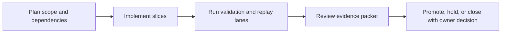

Title: BL-073 QA Scaffold Truthfulness Gates for BL-067 and BL-068
Document Type: Backlog Runbook
Author: APC Codex
Created Date: 2026-03-01
Last Modified Date: 2026-03-02

# BL-073 QA Scaffold Truthfulness Gates for BL-067 and BL-068

## Plain-Language Summary

BL-073 focuses on a clear, operator-visible outcome: Prevent false-green promotions by separating contract-only and execute-mode QA semantics for BL-067/BL-068 and enforcing execute-mode failure when runtime matrix rows remain scaffold/TODO. This matters because it improves reliability and decision confidence for nearby release lanes. Current state: In Implementation (mode semantics and execute TODO-row enforcement scripts authored).


## 6W Snapshot (Who/What/Why/How/When/Where)

| Question | Plain-language answer |
|---|---|
| Who is this for? | QA owners, release owners, and engineering maintainers who depend on deterministic evidence. |
| What is changing? | Prevent false-green promotions by separating contract-only and execute-mode QA semantics for BL-067/BL-068 and enforcing execute-mode failure when runtime matrix rows remain scaffold/TODO. |
| Why is this important? | It reduces risk and keeps related backlog lanes from being blocked by unclear behavior or missing evidence. |
| How will we deliver it? | Deliver in slices, run the required replay/validation lanes, and capture evidence in TestEvidence before owner promotion decisions. |
| When is it done? | Current state: In Implementation (mode semantics and execute TODO-row enforcement scripts authored). This item is done when required acceptance checks pass and promotion evidence is complete. |
| Where is the source of truth? | Runbook `Documentation/backlog/bl-073-qa-scaffold-truthfulness-gates-bl067-bl068.md`, backlog authority `Documentation/backlog/index.md`, and evidence under `TestEvidence/...`. |


## Visual Aid Index

Use visuals only when they improve understanding; prefer compact tables first.

| Visual Aid | Why it helps | Where to find it |
|---|---|---|
| Status Ledger table | Gives a fast plain-language view of priority, state, dependencies, and ownership. | `## Status Ledger` |
| Validation table | Shows exactly how we verify success and safety. | `## Validation Plan` |
| Optional diagram/screenshot/chart | Use only when it makes complex behavior easier to understand than text alone. | Link under the most relevant section (usually validation or evidence). |


## Delivery Flow Diagram



## Status Ledger

| Field | Value |
|---|---|
| ID | BL-073 |
| Priority | P1 |
| Status | In Implementation (mode semantics + TODO-row enforcement script authored) |
| Track | G - Release/Governance |
| Effort | Med / M |
| Depends On | — |
| Blocks | BL-067, BL-068 |
| Annex Spec | `(pending annex spec)` |
| Default Replay Tier | T1 (dev-loop deterministic replay; escalate per Global Replay Cadence Policy) |
| Heavy Lane Budget | Standard (apply heavy-wrapper containment when wrapper cost is high) |

## Objective

Prevent false-green promotions by separating contract-only and execute-mode QA semantics for BL-067/BL-068 and enforcing execute-mode failure when runtime matrix rows remain scaffold/TODO.

## Acceptance IDs

- BL-067 and BL-068 QA lanes expose explicit `--contract-only` and `--execute` modes.
- Execute mode fails whenever required matrix rows contain `TODO` outcomes.
- Promotion checklists reject evidence bundles with scaffold-only execute rows.
- Status/evidence packets clearly distinguish contract scaffolding from runtime execution.

## Validation Plan

QA harness script: `scripts/qa-bl073-scaffold-truthfulness-gates-mac.sh`.
Evidence schema: `TestEvidence/bl073_*/status.tsv`.

Minimum evidence additions:
- `mode_semantics_contract.tsv`
- `todo_row_enforcement.tsv`
- `promotion_gate_policy.md`
- `bl067_bl068_matrix_reconcile.tsv`

## Replay Cadence Plan (Required)

Reference policy: `Documentation/backlog/index.md` -> `Global Replay Cadence Policy`.

| Stage | Tier | Runs | Command Pattern | Evidence |
|---|---|---|---|---|
| Dev loop | T1 | 3 | runbook primary lane command at dev-loop depth | validation matrix + replay summary |
| Candidate intake | T2 | 5 (or heavy-wrapper 2-run cap) | runbook candidate replay command set | contract/execute artifacts + taxonomy |
| Promotion | T3 | 10 (or owner-approved heavy-wrapper 3-run equivalent) | owner-selected promotion replay command set | owner packet + deterministic replay evidence |
| Sentinel | T4 | 20+ (explicit only) | long-run sentinel drill when explicitly requested | parity/sentinel artifacts |

### Cost/Flake Policy

- Diagnose failing run index before repeating full multi-run sweeps.
- Heavy wrappers (`>=20` binary launches per wrapper run) use targeted reruns, candidate at 2 runs, and promotion at 3 runs unless owner requests broader coverage.
- Document cadence overrides with rationale in `lane_notes.md` or `owner_decisions.md`.

## Handoff Return Contract

All worker and owner handoffs for this runbook must include:
- `SHARED_FILES_TOUCHED: no|yes`

Required return block:
```
HANDOFF_READY
TASK: <BL ID + Title>
RESULT: PASS|FAIL
FILES_TOUCHED: ...
VALIDATION: ...
ARTIFACTS: ...
SHARED_FILES_TOUCHED: no|yes
BLOCKERS: ...
```

## Governance Alignment (2026-03-01)

This additive section aligns the runbook with current backlog lifecycle and evidence governance without altering historical execution notes.

- Done transition contract: when this item reaches Done, move the runbook from `Documentation/backlog/` to `Documentation/backlog/done/bl-XXX-*.md` in the same change set as index/status/evidence sync.
- Evidence localization contract: canonical promotion and closeout evidence must be repo-local under `TestEvidence/` (not `/tmp`-only paths).
- Ownership safety contract: worker/owner handoffs must explicitly report `SHARED_FILES_TOUCHED: no|yes`.
- Cadence authority: replay tiering and overrides are governed by `Documentation/backlog/index.md` (`Global Replay Cadence Policy`).
