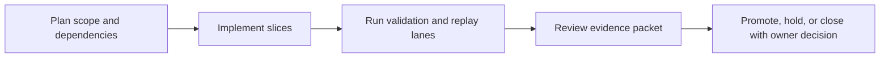

Title: BL-077 Unified Visual Capture and Replay Harness
Document Type: Backlog Runbook
Author: APC Codex
Created Date: 2026-03-02
Last Modified Date: 2026-03-02

# BL-077 Unified Visual Capture and Replay Harness

## Plain-Language Summary

BL-077 focuses on a clear, operator-visible outcome: Provide a robust, easy-to-use capture system that records plugin + companion behavior, guides operators through checkpoint cues, and emits ready-to-review artifacts (video, dense frames, labeled checkpoints, contact sheets, and short cue clips) suitable for automated QA lanes and owner promotion decisions. This matters because it improves reliability and decision confidence for nearby release lanes. Current state: In Planning (P0 user-priority intake promoted to runbook; implementation slices defined).


## 6W Snapshot (Who/What/Why/How/When/Where)

| Question | Plain-language answer |
|---|---|
| Who is this for? | Headphone users, companion-app operators, QA/release owners, and audio-engine maintainers. |
| What is changing? | Provide a robust, easy-to-use capture system that records plugin + companion behavior, guides operators through checkpoint cues, and emits ready-to-review artifacts (video, dense frames, labeled checkpoints, contact sheets, and short cue clips) suitable for automated QA lanes and owner promotion decisions. |
| Why is this important? | It reduces risk and keeps related backlog lanes from being blocked by unclear behavior or missing evidence. |
| How will we deliver it? | Deliver in slices, run the required replay/validation lanes, and capture evidence in TestEvidence before owner promotion decisions. |
| When is it done? | Current state: In Planning (P0 user-priority intake promoted to runbook; implementation slices defined). This item is done when required acceptance checks pass and promotion evidence is complete. |
| Where is the source of truth? | Runbook `Documentation/backlog/bl-077-unified-visual-capture-and-replay-harness.md`, backlog authority `Documentation/backlog/index.md`, and evidence under `TestEvidence/...`. |


## Visual Aid Index

Use visuals only when they improve understanding; prefer compact tables first.

| Visual Aid | Why it helps | Where to find it |
|---|---|---|
| Status Ledger table | Fast snapshot of priority/state/dependencies. | `## Status Ledger` |
| Implementation slices table | Clarifies staged rollout and ownership boundaries. | `## Implementation Slices` |
| Capture pipeline diagram (optional) | Useful when orchestration flow gets dense. | `## Architecture Context` |
| Example contact sheets + clips | Proves operator-ready evidence format. | `TestEvidence/bl077_*/` |
| Evidence visual snapshot | Shows latest evidence packets and replay outcomes in one glance. | `## Evidence Visual Snapshot` |

## Delivery Flow Diagram



## Evidence Visual Snapshot

| Target Artifact | Why it matters | Path |
|---|---|---|
| Run-level status | Fast PASS/FAIL visibility for operators and agents | `TestEvidence/bl077_capture_harness_<timestamp>/status.tsv` |
| Capture contract matrix | Confirms capture profile + cue contract behavior | `TestEvidence/bl077_capture_harness_<timestamp>/capture_contract_matrix.tsv` |
| Artifact schema inventory | Confirms all expected visual outputs are present | `TestEvidence/bl077_capture_harness_<timestamp>/artifact_schema_inventory.tsv` |
| Contact-sheet/clip samples | Human-reviewable visual proof for promotion packets | `TestEvidence/bl077_capture_harness_<timestamp>/` |


## Status Ledger

| Field | Value |
|---|---|
| ID | BL-077 |
| Priority | P0 |
| Status | In Planning (P0 user-priority intake promoted to runbook) |
| Track | D - QA Platform |
| Effort | High / L |
| Depends On | BL-049 (Done), BL-073 |
| Blocks | BL-058, BL-059, BL-060, BL-067, BL-068, BL-074 (validation evidence velocity and reliability) |
| Annex Spec | `(pending annex spec)` |
| Default Replay Tier | T1 (dev-loop deterministic replay; escalate per Global Replay Cadence Policy) |
| Heavy Lane Budget | Standard (promote deterministic short-runs first; escalate only for promotion packets) |

## Objective

Provide a robust, easy-to-use capture system that records plugin + companion behavior, guides operators through checkpoint cues, and emits ready-to-review artifacts (video, dense frames, labeled checkpoints, contact sheets, and short cue clips) suitable for automated QA lanes and owner promotion decisions.

## Scope

In scope:
- Unified capture CLI for screenshot/video/session capture with profile presets.
- Timed cue engine (terminal and optional spoken prompts) with configurable cue profiles.
- Automatic post-processing: frame extraction, checkpoint labeling, contact sheets, and cue-window clips.
- Lane integration contract for backlog scripts (single command, deterministic artifact layout).
- Export-friendly profile schema to support future reuse in `audio-plugin-coder` and `audio-dsp-qa-harness`.

Out of scope:
- Replacing platform-native capture permissions/security models.
- Host-specific UI test frameworks outside capture/evidence orchestration.
- Non-macOS parity in this first delivery slice (cross-platform follow-on allowed as additive work).

## Architecture Context

- Existing seed script: `scripts/capture-headtracking-rotation-mac.sh` proves baseline feasibility.
- This lane formalizes that ad-hoc script into a reusable QA-platform contract:
  - profile-driven orchestration (`coarse`, `dense`, lane-specific presets),
  - deterministic artifact tree and metadata,
  - reusable hooks for lane scripts and external harness consumers.
- Cross-project extension target:
  - Define capture profile contract and evidence schema that can be adopted by `audio-plugin-coder` and `audio-dsp-qa-harness` without coupling to LocusQ internals.

## Acceptance IDs

- `BL077-A-001`: One-command guided capture run works reliably for multi-window plugin + companion workflows.
- `BL077-A-002`: Cue profiles are configurable and can represent dense checkpoint sweeps (including between-angle checks).
- `BL077-A-003`: Post-processing emits deterministic artifacts (video, frames, checkpoints, contact sheets, cue clips, summary metadata).
- `BL077-A-004`: QA-lane integration contract exists and at least one lane consumes the capture harness end-to-end.
- `BL077-A-005`: Capture artifacts are organized under a machine-parseable schema suitable for promotion packets.
- `BL077-A-006`: Export profile/schema is documented for future adoption in `audio-plugin-coder` and `audio-dsp-qa-harness`.

## Implementation Slices

| Slice | Description | Files | Entry Gate | Exit Criteria |
|---|---|---|---|---|
| A | Stabilize core capture CLI and profile system (`coarse`/`dense`/custom profile loading). | `scripts/capture-headtracking-rotation-mac.sh`, `scripts/capture_profiles/*.json` (new), `Documentation/backlog/bl-077-*.md` | Runbook approved | Deterministic guided run succeeds and emits complete summary metadata. |
| B | Add robust post-processing packager (checkpoints, contact sheets, cue-window clips, index TSV/JSON). | `scripts/capture-headtracking-rotation-mac.sh`, `scripts/qa-bl077-capture-harness-mac.sh` (new) | Slice A complete | Artifact tree matches schema contract and replay hash is stable across repeated runs. |
| C | Integrate with lane workflows and extension docs for shared harness adoption. | `scripts/qa-*.sh` integration points, `Documentation/testing/*`, extension notes | Slice B complete | At least one active lane consumes harness automatically; extension contract documented for `audio-plugin-coder` + `audio-dsp-qa-harness`. |

## Validation Plan

QA harness script: `scripts/qa-bl077-capture-harness-mac.sh` (to be authored).
Evidence schema: `TestEvidence/bl077_capture_harness_<timestamp>/status.tsv`.

Minimum evidence additions:
- `capture_contract_matrix.tsv`
- `cue_profile_matrix.tsv`
- `artifact_schema_inventory.tsv`
- `replay_hashes.tsv`
- `integration_consumers.tsv`
- `extension_contract.md`

## Replay Cadence Plan (Required)

Reference policy: `Documentation/backlog/index.md` -> `Global Replay Cadence Policy`.

| Stage | Tier | Runs | Command Pattern | Evidence |
|---|---|---|---|---|
| Dev loop | T1 | 3 | `scripts/qa-bl077-capture-harness-mac.sh --contract-only --runs 3` | contract matrix + replay summary |
| Candidate intake | T2 | 5 | `scripts/qa-bl077-capture-harness-mac.sh --execute --runs 5` | execute matrix + taxonomy |
| Promotion | T3 | 10 | `scripts/qa-bl077-capture-harness-mac.sh --execute --runs 10` | owner packet + deterministic replay evidence |
| Sentinel | T4 | 20+ (explicit only) | long-run capture reliability soak | long-run parity and flake taxonomy |

### Cost/Flake Policy

- Diagnose specific failing replay indices before repeating multi-run sweeps.
- Keep default evidence windows short and targeted (checkpoint-centric) to reduce artifact bloat.
- Document any cadence override in owner decision artifacts with rationale.

## Handoff Return Contract

All worker and owner handoffs for this runbook must include:
- `SHARED_FILES_TOUCHED: no|yes`

Required return block:
```
HANDOFF_READY
TASK: <BL ID + Title>
RESULT: PASS|FAIL
FILES_TOUCHED: ...
VALIDATION: ...
ARTIFACTS: ...
SHARED_FILES_TOUCHED: no|yes
BLOCKERS: ...
```

## Governance Alignment (2026-03-02)

This additive section aligns the runbook with current backlog lifecycle and evidence governance.

- Done transition contract: when this item reaches Done, move the runbook from `Documentation/backlog/` to `Documentation/backlog/done/bl-077-*.md` in the same change set as index/status/evidence sync.
- Evidence localization contract: canonical promotion and closeout evidence must be repo-local under `TestEvidence/`.
- Ownership safety contract: worker/owner handoffs must explicitly report `SHARED_FILES_TOUCHED: no|yes`.
- Cadence authority: replay tiering and overrides are governed by `Documentation/backlog/index.md` (`Global Replay Cadence Policy`).
