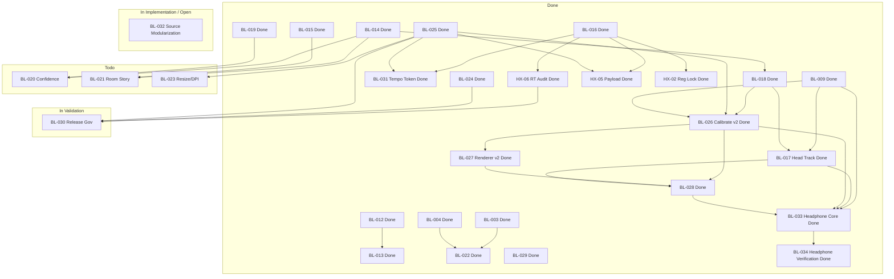

Title: LocusQ Master Backlog Index
Document Type: Backlog Index
Author: APC Codex
Created Date: 2026-02-23
Last Modified Date: 2026-02-26

# LocusQ Master Backlog Index

## Purpose

Single canonical backlog authority for priority, ordering, status, dependencies, and closeout criteria across all BL/HX work items. This file is a dashboard — detailed execution content lives in individual runbook docs alongside annex plan specs.

## Canonical Contract

1. This file is the single authority for backlog status, ordering, and priority.
2. Open-item runbook docs (`Documentation/backlog/bl-XXX-*.md`) carry execution detail, agent prompts, and validation plans.
3. Done-item runbooks are archived under `Documentation/backlog/done/` and linked from Closed Archive.
4. Annex plan specs (`Documentation/plans/*.md`) carry deep architecture; they must not contain authoritative backlog state.
5. Every open item must have a corresponding runbook doc with dependencies, agent mega-prompts, and exit criteria.
6. Any status/priority change must update this file, the runbook's Status Ledger, and evidence surfaces in the same changeset.
7. Intake process for new items uses `Documentation/backlog/_template-intake.md`.
8. Owner promotion decisions should use `Documentation/backlog/_template-promotion-decision.md` inside the owner sync evidence bundle.

## Layer Model

| Layer | Role | Authority |
|---|---|---|
| Master index (this file) | Priority, sequencing, status, dependencies, dashboard | Authoritative |
| Runbook docs (open: `Documentation/backlog/bl-XXX-*.md`; done: `Documentation/backlog/done/*.md`) | Execution detail, agent prompts, validation plans, evidence contracts | Execution |
| Annex specs (`Documentation/plans/*.md`) | Deep architecture/spec details per BL lane | Supporting |
| Archive (`Documentation/archive/`) | Historical context and extraction source | Reference only |

## Active Queue

| # | ID | Title | Priority | Status | Track | Depends On | Blocks | Runbook |
|--:|-----|-------|----------|--------|-------|------------|--------|---------|
| 1 | BL-030 | Release governance and device rerun | P2 | In Validation (RL-09 PASS; RL-05 manual evidence blocker retained through G5/G6/I1; RL-03 remains red after K1 hardening with residual `app_exited_before_result` flake (`BL-029 9/10`, `BL-009 10/10`); RL-04/RL-06 remain red via H2/H3 with I2 diagnostics) | G | BL-024, BL-025, HX-06 | — | [bl-030](bl-030-release-governance.md) |
| 2 | BL-020 | Confidence/masking overlay mapping | P2 | Todo | E | BL-014, BL-019 | — | [bl-020](bl-020-confidence-masking.md) |
| 3 | BL-021 | Room-story overlays | P2 | Todo | E | BL-014, BL-015 | — | [bl-021](bl-021-room-story-overlays.md) |
| 4 | BL-023 | Resize/DPI hardening | P2 | Todo | C | BL-025 | — | [bl-023](bl-023-resize-dpi-hardening.md) |
| 5 | BL-032 | Source modularization of PluginProcessor/PluginEditor | P2 | In Implementation (Slice D1 closed `BL032-G-001` with guardrails PASS; remaining blocker is RT audit allowlist drift after line-map movement: `non_allowlisted=92`) | F | — | — | [bl-032](bl-032-source-modularization.md) |

## Dependency Graph

## Parallel Agent Tracks

| Track | Name | Scope | Skills |
|---|---|---|---|
| A | Runtime Formats | No active items (BL-033 complete) | `steam-audio-capi`, `clap-plugin-lifecycle`, `spatial-audio-engineering`, `skill_docs` |
| B | Scene/UI Runtime | No active items (BL-031 complete; intake lane) | `juce-webview-runtime`, `reactive-av`, `threejs`, `physics-reactive-audio`, `skill_impl`, `skill_docs` |
| C | UX Authoring | BL-023 | `skill_design`, `juce-webview-runtime`, `threejs`, `skill_plan`, `skill_docs` |
| D | QA Platform | No active items (BL-034 archived to done runbook) | `skill_test`, `skill_testing`, `skill_troubleshooting`, `skill_plan` |
| E | R&D Expansion | BL-020, BL-021 | `skill_plan`, `skill_dream`, `reactive-av`, `threejs` |
| F | Hardening | BL-032 | `skill_impl`, `skill_testing`, `juce-webview-runtime`, `skill_docs` |
| G | Release/Governance | BL-030 | `skill_docs`, `skill_plan`, `skill_test`, `skill_ship` |

## Intake Process

1. **Capture** — Create `Documentation/backlog/_intake-YYYY-MM-DD-<slug>.md` using the intake template.
2. **Triage** — Assign BL/HX ID, determine dependencies, set priority, assign to track.
3. **Promote** — Convert to full runbook (`bl-XXX-<slug>.md`), add row to this index.
4. **Archive** — Delete the intake doc after promotion.

## Owner Sync Packet Contract

For owner/orchestrator closeout transitions (`In Validation` -> `Done-candidate`), generate:
- `TestEvidence/<bl_or_hx>_owner_sync_<slice>_<timestamp>/promotion_decision.md`

Template:
- `Documentation/backlog/_template-promotion-decision.md`

## Definition of Ready

1. Objective, dependency gate, owner track, and exit artifact are explicit in the runbook.
2. Annex spec and runbook references are present and linked.
3. Agent mega-prompts (skill-aware + standalone) are defined for each implementation slice.
4. Validation commands and evidence destinations are defined.

## Definition of Done

1. Code/docs changes merged.
2. Required validation commands pass with recorded artifacts.
3. `status.json`, `TestEvidence/build-summary.md`, `TestEvidence/validation-trend.md`, and this index are synchronized.
4. `./scripts/validate-docs-freshness.sh` passes.

## Sync Contract (ADR-0005 Extended)

Any status change must update in the same changeset:
1. The runbook's Status Ledger
2. This index's dashboard table
3. `status.json`
4. `TestEvidence/build-summary.md` and `TestEvidence/validation-trend.md`
5. `README.md` and `CHANGELOG.md` (for Done transitions)

## Material Preservation Map

| Backlog ID | Primary Annex Docs |
|---|---|
| BL-011 | `Documentation/plans/bl-011-clap-contract-closeout-2026-02-23.md`; `Documentation/plans/LocusQClapContract.h` |
| BL-013 | `Documentation/plans/bl-013-hostrunner-feasibility-2026-02-23.md` |
| BL-017 | `Documentation/plans/bl-017-head-tracked-monitoring-companion-bridge-plan-2026-02-22.md` |
| BL-024 | `Documentation/plans/reaper-host-automation-plan-2026-02-22.md` |
| BL-025 | `Documentation/plans/bl-025-emitter-uiux-v2-spec-2026-02-22.md` |
| BL-026 | `Documentation/plans/bl-026-calibrate-uiux-v2-spec-2026-02-23.md`; `Documentation/plans/bl-026-calibrate-v1-v2-uiux-comparison-2026-02-23.md` |
| BL-027 | `Documentation/plans/bl-027-renderer-uiux-v2-spec-2026-02-23.md` |
| BL-028 | `Documentation/plans/bl-028-spatial-output-matrix-spec-2026-02-25.md` |
| BL-029 | `Documentation/plans/bl-029-dsp-visualization-and-tooling-spec-2026-02-24.md`; `Documentation/plans/bl-029-audition-platform-expansion-plan-2026-02-24.md` |
| BL-031 | `Documentation/plans/bl-031-tempo-locked-visual-token-scheduler-spec-2026-02-24.md` |
| BL-033 | `Documentation/plans/bl-033-headphone-calibration-core-spec-2026-02-25.md` |
| BL-034 | `Documentation/plans/bl-034-headphone-calibration-verification-spec-2026-02-25.md` |

## Closed Archive

| ID | Title | Completed | Runbook |
|---|---|---|---|
| BL-001 | README standards and structure | 2026-02-21 | [bl-001](done/bl-001-readme-standards.md) |
| BL-002 | Physics preset host reversion fix | 2026-02-21 | [bl-002](done/bl-002-physics-preset-reversion.md) |
| BL-003 | Timeline transport controls restore | 2026-02-21 | [bl-003](done/bl-003-timeline-transport.md) |
| BL-004 | Keyframe editor gestures in production UI | 2026-02-21 | [bl-004](done/bl-004-keyframe-gestures.md) |
| BL-005 | Preset save host path fix | 2026-02-21 | [bl-005](done/bl-005-preset-save-path.md) |
| BL-006 | Motion trail overlays | 2026-02-21 | [bl-006](done/bl-006-motion-trail-overlays.md) |
| BL-007 | Velocity vector overlays | 2026-02-21 | [bl-007](done/bl-007-velocity-vector-overlays.md) |
| BL-008 | Audio-reactive RMS overlays | 2026-02-21 | [bl-008](done/bl-008-rms-overlays.md) |
| BL-009 | Steam headphone contract closeout | 2026-02-23 | [bl-009](done/bl-009-steam-headphone-contract.md) |
| BL-010 | FDN expansion promotion | 2026-02-23 | [bl-010](done/bl-010-fdn-expansion.md) |
| BL-011 | CLAP lifecycle and CI/host closeout | 2026-02-23 | [bl-011](done/bl-011-clap-lifecycle.md) |
| BL-012 | QA harness tranche closeout | 2026-02-24 | [bl-012](done/bl-012-qa-harness-tranche.md) |
| BL-013 | HostRunner feasibility promotion | 2026-02-25 | [bl-013](done/bl-013-hostrunner-feasibility.md) |
| BL-014 | Listener/speaker/aim/RMS overlay strict closeout | 2026-02-24 | [bl-014](done/bl-014-overlay-strict-closeout.md) |
| BL-015 | All-emitter realtime rendering closure | 2026-02-23 | [bl-015](done/bl-015-all-emitter-rendering.md) |
| BL-016 | Visualization transport contract closure | 2026-02-23 | [bl-016](done/bl-016-transport-contract.md) |
| BL-017 | Head-tracked monitoring companion bridge | 2026-02-25 | [bl-017](done/bl-017-head-tracked-monitoring.md) |
| BL-018 | Spatial format matrix strict closeout | 2026-02-24 | [bl-018](done/bl-018-spatial-format-matrix.md) |
| BL-019 | Physics interaction lens closure | 2026-02-23 | [bl-019](done/bl-019-physics-interaction-lens.md) |
| BL-022 | Choreography lane closeout | 2026-02-24 | [bl-022](done/bl-022-choreography-closeout.md) |
| BL-024 | REAPER host automation baseline | 2026-02-23 | [bl-024](done/bl-024-reaper-host-automation.md) |
| BL-025 | EMITTER UI/UX v2 deterministic closeout | 2026-02-24 | [bl-025](done/bl-025-emitter-uiux-v2.md) |
| BL-026 | CALIBRATE UI/UX v2 multi-topology | 2026-02-25 | [bl-026](done/bl-026-calibrate-uiux-v2.md) |
| BL-027 | RENDERER UI/UX v2 multi-profile | 2026-02-25 | [bl-027](done/bl-027-renderer-uiux-v2.md) |
| BL-028 | Spatial output matrix enforcement | 2026-02-25 | [bl-028](done/bl-028-spatial-output-matrix.md) |
| BL-029 | DSP visualization and tooling | 2026-02-25 | [bl-029](done/bl-029-dsp-visualization.md) |
| BL-031 | Tempo-locked visual token scheduler | 2026-02-25 | [bl-031](done/bl-031-tempo-token-scheduler.md) |
| BL-033 | Headphone calibration core path | 2026-02-26 | [bl-033](done/bl-033-headphone-calibration-core.md) |
| BL-034 | Headphone calibration verification and profile governance | 2026-02-26 | [bl-034](done/bl-034-headphone-calibration-verification.md) |
| HX-01 | shared_ptr atomic migration guard | 2026-02-23 | [hx-01](done/hx-01-shared-ptr-atomic.md) |
| HX-02 | Registration lock / memory-order audit | 2026-02-25 | [hx-02](done/hx-02-registration-lock.md) |
| HX-03 | REAPER multi-instance stability lane | 2026-02-23 | [hx-03](done/hx-03-reaper-multi-instance.md) |
| HX-04 | Scenario coverage audit and drift guard | 2026-02-23 | [hx-04](done/hx-04-scenario-coverage.md) |
| HX-05 | Payload budget and throttle contract | 2026-02-25 | [hx-05](done/hx-05-payload-budget.md) |
| HX-06 | Recurring RT-safety static audit | 2026-02-25 | [hx-06](done/hx-06-rt-safety-audit.md) |
