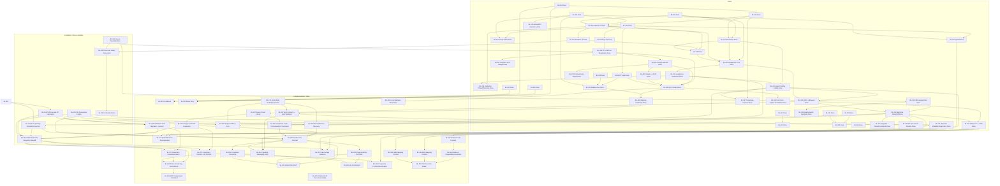

Title: LocusQ Master Backlog Index
Document Type: Backlog Index
Author: APC Codex
Created Date: 2026-02-23
Last Modified Date: 2026-03-19 (BL-079, BL-085, BL-086, BL-095, BL-096, BL-097, BL-098, BL-099, BL-100, BL-101 promoted to Done; active P1 blocked: BL-060, BL-067)

# LocusQ Master Backlog Index

## Purpose

Single canonical backlog authority for priority, ordering, status, dependencies, and closeout across all BL/HX work.
This file is the dashboard.
Detailed execution content lives in runbooks, plans, and evidence packets.

## Canonical Rules

1. This file is the single authority for backlog status, ordering, and priority.
2. Open work lives in `Documentation/backlog/bl-*.md` or `hx-*.md`.
3. Done work lives in `Documentation/backlog/done/`.
4. Plans under `Documentation/plans/*.md` are supporting architecture, not backlog authority.
5. Any status or priority change must update this file, the runbook `Status Ledger`, and the evidence surfaces in the same change set.

## Backlog Lifecycle Contract

1. New work starts with `Documentation/backlog/_template-intake.md`.
2. Promoted work uses `Documentation/backlog/_template-runbook.md` and must define replay cadence and ownership boundaries.
3. Owner promotion packets use `Documentation/backlog/_template-promotion-decision.md`.
4. Done transitions use `Documentation/backlog/_template-closeout.md`.
5. When an item becomes Done, move its runbook from `Documentation/backlog/` to `Documentation/backlog/done/` in the same change set as index/status/evidence sync.
6. All worker and owner handoffs must explicitly report `SHARED_FILES_TOUCHED: no|yes`.
7. Evidence for canonical promotions must be repo-local under `TestEvidence/` (not `/tmp` paths).
8. Required runbook headings: `Plain-Language Summary`, `6W Snapshot (Who/What/Why/How/When/Where)`, and `Visual Aid Index`.
9. Authoring guide: `Documentation/backlog/runbook-authoring-guide.md`
10. Summary schema: `Documentation/backlog/backlog-summary-schema.md`
11. Draft automation contract: `Documentation/backlog/automation-contracts.json`
12. Draft automation guide: `Documentation/backlog/automation-draft-flow.md`
13. Draft automation runner: `scripts/backlog-auto-123.py`

## Layer Model

| Layer | Role | Authority |
|---|---|---|
| Master index (this file) | Priority, sequencing, status, dependencies, dashboard | Authoritative |
| Runbook docs (open: `Documentation/backlog/bl-XXX-*.md`; done: `Documentation/backlog/done/*.md`) | Execution detail, agent prompts, validation plans, evidence contracts | Execution |
| Annex specs (`Documentation/plans/*.md`) | Deep architecture/spec details per BL lane | Supporting |
| Archive (`Documentation/archive/`) | Historical context and extraction source | Reference only |

## Global Replay Cadence Policy

Default policy for open and future backlog items.

### Tiered Replay Contract

| Tier | Name | Default Use | Typical Runs | Required Evidence |
|---|---|---|---|---|
| T0 | Syntax/Usage Smoke | Script contract sanity and argument semantics | 1 | syntax/help logs, exit probes, docs freshness |
| T1 | Dev Loop Determinism | Day-to-day implementation checks | 3 | contract/execute matrices + replay hashes |
| T2 | Candidate Gate | Pre-owner intake confidence gate | 5 | stable replay summary + blocker taxonomy |
| T3 | Promotion Gate | Final owner promotion validation | 10 (or owner-approved equivalent) | promotion packet + deterministic replay evidence |
| T4 | Long-Run Sentinel | Explicit soak/regression sentinel only | 20/50/100 (explicitly requested) | long-run sentinel summaries and parity artifacts |

### Execution Rules

1. Start at T1 for active development unless the runbook explicitly requires T0 only (docs-only lanes).
2. Escalate to T2 only after T1 is green and intake is pending.
3. Escalate to T3 once per promotion cycle; avoid repeated full T3 reruns unless code changed or owner requests.
4. Reserve T4 for sentinel slices and post-fix confidence drills, not routine iteration.
5. If a replay fails, run targeted diagnostics on the failing run index before repeating full multi-run sweeps.
6. Heavy wrappers (`>=20` binary launches per wrapper run) should use targeted debugging, `2` candidate runs, and `3` promotion runs unless the owner requires more.
7. Per `ADR-0023`, replay automation may draft packets and sync summaries, but authoritative promotion remains owner-confirmed by default.

### Override Contract

- Stricter item-specific cadence is allowed only when documented in that runbook.
- Temporary overrides must record the reason in `owner_decisions.md` or `lane_notes.md`.

## UI/UX Prioritization Snapshot (2026-03-18)

Derived from:
- `Documentation/reports/2026-03-17-locusq-ui-ux-design-review.md`
- `Documentation/reports/2026-03-17-locusq-ui-ux-refinement-pass.md`
- `Documentation/reports/2026-03-17-locusq-ui-ux-second-opinion-claude.md`

| Order | Item | Status | Priority | Why now |
|---:|---|---|---|---|
| 1 | BL-091 Companion Focus/Lab trust flow | `[DONE]` | P1 | Focus/Lab trust flow is implemented, capture-backed, and packaged for promotion; only formal archive/closeout remains. |
| 2 | BL-090 Plugin authority-first shell and renderer hierarchy | `[DONE]` | P1 | The compressed shell is live, capture-backed, and packaged for promotion; only formal archive/closeout remains. |
| 3 | BL-089 Render trust contract and requested-vs-active language | `[DONE]` | P1 | Shared trust vocabulary is live, representative parity evidence exists, and bounded truth-language keeps BL-095/BL-099 follow-ons separate. |
| 4 | BL-092 Cross-format capability messaging parity | `[DONE]` | P2 | Representative native and preview parity is capture-backed and packaged for promotion; only formal archive/closeout remains. |
| 5 | BL-093 Visual DNA token adoption and polish | `[DONE]` | P2 | Token drift is reconciled in the live plugin and companion shells, the owner sync packet is written, and only archive/closeout remains. |
| 6 | BL-094 Reactive/simulation/temporal lab containment | `[DONE]` | P2 | The containment rule is now live in docs, architecture, and the `EMITTER` motion shell; only archive/closeout remains. |

Execution note:
- BL-091, BL-090, and BL-089 remain one coordinated P1 trust wave.
- BL-091, BL-090, BL-089, and BL-092 are now `Done` from trust-wave owner sync packet `TestEvidence/ui_ux_trust_wave_owner_sync_z1_20260318T040618Z/promotion_decision.md` plus final closeout sync on 2026-03-18.
- BL-093 is now `Done` with validation bundle `TestEvidence/bl093_visual_token_polish_20260318T042850Z/summary.md`, owner sync packet `TestEvidence/bl093_owner_sync_z1_20260318T044057Z/promotion_decision.md`, and final closeout sync on 2026-03-18.
- BL-094 is now `Done` with containment bundle `TestEvidence/bl094_motion_lab_containment_20260318T045654Z/summary.md`, owner sync packet `TestEvidence/bl094_owner_sync_z1_20260318T045927Z/promotion_decision.md`, and final closeout sync on 2026-03-18.

### Trust Wave Execution Packet (2026-03-17)

Primary packet:
- `Documentation/plans/2026-03-17-ui-ux-trust-wave-execution-packet.md`

Immediate wave summary:

| Wave | Primary BL | Outcome | Primary Write Set | Promotion Constraint |
|---|---|---|---|---|
| 1A | BL-091 | Companion launches trust-first with Focus/Lab split | `companion/Sources/LocusQHeadTrackingCompanion/main.swift` | BL-089 copy contract must reconcile before promotion |
| 1B | BL-090 | Plugin header and `RENDERER` hierarchy are compressed without losing boot/trust signals | `Source/ui/public/index.html`, `Source/ui/src/index.ts` | BL-089 copy contract must reconcile before promotion |
| 1C | BL-089 | Shared requested/active/fallback language is frozen and normalized | docs first, then targeted plugin/companion text hooks | engine-specific trust text must stay truthful relative to BL-095 |

## Active Queue

| # | ID | Title | Priority | Status | Track | Depends On | Blocks | Runbook |
|--:|-----|-------|----------|--------|-------|------------|--------|---------|
| 1 | BL-030 | Release governance and device rerun | P2 | **Done** (N15 owner authoritative confirm `UNANIMOUS_PASS`; RL-03..RL-09 closeout matrix PASS; release decision `GO`) | G | BL-024, BL-025, HX-06 | — | [bl-030](done/bl-030-release-governance.md) |
| 2 | BL-020 | Confidence/masking overlay mapping | P2 | In Validation (C4 mode parity + exit semantics packets are green; owner promotion review pending) | E | BL-014, BL-019 | — | [bl-020](bl-020-confidence-masking.md) |
| 3 | BL-021 | Room-story overlays | P2 | In Implementation (C2 soak PASS; N13 owner recheck `--contract-only --runs 3` PASS with stable replay hash/row signatures) | E | BL-014, BL-015 | — | [bl-021](bl-021-room-story-overlays.md) |
| 4 | BL-023 | Resize/DPI hardening | P2 | **Done** (A2 runtime/UI hardening complete; T3 heavy-wrapper equivalent replay PASS; strict usage exits and mode parity confirmed) | C | BL-025 | — | [bl-023](done/bl-023-resize-dpi-hardening.md) |
| 5 | BL-032 | Source modularization of PluginProcessor/PluginEditor | P2 | Done-candidate (current branch hold recheck PASS; owner promotion packet pending) | F | — | — | [bl-032](bl-032-source-modularization.md) |
| 6 | BL-035 | RT lock-free registration | P0 | **Done** (owner heavy-wrapper equivalent cadence replay PASS: T2 `2/2`, T3 `3/3`; closeout/archive sync PASS) | F | HX-02, BL-032 | — | [bl-035](done/bl-035-rt-lock-free-registration.md) |
| 7 | BL-036 | DSP finite output guardrails | P0 | **Done** (contract-lane D2 evidence archived honestly on 2026-03-05; remaining runtime implementation slices A2/B2/C1 split into BL-078) | F | BL-035 | — | [bl-036](done/bl-036-dsp-finite-output-guardrails.md) |
| 8 | BL-037 | Emitter snapshot CPU budget | P1 | **Done** (Z10 owner D2 intake accepted; deterministic 100-run replay, strict usage semantics, and closeout/archive sync PASS) | F | BL-035 | — | [bl-037](done/bl-037-emitter-snapshot-cpu-budget.md) |
| 9 | BL-038 | Calibration threading and telemetry | P1 | **Done** (Z10 owner D2 intake accepted; deterministic 100/100 contract/execute parity; closeout/archive sync PASS) | E | BL-026, BL-034 | — | [bl-038](done/bl-038-calibration-threading-and-telemetry.md) |
| 10 | BL-039 | Parameter relay spec generation | P1 | **Done** (Z11 done promotion 2026-03-17; reused green owner lane evidence and archive sync complete; artifact `TestEvidence/bl039_owner_sync_z11_20260317T043154Z_7514/promotion_decision.md`) | B | BL-027, BL-032 | — | [bl-039](done/bl-039-parameter-relay-spec-generation.md) |
| 11 | BL-040 | UI modularization and authority status UX | P1 | **Done** (owner-verified done-promotion evidence complete 2026-03-17; 100-run authority diagnostics PASS, strict usage exits green, docs freshness green; evidence: `TestEvidence/bl040_done_promotion_20260317T180000Z/`) | B | BL-027, BL-039 | — | [bl-040](done/bl-040-ui-modularization-and-authority-status.md) |
| 12 | BL-041 | Doppler v2 and VBAP geometry validation | P2 | **Done** (Z10 owner D2 intake accepted; deterministic 100/100 contract/execute parity, strict usage exits, docs freshness, and closeout/archive sync PASS) | E | BL-036 | — | [bl-041](done/bl-041-doppler-v2-and-vbap-geometry-validation.md) |
| 13 | BL-042 | QA CI regression gates | P1 | **Done** (Z16c RT reconcile PASS; Z16P_r2c preflight PASS; Z18 owner done-promotion PASS) | G | BL-035, BL-036, BL-041, HX-06 | BL-030 | [bl-042](done/bl-042-qa-ci-regression-gates.md) |
| 14 | BL-044 | Quality-tier seamless switching | P1 | **Done** (Z17 owner done-promotion PASS; deterministic e2e evidence localized and ownership-safe) | F | BL-043 (Done) | — | [bl-044](done/bl-044-quality-tier-seamless-switching.md) |
| 15 | BL-045 | Head tracking fidelity v1.1 | P1 | **Done** (all slices + full QA lane 10/10 PASS 2026-02-27; `TestEvidence/bl045_headtracking_fidelity_20260227T034917Z`) | E | BL-017, BL-034 | — | [bl-045](done/bl-045-head-tracking-fidelity-v11.md) |
| 16 | BL-046 | SOFA HRTF and binaural expansion | P1 | **Done** (Z17 owner done-promotion PASS; owner-ready + long-run parity evidence complete) | A | BL-045, BL-033 | — | [bl-046](done/bl-046-sofa-hrtf-binaural-expansion.md) |
| 17 | BL-047 | Spatial coordinate contract | P1 | **Done** (Z16b ownership-safe reconcile PASS; Z17 owner done-promotion PASS) | E | BL-018, BL-045 | — | [bl-047](done/bl-047-spatial-coordinate-contract.md) |
| 18 | BL-048 | Cross-platform shipping hardening | P1 | **Done** (Z16b e2e promotion reconcile PASS; Z17 owner done-promotion PASS) | G | BL-030, BL-042 | — | [bl-048](done/bl-048-cross-platform-shipping-hardening.md) |
| 19 | BL-049 | Unit test framework and tracker automation | P1 | **Done** (D2 done-promotion parity PASS; Z17 owner done-promotion PASS) | D | BL-042 | — | [bl-049](done/bl-049-unit-test-framework-and-tracker-automation.md) |
| 20 | BL-050 | High-rate delay and FIR hardening | P0 | **Done** (owner T1/T2/T3 replay PASS; final T3 `10/10` lane_result/docs_freshness PASS; `fir_profile=WARN` accepted as follow-on hardening) | F | BL-043 (Done), BL-046 (Done) | — | [bl-050](done/bl-050-high-rate-delay-and-fir-hardening.md) |
| 21 | BL-051 | Ambisonics and ADM roadmap | P3 | **Done** (BL-062..BL-066 promoted to Done; BL-050 dependency now Done; closeout/archive sync PASS) | E | BL-046 (Done), BL-050 | — | [bl-051](done/bl-051-ambisonics-and-adm-roadmap.md) |
| 22 | BL-062 | Ambisonics IR interface contract | P2 | **Done** (Done promotion complete; bundle bl062_bl066_done_promotion_20260228_153040) | E | BL-051 | BL-063 | [bl-062](done/bl-062-ambisonics-ir-interface-contract.md) |
| 23 | BL-063 | Ambisonics renderer compatibility guardrails | P2 | **Done** (Done promotion complete; bundle bl062_bl066_done_promotion_20260228_153040) | E | BL-062 | BL-066 | [bl-063](done/bl-063-ambisonics-renderer-compatibility-guardrails.md) |
| 24 | BL-064 | ADM mapping contract | P2 | **Done** (Done promotion complete; bundle bl062_bl066_done_promotion_20260228_153040) | E | BL-051 | BL-066 | [bl-064](done/bl-064-adm-mapping-contract.md) |
| 25 | BL-065 | IAMF mapping contract | P2 | **Done** (Done promotion complete; bundle bl062_bl066_done_promotion_20260228_153040) | E | BL-051 | BL-066 | [bl-065](done/bl-065-iamf-mapping-contract.md) |
| 26 | BL-066 | Ambisonics + ADM pilot execution intake | P1 | **Done** (Done promotion complete; bundle bl062_bl066_done_promotion_20260228_153040) | E | BL-063, BL-064, BL-065 | — | [bl-066](done/bl-066-ambisonics-adm-pilot-execution-intake.md) |
| 27 | BL-052 | Steam Audio virtual surround quad layout | P1 | **Done** (A1 and test-phase lanes PASS; owner closeout sync Z1 PASS) | E | BL-038 (Done) | BL-053, BL-054 | [bl-052](done/bl-052-steam-audio-virtual-surround-quad-layout.md) |
| 28 | BL-053 | Head tracking orientation injection | P1 | **Done** (Z1 owner sync 2026-03-16: T3 replay 10/10 PASS; A2 operator listen deferred non-blocking; formal Done 2026-03-17) | E | BL-052, BL-045 | BL-059 | [bl-053](done/bl-053-head-tracking-orientation-injection.md) |
| 29 | BL-054 | PEQ cascade RT integration | P1 | **Done** (Z1 owner sync 2026-03-17: T3 10/10 PASS; archive sync complete) | E | BL-052 | BL-056 | [bl-054](done/bl-054-peq-cascade-rt-integration.md) |
| 30 | BL-055 | FIR convolution engine | P1 | **Done** (historical closeout retained; 2026-03-17 review opened BL-095 for truthfulness/objective-validation follow-up) | E | — | BL-056 | [bl-055](done/bl-055-fir-convolution-engine.md) |
| 31 | BL-056 | Calibration state migration + latency contract | P1 | **Done** (Z1 owner sync 2026-03-17: T3 10/10 PASS; BL-054+BL-055 Done gates met; archive sync complete 2026-03-17) | E | BL-054, BL-055 | BL-059 | [bl-056](done/bl-056-calibration-state-migration-latency.md) |
| 32 | BL-057 | Device preset library (AirPods Pro 1/2/3 + WH-1000XM5) | P1 | **Done** (preset matrix complete; execute T2 `5/5` + T3 `10/10` PASS; Nyquist resonance gate PASS) | E | BL-046 | — (BL-058 unblocked) | [bl-057](done/bl-057-device-preset-library.md) |
| 33 | BL-058 | Companion profile acquisition UI + HRTF matching | P0 | **Done** (Z1 owner sync 2026-03-17: execute lane 16/16 PASS; selftest 7/7 PASS; matching_latency=0.1050ms; send gate closed; privacy contract clean; formal Done 2026-03-17) | E | BL-057 | BL-059 | [bl-058](done/bl-058-companion-profile-acquisition.md) |
| 34 | BL-059 | CalibrationProfile integration handoff | P0 | **Done** (Z1 owner sync 2026-03-16: execute smoke 11/11 PASS; BL-053/BL-055 deps PASS; BL-056 Done gate met; formal Done 2026-03-17) | E | BL-052, BL-053, BL-054, BL-055, BL-056, BL-057, BL-058 | BL-060 | [bl-059](done/bl-059-calibration-profile-integration-handoff.md) |
| 35 | BL-060 | Phase B listening test harness + evaluation | P1 | In Validation (T1+T2 3/3 PASS 2026-03-17; fixture gate 45.5% ext improvement p<0.0001; blocked on ≥5 real participant sessions) | E | BL-059 | BL-061 (conditional) | [bl-060](bl-060-phase-b-listening-test-harness.md) |
| 36 | BL-061 | HRTF interpolation + crossfade (Phase C, conditional) | P2 | Open (conditional on BL-060 gate pass) | E | BL-060 gate pass | — | [bl-061](bl-061-hrtf-interpolation-crossfade.md) |
| 37 | BL-067 | AUv3 app-extension lifecycle and host validation | P1 | In Validation (2026-03-19 local runtime-access contract replay PASS for profile fallback, custom SOFA fallback, and calibration dialog defaults; Apple signing and real host execution still blocked) | A | BL-048 (Done) | — | [bl-067](bl-067-auv3-app-extension-lifecycle-and-host-validation.md) |
| 38 | BL-068 | Temporal effects core (delay/echo/looper/frippertronics) | P1 | **Done** (owner sync Z1 2026-03-17: contract-only 10/10 PASS, execute 3/3 PASS, zero TODO rows, compile-backed execute probe clean; archive sync complete 2026-03-17) | E | BL-050, BL-055 | — | [bl-068](done/bl-068-temporal-effects-delay-echo-looper-frippertronics.md) |
| 39 | BL-069 | RT-safe headphone preset pipeline and failure backoff | P0 | **Done** (owner T2 `5/5` + T3 `10/10` execute replay PASS; closeout sync complete) | F | BL-050 | — | [bl-069](done/bl-069-rt-safe-headphone-preset-pipeline-and-failure-backoff.md) |
| 40 | BL-070 | Coherent audio snapshot and telemetry seqlock contract | P0 | **Done** (owner T2 `5/5` + T3 `10/10` execute replay PASS; closeout sync complete) | F | BL-050 | — | [bl-070](done/bl-070-coherent-audio-snapshot-and-telemetry-seqlock-contract.md) |
| 41 | BL-071 | Calibration generation guard and error-state enforcement | P0 | **Done** (execute + T2 + T3 pass; owner promotion decision recorded; archive sync complete) | E | BL-056, BL-059 | BL-060 | [bl-071](done/bl-071-calibration-generation-guard-and-error-state-enforcement.md) |
| 42 | BL-072 | Companion runtime protocol parity and BL-058 QA harness | P0 | **Done** (historical closeout retained; 2026-03-17 review opened BL-096 for executable/core reunification follow-up) | E | BL-058, BL-059 | BL-060 | [bl-072](done/bl-072-companion-runtime-protocol-parity-and-bl058-qa-harness.md) |
| 43 | BL-073 | QA scaffold truthfulness gates for BL-067 and BL-068 | P1 | **Done** (clean verification against BL-067/BL-068 execute lanes PASS; PR #6 merged; closeout/archive sync complete) | G | — | — | [bl-073](done/bl-073-qa-scaffold-truthfulness-gates-bl067-bl068.md) |
| 44 | BL-074 | WebView runtime reliability diagnostics (strict gesture and degraded mode) | P1 | **Done** (deterministic execute evidence PASS; owner shared-control closeout sync complete) | B | BL-040, BL-067 | — | [bl-074](done/bl-074-webview-runtime-reliability-diagnostics-strict-gesture-and-degraded-mode.md) |
| 45 | BL-075 | Code comment and API documentation accessibility review | P2 | **Done** (execute + T2 + T3 pass; owner promotion decision recorded; archive sync complete) | G | — | — | [bl-075](done/bl-075-code-comment-and-api-documentation-accessibility-review.md) |
| 46 | BL-076 | SpatialRenderer decomposition and boundary guardrails | P1 | **Done** (owner T2 `5/5` + T3 `10/10` execute replay PASS; `Source/SpatialRenderer.cpp` `662` LOC; closeout/archive sync complete) | F | BL-050, BL-069, BL-070 | — | [bl-076](done/bl-076-spatial-renderer-decomposition-and-boundary-guardrails.md) |
| 47 | BL-077 | Unified visual capture and replay harness | P0 | **Done** (contract + execute + live execute + T2 + T3 evidence PASS; closeout/archive sync complete) | D | BL-049 (Done), BL-073 | BL-058, BL-059, BL-060, BL-067, BL-068, BL-074 | [bl-077](done/bl-077-unified-visual-capture-and-replay-harness.md) |
| 48 | BL-078 | Runtime finite-output enforcement and diagnostics | P0 | **Done** (A2/B2/C1/D1 green; owner sync Z1 packet `TestEvidence/bl078_owner_sync_z1_20260317T202724Z/promotion_decision.md`; archive sync complete 2026-03-17) | F | BL-036 | — | [bl-078](done/bl-078-runtime-finite-output-enforcement-and-diagnostics.md) |
| 49 | BL-079 | APVTS parameter grouping and host hierarchy | P2 | **Done** (2026-03-19: VST3 host gate PASS — 215 params, all 20 group-boundary names, correct flat order; AU idx-1 offset is JUCE bypass-param convention) | F | BL-032 | — | [bl-079](done/bl-079-apvts-parameter-grouping-and-host-hierarchy.md) |
| 50 | BL-080 | Authoring undo/redo for timeline and preset operations | P3 | **Done** (processor snapshot/file history, native undo/redo bridge, and WebView controls are live; rebuilt standalone production self-test PASSed with `UI-W3A-01` and `UI-W3A-02`; closeout sync complete 2026-03-18) | F | BL-070, BL-074 | — | [bl-080](done/bl-080-authoring-undo-redo-for-timeline-and-preset-operations.md) |
| 51 | BL-081 | Perceptual listening harness — upstream extraction to audio-dsp-qa-harness | P2 | Open | G | BL-060 | — | [bl-081](bl-081-perceptual-listening-harness-upstream-extraction.md) |
| 52 | BL-082 | QA runner app library — upstream extraction to audio-dsp-qa-harness | P0 | In Validation (2026-03-19 local parity lane is green; LocusQ already uses thin `qa/main.cpp` + `BaseQARunner`; remaining work is cross-repo adoption + owner closeout) | G | — | BL-083, BL-084, BL-085 | [bl-082](bl-082-qa-runner-app-library.md) |
| 53 | BL-083 | Runtime-config contract enforcement — audio-dsp-qa-harness ScenarioExecutor | P0 | In Validation (2026-03-19 upstream executor contract is present and local proof lane is green; remaining work is cross-repo verification + owner closeout) | G | — | — | [bl-083](bl-083-runtime-config-contract.md) |
| 54 | BL-084 | Profiling contract hardening — audio-dsp-qa-harness ScenarioExecutor | P0 | In Validation (2026-03-19 shared runner now owns profiling attachment; LocusQ local workaround removed; remaining work is cross-repo audit + owner closeout) | G | — | — | [bl-084](bl-084-profiling-contract-hardening.md) |
| 55 | BL-085 | CMake integration module — audio-dsp-qa-harness | P1 | **Done** (2026-03-19) | G | BL-082 | — | [bl-085](done/bl-085-cmake-integration-module.md) |
| 56 | BL-086 | CI checkout composite action — audio-dsp-qa-harness | P1 | Open | G | — | — | [bl-086](bl-086-ci-checkout-composite-action.md) |
| 57 | BL-087 | Recursive scenario discovery — audio-dsp-qa-harness | P2 | Open (deferred) | G | — | — | [bl-087](bl-087-recursive-scenario-discovery.md) |
| 58 | BL-088 | HostRunner plugin backends (VST3/AU) — audio-dsp-qa-harness | P2 | Open (deferred; after BL-082/083/084) | G | BL-082, BL-083, BL-084 | — | [bl-088](bl-088-hostrunner-plugin-backends.md) |
| 59 | BL-089 | Render trust contract and requested-vs-active language | P1 | **Done** (shared copy contract is live across plugin + companion; trust-wave evidence bundle captured at `TestEvidence/ui_ux_trust_wave_validation_20260318T023805Z/`; owner sync packet recorded; closeout sync complete 2026-03-18 while BL-095/BL-099 continue independently) | B | BL-040, BL-053, BL-058, BL-095, BL-099 | BL-090, BL-091, BL-092 | [bl-089](done/bl-089-render-trust-contract-and-requested-active-language.md) |
| 60 | BL-090 | Plugin authority-first shell and renderer hierarchy | P1 | **Done** (compressed header, authority-first `RENDERER`, and collapsed `Lab` drawer are live; representative captures remain bundled under `TestEvidence/ui_ux_trust_wave_validation_20260318T023805Z/`; closeout sync complete 2026-03-18) | C | BL-089, BL-040, BL-027, BL-074 | BL-093 | [bl-090](done/bl-090-plugin-authority-first-shell-and-renderer-hierarchy.md) |
| 61 | BL-091 | Companion Focus/Lab trust flow | P1 | **Done** (`Focus` default, readiness ladder, synthetic-mode disclosure, and `Lab` containment are live; representative captures remain bundled under `TestEvidence/ui_ux_trust_wave_validation_20260318T023805Z/`; closeout sync complete 2026-03-18) | C | BL-089, BL-045, BL-058, BL-072 | BL-093 | [bl-091](done/bl-091-companion-focus-lab-trust-flow.md) |
| 62 | BL-092 | Cross-format capability messaging parity | P2 | **Done** (preview/degraded/AUv3-aware messaging is live; representative browser-preview and native captures remain bundled under `TestEvidence/ui_ux_trust_wave_validation_20260318T023805Z/`; closeout sync complete 2026-03-18) | A | BL-067, BL-074, BL-089 | — | [bl-092](done/bl-092-cross-format-capability-messaging-parity.md) |
| 63 | BL-093 | Visual DNA token adoption and polish | P2 | **Done** (token drift is reconciled in the live plugin + companion shells; browser-preview, native standalone, and native companion captures remain bundled under `TestEvidence/bl093_visual_token_polish_20260318T042850Z/`; closeout sync complete 2026-03-18) | C | BL-089, BL-090, BL-091 | — | [bl-093](done/bl-093-visual-dna-token-adoption-and-polish.md) |
| 64 | BL-094 | Reactive/simulation/temporal lab containment | P2 | **Done** (guardrail now exists in backlog docs, architecture, and the live `EMITTER` motion shell; containment captures remain bundled under `TestEvidence/bl094_motion_lab_containment_20260318T045654Z/`; closeout sync complete 2026-03-18) | E | BL-090, BL-091 | future reactive/simulation/temporal expansion lanes | [bl-094](done/bl-094-reactive-simulation-temporal-lab-containment.md) |
| 65 | BL-095 | Partitioned FIR truthfulness recovery and objective validation | P0 | **Done** (2026-03-19) | E | BL-050, BL-055, BL-073 | — | [bl-095](done/bl-095-partitioned-fir-truthfulness-recovery-and-objective-validation.md) |
| 66 | BL-096 | Companion executable/core protocol reunification | P1 | In Validation (2026-03-19 local reunification slice is green; shipping executable no longer owns a parallel v1 packet path; remaining work is plugin-decode parity evidence + owner sync) | E | BL-045, BL-072 | — | [bl-096](bl-096-companion-executable-core-protocol-reunification.md) |
| 67 | BL-097 | Editor bridge cadence tiering and calibration reload isolation | P1 | In Validation (2026-03-19 cadence + staged-reload slice is green; remaining work is owner closeout after broader cadence-budget review) | B | HX-05, BL-059, BL-074 | — | [bl-097](bl-097-editor-bridge-cadence-tiering-and-calibration-reload-isolation.md) |
| 68 | BL-098 | Local validation lane restoration and clean-build completeness | P1 | Done (2026-03-19) | G | BL-042 | — | [bl-098](done/bl-098-local-validation-lane-restoration-and-clean-build-completeness.md) |
| 69 | BL-099 | Headphone verification truthfulness and compensation provenance | P1 | **Done** (2026-03-19) | E | BL-034, BL-057 | BL-089 | [bl-099](done/bl-099-headphone-verification-truthfulness-and-compensation-provenance.md) |
| 70 | BL-100 | Desktop operator runner and evidence contract — audio-dsp-qa-harness | P1 | **Done** (2026-03-19: harness 50/50 ctest PASS; contract 22/22 + execute 3/3; upstream commit 6cea7b95) | G | BL-082, BL-083, BL-084, BL-085 | downstream standalone/companion/desktop-host robotic QA adoption lanes | [bl-100](done/bl-100-desktop-operator-runner-and-evidence-contract.md) |
| 71 | BL-101 | CALIBRATE discovery, provenance, and truthfulness | P1 | **Done** (2026-03-19) | E | BL-026, BL-038, BL-059, BL-099 | future CALIBRATE capability-expansion lanes | [bl-101](done/bl-101-calibrate-discovery-provenance-and-truthfulness.md) |

## Priority and Parallel Session Safety (Codex + Claude)

### Priority Normalization

- `P0`: release blocker, RT-safety blocker, data-loss risk, or deterministic failure in promotion gates.
- `P1`: critical feature lane for current delivery window or dependency-blocking contract lane.
- `P2`: planned expansion or hardening that is not a release blocker.
- `P3`: exploratory/roadmap lane with no immediate dependency pressure.

Priority changes require same-changeset updates to:
1. Active Queue row in this file.
2. Runbook `Status Ledger`.
3. `status.json` note/date surfaces when execution posture changes.

### Immediate Promotion Blockers (2026-03-01)

1. BL-067 and BL-068 are not eligible for promotion while any required execute-mode evidence row remains `TODO`.
2. Contract-only scaffold evidence may support planning but cannot satisfy promotion gates for BL-067/BL-068.
3. BL-073 acceptance must be met (execute-mode semantics + TODO-row enforcement) before BL-067/BL-068 promotion review.

### Parallel Session Safety Contract

For concurrent Codex/Claude sessions:
1. One active writer per BL/HX at a time (single-lane ownership).
2. Sessions may run in parallel only when target BL/HX lanes are disjoint or file-touch sets do not overlap.
3. Every handoff must include `SHARED_FILES_TOUCHED: no|yes` plus artifact paths.
4. If overlap is detected mid-session, stop lane edits, record blocker in handoff, and re-sequence work.

## Dependency Graph

```mermaid
graph TD
    subgraph Done
        BL-003[BL-003 Done]
        BL-004[BL-004 Done]
        BL-009[BL-009 Done]
        BL-013[BL-013 Done]
        BL-012[BL-012 Done]
        BL-026[BL-026 Calibrate v2 Done]
        BL-017[BL-017 Head Track Done]
        BL-031[BL-031 Tempo Token Done]
        BL-035[BL-035 RT Lock-Free Registration Done]
        BL-036[BL-036 Finite Guardrails Done]
        BL-037[BL-037 Snapshot CPU Budget Done]
        BL-038[BL-038 Calibration Thread/Telemetry Done]
        BL-041[BL-041 Doppler + VBAP Done]
        BL-014[BL-014 Done]
        BL-018[BL-018 Done]
        BL-022[BL-022 Done]
        BL-015[BL-015 Done]
        BL-016[BL-016 Done]
        BL-019[BL-019 Done]
        BL-024[BL-024 Done]
        BL-025[BL-025 Done]
        BL-029[BL-029 Done]
        BL-023[BL-023 Resize/DPI Hardening Done]
        BL-028[BL-028 Done]
        BL-033[BL-033 Headphone Core Done]
        BL-034[BL-034 Headphone Verification Done]
        BL-027[BL-027 Renderer v2 Done]
        HX-05[HX-05 Payload Done]
        HX-02[HX-02 Reg Lock Done]
        HX-06[HX-06 RT Audit Done]
        BL-043[BL-043 FDN Sample-Rate Done]
        BL-042[BL-042 QA CI Gates Done]
        BL-044[BL-044 Quality Switch Continuity Done]
        BL-045[BL-045 Head Tracking Fidelity Done]
        BL-046[BL-046 SOFA + Binaural Done]
        BL-047[BL-047 Coordinate Contract Done]
        BL-048[BL-048 Shipping Hardening Done]
        BL-049[BL-049 Unit Tests + Tracker Automation Done]
        BL-050[BL-050 High-Rate Delay/FIR Done]
        BL-051[BL-051 Ambisonics + ADM Done]
        BL-069[BL-069 RT-Safe Preset Pipeline Done]
        BL-070[BL-070 Snapshot + Telemetry Seqlock Done]
        BL-074[BL-074 WebView Reliability Diagnostics Done]
        BL-078[BL-078 Runtime Finite Output Done]
        BL-030[BL-030 Release Gov Done]
    end

    subgraph "In Validation / Done-candidate"
        BL-053[BL-053 Head Tracking Orientation Injection]
        BL-054[BL-054 PEQ Cascade RT Integration]
        BL-055[BL-055 FIR Convolution Engine]
        BL-059[BL-059 CalibrationProfile Integration Handoff]
        BL-032[BL-032 Source Modularization]
        BL-039[BL-039 Parameter Relay Generation]
        BL-040[BL-040 UI Modularization]
    end

    subgraph "In Implementation / Open"
        BL-020[BL-020 Confidence]
        BL-021[BL-021 Room Story]
        BL-056[BL-056 Calibration State Migration + Latency]
        BL-057[BL-057 Device Preset Library]
        BL-058[BL-058 Companion Profile Acquisition]
        BL-060[BL-060 Phase B Listening Test Harness]
        BL-061[BL-061 HRTF Interpolation + Crossfade]
        BL-067[BL-067 AUv3 Lifecycle + Host Validation]
        BL-068[BL-068 Temporal Effects Core]
        BL-071[BL-071 Calibration Generation Guard]
        BL-072[BL-072 Companion Protocol + BL-058 QA]
        BL-073[BL-073 QA Scaffold Truthfulness Gates]
        BL-075[BL-075 Comment/API Docs Accessibility]
        BL-076[BL-076 SpatialRenderer Decomposition]
        BL-089[BL-089 Render Trust Contract]
        BL-090[BL-090 Plugin Authority-First Shell]
        BL-091[BL-091 Companion Focus/Lab]
        BL-092[BL-092 Capability Messaging Parity]
        BL-093[BL-093 Visual DNA Polish]
        BL-094[BL-094 Lab Containment]
        BL-095[BL-095 FIR Truthfulness Recovery]
        BL-096[BL-096 Companion Protocol Reunification]
        BL-097[BL-097 Editor Bridge Cadence]
        BL-098[BL-098 Local Validation Restoration]
        BL-099[BL-099 Headphone Truth + Compensation Provenance]
        BL-062[BL-062 Ambisonics IR Contract]
        BL-063[BL-063 Renderer Compatibility Guardrails]
        BL-064[BL-064 ADM Mapping Contract]
        BL-065[BL-065 IAMF Mapping Contract]
        BL-066[BL-066 Pilot Execution Intake]
    end

    BL-014 --> BL-018
    BL-018 --> BL-026
    BL-025 --> BL-026
    BL-009 --> BL-026
    BL-026 --> BL-027
    BL-026 --> BL-028
    BL-027 --> BL-028
    BL-017 --> BL-028
    BL-016 --> BL-031
    BL-025 --> BL-031
    BL-016 --> HX-02
    BL-016 --> HX-05
    BL-025 --> HX-05
    BL-016 --> HX-06
    HX-06 --> BL-030
    BL-024 --> BL-030
    BL-025 --> BL-030
    BL-009 --> BL-017
    BL-018 --> BL-017
    BL-003 --> BL-022
    BL-004 --> BL-022
    BL-012 --> BL-013
    BL-014 --> BL-020
    BL-019 --> BL-020
    BL-014 --> BL-021
    BL-015 --> BL-021
    BL-025 --> BL-023
    HX-02 --> BL-035
    BL-032 --> BL-035
    BL-035 --> BL-036
    BL-035 --> BL-037
    BL-036 --> BL-078
    BL-026 --> BL-038
    BL-034 --> BL-038
    BL-027 --> BL-039
    BL-032 --> BL-039
    BL-039 --> BL-040
    BL-036 --> BL-041
    BL-035 --> BL-042
    BL-036 --> BL-042
    BL-041 --> BL-042
    HX-06 --> BL-042
    BL-032 --> BL-043
    BL-043 --> BL-044
    BL-017 --> BL-045
    BL-034 --> BL-045
    BL-045 --> BL-046
    BL-033 --> BL-046
    BL-018 --> BL-047
    BL-045 --> BL-047
    BL-030 --> BL-048
    BL-042 --> BL-048
    BL-042 --> BL-049
    BL-048 --> BL-067
    BL-043 --> BL-050
    BL-046 --> BL-050
    BL-050 --> BL-068
    BL-050 --> BL-069
    BL-050 --> BL-070
    BL-050 --> BL-076
    BL-069 --> BL-076
    BL-070 --> BL-076
    BL-046 --> BL-051
    BL-050 --> BL-051
    BL-045 --> BL-053
    BL-052 --> BL-053
    BL-052 --> BL-054
    BL-054 --> BL-056
    BL-055 --> BL-068
    BL-055 --> BL-056
    BL-046 --> BL-057
    BL-057 --> BL-058
    BL-053 --> BL-059
    BL-054 --> BL-059
    BL-055 --> BL-059
    BL-056 --> BL-059
    BL-058 --> BL-059
    BL-059 --> BL-060
    BL-060 --> BL-061
    BL-071 --> BL-060
    BL-072 --> BL-060
    BL-056 --> BL-071
    BL-059 --> BL-071
    BL-058 --> BL-072
    BL-059 --> BL-072
    BL-073 --> BL-067
    BL-073 --> BL-068
    BL-073 --> BL-095
    BL-040 --> BL-074
    BL-067 --> BL-074
    BL-040 --> BL-089
    BL-053 --> BL-089
    BL-058 --> BL-089
    BL-089 --> BL-090
    BL-089 --> BL-091
    BL-095 --> BL-089
    BL-099 --> BL-089
    BL-067 --> BL-092
    BL-074 --> BL-092
    BL-089 --> BL-092
    BL-089 --> BL-093
    BL-090 --> BL-093
    BL-091 --> BL-093
    BL-090 --> BL-094
    BL-091 --> BL-094
    BL-050 --> BL-095
    BL-055 --> BL-095
    BL-045 --> BL-096
    BL-072 --> BL-096
    HX-05 --> BL-097
    BL-059 --> BL-097
    BL-074 --> BL-097
    BL-042 --> BL-098
    BL-034 --> BL-099
    BL-057 --> BL-099
    BL-051 --> BL-062
    BL-062 --> BL-063
    BL-051 --> BL-064
    BL-051 --> BL-065
    BL-063 --> BL-066
    BL-064 --> BL-066
    BL-065 --> BL-066
    BL-009 --> BL-033
    BL-017 --> BL-033
    BL-026 --> BL-033
    BL-028 --> BL-033
    BL-033 --> BL-034
```

## Parallel Agent Tracks

| Track | Name | Scope | Skills |
|---|---|---|---|
| A | Runtime Formats | BL-046, BL-067, BL-092 | `steam-audio-capi`, `clap-plugin-lifecycle`, `auv3-plugin-lifecycle`, `spatial-audio-engineering`, `skill_docs` |
| B | Scene/UI Runtime | BL-039, BL-040, BL-074, BL-089, BL-097 | `juce-webview-runtime`, `reactive-av`, `threejs`, `physics-reactive-audio`, `skill_impl`, `skill_docs` |
| C | UX Authoring | BL-090, BL-091, BL-093 | `skill_design`, `juce-webview-runtime`, `threejs`, `skill_plan`, `skill_docs` |
| D | QA Platform | BL-049, BL-077 | `skill_test`, `skill_testing`, `skill_troubleshooting`, `skill_plan` |
| E | R&D Expansion | BL-020, BL-021, BL-038, BL-041, BL-045, BL-047, BL-051, BL-053, BL-054, BL-055, BL-056, BL-057, BL-058, BL-059, BL-060, BL-061, BL-062, BL-063, BL-064, BL-065, BL-066, BL-068, BL-071, BL-072, BL-094, BL-095, BL-096, BL-099 | `skill_plan`, `skill_dream`, `spatial-audio-engineering`, `steam-audio-capi`, `reactive-av`, `threejs`, `temporal-effects-engineering` |
| F | Hardening | BL-032, BL-035, BL-036, BL-037, BL-044, BL-050, BL-069, BL-070, BL-076, BL-078, BL-079, BL-080 | `skill_impl`, `skill_testing`, `juce-webview-runtime`, `skill_docs` |
| G | Release/Governance | BL-030, BL-042, BL-048, BL-073, BL-075, BL-098 | `skill_docs`, `skill_plan`, `skill_test`, `skill_ship`, `documentation-hygiene-expert` |

## Intake Process

1. **Capture** — Create `Documentation/backlog/_intake-YYYY-MM-DD-<slug>.md` using the intake template.
2. **Triage** — Assign BL/HX ID, determine dependencies, set priority, assign to track.
3. **Promote** — Convert to full runbook (`bl-XXX-<slug>.md`), add row to this index.
4. **Archive** — Delete the intake doc after promotion.

## Execution Wave Plan (2026-03-01)

Authority document: `Documentation/reports/2026-03-01-execution-wave-triage.md`.

| Wave | BL IDs | Owner Pod | Sequencing Notes |
|---|---|---|---|
| 1 | BL-050, BL-058, BL-059, BL-073 | Hardening + Calibration + QA Governance pods | Start immediately; complete promotion-blocker policy enforcement before Wave 2 promotions |
| 2 | BL-067, BL-068, BL-074 | Runtime Formats + Temporal DSP + WebView Runtime pods | Starts after Wave 1 blocker outputs are in place (`BL-073` execute gate active) |
| 3 | BL-060, BL-061 (conditional) | Listening Harness + HRTF Validation pods | BL-061 remains conditional on BL-060 gate pass |

## Owner Sync Packet Contract

For owner/orchestrator closeout transitions (`In Validation` -> `Done-candidate`), generate:
- `TestEvidence/<bl_or_hx>_owner_sync_<slice>_<timestamp>/promotion_decision.md`

Template:
- `Documentation/backlog/_template-promotion-decision.md`

## Definition of Ready

1. Objective, dependency gate, owner track, and exit artifact are explicit in the runbook.
2. Annex spec and runbook references are present and linked.
3. Agent mega-prompts (skill-aware + standalone) are defined for each implementation slice.
4. Validation commands and evidence destinations are defined.

## Definition of Done

1. Code/docs changes merged.
2. Required validation commands pass with recorded artifacts.
3. `status.json`, `TestEvidence/build-summary.md`, `TestEvidence/validation-trend.md`, and this index are synchronized.
4. `./scripts/validate-docs-freshness.sh` passes.

## Sync Contract (ADR-0005 Extended)

Any status change must update in the same changeset:
1. The runbook's Status Ledger
2. This index's dashboard table
3. `status.json`
4. `TestEvidence/build-summary.md` and `TestEvidence/validation-trend.md`
5. `README.md` and `CHANGELOG.md` (for Done transitions)

## Material Preservation Map

| Backlog ID | Primary Annex Docs |
|---|---|
| BL-011 | `Documentation/plans/bl-011-clap-contract-closeout-2026-02-23.md`; `Documentation/plans/LocusQClapContract.h` |
| BL-013 | `Documentation/plans/bl-013-hostrunner-feasibility-2026-02-23.md` |
| BL-017 | `Documentation/plans/bl-017-head-tracked-monitoring-companion-bridge-plan-2026-02-22.md` |
| BL-024 | `Documentation/plans/reaper-host-automation-plan-2026-02-22.md` |
| BL-025 | `Documentation/plans/bl-025-emitter-uiux-v2-spec-2026-02-22.md` |
| BL-026 | `Documentation/plans/bl-026-calibrate-uiux-v2-spec-2026-02-23.md`; `Documentation/plans/bl-026-calibrate-v1-v2-uiux-comparison-2026-02-23.md` |
| BL-027 | `Documentation/plans/bl-027-renderer-uiux-v2-spec-2026-02-23.md` |
| BL-028 | `Documentation/plans/bl-028-spatial-output-matrix-spec-2026-02-25.md` |
| BL-029 | `Documentation/plans/bl-029-dsp-visualization-and-tooling-spec-2026-02-24.md`; `Documentation/plans/bl-029-audition-platform-expansion-plan-2026-02-24.md` |
| BL-031 | `Documentation/plans/bl-031-tempo-locked-visual-token-scheduler-spec-2026-02-24.md` |
| BL-033 | `Documentation/plans/bl-033-headphone-calibration-core-spec-2026-02-25.md` |
| BL-034 | `Documentation/plans/bl-034-headphone-calibration-verification-spec-2026-02-25.md` |
| BL-035 | `(pending annex spec)` |
| BL-036 | `(pending annex spec)` |
| BL-037 | `(pending annex spec)` |
| BL-038 | `(pending annex spec)` |
| BL-039 | `(pending annex spec)` |
| BL-040 | `(pending annex spec)` |
| BL-041 | `(pending annex spec)` |
| BL-042 | `(pending annex spec)` |
| BL-043 | `(no annex spec — self-contained runbook)` |
| BL-044 | `(pending annex spec)` |
| BL-045 | `Documentation/plans/bl-045-head-tracking-fidelity-v11-spec-2026-02-26.md` |
| BL-046 | `(pending annex spec)` |
| BL-047 | `(pending annex spec)` |
| BL-048 | `(pending annex spec)` |
| BL-049 | `(pending annex spec)` |
| BL-050 | `Documentation/plans/bl-050-partitioned-fir-migration-contract-2026-03-01.md` |
| BL-051 | `(pending annex spec)` |
| BL-052 | `(no annex spec — self-contained runbook)` |
| BL-053 | `(no annex spec — self-contained runbook)` |
| BL-054 | `Documentation/plans/2026-02-27-calibration-system-design.md`; `Documentation/plans/2026-02-27-calibration-implementation-plan.md` |
| BL-055 | `Documentation/plans/2026-02-27-calibration-system-design.md`; `Documentation/plans/2026-02-27-calibration-implementation-plan.md` |
| BL-056 | `Documentation/plans/2026-02-27-calibration-system-design.md`; `Documentation/plans/2026-02-27-calibration-implementation-plan.md`; `Documentation/plans/calibration-profile-schema-v1.md` |
| BL-057 | `Documentation/plans/2026-02-27-calibration-system-design.md`; `Documentation/plans/2026-02-27-calibration-implementation-plan.md` |
| BL-058 | `Documentation/plans/2026-02-27-calibration-system-design.md`; `Documentation/plans/2026-02-27-calibration-implementation-plan.md`; `Documentation/plans/calibration-profile-schema-v1.md` |
| BL-059 | `Documentation/plans/2026-02-27-calibration-system-design.md`; `Documentation/plans/2026-02-27-calibration-implementation-plan.md`; `Documentation/plans/calibration-profile-schema-v1.md` |
| BL-060 | `Documentation/plans/2026-02-27-calibration-system-design.md`; `Documentation/plans/2026-02-27-calibration-implementation-plan.md` |
| BL-061 | `Documentation/plans/2026-02-27-calibration-system-design.md`; `Documentation/plans/2026-02-27-calibration-implementation-plan.md` |
| BL-067 | `Documentation/plans/bl-067-auv3-app-extension-lifecycle-and-host-validation-spec-2026-03-01.md` |
| BL-068 | `Documentation/plans/bl-068-temporal-effects-core-spec-2026-03-01.md` |
| BL-069 | `(no annex spec — self-contained runbook)` |
| BL-070 | `(no annex spec — self-contained runbook)` |
| BL-071 | `(pending annex spec)` |
| BL-072 | `(pending annex spec)` |
| BL-073 | `(pending annex spec)` |
| BL-074 | `(no annex spec — self-contained runbook + diagnostics contract tables)` |
| BL-075 | `(pending annex spec)` |
| BL-076 | `Documentation/plans/bl-076-spatial-renderer-decomposition-planning-packet-2026-03-02.md` |
| BL-077 | `(pending annex spec)` |
| BL-078 | `(pending annex spec)` |
| BL-079 | `(no annex spec — self-contained runbook)` |
| BL-080 | `(no annex spec — self-contained runbook)` |
| BL-089 | `Documentation/reports/2026-03-17-locusq-ui-ux-design-review.md`; `Documentation/reports/2026-03-17-locusq-ui-ux-refinement-pass.md`; `Documentation/reports/2026-03-17-locusq-ui-ux-second-opinion-claude.md`; `Documentation/reports/visuals/ui-ux-refinement-2026-03-17/trust-state-ladder.svg`; `Documentation/reports/visuals/ui-ux-second-opinion-claude-2026-03-17/render-trust-ladder.svg` |
| BL-090 | `Documentation/reports/2026-03-17-locusq-ui-ux-design-review.md`; `Documentation/reports/2026-03-17-locusq-ui-ux-refinement-pass.md`; `Documentation/reports/2026-03-17-locusq-ui-ux-second-opinion-claude.md`; `Documentation/reports/visuals/ui-ux-refinement-2026-03-17/refinement-prototype.html`; `Documentation/reports/visuals/ui-ux-second-opinion-claude-2026-03-17/second-opinion-prototype.html` |
| BL-091 | `Documentation/reports/2026-03-17-locusq-ui-ux-design-review.md`; `Documentation/reports/2026-03-17-locusq-ui-ux-refinement-pass.md`; `Documentation/reports/2026-03-17-locusq-ui-ux-second-opinion-claude.md`; `Documentation/reports/visuals/ui-ux-refinement-2026-03-17/focus-lab-operating-model.svg`; `Documentation/reports/visuals/ui-ux-second-opinion-claude-2026-03-17/companion-focus-lab-hierarchy.svg` |
| BL-092 | `Documentation/reports/2026-03-17-locusq-ui-ux-refinement-pass.md`; `Documentation/reports/2026-03-17-locusq-ui-ux-second-opinion-claude.md`; `Documentation/reports/visuals/ui-ux-refinement-2026-03-17/format-runtime-parity.svg`; `Documentation/plans/bl-067-auv3-app-extension-lifecycle-and-host-validation-spec-2026-03-01.md`; `Documentation/plans/bl-011-clap-contract-closeout-2026-02-23.md` |
| BL-093 | `Documentation/reports/ui-ux-refinement-2026-03-17/visual-dna.json`; `Documentation/reports/ui-ux-refinement-2026-03-17/design-tokens.json`; `Documentation/reports/ui-ux-refinement-2026-03-17/component-specs.md`; `Documentation/reports/2026-03-17-locusq-ui-ux-second-opinion-claude.md`; `Documentation/reports/visuals/ui-ux-second-opinion-claude-2026-03-17/second-opinion-prototype.html` |
| BL-094 | `Documentation/reports/2026-03-17-locusq-ui-ux-refinement-pass.md`; `Documentation/reports/2026-03-17-locusq-ui-ux-second-opinion-claude.md`; `Documentation/reports/visuals/ui-ux-review-2026-03-17/scope-compass.svg`; `Documentation/reports/visuals/ui-ux-second-opinion-claude-2026-03-17/scope-boundary.svg`; `ARCHITECTURE.md` |

## Closed Archive

| ID | Title | Completed | Runbook |
|---|---|---|---|
| BL-001 | README standards and structure | 2026-02-21 | [bl-001](done/bl-001-readme-standards.md) |
| BL-002 | Physics preset host reversion fix | 2026-02-21 | [bl-002](done/bl-002-physics-preset-reversion.md) |
| BL-003 | Timeline transport controls restore | 2026-02-21 | [bl-003](done/bl-003-timeline-transport.md) |
| BL-004 | Keyframe editor gestures in production UI | 2026-02-21 | [bl-004](done/bl-004-keyframe-gestures.md) |
| BL-005 | Preset save host path fix | 2026-02-21 | [bl-005](done/bl-005-preset-save-path.md) |
| BL-006 | Motion trail overlays | 2026-02-21 | [bl-006](done/bl-006-motion-trail-overlays.md) |
| BL-007 | Velocity vector overlays | 2026-02-21 | [bl-007](done/bl-007-velocity-vector-overlays.md) |
| BL-008 | Audio-reactive RMS overlays | 2026-02-21 | [bl-008](done/bl-008-rms-overlays.md) |
| BL-009 | Steam headphone contract closeout | 2026-02-23 | [bl-009](done/bl-009-steam-headphone-contract.md) |
| BL-010 | FDN expansion promotion | 2026-02-23 | [bl-010](done/bl-010-fdn-expansion.md) |
| BL-011 | CLAP lifecycle and CI/host closeout | 2026-02-23 | [bl-011](done/bl-011-clap-lifecycle.md) |
| BL-012 | QA harness tranche closeout | 2026-02-24 | [bl-012](done/bl-012-qa-harness-tranche.md) |
| BL-013 | HostRunner feasibility promotion | 2026-02-25 | [bl-013](done/bl-013-hostrunner-feasibility.md) |
| BL-014 | Listener/speaker/aim/RMS overlay strict closeout | 2026-02-24 | [bl-014](done/bl-014-overlay-strict-closeout.md) |
| BL-015 | All-emitter realtime rendering closure | 2026-02-23 | [bl-015](done/bl-015-all-emitter-rendering.md) |
| BL-016 | Visualization transport contract closure | 2026-02-23 | [bl-016](done/bl-016-transport-contract.md) |
| BL-017 | Head-tracked monitoring companion bridge | 2026-02-25 | [bl-017](done/bl-017-head-tracked-monitoring.md) |
| BL-018 | Spatial format matrix strict closeout | 2026-02-24 | [bl-018](done/bl-018-spatial-format-matrix.md) |
| BL-019 | Physics interaction lens closure | 2026-02-23 | [bl-019](done/bl-019-physics-interaction-lens.md) |
| BL-022 | Choreography lane closeout | 2026-02-24 | [bl-022](done/bl-022-choreography-closeout.md) |
| BL-024 | REAPER host automation baseline | 2026-02-23 | [bl-024](done/bl-024-reaper-host-automation.md) |
| BL-025 | EMITTER UI/UX v2 deterministic closeout | 2026-02-24 | [bl-025](done/bl-025-emitter-uiux-v2.md) |
| BL-026 | CALIBRATE UI/UX v2 multi-topology | 2026-02-25 | [bl-026](done/bl-026-calibrate-uiux-v2.md) |
| BL-027 | RENDERER UI/UX v2 multi-profile | 2026-02-25 | [bl-027](done/bl-027-renderer-uiux-v2.md) |
| BL-028 | Spatial output matrix enforcement | 2026-02-25 | [bl-028](done/bl-028-spatial-output-matrix.md) |
| BL-029 | DSP visualization and tooling | 2026-02-25 | [bl-029](done/bl-029-dsp-visualization.md) |
| BL-031 | Tempo-locked visual token scheduler | 2026-02-25 | [bl-031](done/bl-031-tempo-token-scheduler.md) |
| BL-033 | Headphone calibration core path | 2026-02-26 | [bl-033](done/bl-033-headphone-calibration-core.md) |
| BL-034 | Headphone calibration verification and profile governance | 2026-02-26 | [bl-034](done/bl-034-headphone-calibration-verification.md) |
| BL-035 | RT lock-free registration | 2026-03-05 | [bl-035](done/bl-035-rt-lock-free-registration.md) |
| BL-036 | DSP finite output guardrails | 2026-03-05 | [bl-036](done/bl-036-dsp-finite-output-guardrails.md) |
| BL-037 | Emitter snapshot CPU budget | 2026-03-05 | [bl-037](done/bl-037-emitter-snapshot-cpu-budget.md) |
| BL-038 | Calibration threading and telemetry | 2026-03-05 | [bl-038](done/bl-038-calibration-threading-and-telemetry.md) |
| BL-041 | Doppler v2 and VBAP geometry validation | 2026-03-05 | [bl-041](done/bl-041-doppler-v2-and-vbap-geometry-validation.md) |
| BL-042 | QA CI regression gates | 2026-02-28 | [bl-042](done/bl-042-qa-ci-regression-gates.md) |
| BL-043 | FDN sample-rate integrity | 2026-02-26 | [bl-043](done/bl-043-fdn-sample-rate-integrity.md) |
| BL-044 | Quality-tier seamless switching | 2026-02-27 | [bl-044](done/bl-044-quality-tier-seamless-switching.md) |
| BL-045 | Head tracking fidelity v1.1 | 2026-02-27 | [bl-045](done/bl-045-head-tracking-fidelity-v11.md) |
| BL-046 | SOFA HRTF and binaural expansion | 2026-02-27 | [bl-046](done/bl-046-sofa-hrtf-binaural-expansion.md) |
| BL-047 | Spatial coordinate contract | 2026-02-27 | [bl-047](done/bl-047-spatial-coordinate-contract.md) |
| BL-048 | Cross-platform shipping hardening | 2026-02-27 | [bl-048](done/bl-048-cross-platform-shipping-hardening.md) |
| BL-049 | Unit test framework and tracker automation | 2026-02-27 | [bl-049](done/bl-049-unit-test-framework-and-tracker-automation.md) |
| BL-050 | High-rate delay and FIR hardening | 2026-03-04 | [bl-050](done/bl-050-high-rate-delay-and-fir-hardening.md) |
| BL-051 | Ambisonics and ADM roadmap | 2026-03-05 | [bl-051](done/bl-051-ambisonics-and-adm-roadmap.md) |
| BL-052 | Steam Audio virtual surround + quad layout | 2026-02-28 | [bl-052](done/bl-052-steam-audio-virtual-surround-quad-layout.md) |
| BL-069 | RT-safe headphone preset pipeline and failure backoff | 2026-03-04 | [bl-069](done/bl-069-rt-safe-headphone-preset-pipeline-and-failure-backoff.md) |
| BL-070 | Coherent audio snapshot and telemetry seqlock contract | 2026-03-04 | [bl-070](done/bl-070-coherent-audio-snapshot-and-telemetry-seqlock-contract.md) |
| BL-073 | QA scaffold truthfulness gates for BL-067 and BL-068 | 2026-03-03 | [bl-073](done/bl-073-qa-scaffold-truthfulness-gates-bl067-bl068.md) |
| BL-074 | WebView runtime reliability diagnostics (strict gesture and degraded mode) | 2026-03-05 | [bl-074](done/bl-074-webview-runtime-reliability-diagnostics-strict-gesture-and-degraded-mode.md) |
| BL-076 | SpatialRenderer decomposition and boundary guardrails | 2026-03-06 | [bl-076](done/bl-076-spatial-renderer-decomposition-and-boundary-guardrails.md) |
| BL-077 | Unified visual capture and replay harness | 2026-03-03 | [bl-077](done/bl-077-unified-visual-capture-and-replay-harness.md) |
| HX-01 | shared_ptr atomic migration guard | 2026-02-23 | [hx-01](done/hx-01-shared-ptr-atomic.md) |
| HX-02 | Registration lock / memory-order audit | 2026-02-25 | [hx-02](done/hx-02-registration-lock.md) |
| HX-03 | REAPER multi-instance stability lane | 2026-02-23 | [hx-03](done/hx-03-reaper-multi-instance.md) |
| HX-04 | Scenario coverage audit and drift guard | 2026-02-23 | [hx-04](done/hx-04-scenario-coverage.md) |
| HX-05 | Payload budget and throttle contract | 2026-02-25 | [hx-05](done/hx-05-payload-budget.md) |
| HX-06 | Recurring RT-safety static audit | 2026-02-25 | [hx-06](done/hx-06-rt-safety-audit.md) |
