Title: LocusQ Master Backlog Index
Document Type: Backlog Index
Author: APC Codex
Created Date: 2026-02-23
Last Modified Date: 2026-02-28 (BL-052 done archive sync)

# LocusQ Master Backlog Index

## Purpose

Single canonical backlog authority for priority, ordering, status, dependencies, and closeout criteria across all BL/HX work items. This file is a dashboard — detailed execution content lives in individual runbook docs alongside annex plan specs.

## Canonical Contract

1. This file is the single authority for backlog status, ordering, and priority.
2. Open-item runbook docs (`Documentation/backlog/bl-XXX-*.md`) carry execution detail, agent prompts, and validation plans.
3. Done-item runbooks are archived under `Documentation/backlog/done/` and linked from Closed Archive.
4. Annex plan specs (`Documentation/plans/*.md`) carry deep architecture; they must not contain authoritative backlog state.
5. Every open item must have a corresponding runbook doc with dependencies, agent mega-prompts, and exit criteria.
6. Any status/priority change must update this file, the runbook's Status Ledger, and evidence surfaces in the same changeset.
7. Intake process for new items uses `Documentation/backlog/_template-intake.md`.
8. Owner promotion decisions should use `Documentation/backlog/_template-promotion-decision.md` inside the owner sync evidence bundle.

## Layer Model

| Layer | Role | Authority |
|---|---|---|
| Master index (this file) | Priority, sequencing, status, dependencies, dashboard | Authoritative |
| Runbook docs (open: `Documentation/backlog/bl-XXX-*.md`; done: `Documentation/backlog/done/*.md`) | Execution detail, agent prompts, validation plans, evidence contracts | Execution |
| Annex specs (`Documentation/plans/*.md`) | Deep architecture/spec details per BL lane | Supporting |
| Archive (`Documentation/archive/`) | Historical context and extraction source | Reference only |

## Active Queue

| # | ID | Title | Priority | Status | Track | Depends On | Blocks | Runbook |
|--:|-----|-------|----------|--------|-------|------------|--------|---------|
| 1 | BL-030 | Release governance and device rerun | P2 | In Validation (N13 owner replay reconcile remains `FAIL` 3/3; `device_matrix_capture` aborts with exit `143` before gate emission, so RL-05 stays blocked) | G | BL-024, BL-025, HX-06 | — | [bl-030](bl-030-release-governance.md) |
| 2 | BL-020 | Confidence/masking overlay mapping | P2 | In Implementation (C1 additive native bridge intake integrated; build/smoke PASS; RT gate still red `non_allowlisted=85` in owner N9 replay) | E | BL-014, BL-019 | — | [bl-020](bl-020-confidence-masking.md) |
| 3 | BL-021 | Room-story overlays | P2 | In Implementation (C2 soak PASS; N13 owner recheck `--contract-only --runs 3` PASS with stable replay hash/row signatures) | E | BL-014, BL-015 | — | [bl-021](bl-021-room-story-overlays.md) |
| 4 | BL-023 | Resize/DPI hardening | P2 | In Implementation (C2 soak PASS; N13 owner recheck `--contract-only --runs 3` PASS with deterministic signatures and zero row drift) | C | BL-025 | — | [bl-023](bl-023-resize-dpi-hardening.md) |
| 5 | BL-032 | Source modularization of PluginProcessor/PluginEditor | P2 | Done-candidate (D1 guardrail remediation PASS, D2 RT reconciliation PASS, E1 owner replay PASS, F1 done-promotion PASS) | F | — | — | [bl-032](bl-032-source-modularization.md) |
| 6 | BL-035 | RT lock-free registration | P0 | In Implementation (owner D6 replay keeps build/smoke/selftest/RT/schema green and `BL035-A-001/A-002` closed, but docs freshness gate fails on external metadata debt in `TestEvidence/bl030_rl05_manual_closure_g5_20260225T210303Z/harness_contract.md`) | F | HX-02, BL-032 | BL-030 | [bl-035](bl-035-rt-lock-free-registration.md) |
| 7 | BL-036 | DSP finite output guardrails | P0 | In Implementation (Z7 owner intake accepted H2 + C5c exit-semantics packet; deterministic replay and docs freshness are green) | F | BL-035 | BL-030 | [bl-036](bl-036-dsp-finite-output-guardrails.md) |
| 8 | BL-037 | Emitter snapshot CPU budget | P1 | In Implementation (Z7 owner intake accepted H2 + C5c exit-semantics packet; deterministic replay and docs freshness are green) | F | BL-035 | BL-030 | [bl-037](bl-037-emitter-snapshot-cpu-budget.md) |
| 9 | BL-038 | Calibration threading and telemetry | P1 | In Implementation (Z7 owner intake accepted H2 + C6r execute-mode parity packet; deterministic parity, strict usage exits, and docs freshness are green) | E | BL-026, BL-034 | — | [bl-038](bl-038-calibration-threading-and-telemetry.md) |
| 10 | BL-039 | Parameter relay spec generation | P1 | In Implementation (Z7 owner intake accepted H2 + C5c execute-mode parity packet; deterministic parity and docs freshness are green) | B | BL-027, BL-032 | — | [bl-039](bl-039-parameter-relay-spec-generation.md) |
| 11 | BL-040 | UI modularization and authority status UX | P1 | In Implementation (Z7 owner intake accepted H2 + C5c authority diagnostics exit-semantics packet; deterministic lane and docs freshness are green) | B | BL-027, BL-039 | — | [bl-040](bl-040-ui-modularization-and-authority-status.md) |
| 12 | BL-041 | Doppler v2 and VBAP geometry validation | P2 | In Implementation (Z7 owner intake accepted H2 + C3c replay sentinel/mode parity packet; deterministic contract/execute artifacts and docs freshness are green) | E | BL-036 | — | [bl-041](bl-041-doppler-v2-and-vbap-geometry-validation.md) |
| 13 | BL-042 | QA CI regression gates | P1 | In Planning (derived from repo review 2026-02-26 P1 findings) | G | BL-035, BL-036, BL-041, HX-06 | BL-030 | [bl-042](bl-042-qa-ci-regression-gates.md) |
| 14 | BL-044 | Quality-tier seamless switching | P1 | In Planning (derived from full architecture review 2026-02-26 gap G-02/G-13) | F | BL-043 (Done) | — | [bl-044](bl-044-quality-tier-seamless-switching.md) |
| 15 | BL-045 | Head tracking fidelity v1.1 | P1 | **Done** (all slices + full QA lane 10/10 PASS 2026-02-27; `TestEvidence/bl045_headtracking_fidelity_20260227T034917Z`) | E | BL-017, BL-034 | BL-046, BL-047 | [bl-045](done/bl-045-head-tracking-fidelity-v11.md) |
| 16 | BL-046 | SOFA HRTF and binaural expansion | P1 | In Planning (derived from full architecture review 2026-02-26 gap G-10/G-11) | A | BL-045, BL-033 | — | [bl-046](bl-046-sofa-hrtf-binaural-expansion.md) |
| 17 | BL-047 | Spatial coordinate contract | P1 | In Planning (derived from full architecture review 2026-02-26 gap G-12) | E | BL-018, BL-045 | — | [bl-047](bl-047-spatial-coordinate-contract.md) |
| 18 | BL-048 | Cross-platform shipping hardening | P1 | In Planning (derived from full architecture review 2026-02-26 gap G-08/G-09/G-25) | G | BL-030, BL-042 | — | [bl-048](bl-048-cross-platform-shipping-hardening.md) |
| 19 | BL-049 | Unit test framework and tracker automation | P1 | In Planning (derived from full architecture review 2026-02-26 gap G-16/G-17) | D | BL-042 | — | [bl-049](bl-049-unit-test-framework-and-tracker-automation.md) |
| 20 | BL-050 | High-rate delay and FIR hardening | P2 | In Planning (derived from full architecture review 2026-02-26 gap G-14/G-24) | F | BL-043 (Done), BL-046 | — | [bl-050](bl-050-high-rate-delay-and-fir-hardening.md) |
| 21 | BL-051 | Ambisonics and ADM roadmap | P3 | In Planning (derived from full architecture review 2026-02-26 gap G-20/G-21/G-24 follow-on) | E | BL-046, BL-050 | — | [bl-051](bl-051-ambisonics-and-adm-roadmap.md) |
| 22 | BL-052 | Steam Audio virtual surround quad layout | P1 | **Done** (A1 and test-phase lanes PASS; owner closeout sync Z1 PASS) | E | BL-038 | BL-053, BL-054 | [bl-052](done/bl-052-steam-audio-virtual-surround-quad-layout.md) |

## Dependency Graph

```mermaid
graph TD
    subgraph Done
        BL-003[BL-003 Done]
        BL-004[BL-004 Done]
        BL-009[BL-009 Done]
        BL-013[BL-013 Done]
        BL-012[BL-012 Done]
        BL-026[BL-026 Calibrate v2 Done]
        BL-017[BL-017 Head Track Done]
        BL-031[BL-031 Tempo Token Done]
        BL-014[BL-014 Done]
        BL-018[BL-018 Done]
        BL-022[BL-022 Done]
        BL-015[BL-015 Done]
        BL-016[BL-016 Done]
        BL-019[BL-019 Done]
        BL-024[BL-024 Done]
        BL-025[BL-025 Done]
        BL-029[BL-029 Done]
        BL-028[BL-028 Done]
        BL-033[BL-033 Headphone Core Done]
        BL-034[BL-034 Headphone Verification Done]
        BL-027[BL-027 Renderer v2 Done]
        HX-05[HX-05 Payload Done]
        HX-02[HX-02 Reg Lock Done]
        HX-06[HX-06 RT Audit Done]
        BL-043[BL-043 FDN Sample-Rate Done]
    end

    subgraph "In Validation"
        BL-030[BL-030 Release Gov]
        BL-032[BL-032 Source Modularization]
    end

    subgraph "In Implementation / Open"
        BL-020[BL-020 Confidence]
        BL-021[BL-021 Room Story]
        BL-023[BL-023 Resize/DPI]
        BL-035[BL-035 RT Lock-Free Registration]
        BL-036[BL-036 Finite Guardrails]
        BL-037[BL-037 Snapshot CPU Budget]
        BL-038[BL-038 Calibration Thread/Telemetry]
        BL-039[BL-039 Parameter Relay Generation]
        BL-040[BL-040 UI Modularization]
        BL-041[BL-041 Doppler + VBAP]
        BL-042[BL-042 QA CI Gates]
        BL-044[BL-044 Quality Switch Continuity]
        BL-045[BL-045 Head Tracking Fidelity]
        BL-046[BL-046 SOFA + Binaural]
        BL-047[BL-047 Coordinate Contract]
        BL-048[BL-048 Shipping Hardening]
        BL-049[BL-049 Unit Tests + Tracker Automation]
        BL-050[BL-050 High-Rate Delay/FIR]
        BL-051[BL-051 Ambisonics + ADM]
    end

    BL-014 --> BL-018
    BL-018 --> BL-026
    BL-025 --> BL-026
    BL-009 --> BL-026
    BL-026 --> BL-027
    BL-026 --> BL-028
    BL-027 --> BL-028
    BL-017 --> BL-028
    BL-016 --> BL-031
    BL-025 --> BL-031
    BL-016 --> HX-02
    BL-016 --> HX-05
    BL-025 --> HX-05
    BL-016 --> HX-06
    HX-06 --> BL-030
    BL-024 --> BL-030
    BL-025 --> BL-030
    BL-009 --> BL-017
    BL-018 --> BL-017
    BL-003 --> BL-022
    BL-004 --> BL-022
    BL-012 --> BL-013
    BL-014 --> BL-020
    BL-019 --> BL-020
    BL-014 --> BL-021
    BL-015 --> BL-021
    BL-025 --> BL-023
    HX-02 --> BL-035
    BL-032 --> BL-035
    BL-035 --> BL-036
    BL-035 --> BL-037
    BL-026 --> BL-038
    BL-034 --> BL-038
    BL-027 --> BL-039
    BL-032 --> BL-039
    BL-039 --> BL-040
    BL-036 --> BL-041
    BL-035 --> BL-042
    BL-036 --> BL-042
    BL-041 --> BL-042
    HX-06 --> BL-042
    BL-032 --> BL-043
    BL-043 --> BL-044
    BL-017 --> BL-045
    BL-034 --> BL-045
    BL-045 --> BL-046
    BL-033 --> BL-046
    BL-018 --> BL-047
    BL-045 --> BL-047
    BL-030 --> BL-048
    BL-042 --> BL-048
    BL-042 --> BL-049
    BL-043 --> BL-050
    BL-046 --> BL-050
    BL-046 --> BL-051
    BL-050 --> BL-051
    BL-009 --> BL-033
    BL-017 --> BL-033
    BL-026 --> BL-033
    BL-028 --> BL-033
    BL-033 --> BL-034
```

## Parallel Agent Tracks

| Track | Name | Scope | Skills |
|---|---|---|---|
| A | Runtime Formats | BL-046 | `steam-audio-capi`, `clap-plugin-lifecycle`, `spatial-audio-engineering`, `skill_docs` |
| B | Scene/UI Runtime | BL-039, BL-040 | `juce-webview-runtime`, `reactive-av`, `threejs`, `physics-reactive-audio`, `skill_impl`, `skill_docs` |
| C | UX Authoring | BL-023 | `skill_design`, `juce-webview-runtime`, `threejs`, `skill_plan`, `skill_docs` |
| D | QA Platform | BL-049 | `skill_test`, `skill_testing`, `skill_troubleshooting`, `skill_plan` |
| E | R&D Expansion | BL-020, BL-021, BL-038, BL-041, BL-045, BL-047, BL-051 | `skill_plan`, `skill_dream`, `reactive-av`, `threejs` |
| F | Hardening | BL-032, BL-035, BL-036, BL-037, BL-044, BL-050 | `skill_impl`, `skill_testing`, `juce-webview-runtime`, `skill_docs` |
| G | Release/Governance | BL-030, BL-042, BL-048 | `skill_docs`, `skill_plan`, `skill_test`, `skill_ship` |

## Intake Process

1. **Capture** — Create `Documentation/backlog/_intake-YYYY-MM-DD-<slug>.md` using the intake template.
2. **Triage** — Assign BL/HX ID, determine dependencies, set priority, assign to track.
3. **Promote** — Convert to full runbook (`bl-XXX-<slug>.md`), add row to this index.
4. **Archive** — Delete the intake doc after promotion.

## Owner Sync Packet Contract

For owner/orchestrator closeout transitions (`In Validation` -> `Done-candidate`), generate:
- `TestEvidence/<bl_or_hx>_owner_sync_<slice>_<timestamp>/promotion_decision.md`

Template:
- `Documentation/backlog/_template-promotion-decision.md`

## Definition of Ready

1. Objective, dependency gate, owner track, and exit artifact are explicit in the runbook.
2. Annex spec and runbook references are present and linked.
3. Agent mega-prompts (skill-aware + standalone) are defined for each implementation slice.
4. Validation commands and evidence destinations are defined.

## Definition of Done

1. Code/docs changes merged.
2. Required validation commands pass with recorded artifacts.
3. `status.json`, `TestEvidence/build-summary.md`, `TestEvidence/validation-trend.md`, and this index are synchronized.
4. `./scripts/validate-docs-freshness.sh` passes.

## Sync Contract (ADR-0005 Extended)

Any status change must update in the same changeset:
1. The runbook's Status Ledger
2. This index's dashboard table
3. `status.json`
4. `TestEvidence/build-summary.md` and `TestEvidence/validation-trend.md`
5. `README.md` and `CHANGELOG.md` (for Done transitions)

## Material Preservation Map

| Backlog ID | Primary Annex Docs |
|---|---|
| BL-011 | `Documentation/plans/bl-011-clap-contract-closeout-2026-02-23.md`; `Documentation/plans/LocusQClapContract.h` |
| BL-013 | `Documentation/plans/bl-013-hostrunner-feasibility-2026-02-23.md` |
| BL-017 | `Documentation/plans/bl-017-head-tracked-monitoring-companion-bridge-plan-2026-02-22.md` |
| BL-024 | `Documentation/plans/reaper-host-automation-plan-2026-02-22.md` |
| BL-025 | `Documentation/plans/bl-025-emitter-uiux-v2-spec-2026-02-22.md` |
| BL-026 | `Documentation/plans/bl-026-calibrate-uiux-v2-spec-2026-02-23.md`; `Documentation/plans/bl-026-calibrate-v1-v2-uiux-comparison-2026-02-23.md` |
| BL-027 | `Documentation/plans/bl-027-renderer-uiux-v2-spec-2026-02-23.md` |
| BL-028 | `Documentation/plans/bl-028-spatial-output-matrix-spec-2026-02-25.md` |
| BL-029 | `Documentation/plans/bl-029-dsp-visualization-and-tooling-spec-2026-02-24.md`; `Documentation/plans/bl-029-audition-platform-expansion-plan-2026-02-24.md` |
| BL-031 | `Documentation/plans/bl-031-tempo-locked-visual-token-scheduler-spec-2026-02-24.md` |
| BL-033 | `Documentation/plans/bl-033-headphone-calibration-core-spec-2026-02-25.md` |
| BL-034 | `Documentation/plans/bl-034-headphone-calibration-verification-spec-2026-02-25.md` |
| BL-035 | `(pending annex spec)` |
| BL-036 | `(pending annex spec)` |
| BL-037 | `(pending annex spec)` |
| BL-038 | `(pending annex spec)` |
| BL-039 | `(pending annex spec)` |
| BL-040 | `(pending annex spec)` |
| BL-041 | `(pending annex spec)` |
| BL-042 | `(pending annex spec)` |
| BL-043 | `(no annex spec — self-contained runbook)` |
| BL-044 | `(pending annex spec)` |
| BL-045 | `Documentation/plans/bl-045-head-tracking-fidelity-v11-spec-2026-02-26.md` |
| BL-046 | `(pending annex spec)` |
| BL-047 | `(pending annex spec)` |
| BL-048 | `(pending annex spec)` |
| BL-049 | `(pending annex spec)` |
| BL-050 | `(pending annex spec)` |
| BL-051 | `(pending annex spec)` |
| BL-052 | `(no annex spec — self-contained runbook)` |

## Closed Archive

| ID | Title | Completed | Runbook |
|---|---|---|---|
| BL-001 | README standards and structure | 2026-02-21 | [bl-001](done/bl-001-readme-standards.md) |
| BL-002 | Physics preset host reversion fix | 2026-02-21 | [bl-002](done/bl-002-physics-preset-reversion.md) |
| BL-003 | Timeline transport controls restore | 2026-02-21 | [bl-003](done/bl-003-timeline-transport.md) |
| BL-004 | Keyframe editor gestures in production UI | 2026-02-21 | [bl-004](done/bl-004-keyframe-gestures.md) |
| BL-005 | Preset save host path fix | 2026-02-21 | [bl-005](done/bl-005-preset-save-path.md) |
| BL-006 | Motion trail overlays | 2026-02-21 | [bl-006](done/bl-006-motion-trail-overlays.md) |
| BL-007 | Velocity vector overlays | 2026-02-21 | [bl-007](done/bl-007-velocity-vector-overlays.md) |
| BL-008 | Audio-reactive RMS overlays | 2026-02-21 | [bl-008](done/bl-008-rms-overlays.md) |
| BL-009 | Steam headphone contract closeout | 2026-02-23 | [bl-009](done/bl-009-steam-headphone-contract.md) |
| BL-010 | FDN expansion promotion | 2026-02-23 | [bl-010](done/bl-010-fdn-expansion.md) |
| BL-011 | CLAP lifecycle and CI/host closeout | 2026-02-23 | [bl-011](done/bl-011-clap-lifecycle.md) |
| BL-012 | QA harness tranche closeout | 2026-02-24 | [bl-012](done/bl-012-qa-harness-tranche.md) |
| BL-013 | HostRunner feasibility promotion | 2026-02-25 | [bl-013](done/bl-013-hostrunner-feasibility.md) |
| BL-014 | Listener/speaker/aim/RMS overlay strict closeout | 2026-02-24 | [bl-014](done/bl-014-overlay-strict-closeout.md) |
| BL-015 | All-emitter realtime rendering closure | 2026-02-23 | [bl-015](done/bl-015-all-emitter-rendering.md) |
| BL-016 | Visualization transport contract closure | 2026-02-23 | [bl-016](done/bl-016-transport-contract.md) |
| BL-017 | Head-tracked monitoring companion bridge | 2026-02-25 | [bl-017](done/bl-017-head-tracked-monitoring.md) |
| BL-018 | Spatial format matrix strict closeout | 2026-02-24 | [bl-018](done/bl-018-spatial-format-matrix.md) |
| BL-019 | Physics interaction lens closure | 2026-02-23 | [bl-019](done/bl-019-physics-interaction-lens.md) |
| BL-022 | Choreography lane closeout | 2026-02-24 | [bl-022](done/bl-022-choreography-closeout.md) |
| BL-024 | REAPER host automation baseline | 2026-02-23 | [bl-024](done/bl-024-reaper-host-automation.md) |
| BL-025 | EMITTER UI/UX v2 deterministic closeout | 2026-02-24 | [bl-025](done/bl-025-emitter-uiux-v2.md) |
| BL-026 | CALIBRATE UI/UX v2 multi-topology | 2026-02-25 | [bl-026](done/bl-026-calibrate-uiux-v2.md) |
| BL-027 | RENDERER UI/UX v2 multi-profile | 2026-02-25 | [bl-027](done/bl-027-renderer-uiux-v2.md) |
| BL-028 | Spatial output matrix enforcement | 2026-02-25 | [bl-028](done/bl-028-spatial-output-matrix.md) |
| BL-029 | DSP visualization and tooling | 2026-02-25 | [bl-029](done/bl-029-dsp-visualization.md) |
| BL-031 | Tempo-locked visual token scheduler | 2026-02-25 | [bl-031](done/bl-031-tempo-token-scheduler.md) |
| BL-033 | Headphone calibration core path | 2026-02-26 | [bl-033](done/bl-033-headphone-calibration-core.md) |
| BL-034 | Headphone calibration verification and profile governance | 2026-02-26 | [bl-034](done/bl-034-headphone-calibration-verification.md) |
| BL-043 | FDN sample-rate integrity | 2026-02-26 | [bl-043](done/bl-043-fdn-sample-rate-integrity.md) |
| BL-052 | Steam Audio virtual surround + quad layout | 2026-02-28 | [bl-052](done/bl-052-steam-audio-virtual-surround-quad-layout.md) |
| HX-01 | shared_ptr atomic migration guard | 2026-02-23 | [hx-01](done/hx-01-shared-ptr-atomic.md) |
| HX-02 | Registration lock / memory-order audit | 2026-02-25 | [hx-02](done/hx-02-registration-lock.md) |
| HX-03 | REAPER multi-instance stability lane | 2026-02-23 | [hx-03](done/hx-03-reaper-multi-instance.md) |
| HX-04 | Scenario coverage audit and drift guard | 2026-02-23 | [hx-04](done/hx-04-scenario-coverage.md) |
| HX-05 | Payload budget and throttle contract | 2026-02-25 | [hx-05](done/hx-05-payload-budget.md) |
| HX-06 | Recurring RT-safety static audit | 2026-02-25 | [hx-06](done/hx-06-rt-safety-audit.md) |
