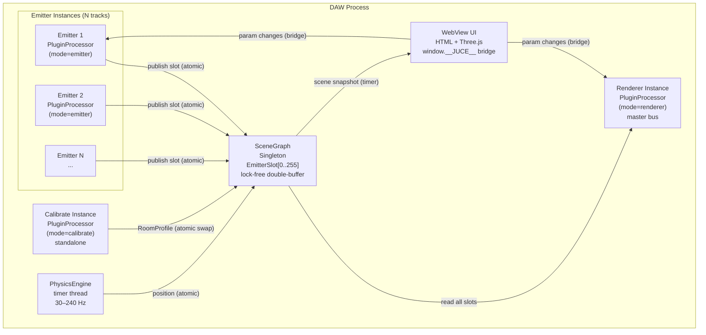
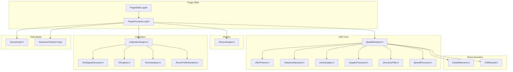
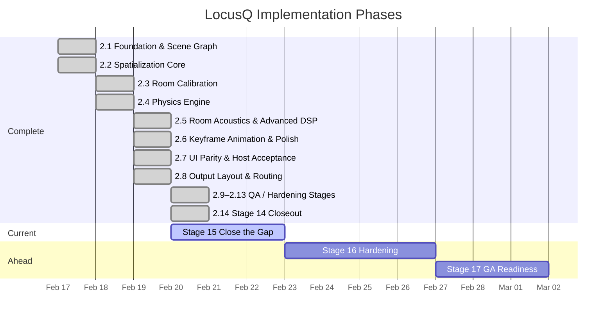

Title: LocusQ Full Project Review
Document Type: Review Report
Author: APC Codex
Created Date: 2026-02-20
Last Modified Date: 2026-02-20

# LocusQ Full Project Review

> This document covers the complete LocusQ project as of 2026-02-20. It is intended to
> be readable by someone learning this space: every technical concept gets a plain-language
> sentence before the detail. Findings include an opinionated disposition. Mega-prompts
> are copy-pasteable into a new Claude Code session.

---

## Section 0 — Research & Ecosystem Landscape
*[Populated in Task 8 from research agent output]*

---

## Section 1 — System Map

### What this section is

Before reading any findings, these four diagrams give you a complete mental model of what
LocusQ is and how its parts relate. Read them top-to-bottom once, then refer back when
a finding references a specific component.

### 1a. High-Level Architecture

> **Plain language:** LocusQ is one plugin binary that can run in three roles. Multiple
> "Emitter" instances send spatial position data to a central "scene" that one "Renderer"
> instance reads to produce quad spatial output. A "Calibrate" instance measures the room.

### 1b. Data Flow & Thread Model

> **Plain language:** Audio plugins have strict real-time rules — the audio thread cannot
> wait for anything. LocusQ uses lock-free data structures to let the physics timer thread
> and the audio thread share data without ever blocking each other.

```mermaid
graph LR
    subgraph AudioThread["Audio Thread (real-time, no blocking)"]
        AT["processBlock()\n• read APVTS params\n• read SceneGraph slots\n• render/spatialize\n• write position"]
    end
    subgraph PhysicsThread["Physics Timer Thread (30–240 Hz)"]
        PT["tick()\n• integrate forces\n• collision detect\n• write position"]
    end
    subgraph UIThread["UI Timer Thread (30–60 fps)"]
        UT["timerCallback()\n• serialize scene to JSON\n• evaluateJavascript"]
    end
    subgraph RegistrationPath["Registration (rare, startup/shutdown only)"]
        RP["registerEmitter()\nunregisterEmitter()\nSpinLock (acceptable)"]
    end
    SG[("SceneGraph\nEmitterSlot[N]\ndouble-buffer")]
    AT -->|"read: memory_order_acquire"| SG
    PT -->|"write: atomic swap"| SG
    UT -->|"read: memory_order_acquire"| SG
    RP -->|"write: SpinLock"| SG
    style AT fill:#1a3a5c
    style PT fill:#3a1a5c
    style UT fill:#1a5c3a
    style RP fill:#5c3a1a
```

### 1c. Component Dependency Graph

> **Plain language:** Before changing any file, know what else depends on it. This graph
> shows the blast radius of every source file.

### 1d. Implementation Phase Timeline

> **Plain language:** LocusQ was built in staged phases, each adding a new capability.
> This chart shows what's done, what's current, and what's ahead.

---
