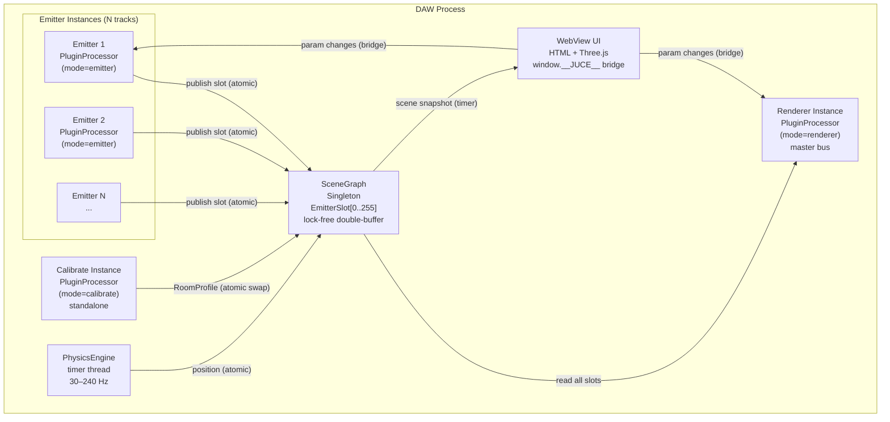
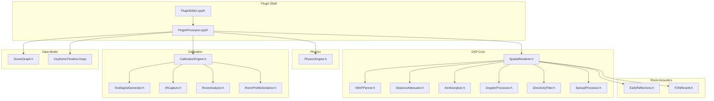
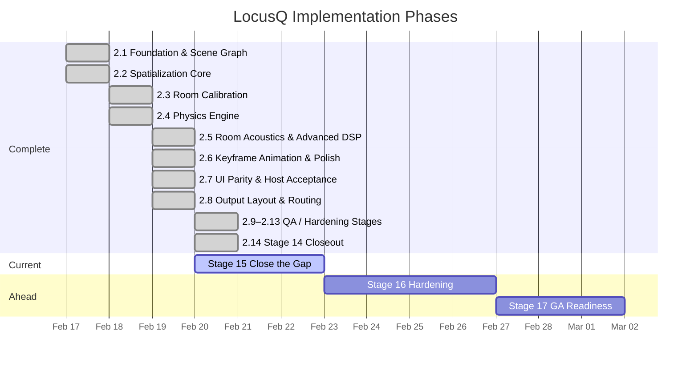

Title: LocusQ Full Project Review
Document Type: Review Report
Author: APC Codex
Created Date: 2026-02-20
Last Modified Date: 2026-02-20

# LocusQ Full Project Review

> This document covers the complete LocusQ project as of 2026-02-20. It is intended to
> be readable by someone learning this space: every technical concept gets a plain-language
> sentence before the detail. Findings include an opinionated disposition. Mega-prompts
> are copy-pasteable into a new Claude Code session.

---

## Section 0 — Research & Ecosystem Landscape
*[Populated in Task 8 from research agent output]*

---

## Section 1 — System Map

### What this section is

Before reading any findings, these four diagrams give you a complete mental model of what
LocusQ is and how its parts relate. Read them top-to-bottom once, then refer back when
a finding references a specific component.

### 1a. High-Level Architecture

> **Plain language:** LocusQ is one plugin binary that can run in three roles. Multiple
> "Emitter" instances send spatial position data to a central "scene" that one "Renderer"
> instance reads to produce quad spatial output. A "Calibrate" instance measures the room.

### 1b. Data Flow & Thread Model

> **Plain language:** Audio plugins have strict real-time rules — the audio thread cannot
> wait for anything. LocusQ uses lock-free data structures to let the physics timer thread
> and the audio thread share data without ever blocking each other.

```mermaid
graph LR
    subgraph AudioThread["Audio Thread (real-time, no blocking)"]
        AT["processBlock()\n• read APVTS params\n• read SceneGraph slots\n• render/spatialize\n• write position"]
    end
    subgraph PhysicsThread["Physics Timer Thread (30–240 Hz)"]
        PT["tick()\n• integrate forces\n• collision detect\n• write position"]
    end
    subgraph UIThread["UI Timer Thread (30–60 fps)"]
        UT["timerCallback()\n• serialize scene to JSON\n• evaluateJavascript"]
    end
    subgraph RegistrationPath["Registration (rare, startup/shutdown only)"]
        RP["registerEmitter()\nunregisterEmitter()\nSpinLock (acceptable)"]
    end
    SG[("SceneGraph\nEmitterSlot[N]\ndouble-buffer")]
    AT -->|"read: memory_order_acquire"| SG
    PT -->|"write: atomic swap"| SG
    UT -->|"read: memory_order_acquire"| SG
    RP -->|"write: SpinLock"| SG
    style AT fill:#1a3a5c
    style PT fill:#3a1a5c
    style UT fill:#1a5c3a
    style RP fill:#5c3a1a
```

### 1c. Component Dependency Graph

> **Plain language:** Before changing any file, know what else depends on it. This graph
> shows the blast radius of every source file.

### 1d. Implementation Phase Timeline

> **Plain language:** LocusQ was built in staged phases, each adding a new capability.
> This chart shows what's done, what's current, and what's ahead.

---

## Section 2 — Domain Reviews

### 2a. Architecture Review

**Current state:** LocusQ's architecture centers on a process-wide `SceneGraph` singleton
with lock-free double-buffered `EmitterSlot[0..255]`, a physics timer thread (30–240 Hz),
and a single `SpatialRenderer` consuming all emitter state per audio block. The design
is aligned to ADR-0002 (single-process routing with ephemeral audio fast-path) and ADR-0003
(deterministic authority precedence: DAW/APVTS > timeline > physics). The inter-instance
communication model is novel for JUCE plugins and well-suited to the quad-panner use case.

**Verdict:** Sound. One low-severity design note. Two items explicitly acceptable.

#### Findings

| ID | Severity | Finding | Disposition |
|----|----------|---------|-------------|
| A-01 | Low | SceneGraph `std::shared_ptr<RoomProfile>` uses `std::atomic_store`/`load` (deprecated C++20) | acceptable |
| A-02 | Info | `rendererRegistered` is plain `bool` protected by SpinLock, not atomic | acceptable |
| A-03 | Info | `computeEmitterInteractionForce` reads other emitters' position with 1-frame lag | acceptable |

#### A-01: `std::atomic_store` on `shared_ptr` is deprecated in C++20

> **What this means:** The way LocusQ swaps room calibration data between threads uses a
> C++ pattern that still works but is officially deprecated. The replacement (`std::atomic<shared_ptr>`)
> requires C++20, which JUCE 8 does not mandate.

`SceneGraph.h:191-198` uses `std::atomic_store(&currentRoomProfile, newProfile)`. This is correct
and safe but will generate compiler warnings under `-std=c++20`. Since JUCE 8 targets C++17,
this is acceptable today. When JUCE moves to C++20, migrate to `std::atomic<std::shared_ptr<RoomProfile>>`.

**Recommendation:** No action for v1. Add to post-v1 tech debt list.

#### A-02: `rendererRegistered` bool under SpinLock

> **What this means:** The flag tracking whether a renderer exists is a normal boolean, not
> an atomic one, but it's always accessed under a SpinLock so this is safe.

`SceneGraph.h:264` — `bool rendererRegistered = false` is only read/written inside
`registrationLock` scope. The unlocked `isRendererRegistered()` at line 178 is a read-only
fast path that tolerates staleness (renderer registration is rare and stable).

**Recommendation:** Acceptable as-is. No change needed.

#### A-03: Interaction force reads with 1-frame temporal lag

> **What this means:** When computing forces between emitters, each emitter sees the others'
> positions from the previous audio callback. This is intentional — it avoids needing
> synchronized reads across multiple slots.

`PluginProcessor.cpp:150-152` — documented in-code with explicit rationale. The 1-frame lag
at 44.1kHz/512 samples is ~11.6ms, well within perceptual tolerance for spatial interaction.

**Recommendation:** Acceptable. Already documented in source.

---

### 2b. Code Review

**Current state:** The codebase is 22 source files (19 headers, 3 .cpp). `processBlock`
is RT-safe: no heap allocations, no locks, all parameter reads via `getRawParameterValue()->load()`.
Serialization and UI bridge code correctly use heap allocation outside the audio thread.
The Stage 14 medium finding on `emit_dir_azimuth`/`emit_dir_elevation` is now resolved —
relay, attachment, and UI are fully wired. `phys_vel_x/y/z` remain unwired.

**Verdict:** Clean RT path. One medium finding (phys_vel UI gap). One resolved finding confirmed.

#### Findings

| ID | Severity | Finding | Disposition |
|----|----------|---------|-------------|
| C-01 | Medium | `phys_vel_x`, `phys_vel_y`, `phys_vel_z` have no relay/attachment/UI | fix now (Stage 15-B) |
| C-02 | Resolved | `emit_dir_azimuth`, `emit_dir_elevation` now fully wired | closed |
| C-03 | Info | `new juce::DynamicObject()` in serialization paths (lines 965–1680) | acceptable |
| C-04 | Info | Parameter creation uses `std::vector<unique_ptr>::push_back` (line 1859+) | acceptable |

#### C-01: `phys_vel_x/y/z` — DSP-backed but UI-invisible

> **What this means:** The initial velocity parameters (how fast and in which direction an
> emitter is "thrown") exist in the DSP engine but cannot be seen or edited in the production
> UI. Users must use DAW automation to change them.

Evidence:
- APVTS definition: `PluginProcessor.cpp` lines ~2046-2065
- DSP read: `PluginProcessor.cpp` lines ~698-700
- `PluginEditor.h`: no `physVelXRelay` / `physVelYRelay` / `physVelZRelay`
- `index.js`: no `phys_vel_x` in sliderStates
- `index.html`: no `val-vel-x` control rows

**Recommendation:** Wire in Stage 15-B. Follow the `phys_friction` relay/attachment/UI pattern.

#### C-02: `emit_dir_azimuth` + `emit_dir_elevation` — now resolved

> **What this means:** The directivity aim parameters are now fully exposed in the production UI.

Evidence:
- Relay: `PluginEditor.h:75-76` (`dirAzimuthRelay`, `dirElevationRelay`)
- Attachment: `PluginEditor.cpp:343-346`
- UI sliderStates: `index.js:261-262`
- UI bindValueStepper: `index.js:1663-1665`
- UI valueChangedEvent: `index.js:2004-2010`
- HTML controls: `index.html:568-569`

**Recommendation:** Closed. Stage 14 medium finding is fully resolved.

#### C-03: Heap allocation in serialization paths

> **What this means:** The scene-to-JSON serialization code allocates memory on the heap,
> but this code runs on the UI timer thread, not the audio thread, so it's safe.

`new juce::DynamicObject()` at lines 965, 1031, 1080, 1092, 1099, etc. — all inside
`getSceneStateJSON()`, `serializeTimeline()`, or WebView command handlers. These run in
`timerCallback()` or message thread context. No RT violation.

**Recommendation:** Acceptable. No change needed.

#### C-04: Parameter tree construction uses `push_back`

> **What this means:** The parameter list is built with vector push_back during plugin
> construction (once at startup), not during audio processing.

`createParameterLayout()` at line 1859+ — runs once during `AudioProcessor` construction.
Not an RT path.

**Recommendation:** Acceptable. No change needed.

---

### 2c. Design Review

**Current state:** The production UI (`index.js` + `index.html`) exposes all emitter-mode
parameters that have relays, including the newly wired directivity aim controls. The UI
resilience contract (BOOT_START -> RUNNING) is implemented. The Three.js viewport is a
placeholder — the spec in `.ideas/architecture.md` Section 7 describes room wireframe,
speaker positions, emitter objects, motion trails, velocity vectors, and interactive drag/rotate,
but the production UI implements only the control panel, not the full viewport.

**Verdict:** Control panel is complete. Viewport is placeholder. One medium finding.

#### Findings

| ID | Severity | Finding | Disposition |
|----|----------|---------|-------------|
| D-01 | Medium | Three.js viewport not implemented — only control panel UI exists | explicit defer (post-v1) |
| D-02 | Low | `phys_vel_x/y/z` not in production UI | fix now (Stage 15-B) |
| D-03 | Info | Keyframe editor UI not implemented | explicit defer (post-v1) |

#### D-01: Three.js 3D viewport is placeholder

> **What this means:** The architecture spec describes a full 3D viewport with room wireframe,
> speaker cones, draggable emitter objects, motion trails, and orbit controls. The production
> UI has the control panel and parameter bindings but not the 3D visualization.

This is a large feature (~500-1000 LOC of Three.js) that is not blocking v1 functionality.
All spatial parameters are editable via the control panel. The viewport adds visual feedback
but is not required for audio correctness.

**Recommendation:** Explicit defer to post-v1. Record in ADR-0008 (Stage 16-D).

> **See Section 0e:** Three.js spatial audio visualization patterns may inform viewport scope.

#### D-02: Initial velocity controls missing from UI

> **What this means:** Users cannot see or adjust the throw velocity from the plugin UI.

Same as C-01. Fixed in Stage 15-B.

#### D-03: Keyframe timeline editor not in production UI

> **What this means:** The keyframe animation system works via internal presets and DAW
> automation, but there is no visual timeline editor in the production UI.

Like D-01, this is a significant UI feature that is not blocking v1 audio functionality.
Default keyframe presets are loaded automatically.

**Recommendation:** Explicit defer to post-v1.

---

### 2d. QA Review

**Current state:** 43 scenario files covering DSP components, output layouts, snapshot
migration, physics, RT safety, and CPU budget. Automated lanes are green. Manual DAW
acceptance (DEV-01..DEV-06) remains unexecuted.

**Verdict:** Strong automated coverage. Four component gaps. Manual acceptance still open.

#### Coverage Matrix

| Component | Scenario File(s) | Gap? |
|-----------|-----------------|------|
| VBAPPanner | locusq_renderer_spatial_output.json | — |
| DistanceAttenuator | locusq_renderer_distance_attenuation.json | — |
| AirAbsorption | (covered indirectly by quality/distance scenarios) | **gap: no dedicated scenario** |
| FDNReverb | locusq_25_room_size_small/large.json | partial |
| DopplerProcessor | locusq_25_doppler_motion.json | — |
| DirectivityFilter | locusq_25_directivity_focus.json | — |
| SpreadProcessor | locusq_25_spread_diffuse.json | — |
| PhysicsEngine | locusq_24_physics_spatial_motion/zero_g_drift.json | — |
| computeEmitterInteractionForce | locusq_multi_emitter_interaction.json | — |
| CalibrationEngine | (no scenario) | **gap** |
| KeyframeTimeline | locusq_26_animation_internal_smoke.json | — |
| emit_dir DSP path | (no dedicated scenario) | **gap** |
| Output layouts | locusq_phase_2_8_output_layout_*.json (mono/stereo/quad) | — |
| Snapshot migration | locusq_phase_2_11*.json (5 scenarios) | — |
| RT safety | locusq_rt_safety_emitter.json | — |

#### Findings

| ID | Severity | Finding | Disposition |
|----|----------|---------|-------------|
| Q-01 | Medium | DEV-01..DEV-06 manual DAW acceptance unexecuted | fix now (Stage 15-D) |
| Q-02 | Low | No dedicated AirAbsorption scenario | fix next (Stage 16-A) |
| Q-03 | Low | No CalibrationEngine scenario | fix next (Stage 16-A) |
| Q-04 | Low | No emit_dir DSP effect scenario | fix next (Stage 16-E) |

#### Q-01: Manual DAW acceptance rows still open

> **What this means:** Six checks that require a human to plug in headphones, play audio,
> and verify output have not been run. These are the portable-device profile gates from
> ADR-0006.

**Recommendation:** Execute in Stage 15-D. Blocks draft-pre-release promotion.

#### Q-02: AirAbsorption lacks dedicated scenario

> **What this means:** Air absorption (high-frequency rolloff with distance) is tested
> indirectly by other scenarios but has no scenario that specifically validates the filter
> cutoff vs distance relationship.

**Recommendation:** Author scenario in Stage 16-A.

#### Q-03: CalibrationEngine has no automated scenario

> **What this means:** The room measurement system has no automated test scenario. It was
> validated manually during Phase 2.3 but has no regression coverage.

**Recommendation:** Author scenario in Stage 16-A.

#### Q-04: Directivity aim effect has no dedicated scenario

> **What this means:** The directivity aim parameters now have UI exposure (C-02 resolved)
> but no scenario verifying the DSP effect of aim direction on spatial output.

**Recommendation:** Author `locusq_directivity_aim.json` in Stage 16-E.

---

## Section 3 — Model Assignment Rationale

> **What this means:** Different Claude models have different strengths and costs. Choosing
> the right model per task saves time and money without sacrificing quality. These rules
> are calibrated for LocusQ's specific task mix.

### Decision Rule (Plain Language)

Start with **Sonnet 4.6**. Upgrade to **Opus 4.6** if the task:
- touches an ADR or invariants.md
- crosses 3+ files with causal dependencies
- requires a judgment call that affects system design
- synthesises research from many external sources

Downgrade to **Haiku 4.5** if the task:
- touches one file
- has a clear template to follow
- success is binary (it either compiles / passes / matches a pattern, or it doesn't)
- is high-volume and repetitive

### Assignment Table

| Task Type | Model | Reasoning |
|-----------|-------|-----------|
| Architecture decisions, ADR authoring | Opus 4.6 | Multi-file causal reasoning; wrong call is expensive |
| Cross-cutting design (invariant changes) | Opus 4.6 | Must hold entire constraint graph in context |
| Research synthesis (Section 0) | Opus 4.6 | Heterogeneous sources; needs judgment on relevance |
| DSP implementation (C++) | Sonnet 4.6 | Clear spec; best cost/quality ratio |
| UI wiring (JS + HTML + C++ relay) | Sonnet 4.6 | Follows a template; needs to see 4 files at once |
| Code review fixes (bounded scope) | Sonnet 4.6 | Single finding -> single fix |
| QA scenario JSON authoring | Haiku 4.5 | Template-driven; parameters are known |
| Doc metadata fixes | Haiku 4.5 | Pattern match; binary correctness |
| Constant/comment additions | Haiku 4.5 | Single file; deterministic |
| Phase closeout validation | Haiku 4.5 | Run scripts; check output |
| Build scripts, grep sweeps | Haiku 4.5 | No reasoning depth needed |

### Cost Intuition

Running Opus when Haiku suffices costs ~20x more per token. For LocusQ's Stage 15-17
work, roughly 60% of tasks are Haiku-appropriate. Defaulting everything to Opus would
be both wasteful and unnecessary — the quality ceiling is determined by spec clarity,
not model tier, for well-scoped tasks.

---
