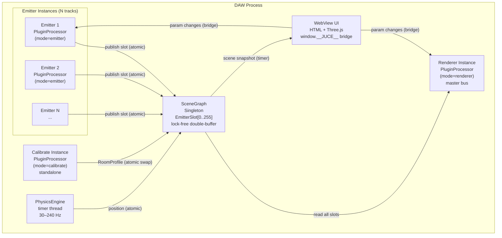
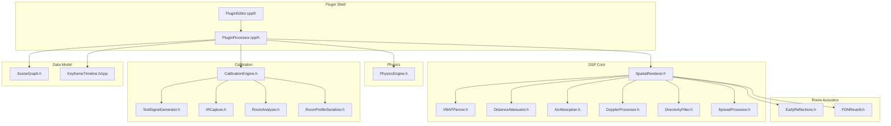
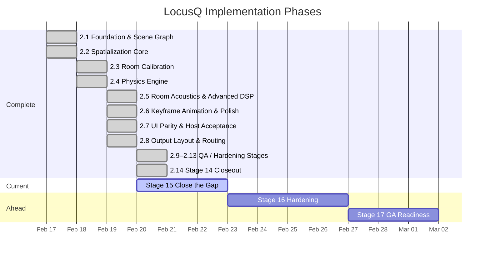
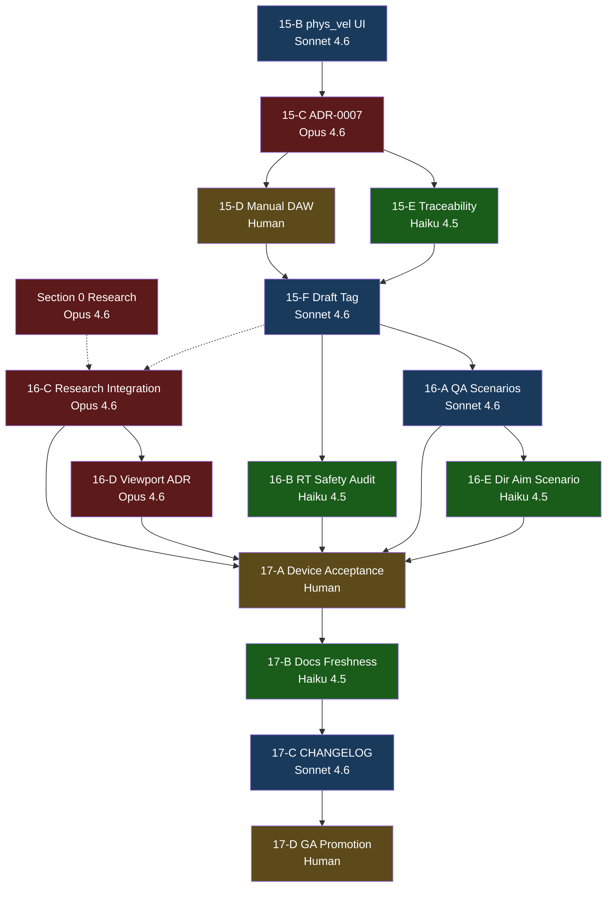

Title: LocusQ Full Project Review
Document Type: Review Report
Author: APC Codex
Created Date: 2026-02-20
Last Modified Date: 2026-02-20

# LocusQ Full Project Review

> This document covers the complete LocusQ project as of 2026-02-20. It is intended to
> be readable by someone learning this space: every technical concept gets a plain-language
> sentence before the detail. Findings include an opinionated disposition. Mega-prompts
> are copy-pasteable into a new Claude Code session.

---

## Section 0 — Research & Ecosystem Landscape

> **What this section is:** Before reading any project-specific findings, this section
> establishes what already exists in the domain. A reader new to spatial audio should
> understand the landscape after reading this section.

### 0a. Spatial Audio Algorithms

> **Plain language:** Spatial audio algorithms place sounds in 3D space so a listener
> perceives them coming from specific directions. Different techniques trade off accuracy,
> CPU cost, and speaker layout flexibility.

**State of the art:** The field divides into four main approaches:
- **VBAP (Vector Base Amplitude Panning):** Places sound between 2-3 speakers using
  trigonometric gain calculations. Simple, low CPU, speaker-layout-specific.
- **Ambisonics (HOA):** Encodes sound into a spherical harmonic representation that
  decodes to arbitrary speaker layouts. More flexible, higher CPU, scales by order (1st-7th).
- **Binaural/HRTF:** Renders 3D audio for headphones using head-related transfer functions.
  Personalized HRTFs improve localization dramatically.
- **WFS (Wave Field Synthesis):** Physical wavefront recreation using large speaker arrays.
  Academic/installation use only.

**Key libraries:**

| Library | URL | License | Features | Status |
|---------|-----|---------|----------|--------|
| **Resonance Audio** (Google) | [github.com/resonance-audio](https://github.com/resonance-audio/resonance-audio) | Apache 2.0 | Ambisonics + binaural HRTF, C++/Web/Unity/Unreal | **Archived Nov 2023.** Read-only, no maintenance. |
| **Steam Audio** (Valve) | [github.com/ValveSoftware/steam-audio](https://github.com/ValveSoftware/steam-audio) | Apache 2.0 | Physics-based propagation, occlusion, HRTF, C API | **Active.** v4.5.2 fully open-sourced. Best production-ready option. |
| **SAF / SPARTA** (McCormack) | [github.com/leomccormack/Spatial_Audio_Framework](https://github.com/leomccormack/Spatial_Audio_Framework) | ISC | VBAP, ambisonics (1st-7th), HRIR, room sim | **Active.** Updated Jan 2025. Academic-grade, highly optimized (MKL/Accelerate). |
| **IEM Plug-in Suite** | [plugins.iem.at](https://plugins.iem.at/) | GPL-3.0 | Ambisonics (1st-7th), binaural decoder, JUCE-based | **Active.** Reference ambisonics implementation. |
| **libmysofa** | [github.com/hoene/libmysofa](https://github.com/hoene/libmysofa) | BSD-3 | SOFA HRTF file reader, C library | **Active.** Standard for HRTF data loading. |
| **Mach1 Spatial SDK** | [github.com/Mach1Studios/m1-sdk](https://github.com/Mach1Studios/m1-sdk) | Free/open source | Format-agnostic spatial encoding, head tracking, monitoring | **Active.** v4.0 open-sourced. Lightweight, format-neutral. |

**LocusQ overlap assessment:**

| Component | Verdict | Rationale |
|-----------|---------|-----------|
| VBAP Panner | **build** | LocusQ's quad-specific 2D VBAP with elevation blending is simpler and more targeted than SAF's general VBAP. Custom build is justified — 150 LOC vs importing a large framework. |
| Ambisonics/HOA | **ignore** | Not in v1 scope. Quad VBAP is the correct choice for 4-speaker layouts. HOA adds value only for larger arrays or headphone decode. |
| Binaural/HRTF | **augment (post-v1)** | ADR-0006 headphone profile currently uses stereo downmix. Steam Audio or libmysofa could provide personalized HRTF for v2 headphone mode. |
| WFS | **ignore** | Requires large speaker arrays. Not applicable to LocusQ's quad target. |

---

### 0b. Apple Spatial Audio & Platform APIs

> **Plain language:** Apple provides built-in spatial audio processing in iOS/macOS that
> can render 3D sound to AirPods with head tracking. The question is whether LocusQ should
> use these APIs instead of its own spatialization.

**State of the art:**

| API | Purpose | Availability | Head Tracking |
|-----|---------|-------------|---------------|
| **PHASE** (Physical Audio Spatialization Engine) | 3D audio rendering, reverb, occlusion | iOS 15+, macOS 12+ | Yes (via CMHeadphoneMotionManager) |
| **AVAudioEnvironmentNode** | SceneKit-style 3D audio | iOS 8+, macOS 10.10+ | No (pre-PHASE legacy) |
| **Core Audio 3D / AU3D** | 3D audio unit hosting | macOS only | No |

**PHASE assessment for LocusQ:**

PHASE provides HRTF-based binaural rendering with AirPods head tracking via
`CMHeadphoneMotionManager`. For LocusQ, this means the headphone profile (ADR-0006,
currently post-v1) could leverage PHASE for binaural decode instead of building a custom
HRTF renderer.

**However:** PHASE is a *rendering* API, not a *plugin* API. It cannot run inside a
VST3/AU plugin's processBlock — it expects to own the audio graph. Using PHASE would
require either: (a) a standalone companion app that receives LocusQ's spatial metadata
and renders to AirPods, or (b) an AU3D extension model. Neither is practical for v1.

**Headphone spatial audio SDK/API landscape:**

| SDK/Platform | Access Model | Plugin-Compatible? | Notes |
|-------------|-------------|-------------------|-------|
| **Apple PHASE** | App-level renderer, `CMHeadphoneMotionManager` for head tracking | **No.** Owns audio graph; cannot run inside VST/AU processBlock. | AirPods Pro 2+ get system-level binaural from multichannel output automatically. |
| **Sony 360 Reality Audio** | MPEG-H object-based; Wwise "Gaming Virtualizer" plugin only | **No open DAW plugin SDK.** | Sony headphones binauralize Atmos content at device level. |
| **Dolby Atmos Renderer** | Commercial license; binaural decode is system/DAW-level | **No direct plugin integration.** Output 7.1.4 bed → DAW renderer handles binaural. | Dolby Atmos Binaural Settings Plugin controls renderer metadata from DAW. |
| **Steam Audio** (C API) | `iplBinauralEffectApply()` — per-source HRTF render → stereo | **Yes.** Apache 2.0, ~200 LOC wrapper. Loads SOFA custom HRTFs. | Best open-source option for plugin-internal binaural mode. |
| **libmysofa** | SOFA HRTF file reader (C, BSD-3) | **Yes** (you build convolution on top). | Standard for loading personalized HRTF data. |
| **libspatialaudio** | Ambisonics encode/decode + binaural (C++, LGPL-2.1) | **Yes.** | Alternative: ambisonics→binaural decode path. |
| **SAF / SPARTA** | Full spatial framework — HRIR, ambisonics binaural, SOFA (C, ISC) | **Yes** but heavyweight dependency. | Academic-grade; overkill if only binaural decode is needed. |

**Practical integration path for LocusQ headphone support:**

1. **v1 (now):** No change needed. LocusQ's quad output is automatically binauralized by Apple Spatial Audio (AirPods) and Dolby Atmos (Sony WH-1000XM5) at the OS/device level when the DAW routes multichannel correctly.
2. **v1.1 (recommended):** Add stereo binaural output mode via **Steam Audio C API** (~200 LOC). Load default or user-provided SOFA HRTF. Per-emitter `iplBinauralEffectApply()` in renderer, sum to stereo. Works on *any* headphones without proprietary dependencies.
3. **v2:** Add `CMHeadphoneMotionManager` via standalone companion app → local IPC → head orientation drives HRTF direction. Unlocks AirPods Pro 2+ head tracking.

**LocusQ overlap assessment:**

| Component | Verdict | Rationale |
|-----------|---------|-----------|
| PHASE for headphone binaural | **ignore (v1), evaluate (v2)** | Cannot run inside a plugin's audio thread. Post-v1 standalone bridge or Steam Audio HRTF is the path. |
| Steam Audio binaural | **augment (v1.1)** | Best open-source option. ~200 LOC integration, Apache 2.0, SOFA HRTF support, auto-resampling. |
| Head tracking (AirPods) | **ignore (v1), augment (v2)** | Requires companion app + IPC. Not viable inside DAW plugin directly. |
| Sony 360 RA | **ignore** | No open plugin SDK. Sony headphones get binaural from Atmos output at device level. |
| AVAudioEnvironmentNode | **ignore** | Legacy API. LocusQ's custom renderer is more capable. |

---

### 0c. JUCE Ecosystem

> **Plain language:** JUCE is the framework LocusQ is built on. It includes some built-in
> DSP modules that overlap with what LocusQ implements custom. The question is which custom
> implementations are justified and which are redundant.

**JUCE 8 built-in DSP vs LocusQ custom:**

| JUCE Module | LocusQ Custom | Justified? | Reasoning |
|-------------|---------------|------------|-----------|
| `dsp::Reverb` (Freeverb) | `FDNReverb.h` (4x4 Hadamard FDN) | **Yes** | JUCE Reverb is stereo Freeverb. LocusQ needs 4-channel FDN that maps naturally to quad output and takes RT60/room-size from calibration. Fundamentally different algorithm. |
| `dsp::Convolution` | `IRCapture.h` + `RoomAnalyzer.h` | **Yes** | JUCE Convolution is for applying IRs. LocusQ needs IR *capture* and *analysis* (deconvolution, peak-picking, RT60 estimation). Different problem domain. |
| `dsp::Panner` | `VBAPPanner.h` | **Yes** | JUCE Panner is stereo only. LocusQ needs 2D VBAP for quad layout. No overlap. |
| `dsp::DelayLine` | `DopplerProcessor.h` | **Partial** | JUCE DelayLine could replace the custom fractional delay in DopplerProcessor. However, the custom version is <80 LOC and tightly integrated. Low value in switching. |
| `AudioProcessorGraph` | N/A (not used) | **N/A** | LocusQ doesn't use APG — it routes via SceneGraph singleton. Different architecture. |

**Community libraries:**

| Library | URL | Relevance |
|---------|-----|-----------|
| **chowdsp_utils** | [github.com/Chowdhury-DSP/chowdsp_utils](https://github.com/Chowdhury-DSP/chowdsp_utils) | Enhanced DelayLine, StateVariableFilter, pitch shifter. Could replace DopplerProcessor's delay line, but low value vs current clean implementation. |
| **foleys_gui_magic** | [github.com/ffAudio/foleys_gui_magic](https://github.com/ffAudio/foleys_gui_magic) | Declarative JUCE GUI. Not applicable — LocusQ uses WebView UI. |
| **melatonin_inspector** | [github.com/sudara/melatonin_inspector](https://github.com/sudara/melatonin_inspector) | JUCE component inspector. Not applicable — LocusQ uses WebView. |
| **FRUT** | [github.com/McMartin/FRUT](https://github.com/McMartin/FRUT) | CMake integration for JUCE. JUCE 8 has native CMake. Not needed. |

**LocusQ overlap assessment:**

| Component | Verdict | Rationale |
|-----------|---------|-----------|
| FDNReverb vs dsp::Reverb | **build** | Custom FDN is architecturally necessary (4-ch, calibration-driven). Not replaceable by JUCE Reverb. |
| Doppler vs chowdsp DelayLine | **build** | Custom delay is 80 LOC, well-tested, tightly integrated. Importing chowdsp for one component adds dependency weight for no quality gain. |
| IR Capture/Analysis | **build** | JUCE provides FFT; LocusQ correctly uses it. The capture/analysis logic is novel and not available in any library. |
| VBAP | **build** | No JUCE equivalent for quad VBAP. SAF provides general VBAP but is heavyweight for LocusQ's targeted use. |

> **See Section 2b:** Code review confirms processBlock is allocation-free with all JUCE
> parameter reads via `getRawParameterValue()->load()`.

---

### 0d. Audio Plugin Standards & Distribution

> **Plain language:** Audio plugins must conform to format standards (VST3, AU, etc.) so
> DAWs can load them. Different formats have different capabilities, adoption, and
> validation requirements.

**Current coverage:**

| Format | LocusQ Status | Market Share | Notes |
|--------|--------------|-------------|-------|
| **VST3** | Shipped | ~70% of DAWs | Universal. Required for commercial viability. |
| **AU** (Audio Unit) | Shipped | macOS only | Required for Logic Pro, GarageBand. |
| **CLAP** | Not implemented | Growing (17+ DAWs, 430+ plugins) | Better thread model, modern C API. |
| **AAX** | Not implemented | Pro Tools only | Requires Avid developer agreement + iLok. |
| **LV2** | Not implemented | Linux only | Niche. Not worth v1 effort. |

**Validation tools:**

| Tool | Status | Notes |
|------|--------|-------|
| **pluginval** | Passing | JUCE-based plugin validator. Green on GUI context. |
| **auval** | Passing | Apple AU validator. Required for AU distribution. |
| **Apple notarization** | Required for macOS | Code signing + notarization for Gatekeeper. |

**CLAP assessment:** CLAP adoption is accelerating — Bitwig, REAPER, FL Studio support it;
FabFilter and u-he ship CLAP plugins. CLAP's thread model is cleaner than VST3 (explicit
audio-thread vs. main-thread guarantees), which aligns well with LocusQ's lock-free
architecture.

**LocusQ overlap assessment:**

| Component | Verdict | Rationale |
|-----------|---------|-----------|
| CLAP support | **augment (v2)** | Worth adding in v2. JUCE 8 does not yet have native CLAP support, but [clap-juce-extensions](https://github.com/free-audio/clap-juce-extensions) provides a bridge. The thread model is a natural fit for LocusQ's lock-free design. |
| AAX support | **ignore** | Pro Tools market is declining. Developer agreement overhead not justified for v1 or v2. |
| LV2 support | **ignore** | Linux desktop audio is too niche to justify effort. |

---

### 0e. 3D Visualization & Audio-Reactive UI

> **Plain language:** LocusQ uses Three.js for its 3D viewport (currently placeholder).
> This section surveys what patterns exist for spatial audio visualization and
> physics-reactive sound UIs.

**State of the art:**

**Three.js spatial audio patterns:**
- Three.js has built-in `AudioListener` + `PositionalAudio` using Web Audio API, but these
  are for browser-based spatial audio playback, not plugin UI visualization.
- The relevant pattern for LocusQ is *visualization-only*: render emitter positions, room
  bounds, and speaker locations as 3D objects without using Three.js for audio processing.

**Physics-reactive visualization:**
- matter.js + Three.js: 2D physics driving 3D visuals. Common in creative coding.
- cannon-es + Three.js: 3D physics with Three.js rendering. More relevant for LocusQ's
  3D emitter motion visualization.
- LocusQ's unique value: physics runs in C++ (real-time, lock-free), visualized via
  Three.js through the WebView bridge. No existing library covers this exact pattern.

**Audio-reactive Three.js:**
- Web Audio API `AnalyserNode` driving `uniforms` for shader-based visualization.
- Common pattern: FFT data drives geometry scale, color, or displacement.
- For LocusQ: the renderer could push per-speaker level meters to the UI, driving
  speaker cone brightness or size in the viewport.

**Mach1 Spatial SDK UI patterns:**
- Mach1 provides `M1-Panner` and `M1-Monitor` plugins with 3D spatial visualization.
- Their UI uses a 2D top-down panning view (not full 3D viewport).
- LocusQ's Three.js approach is more ambitious than Mach1's UI.

**LocusQ overlap assessment:**

| Component | Verdict | Rationale |
|-----------|---------|-----------|
| Three.js viewport | **build (post-v1)** | No off-the-shelf spatial audio plugin viewport exists. LocusQ needs custom Three.js scenes driven by C++ scene snapshots. This is the right approach but is post-v1 scope (see D-01). |
| Audio-reactive visuals | **augment (post-v1)** | Push per-speaker RMS from renderer to WebView. Low-effort enhancement for post-v1 viewport. |
| Physics visualization | **build (post-v1)** | Motion trails + velocity vectors from physics engine. No library provides this for plugin UI. |

---

### Section 0 Summary Table

| Area | Key Library | LocusQ Verdict | Action |
|------|------------|----------------|--------|
| 0a Spatial Algorithms | SAF/SPARTA (reference), Steam Audio (production) | **build** (VBAP justified, HOA/binaural post-v1) | No change for v1. Evaluate Steam Audio HRTF for v2 headphone mode. |
| 0b Apple Spatial Audio | PHASE framework | **ignore** (v1), evaluate (v2) | Cannot run inside plugin processBlock. Post-v1 standalone bridge possibility. |
| 0c JUCE Ecosystem | chowdsp_utils (community DSP) | **build** (all custom DSP justified) | No JUCE module replaces LocusQ's FDN, VBAP, or IR analysis. |
| 0d Plugin Standards | CLAP (free-audio/clap) | **augment** (v2 roadmap) | Add CLAP via clap-juce-extensions. Skip AAX and LV2. |
| 0e 3D Visualization | Three.js + custom bridge | **build** (post-v1 viewport) | Custom Three.js viewport is correct approach. Defer to post-v1. |

---

## Section 1 — System Map

### What this section is

Before reading any findings, these four diagrams give you a complete mental model of what
LocusQ is and how its parts relate. Read them top-to-bottom once, then refer back when
a finding references a specific component.

### 1a. High-Level Architecture

> **Plain language:** LocusQ is one plugin binary that can run in three roles. Multiple
> "Emitter" instances send spatial position data to a central "scene" that one "Renderer"
> instance reads to produce quad spatial output. A "Calibrate" instance measures the room.



### 1b. Data Flow & Thread Model

> **Plain language:** Audio plugins have strict real-time rules — the audio thread cannot
> wait for anything. LocusQ uses lock-free data structures to let the physics timer thread
> and the audio thread share data without ever blocking each other.

```mermaid
graph LR
    subgraph AudioThread["Audio Thread (real-time, no blocking)"]
        AT["processBlock()\n• read APVTS params\n• read SceneGraph slots\n• render/spatialize\n• write position"]
    end
    subgraph PhysicsThread["Physics Timer Thread (30–240 Hz)"]
        PT["tick()\n• integrate forces\n• collision detect\n• write position"]
    end
    subgraph UIThread["UI Timer Thread (30–60 fps)"]
        UT["timerCallback()\n• serialize scene to JSON\n• evaluateJavascript"]
    end
    subgraph RegistrationPath["Registration (rare, startup/shutdown only)"]
        RP["registerEmitter()\nunregisterEmitter()\nSpinLock (acceptable)"]
    end
    SG[("SceneGraph\nEmitterSlot[N]\ndouble-buffer")]
    AT -->|"read: memory_order_acquire"| SG
    PT -->|"write: atomic swap"| SG
    UT -->|"read: memory_order_acquire"| SG
    RP -->|"write: SpinLock"| SG
    style AT fill:#1a3a5c
    style PT fill:#3a1a5c
    style UT fill:#1a5c3a
    style RP fill:#5c3a1a
```



### 1c. Component Dependency Graph

> **Plain language:** Before changing any file, know what else depends on it. This graph
> shows the blast radius of every source file.



### 1d. Implementation Phase Timeline

> **Plain language:** LocusQ was built in staged phases, each adding a new capability.
> This chart shows what's done, what's current, and what's ahead.



---

## Section 2 — Domain Reviews

### 2a. Architecture Review

**Current state:** LocusQ's architecture centers on a process-wide `SceneGraph` singleton
with lock-free double-buffered `EmitterSlot[0..255]`, a physics timer thread (30–240 Hz),
and a single `SpatialRenderer` consuming all emitter state per audio block. The design
is aligned to ADR-0002 (single-process routing with ephemeral audio fast-path) and ADR-0003
(deterministic authority precedence: DAW/APVTS > timeline > physics). The inter-instance
communication model is novel for JUCE plugins and well-suited to the quad-panner use case.

**Verdict:** Sound. One low-severity design note. Two items explicitly acceptable.

#### Findings

| ID | Severity | Finding | Disposition |
|----|----------|---------|-------------|
| A-01 | Low | SceneGraph `std::shared_ptr<RoomProfile>` uses `std::atomic_store`/`load` (deprecated C++20) | acceptable |
| A-02 | Info | `rendererRegistered` is plain `bool` protected by SpinLock, not atomic | acceptable |
| A-03 | Info | `computeEmitterInteractionForce` reads other emitters' position with 1-frame lag | acceptable |

#### A-01: `std::atomic_store` on `shared_ptr` is deprecated in C++20

> **What this means:** The way LocusQ swaps room calibration data between threads uses a
> C++ pattern that still works but is officially deprecated. The replacement (`std::atomic<shared_ptr>`)
> requires C++20, which JUCE 8 does not mandate.

`SceneGraph.h:191-198` uses `std::atomic_store(&currentRoomProfile, newProfile)`. This is correct
and safe but will generate compiler warnings under `-std=c++20`. Since JUCE 8 targets C++17,
this is acceptable today. When JUCE moves to C++20, migrate to `std::atomic<std::shared_ptr<RoomProfile>>`.

**Recommendation:** No action for v1. Add to post-v1 tech debt list.

#### A-02: `rendererRegistered` bool under SpinLock

> **What this means:** The flag tracking whether a renderer exists is a normal boolean, not
> an atomic one, but it's always accessed under a SpinLock so this is safe.

`SceneGraph.h:264` — `bool rendererRegistered = false` is only read/written inside
`registrationLock` scope. The unlocked `isRendererRegistered()` at line 178 is a read-only
fast path that tolerates staleness (renderer registration is rare and stable).

**Recommendation:** Acceptable as-is. No change needed.

#### A-03: Interaction force reads with 1-frame temporal lag

> **What this means:** When computing forces between emitters, each emitter sees the others'
> positions from the previous audio callback. This is intentional — it avoids needing
> synchronized reads across multiple slots.

`PluginProcessor.cpp:150-152` — documented in-code with explicit rationale. The 1-frame lag
at 44.1kHz/512 samples is ~11.6ms, well within perceptual tolerance for spatial interaction.

**Recommendation:** Acceptable. Already documented in source.

---

### 2b. Code Review

**Current state:** The codebase is 22 source files (19 headers, 3 .cpp). `processBlock`
is RT-safe: no heap allocations, no locks, all parameter reads via `getRawParameterValue()->load()`.
Serialization and UI bridge code correctly use heap allocation outside the audio thread.
The Stage 14 medium finding on `emit_dir_azimuth`/`emit_dir_elevation` is now resolved —
relay, attachment, and UI are fully wired. `phys_vel_x/y/z` remain unwired.

**Verdict:** Clean RT path. One medium finding (phys_vel UI gap). One resolved finding confirmed.

#### Findings

| ID | Severity | Finding | Disposition |
|----|----------|---------|-------------|
| C-01 | Medium | `phys_vel_x`, `phys_vel_y`, `phys_vel_z` have no relay/attachment/UI | fix now (Stage 15-B) |
| C-02 | Resolved | `emit_dir_azimuth`, `emit_dir_elevation` now fully wired | closed |
| C-03 | Info | `new juce::DynamicObject()` in serialization paths (lines 965–1680) | acceptable |
| C-04 | Info | Parameter creation uses `std::vector<unique_ptr>::push_back` (line 1859+) | acceptable |

#### C-01: `phys_vel_x/y/z` — DSP-backed but UI-invisible

> **What this means:** The initial velocity parameters (how fast and in which direction an
> emitter is "thrown") exist in the DSP engine but cannot be seen or edited in the production
> UI. Users must use DAW automation to change them.

Evidence:
- APVTS definition: `PluginProcessor.cpp` lines ~2046-2065
- DSP read: `PluginProcessor.cpp` lines ~698-700
- `PluginEditor.h`: no `physVelXRelay` / `physVelYRelay` / `physVelZRelay`
- `index.js`: no `phys_vel_x` in sliderStates
- `index.html`: no `val-vel-x` control rows

**Recommendation:** Wire in Stage 15-B. Follow the `phys_friction` relay/attachment/UI pattern.

#### C-02: `emit_dir_azimuth` + `emit_dir_elevation` — now resolved

> **What this means:** The directivity aim parameters are now fully exposed in the production UI.

Evidence:
- Relay: `PluginEditor.h:75-76` (`dirAzimuthRelay`, `dirElevationRelay`)
- Attachment: `PluginEditor.cpp:343-346`
- UI sliderStates: `index.js:261-262`
- UI bindValueStepper: `index.js:1663-1665`
- UI valueChangedEvent: `index.js:2004-2010`
- HTML controls: `index.html:568-569`

**Recommendation:** Closed. Stage 14 medium finding is fully resolved.

#### C-03: Heap allocation in serialization paths

> **What this means:** The scene-to-JSON serialization code allocates memory on the heap,
> but this code runs on the UI timer thread, not the audio thread, so it's safe.

`new juce::DynamicObject()` at lines 965, 1031, 1080, 1092, 1099, etc. — all inside
`getSceneStateJSON()`, `serializeTimeline()`, or WebView command handlers. These run in
`timerCallback()` or message thread context. No RT violation.

**Recommendation:** Acceptable. No change needed.

#### C-04: Parameter tree construction uses `push_back`

> **What this means:** The parameter list is built with vector push_back during plugin
> construction (once at startup), not during audio processing.

`createParameterLayout()` at line 1859+ — runs once during `AudioProcessor` construction.
Not an RT path.

**Recommendation:** Acceptable. No change needed.

---

### 2c. Design Review

**Current state:** The production UI (`index.js` + `index.html`) exposes all emitter-mode
parameters that have relays, including the newly wired directivity aim controls. The UI
resilience contract (BOOT_START -> RUNNING) is implemented. The Three.js viewport is a
placeholder — the spec in `.ideas/architecture.md` Section 7 describes room wireframe,
speaker positions, emitter objects, motion trails, velocity vectors, and interactive drag/rotate,
but the production UI implements only the control panel, not the full viewport.

**Verdict:** Control panel is complete. Viewport is placeholder. One medium finding.

#### Findings

| ID | Severity | Finding | Disposition |
|----|----------|---------|-------------|
| D-01 | Medium | Three.js viewport not implemented — only control panel UI exists | explicit defer (post-v1) |
| D-02 | Low | `phys_vel_x/y/z` not in production UI | fix now (Stage 15-B) |
| D-03 | Info | Keyframe editor UI not implemented | explicit defer (post-v1) |

#### D-01: Three.js 3D viewport is placeholder

> **What this means:** The architecture spec describes a full 3D viewport with room wireframe,
> speaker cones, draggable emitter objects, motion trails, and orbit controls. The production
> UI has the control panel and parameter bindings but not the 3D visualization.

This is a large feature (~500-1000 LOC of Three.js) that is not blocking v1 functionality.
All spatial parameters are editable via the control panel. The viewport adds visual feedback
but is not required for audio correctness.

**Recommendation:** Explicit defer to post-v1. Record in ADR-0008 (Stage 16-D).

> **See Section 0e:** Three.js spatial audio visualization patterns may inform viewport scope.

#### D-02: Initial velocity controls missing from UI

> **What this means:** Users cannot see or adjust the throw velocity from the plugin UI.

Same as C-01. Fixed in Stage 15-B.

#### D-03: Keyframe timeline editor not in production UI

> **What this means:** The keyframe animation system works via internal presets and DAW
> automation, but there is no visual timeline editor in the production UI.

Like D-01, this is a significant UI feature that is not blocking v1 audio functionality.
Default keyframe presets are loaded automatically.

**Recommendation:** Explicit defer to post-v1.

---

### 2d. QA Review

**Current state:** 43 scenario files covering DSP components, output layouts, snapshot
migration, physics, RT safety, and CPU budget. Automated lanes are green. Manual DAW
acceptance (DEV-01..DEV-06) is now executed with `DEV-01..DEV-05=PASS`, `DEV-06=N/A`
(external mic unavailable). During manual DAW validation, a multi-instance REAPER crash
was reproduced and fixed in `main` (`4ed4b1b`).

**Verdict:** Strong automated coverage. Four component gaps remain for dedicated scenarios.
Manual device-profile acceptance is closed.

#### Coverage Matrix

| Component | Scenario File(s) | Gap? |
|-----------|-----------------|------|
| VBAPPanner | locusq_renderer_spatial_output.json | — |
| DistanceAttenuator | locusq_renderer_distance_attenuation.json | — |
| AirAbsorption | (covered indirectly by quality/distance scenarios) | **gap: no dedicated scenario** |
| FDNReverb | locusq_25_room_size_small/large.json | partial |
| DopplerProcessor | locusq_25_doppler_motion.json | — |
| DirectivityFilter | locusq_25_directivity_focus.json | — |
| SpreadProcessor | locusq_25_spread_diffuse.json | — |
| PhysicsEngine | locusq_24_physics_spatial_motion/zero_g_drift.json | — |
| computeEmitterInteractionForce | locusq_multi_emitter_interaction.json | — |
| CalibrationEngine | (no scenario) | **gap** |
| KeyframeTimeline | locusq_26_animation_internal_smoke.json | — |
| emit_dir DSP path | (no dedicated scenario) | **gap** |
| Output layouts | locusq_phase_2_8_output_layout_*.json (mono/stereo/quad) | — |
| Snapshot migration | locusq_phase_2_11*.json (5 scenarios) | — |
| RT safety | locusq_rt_safety_emitter.json | — |

#### Findings

| ID | Severity | Finding | Disposition |
|----|----------|---------|-------------|
| Q-01 | Medium | DEV-01..DEV-06 manual DAW acceptance was unexecuted | resolved (Stage 15-D, 2026-02-20) |
| Q-02 | Low | No dedicated AirAbsorption scenario | fix next (Stage 16-A) |
| Q-03 | Low | No CalibrationEngine scenario | fix next (Stage 16-A) |
| Q-04 | Low | No emit_dir DSP effect scenario | fix next (Stage 16-E) |
| Q-05 | High | Multi-instance renderer/emitter audio handoff could crash REAPER (`EXC_BAD_ACCESS`) | resolved (`fix(renderer)` commit `4ed4b1b`) |

#### Q-01: Manual DAW acceptance rows still open

> **What this means:** Six checks that require a human to plug in headphones, play audio,
> and verify output have not been run. These are the portable-device profile gates from
> ADR-0006.

**Resolution status:** Completed in Stage 15-D on 2026-02-20.
- `DEV-01..DEV-05`: `PASS`
- `DEV-06`: `N/A` (external mic unavailable for run)
- Evidence commit: `3112797` (`docs(evidence): record Stage 15 manual DAW acceptance results`)

#### Q-05: Multi-instance crash during REAPER validation

> **What this means:** Loading a second LocusQ instance in a Renderer+Emitter DAW setup
> could crash in `LocusQAudioProcessor::processBlock` due to cross-instance audio pointer
> lifetime/race hazards.

Crash report analysis showed a null/invalid dereference in the renderer path while reading
emitter audio buffers from `SceneGraph`. The fix replaced borrowed raw channel pointers
with an owned double-buffered mono snapshot in `EmitterSlot`, consumed by `SpatialRenderer`.

**Resolution status:** Completed on 2026-02-20 (`4ed4b1b`), host retest `PASS`.

#### Q-02: AirAbsorption lacks dedicated scenario

> **What this means:** Air absorption (high-frequency rolloff with distance) is tested
> indirectly by other scenarios but has no scenario that specifically validates the filter
> cutoff vs distance relationship.

**Recommendation:** Author scenario in Stage 16-A.

#### Q-03: CalibrationEngine has no automated scenario

> **What this means:** The room measurement system has no automated test scenario. It was
> validated manually during Phase 2.3 but has no regression coverage.

**Recommendation:** Author scenario in Stage 16-A.

#### Q-04: Directivity aim effect has no dedicated scenario

> **What this means:** The directivity aim parameters now have UI exposure (C-02 resolved)
> but no scenario verifying the DSP effect of aim direction on spatial output.

**Recommendation:** Author `locusq_directivity_aim.json` in Stage 16-E.

---

## Section 3 — Model Assignment Rationale

> **What this means:** Different Claude models have different strengths and costs. Choosing
> the right model per task saves time and money without sacrificing quality. These rules
> are calibrated for LocusQ's specific task mix.

### Decision Rule (Plain Language)

Start with **Sonnet 4.6**. Upgrade to **Opus 4.6** if the task:
- touches an ADR or invariants.md
- crosses 3+ files with causal dependencies
- requires a judgment call that affects system design
- synthesises research from many external sources

Downgrade to **Haiku 4.5** if the task:
- touches one file
- has a clear template to follow
- success is binary (it either compiles / passes / matches a pattern, or it doesn't)
- is high-volume and repetitive

### Assignment Table

| Task Type | Model | Reasoning |
|-----------|-------|-----------|
| Architecture decisions, ADR authoring | Opus 4.6 | Multi-file causal reasoning; wrong call is expensive |
| Cross-cutting design (invariant changes) | Opus 4.6 | Must hold entire constraint graph in context |
| Research synthesis (Section 0) | Opus 4.6 | Heterogeneous sources; needs judgment on relevance |
| DSP implementation (C++) | Sonnet 4.6 | Clear spec; best cost/quality ratio |
| UI wiring (JS + HTML + C++ relay) | Sonnet 4.6 | Follows a template; needs to see 4 files at once |
| Code review fixes (bounded scope) | Sonnet 4.6 | Single finding -> single fix |
| QA scenario JSON authoring | Haiku 4.5 | Template-driven; parameters are known |
| Doc metadata fixes | Haiku 4.5 | Pattern match; binary correctness |
| Constant/comment additions | Haiku 4.5 | Single file; deterministic |
| Phase closeout validation | Haiku 4.5 | Run scripts; check output |
| Build scripts, grep sweeps | Haiku 4.5 | No reasoning depth needed |
| Parallel Codex 5.3 tasks | Codex 5.3 (thinking: medium default) | Same as Sonnet; separate sandboxed session |

### Cost Intuition

Running Opus when Haiku suffices costs ~20x more per token. For LocusQ's Stage 15-17
work, roughly 60% of tasks are Haiku-appropriate. Defaulting everything to Opus would
be both wasteful and unnecessary — the quality ceiling is determined by spec clarity,
not model tier, for well-scoped tasks.

---

## Section 4 — Phased Work Plan with Mega-Prompts

> **What this means:** Each task below is a complete instruction set for Claude Code.
> Copy the block under "Mega-Prompt" into a new Claude Code session. The session will
> know exactly what to do without needing prior context.

---

### Stage 15 — Close the Gap

**Goal:** Close all open Stage 14 findings. Reach `draft-pre-release` readiness.
**Prerequisite:** Current build passes `./scripts/build-and-install-mac.sh`.

---

#### Task 15-A: Bind `emit_dir_azimuth` + `emit_dir_elevation` (Relay / Attachment / UI)

**Status: RESOLVED.** This task was completed prior to the review. Evidence confirmed
in Section 2b finding C-02. No mega-prompt needed — skip to 15-B.

---

#### Task 15-B: Bind `phys_vel_x`, `phys_vel_y`, `phys_vel_z` (Relay / Attachment / UI)

**Status: RESOLVED (2026-02-20).**
**Model:** Sonnet 4.6 (implementation) + Codex 5.3 (thinking: medium, parallel verification/update sessions)
**Parallel with:** None (15-A is already done)
**Previously blocked:** 15-C, 15-E

**What this task does (plain language):** The initial velocity parameters set how fast and
in which direction an emitter is launched when you press "throw." They exist in the DSP
but are currently invisible in the UI.

**Completion evidence (validated on `main` @ `0d73641`):**
- `Source/PluginEditor.h` declares `physVelXRelay`/`physVelYRelay`/`physVelZRelay` before `webView`, and declares `physVelXAttachment`/`physVelYAttachment`/`physVelZAttachment`.
- `Source/PluginEditor.cpp` creates three `juce::WebSliderParameterAttachment` objects bound to `phys_vel_x`/`phys_vel_y`/`phys_vel_z`.
- `Source/ui/public/js/index.js` includes `phys_vel_x`/`phys_vel_y`/`phys_vel_z` in `sliderStates`, `bindValueStepper`, `valueChangedEvent`, and initial display sync.
- `Source/ui/public/index.html` includes `val-vel-x`/`val-vel-y`/`val-vel-z` inside `#physics-advanced` after the Direction row.
- Validation succeeded: `./scripts/build-and-install-mac.sh` completed with exit code 0 on 2026-02-20.

**Unblock status:** 15-C and 15-E are no longer blocked by 15-B.

**Archived Mega-Prompt (kept for reproducibility):**

````
CONTEXT:
LocusQ is a JUCE 8 spatial audio plugin. PluginEditor.h declares parameter relays
(juce::WebSliderRelay, etc.) that bridge APVTS parameters to the WebView UI.
PluginEditor.cpp creates WebSliderParameterAttachment objects that connect each relay
to its parameter. Source/ui/public/js/index.js registers sliderStates and toggleStates
using Juce.getSliderState() / Juce.getToggleState(), binds value steppers, adds
valueChangedEvent listeners, and syncs initial values. Source/ui/public/index.html
contains the control rows.

CURRENT GAP:
phys_vel_x, phys_vel_y, phys_vel_z are float sliders (range -50..50 m/s, default 0).
They are read in DSP at PluginProcessor.cpp ~lines 698–700 but have no relay/attachment/UI.

GOAL:
Wire phys_vel_x, phys_vel_y, phys_vel_z end-to-end. Follow the pattern of phys_friction.

READ FIRST:
1. Source/PluginEditor.h lines 77–90 (physics relay group)
2. Source/PluginEditor.cpp lines 344–360 (physics attachment creation)
3. Source/ui/public/js/index.js lines 265–278 (physics sliderStates)
4. Source/ui/public/js/index.js lines 1662–1666 (physics bindValueStepper)
5. Source/ui/public/js/index.js lines 2008–2020 (physics valueChangedEvent)
6. Source/ui/public/index.html lines 594–602 (physics-advanced disclosure section)

CONSTRAINTS:
- Same member order rules: relays before webView, attachments after addAndMakeVisible.
- Place relays in PluginEditor.h after physResetRelay.
- Place HTML controls inside the physics-advanced disclosure div, after the Direction row.
- Naming convention:
    relays: physVelXRelay / physVelYRelay / physVelZRelay
    attachments: physVelXAttachment / physVelYAttachment / physVelZAttachment
    HTML ids: val-vel-x / val-vel-y / val-vel-z
    sliderStates keys: phys_vel_x / phys_vel_y / phys_vel_z

EXACT CHANGES:

1. PluginEditor.h — add after physResetRelay (in relay section):
   juce::WebSliderRelay physVelXRelay { "phys_vel_x" };
   juce::WebSliderRelay physVelYRelay { "phys_vel_y" };
   juce::WebSliderRelay physVelZRelay { "phys_vel_z" };

2. PluginEditor.h — add after physResetAttachment (in attachments section):
   std::unique_ptr<juce::WebSliderParameterAttachment> physVelXAttachment;
   std::unique_ptr<juce::WebSliderParameterAttachment> physVelYAttachment;
   std::unique_ptr<juce::WebSliderParameterAttachment> physVelZAttachment;

3. PluginEditor.cpp — add after physResetAttachment = ... creation:
   physVelXAttachment = std::make_unique<juce::WebSliderParameterAttachment> (
       *audioProcessor.apvts.getParameter ("phys_vel_x"), physVelXRelay);
   physVelYAttachment = std::make_unique<juce::WebSliderParameterAttachment> (
       *audioProcessor.apvts.getParameter ("phys_vel_y"), physVelYRelay);
   physVelZAttachment = std::make_unique<juce::WebSliderParameterAttachment> (
       *audioProcessor.apvts.getParameter ("phys_vel_z"), physVelZRelay);

4. Source/ui/public/js/index.js — add to sliderStates after phys_friction:
   phys_vel_x: Juce.getSliderState("phys_vel_x"),
   phys_vel_y: Juce.getSliderState("phys_vel_y"),
   phys_vel_z: Juce.getSliderState("phys_vel_z"),

5. Source/ui/public/index.html — add inside physics-advanced div, after Direction row:
   <div class="control-row"><span class="control-label">Init Vel X</span><span class="control-value" id="val-vel-x">0.0<span class="control-unit">m/s</span></span></div>
   <div class="control-row"><span class="control-label">Init Vel Y</span><span class="control-value" id="val-vel-y">0.0<span class="control-unit">m/s</span></span></div>
   <div class="control-row"><span class="control-label">Init Vel Z</span><span class="control-value" id="val-vel-z">0.0<span class="control-unit">m/s</span></span></div>

6. Source/ui/public/js/index.js — add to bindValueStepper block after val-friction:
   bindValueStepper("val-vel-x", sliderStates.phys_vel_x,
       { step: 1.0, min: -50.0, max: 50.0, roundDigits: 1 });
   bindValueStepper("val-vel-y", sliderStates.phys_vel_y,
       { step: 1.0, min: -50.0, max: 50.0, roundDigits: 1 });
   bindValueStepper("val-vel-z", sliderStates.phys_vel_z,
       { step: 1.0, min: -50.0, max: 50.0, roundDigits: 1 });

7. Source/ui/public/js/index.js — add to valueChangedEvent block after phys_friction:
   sliderStates.phys_vel_x.valueChangedEvent.addListener(() => {
       updateValueDisplay("val-vel-x",
           sliderStates.phys_vel_x.getScaledValue().toFixed(1), "m/s");
   });
   sliderStates.phys_vel_y.valueChangedEvent.addListener(() => {
       updateValueDisplay("val-vel-y",
           sliderStates.phys_vel_y.getScaledValue().toFixed(1), "m/s");
   });
   sliderStates.phys_vel_z.valueChangedEvent.addListener(() => {
       updateValueDisplay("val-vel-z",
           sliderStates.phys_vel_z.getScaledValue().toFixed(1), "m/s");
   });

8. Source/ui/public/js/index.js — add to initial sync block:
   updateValueDisplay("val-vel-x",
       sliderStates.phys_vel_x.getScaledValue().toFixed(1), "m/s");
   updateValueDisplay("val-vel-y",
       sliderStates.phys_vel_y.getScaledValue().toFixed(1), "m/s");
   updateValueDisplay("val-vel-z",
       sliderStates.phys_vel_z.getScaledValue().toFixed(1), "m/s");

OUTPUT: 4 files modified

SUCCESS CRITERIA:
- grep "physVelXRelay" Source/PluginEditor.h -> found before webView declaration
- grep "phys_vel_x" Source/ui/public/js/index.js -> in sliderStates, bindValueStepper,
  valueChangedEvent, and initial sync
- grep "val-vel-x" Source/ui/public/index.html -> found inside physics-advanced div

VALIDATION:
./scripts/build-and-install-mac.sh

COMMIT:
git commit -m "feat(stage15): wire phys_vel_x/y/z relay/attachment/UI"
````

---

#### Task 15-C: Author ADR-0007 for emit_dir and phys_vel UI Exposure Decision

**Status: RESOLVED (2026-02-20).**
**Model:** Opus 4.6
**Blocked by:** none (15-B resolved 2026-02-20)
**Blocks:** 15-E

**What this task does (plain language):** An Architecture Decision Record (ADR) documents
*why* a decision was made, so future developers don't accidentally undo it. This ADR
records that directivity aim and initial velocity are now UI-exposed in v1.

**Completion evidence (on `main`):**
- `Documentation/adr/ADR-0007-emitter-directivity-velocity-ui-exposure.md` added.
- Commit: `77494d4` (`docs(adr): add ADR-0007 emit_dir and phys_vel UI exposure decision`).
- Unblock status: 15-E is no longer blocked by 15-C.

**Mega-Prompt:**

````
CONTEXT:
LocusQ uses Architecture Decision Records (ADRs) in Documentation/adr/. The last is
ADR-0006. Each ADR has Title, Status, Context, Decision, Consequences sections and
the project metadata header (Title, Document Type, Author, Created Date, Last Modified Date).

GOAL:
Write Documentation/adr/ADR-0007-emitter-directivity-velocity-ui-exposure.md.

READ FIRST:
1. Documentation/adr/ADR-0006-device-compatibility-profiles-and-monitoring-contract.md
   (for format reference)
2. Documentation/invariants.md (check if any invariant is affected)
3. Documentation/implementation-traceability.md (to understand what traceability means here)

CONTENT:
- Status: Accepted
- Context: emit_dir_azimuth, emit_dir_elevation, phys_vel_x/y/z were DSP-backed but not
  exposed in the production UI. Stage 14 review flagged this as a medium-severity gap.
  Stage 15 tasks 15-A and 15-B close this gap.
- Decision: Expose all five parameters via relay/attachment/UI in the production index.js
  and index.html. No defer — v1 ships with full directivity aim and initial velocity
  editability.
- Consequences: (a) Users can now set directivity aim direction and throw velocity without
  DAW automation. (b) implementation-traceability.md must be updated (Task 15-E).
  (c) QA should add a scenario covering directivity aim effect on spatial output.

OUTPUT: Documentation/adr/ADR-0007-emitter-directivity-velocity-ui-exposure.md

COMMIT:
git commit -m "docs(adr): add ADR-0007 emit_dir and phys_vel UI exposure decision"
````

---

#### Task 15-D: Execute Manual DAW Acceptance (DEV-01..DEV-06)

**Status: RESOLVED (2026-02-20).**
**Model:** Human task (you execute; Claude Code assists with build and log capture)
**Blocked by:** 15-C (resolved)

**What this task does (plain language):** These are the portable-device profile checks —
verifying that LocusQ works on laptop speakers, built-in microphone, and headphones.
They cannot be automated; a human must plug in headphones, press play, and listen.

**Completion evidence (on `main`):**
- `TestEvidence/phase-2-7a-manual-host-ui-acceptance.md` updated:
  - `DEV-01..DEV-05`: `PASS`
  - `DEV-06`: `N/A` (external mic unavailable)
- `TestEvidence/validation-trend.md` appended with Stage 15 manual acceptance entry.
- `TestEvidence/build-summary.md` appended with Stage 15 manual acceptance summary.
- Commit: `3112797` (`docs(evidence): record Stage 15 manual DAW acceptance results`).
- Follow-up hardening during this run:
  - Multi-instance REAPER crash fixed by `4ed4b1b` (`fix(renderer): snapshot emitter audio in SceneGraph to prevent stale-pointer multi-instance crash`).

**Checklist:**
- [x] Read `TestEvidence/phase-2-7a-manual-host-ui-acceptance.md` rows DEV-01..DEV-06
- [x] Run `./scripts/build-and-install-mac.sh` first
- [x] Execute each check in REAPER (or Logic) with the specified device profile
- [x] Fill in the result column for each row
- [x] Save the file

**Assist mega-prompt (run in parallel while executing checks):**

````
CONTEXT:
TestEvidence/phase-2-7a-manual-host-ui-acceptance.md contains manual acceptance rows
DEV-01..DEV-06 for portable device profile checks (laptop speakers, mic, headphones).

GOAL:
After the human fills in the result column for each row, update:
1. TestEvidence/validation-trend.md — add a new trend entry for Stage 15 DAW acceptance
2. TestEvidence/build-summary.md — add a summary line for this run

READ FIRST:
1. TestEvidence/phase-2-7a-manual-host-ui-acceptance.md (full)
2. TestEvidence/validation-trend.md (last 5 entries for format)
3. TestEvidence/build-summary.md (last 3 entries for format)

OUTPUT: Both trend files updated.

COMMIT:
git commit -m "docs(evidence): record Stage 15 manual DAW acceptance results"
````

---

#### Task 15-E: Update implementation-traceability.md

**Model:** Haiku 4.5
**Blocked by:** 15-C

**Mega-Prompt:**

````
CONTEXT:
Documentation/implementation-traceability.md maps every parameter to its APVTS
definition, DSP usage, and UI relay/attachment. Five parameters are now newly wired:
emit_dir_azimuth, emit_dir_elevation (already done), phys_vel_x, phys_vel_y, phys_vel_z.

GOAL:
Update the traceability table rows for these five parameters to show:
- Relay: PluginEditor.h (dirAzimuthRelay/dirElevationRelay/physVelXRelay etc.)
- Attachment: PluginEditor.cpp
- UI: index.js (sliderStates + bindValueStepper) / index.html (val-dir-azimuth etc.)

READ FIRST:
1. Documentation/implementation-traceability.md
2. Source/PluginEditor.h (to confirm exact relay names)

OUTPUT: Documentation/implementation-traceability.md updated.

VALIDATION:
grep "emit_dir_azimuth" Documentation/implementation-traceability.md
# Must show relay + UI columns filled

COMMIT:
git commit -m "docs(traceability): update emit_dir and phys_vel UI binding coverage"
````

---

#### Task 15-F: Cut draft-pre-release Tag

**Model:** Sonnet 4.6
**Blocked by:** 15-E (traceability update pending)

**Mega-Prompt:**

````
CONTEXT:
LocusQ is at draft-pre-release hold per Documentation/stage14-comprehensive-review-2026-02-20.md.
Stage 15 has closed: emit_dir/phys_vel UI gap, ADR-0007 recorded, manual DAW acceptance
complete. Automated lanes are green.

GOAL:
1. Update CHANGELOG.md with Stage 15 entries (15-A resolved, 15-B, 15-C close-out).
2. Update status.json: set notes field to "draft-pre-release candidate".
3. Verify ./scripts/validate-docs-freshness.sh passes.
4. Create annotated git tag v0.15.0-draft.

READ FIRST:
1. CHANGELOG.md (last 3 entries for format)
2. status.json
3. Documentation/stage14-comprehensive-review-2026-02-20.md (release recommendation section)

CONSTRAINTS:
- Do NOT push to remote. Tag locally only. User will push when ready.
- Do NOT modify status.json current_phase field.

VALIDATION:
./scripts/validate-docs-freshness.sh
git tag --list | grep draft

COMMIT:
git commit -m "chore(release): Stage 15 closeout — draft-pre-release candidate"
git tag -a v0.15.0-draft -m "Stage 15 closeout: emit_dir/phys_vel UI, manual DAW acceptance"
````

---

### Stage 16 — Hardening

**Goal:** Expand QA coverage, audit RT safety, integrate research findings, scope viewport.
**Prerequisite:** Stage 15 draft tag cut. All five tasks are parallelizable.

---

#### Task 16-A: QA Scenario Expansion

**Model:** Sonnet 4.6 (Haiku 4.5 for individual scenario JSON files)
**Parallel with:** 16-B, 16-C, 16-D

**What this task does (plain language):** Fills the four component coverage gaps identified
in Section 2d: AirAbsorption, CalibrationEngine, KeyframeTimeline, and emit_dir DSP path.

**Mega-Prompt:**

````
CONTEXT:
LocusQ uses JSON scenario files in qa/scenarios/ to define automated test cases.
Each scenario specifies stimulus parameters, expected assertions, and severity.

GOAL:
Author 4 new scenario files, one per coverage gap:
1. qa/scenarios/locusq_air_absorption_distance.json — verify HF rolloff at 3 distances
2. qa/scenarios/locusq_calibration_sweep_capture.json — basic calibration state machine exercise
3. qa/scenarios/locusq_keyframe_loop_playback.json — verify keyframe evaluation over 8s loop
4. qa/scenarios/locusq_emit_dir_spatial_effect.json — directivity aim vs spatial output

READ FIRST:
1. qa/scenarios/locusq_25_directivity_focus.json (template for DSP-focused scenario)
2. qa/scenarios/locusq_24_physics_spatial_motion.json (template for multi-step scenario)
3. Source/AirAbsorption.h (understand cutoff calculation)
4. Source/CalibrationEngine.h (understand state machine)

OUTPUT: 4 new JSON files in qa/scenarios/

VALIDATION:
ls qa/scenarios/locusq_air_absorption_distance.json
ls qa/scenarios/locusq_calibration_sweep_capture.json
ls qa/scenarios/locusq_keyframe_loop_playback.json
ls qa/scenarios/locusq_emit_dir_spatial_effect.json

COMMIT:
git commit -m "test(stage16): add AirAbsorption, Calibration, Keyframe, and emit_dir scenarios"
````

---

#### Task 16-B: RT-Safety Audit

**Model:** Haiku 4.5
**Parallel with:** 16-A, 16-C, 16-D

**What this task does (plain language):** Scans the processBlock call stack for any
accidental heap allocation, logging, or string construction that would violate real-time
constraints.

**Mega-Prompt:**

````
CONTEXT:
LocusQ's processBlock must be allocation-free. The invariant is in Documentation/invariants.md.

GOAL:
Grep PluginProcessor.cpp for patterns that indicate RT violations:
  new , std::vector, .push_back, .resize, std::string(, juce::Logger, std::cout

For each hit, determine if it's in the processBlock call stack or in a non-RT path
(serialization, parameter creation, WebView command handlers).

Report findings as a table:
| Line | Pattern | In processBlock stack? | Severity |

Expected: zero RT-path violations (all hits should be in non-RT paths).

READ FIRST:
1. Source/PluginProcessor.cpp (full file, focus on processBlock and functions it calls)
2. Documentation/invariants.md

OUTPUT: Findings table. If zero RT violations found, document as "clean" with evidence.

COMMIT:
git commit -m "docs(stage16): RT-safety audit — processBlock allocation-free confirmed"
````

**Stage 16-B Execution Result (2026-02-20): clean**

**Evidence:**
- Invariant checked: `Documentation/invariants.md` -> "No heap allocation, locks, or blocking I/O inside `processBlock()`."
- Scan command: `rg -n "\bnew\b|std::vector|\.push_back|\.resize|std::string\(|juce::Logger|std::cout" Source/PluginProcessor.cpp`
- Hit counts: `new=14`, `std::vector=2`, `.push_back=79`, `.resize=0`, `std::string(=0`, `juce::Logger=0`, `std::cout=0`.
- `processBlock` stack hit count: `0/95` (all matches are in non-RT paths: UI handlers, preset/state serialization, editor/factory creation, and parameter layout construction).

| Line | Pattern | In processBlock stack? | Severity |
|---|---|---|---|
| 965 | `new` | No | Informational (non-RT path) |
| 1031 | `new` | No | Informational (non-RT path) |
| 1080 | `new` | No | Informational (non-RT path) |
| 1092 | `new` | No | Informational (non-RT path) |
| 1099 | `new` | No | Informational (non-RT path) |
| 1137 | `std::vector` | No | Informational (non-RT path) |
| 1152 | `.push_back` | No | Informational (non-RT path) |
| 1462 | `new` | No | Informational (non-RT path) |
| 1469 | `new` | No | Informational (non-RT path) |
| 1475 | `new` | No | Informational (non-RT path) |
| 1554 | `new` | No | Informational (non-RT path) |
| 1601 | `new` | No | Informational (non-RT path) |
| 1644 | `new` | No | Informational (non-RT path) |
| 1680 | `new` | No | Informational (non-RT path) |
| 1761 | `new` | No | Informational (non-RT path) |
| 1859 | `std::vector` | No | Informational (non-RT path) |
| 1862 | `.push_back` | No | Informational (non-RT path) |
| 1866 | `.push_back` | No | Informational (non-RT path) |
| 1870 | `.push_back` | No | Informational (non-RT path) |
| 1874 | `.push_back` | No | Informational (non-RT path) |
| 1877 | `.push_back` | No | Informational (non-RT path) |
| 1879 | `.push_back` | No | Informational (non-RT path) |
| 1881 | `.push_back` | No | Informational (non-RT path) |
| 1883 | `.push_back` | No | Informational (non-RT path) |
| 1886 | `.push_back` | No | Informational (non-RT path) |
| 1890 | `.push_back` | No | Informational (non-RT path) |
| 1895 | `.push_back` | No | Informational (non-RT path) |
| 1899 | `.push_back` | No | Informational (non-RT path) |
| 1903 | `.push_back` | No | Informational (non-RT path) |
| 1907 | `.push_back` | No | Informational (non-RT path) |
| 1911 | `.push_back` | No | Informational (non-RT path) |
| 1915 | `.push_back` | No | Informational (non-RT path) |
| 1919 | `.push_back` | No | Informational (non-RT path) |
| 1924 | `.push_back` | No | Informational (non-RT path) |
| 1928 | `.push_back` | No | Informational (non-RT path) |
| 1932 | `.push_back` | No | Informational (non-RT path) |
| 1936 | `.push_back` | No | Informational (non-RT path) |
| 1939 | `.push_back` | No | Informational (non-RT path) |
| 1944 | `.push_back` | No | Informational (non-RT path) |
| 1948 | `.push_back` | No | Informational (non-RT path) |
| 1951 | `.push_back` | No | Informational (non-RT path) |
| 1954 | `.push_back` | No | Informational (non-RT path) |
| 1958 | `.push_back` | No | Informational (non-RT path) |
| 1962 | `.push_back` | No | Informational (non-RT path) |
| 1966 | `.push_back` | No | Informational (non-RT path) |
| 1971 | `.push_back` | No | Informational (non-RT path) |
| 1974 | `.push_back` | No | Informational (non-RT path) |
| 1978 | `.push_back` | No | Informational (non-RT path) |
| 1982 | `.push_back` | No | Informational (non-RT path) |
| 1986 | `.push_back` | No | Informational (non-RT path) |
| 1990 | `.push_back` | No | Informational (non-RT path) |
| 1994 | `.push_back` | No | Informational (non-RT path) |
| 1998 | `.push_back` | No | Informational (non-RT path) |
| 2002 | `.push_back` | No | Informational (non-RT path) |
| 2006 | `.push_back` | No | Informational (non-RT path) |
| 2010 | `.push_back` | No | Informational (non-RT path) |
| 2013 | `.push_back` | No | Informational (non-RT path) |
| 2017 | `.push_back` | No | Informational (non-RT path) |
| 2020 | `.push_back` | No | Informational (non-RT path) |
| 2024 | `.push_back` | No | Informational (non-RT path) |
| 2027 | `.push_back` | No | Informational (non-RT path) |
| 2031 | `.push_back` | No | Informational (non-RT path) |
| 2035 | `.push_back` | No | Informational (non-RT path) |
| 2039 | `.push_back` | No | Informational (non-RT path) |
| 2043 | `.push_back` | No | Informational (non-RT path) |
| 2046 | `.push_back` | No | Informational (non-RT path) |
| 2049 | `.push_back` | No | Informational (non-RT path) |
| 2052 | `.push_back` | No | Informational (non-RT path) |
| 2056 | `.push_back` | No | Informational (non-RT path) |
| 2059 | `.push_back` | No | Informational (non-RT path) |
| 2062 | `.push_back` | No | Informational (non-RT path) |
| 2065 | `.push_back` | No | Informational (non-RT path) |
| 2070 | `.push_back` | No | Informational (non-RT path) |
| 2074 | `.push_back` | No | Informational (non-RT path) |
| 2078 | `.push_back` | No | Informational (non-RT path) |
| 2082 | `.push_back` | No | Informational (non-RT path) |
| 2086 | `.push_back` | No | Informational (non-RT path) |
| 2089 | `.push_back` | No | Informational (non-RT path) |
| 2093 | `.push_back` | No | Informational (non-RT path) |
| 2097 | `.push_back` | No | Informational (non-RT path) |
| 2100 | `.push_back` | No | Informational (non-RT path) |
| 2104 | `.push_back` | No | Informational (non-RT path) |
| 2108 | `.push_back` | No | Informational (non-RT path) |
| 2112 | `.push_back` | No | Informational (non-RT path) |
| 2116 | `.push_back` | No | Informational (non-RT path) |
| 2120 | `.push_back` | No | Informational (non-RT path) |
| 2123 | `.push_back` | No | Informational (non-RT path) |
| 2126 | `.push_back` | No | Informational (non-RT path) |
| 2130 | `.push_back` | No | Informational (non-RT path) |
| 2134 | `.push_back` | No | Informational (non-RT path) |
| 2137 | `.push_back` | No | Informational (non-RT path) |
| 2141 | `.push_back` | No | Informational (non-RT path) |
| 2144 | `.push_back` | No | Informational (non-RT path) |
| 2147 | `.push_back` | No | Informational (non-RT path) |
| 2156 | `new` | No | Informational (non-RT path) |
| - | `.resize` | No hits in file | None |
| - | `std::string(` | No hits in file | None |
| - | `juce::Logger` | No hits in file | None |
| - | `std::cout` | No hits in file | None |

---

#### Task 16-C: Research Integration Recommendations

**Model:** Opus 4.6
**Blocked by:** Section 0 research (soft dependency — can start with draft)

**What this task does (plain language):** Reads the Section 0 research findings and produces
3-5 concrete integration recommendations for LocusQ.

**Mega-Prompt:**

````
CONTEXT:
Documentation/full-project-review-2026-02-20.md Section 0 contains ecosystem research
covering spatial audio algorithms, Apple APIs, JUCE ecosystem, plugin standards, and
3D visualization. LocusQ implements custom VBAP, FDN reverb, physics engine, and Doppler.

GOAL:
Compare Section 0 findings against LocusQ's current implementation. Produce 3-5 concrete
integration recommendations, each with:
- What to integrate (library/pattern)
- What it replaces or augments
- LOC estimate for change
- Risk assessment
- Recommended timing (v1.1, v2, or never)

Write recommendations to:
Documentation/research/section0-integration-recommendations-2026-02-20.md

READ FIRST:
1. Documentation/full-project-review-2026-02-20.md (Section 0 — full)
2. Source/SpatialRenderer.h (current DSP chain)
3. Source/FDNReverb.h (current reverb implementation)
4. .ideas/architecture.md (design intent)

OUTPUT: Markdown file with 3-5 opinionated recommendations.

COMMIT:
git commit -m "docs(research): Section 0 integration recommendations for LocusQ"
````

---

#### Task 16-D: Three.js Viewport Gap Assessment + ADR-0008

**Model:** Opus 4.6
**Parallel with:** 16-A, 16-B

**What this task does (plain language):** Compares the architecture spec's UI section
against the actual production UI to list every missing viewport feature, then decides
which gaps are v1-required vs post-v1.

**Mega-Prompt:**

````
CONTEXT:
.ideas/architecture.md Section 7 specifies a full Three.js viewport with room wireframe,
speaker cones, draggable emitters, motion trails, velocity vectors, and orbit controls.
The production UI (index.js + index.html) has the control panel but not the viewport.

GOAL:
1. List every specced viewport feature that is absent from production UI
2. Write Documentation/adr/ADR-0008-viewport-scope-v1-vs-post-v1.md scoping which
   features are v1-required (none, if control panel is sufficient) vs post-v1
3. Be opinionated: the right answer is likely "viewport is post-v1"

READ FIRST:
1. .ideas/architecture.md (Section 7 UI spec)
2. Source/ui/public/js/index.js (viewport-related code)
3. Source/ui/public/index.html (canvas/viewport elements)
4. Documentation/adr/ADR-0006-device-compatibility-profiles-and-monitoring-contract.md
   (format reference)

OUTPUT: ADR-0008 file + gap assessment in review notes.

COMMIT:
git commit -m "docs(adr): add ADR-0008 viewport scope — post-v1 deferral"
````

---

#### Task 16-E: Directivity Aim QA Scenario

**Model:** Haiku 4.5
**Blocked by:** 16-A (for template consistency)

**Mega-Prompt:**

````
CONTEXT:
emit_dir_azimuth and emit_dir_elevation are now fully wired. The DirectivityFilter
applies a cardioid-like gain shaping based on the angle between the emitter's aim
direction and each speaker direction.

GOAL:
Author qa/scenarios/locusq_directivity_aim.json covering:
1. Default aim (0,0) — verify baseline spatial output
2. Aim rotated 90 degrees — verify gain shift toward aimed speaker
3. Aim at max elevation — verify vertical directivity effect

Follow the format of locusq_25_directivity_focus.json.

READ FIRST:
1. qa/scenarios/locusq_25_directivity_focus.json
2. Source/DirectivityFilter.h

OUTPUT: qa/scenarios/locusq_directivity_aim.json

COMMIT:
git commit -m "test(stage16): add directivity aim QA scenario"
````

---

### Stage 17 — GA Readiness

**Goal:** Final validation pass, docs freeze, version bump, release.

---

#### Task 17-A: Portable Device Acceptance Repeat

**Model:** Human + Sonnet 4.6
**Blocked by:** Stage 16 complete

**What this task does:** Same as 15-D but with Stage 16 hardening in place. Focus on
headphone profile (ADR-0006 gate).

**Checklist:**
- [ ] Fresh build with `./scripts/build-and-install-mac.sh`
- [ ] Re-execute DEV-01..DEV-06 with focus on headphone and laptop speaker profiles
- [ ] Update validation-trend.md with Stage 17 entry
- [ ] If any check fails, create issue and block GA

---

#### Task 17-B: Docs Freshness Gate

**Model:** Haiku 4.5

**Mega-Prompt:**

````
CONTEXT:
LocusQ docs require metadata freshness. ADR-0005 mandates synchronized updates.

GOAL:
1. Run ./scripts/validate-docs-freshness.sh
2. Resolve any failures (update Last Modified Date metadata on stale files)
3. Verify all metadata headers are present

VALIDATION:
./scripts/validate-docs-freshness.sh (must return 0)

COMMIT:
git commit -m "docs(stage17): resolve docs freshness gate violations"
````

---

#### Task 17-C: CHANGELOG Freeze + Version Bump

**Model:** Sonnet 4.6

**Mega-Prompt:**

````
CONTEXT:
LocusQ is preparing for v1.0.0-ga release.

GOAL:
1. Finalize CHANGELOG.md for v1.0.0-ga (include Stage 15-17 entries)
2. Bump version in CMakeLists.txt (search for VERSION field)
3. Update README.md release section
4. Verify build succeeds with new version

READ FIRST:
1. CHANGELOG.md
2. CMakeLists.txt (version field)
3. README.md

VALIDATION:
./scripts/build-and-install-mac.sh
grep VERSION CMakeLists.txt

COMMIT:
git commit -m "chore(release): CHANGELOG freeze and version bump to v1.0.0-ga"
````

---

#### Task 17-D: GA Promotion

**Model:** Human

**Checklist:**
- [ ] Review `draft-pre-release` tag
- [ ] Resolve any final concerns from Stage 17-A/B/C
- [ ] Push tag `v1.0.0-ga`
- [ ] Publish GitHub release with changelog excerpt
- [ ] Update status.json to record GA milestone

---

## Section 5 — Parallel Agent Dependency Graph

> **What this means:** Tasks with no incoming arrows can start immediately in separate
> Claude Code sessions. Red = Opus 4.6, Blue = Sonnet 4.6, Green = Haiku 4.5,
> Gold = Human. Solid arrow = hard dependency. Dashed = benefits from but can start.



### Updated Start Now (Post 15-D Completion)

Task 15-A, 15-B, 15-C, and 15-D are complete. The immediate next action is:

| Session | Mega-Prompt | Model | Notes |
|---------|------------|-------|-------|
| 1 | Task 15-E (traceability update) | Haiku 4.5 | Unblocked by 15-C completion |
| 2 | Task 15-F (draft tag) | Sonnet 4.6 | Run after 15-E lands |

Then proceed to Stage 16 parallel tracks.

---
