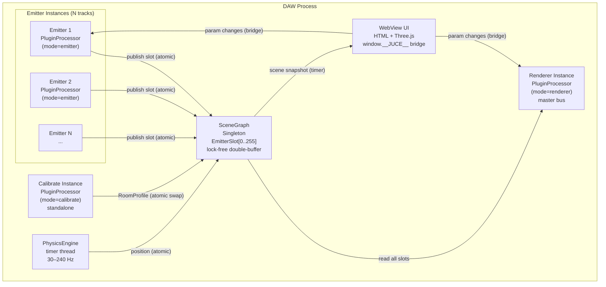
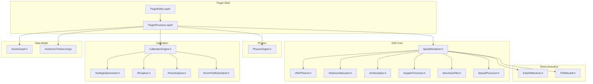
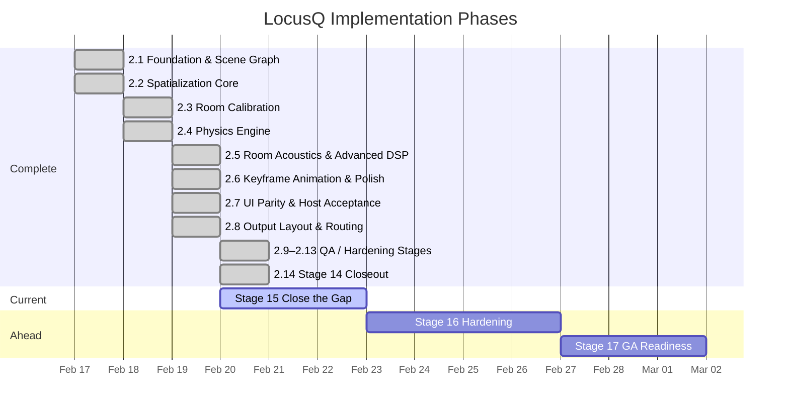
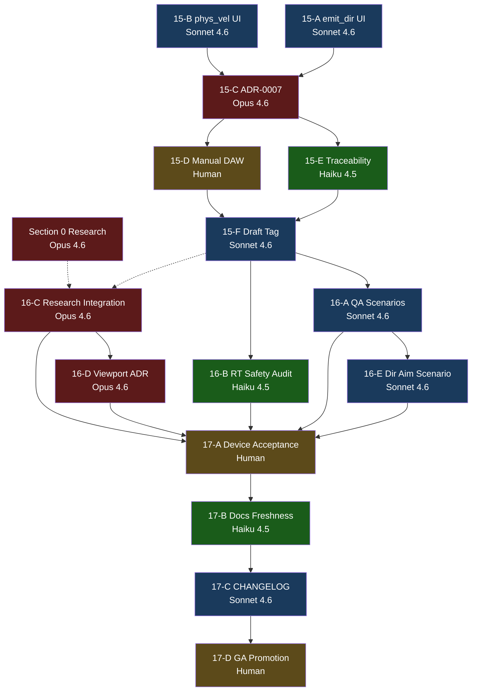

Title: LocusQ Full Project Review — Implementation Plan
Document Type: Implementation Plan
Author: APC Codex
Created Date: 2026-02-20
Last Modified Date: 2026-02-25

# LocusQ Full Project Review — Implementation Plan

> **For Claude:** REQUIRED SUB-SKILL: Use `superpowers:executing-plans` to implement this
> plan task-by-task.

**Goal:** Produce `Documentation/archive/2026-02-23-historical-review-bundles/full-project-review-2026-02-20.md` — a single navigable
document covering research landscape, system diagrams, domain reviews (arch/code/design/QA),
model assignment rationale, phased mega-prompts (Stage 15–17), and a parallel agent
dependency graph. Then execute Stage 15 implementation tasks.

**Architecture:** Section 0 research runs as a parallel Opus 4.6 background agent using
WebSearch while Sections 1–5 are written in the main session. Stage 15 code tasks (15-A and
15-B) are parallelisable. All domain review findings are calibrated against invariants.md,
the ADR record, and the existing Stage 14 review. Every finding gets an opinionated
`fix now / fix next / acceptable / explicit defer` disposition — no hedging.

**Tech Stack:** JUCE 8 / C++ (PluginProcessor, PluginEditor), WebView HTML/JS (index.js,
index.html), Mermaid diagrams (GitHub-renderable), Markdown with project metadata headers.

**Design doc:** `Documentation/archive/2026-02-23-historical-review-bundles/full-project-review-design-2026-02-20.md`

---

## Part 1 — Produce the Review Document

### Task 1: Dispatch Research Agent (Section 0)

**Model:** Opus 4.6
**Runs:** In background, parallel to Tasks 2–8.

**Files to read first:**
- `.ideas/architecture.md`
- `Documentation/invariants.md`
- `Documentation/adr/ADR-0006-device-compatibility-profiles-and-monitoring-contract.md`

**Step 1: Dispatch background agent**

Invoke Task tool with `subagent_type: general-purpose`, `run_in_background: true`.

Mega-prompt for the agent:

```
You are a senior audio software researcher. Your job is to produce Section 0 of a
full project review for LocusQ — a JUCE 8 spatial audio plugin with VST3/AU formats.

LocusQ implements:
- Custom VBAP panner (quad speaker layout)
- Custom FDN reverb (4x4 Hadamard) + early reflections
- Custom physics engine (timer thread, Euler integration)
- Custom Doppler processor
- Lock-free SceneGraph singleton (inter-instance emitter→renderer communication)
- WebView UI with Three.js 3D viewport
- Calibration engine (IR capture, deconvolution, room analysis)
- 76 parameters, 3 modes (Calibrate / Emitter / Renderer)

For EACH of the following 5 areas, produce: (a) one-sentence plain-language definition,
(b) state of the art, (c) specific libraries/repos/packages with GitHub URLs where possible,
(d) LocusQ overlap assessment: "build" / "use" / "augment" / "ignore" with one-sentence
rationale. Be opinionated — give a clear recommendation, not a list of options.

Area 0a: Spatial Audio Algorithms
  - VBAP, Ambisonics (1st-3rd order HOA), binaural HRTF, WFS, stereo/quad downmix
  - Key candidates: resonance-audio (Google), steam-audio (Valve), IEM Plug-in Suite,
    SPARTA, libmysofa, Mach1 Spatial SDK, SOFA format

Area 0b: Apple Spatial Audio & Platform APIs
  - AVAudioEnvironmentNode, PHASE framework, Core Audio 3D, AU3D, AirPods head tracking
  - ADR-0006 adds headphone/binaural profile (currently post-v1); assess if PHASE makes
    it cheap enough to pull into v1

Area 0c: JUCE Ecosystem
  - What JUCE 8 already provides that LocusQ reimplements: dsp::Reverb, dsp::Convolution,
    dsp::Panner, AudioProcessorGraph, fractional delay
  - Community libs: chowdsp_utils, foleys_gui_magic, FRUT, melatonin_inspector
  - Honest audit: where is LocusQ's custom implementation justified (lock-free constraint,
    VBAP specifics) vs where is it redundant?

Area 0d: Audio Plugin Standards & Distribution
  - VST3, AU, CLAP, AAX, LV2 — requirements and LocusQ's current coverage
  - pluginval, auval, Apple notarization, codesigning, DAW compatibility matrix
  - Should CLAP be on the v2 roadmap? (growing adoption, better thread model)

Area 0e: 3D Visualization & Audio-Reactive UI
  - Three.js spatial audio examples, Web Audio API AudioListener, p5.sound, Tone.js
  - Physics-reactive sound (matter.js + Howler.js patterns)
  - Audio-reactive Three.js: what patterns exist for driving visuals from audio analysis
  - Mach1 Spatial SDK UI patterns

Format your output as Markdown ready to paste into a review document. Use second-level
headers for each area (## 0a, ## 0b, etc). Include a summary table at the end:

| Area | Key Library | LocusQ Verdict | Action |
|------|------------|----------------|--------|
```

**Step 2: Note the output file path**

The agent will return its output. Save the output file path for Task 8.

**Step 3: Continue with Tasks 2–7 while agent runs**

Do not block on the research agent. Proceed immediately to Task 2.

---

### Task 2: Document Skeleton + Section 1 System Map

**Model:** Sonnet 4.6
**Files to read first:**
- `.ideas/architecture.md` (all diagrams)
- `Source/SceneGraph.h` (thread model, slot structure)
- `Documentation/archive/2026-02-23-historical-review-bundles/full-project-review-design-2026-02-20.md`
- `status.json`
- `.ideas/plan.md` (phase list)

**Step 1: Define acceptance criteria**

Section 1 must contain:
- [ ] Diagram 1a: all 3 modes, SceneGraph, DAW process boundary, WebView layer, arrows
- [ ] Diagram 1b: 4 threads labeled, data crossing labels (lock-free / atomic / spinlock)
- [ ] Diagram 1c: all 22 source files as nodes, edges, domain clusters
- [ ] Diagram 1d: Gantt with phases 2.1–2.14, current phase highlighted

**Step 2: Create document with metadata header and Section 1**

Create `Documentation/archive/2026-02-23-historical-review-bundles/full-project-review-2026-02-20.md`.

```markdown
Title: LocusQ Full Project Review
Document Type: Review Report
Author: APC Codex
Created Date: 2026-02-20
Last Modified Date: 2026-02-20

# LocusQ Full Project Review

> This document covers the complete LocusQ project as of 2026-02-20. It is intended to
> be readable by someone learning this space: every technical concept gets a plain-language
> sentence before the detail. Findings include an opinionated disposition. Mega-prompts
> are copy-pasteable into a new Claude Code session.

---

## Section 0 — Research & Ecosystem Landscape
*[Populated in Task 8 from research agent output]*

---

## Section 1 — System Map

### What this section is

Before reading any findings, these four diagrams give you a complete mental model of what
LocusQ is and how its parts relate. Read them top-to-bottom once, then refer back when
a finding references a specific component.

### 1a. High-Level Architecture

> **Plain language:** LocusQ is one plugin binary that can run in three roles. Multiple
> "Emitter" instances send spatial position data to a central "scene" that one "Renderer"
> instance reads to produce quad spatial output. A "Calibrate" instance measures the room.

[INSERT MERMAID DIAGRAM 1a]

### 1b. Data Flow & Thread Model

> **Plain language:** Audio plugins have strict real-time rules — the audio thread cannot
> wait for anything. LocusQ uses lock-free data structures to let the physics timer thread
> and the audio thread share data without ever blocking each other.

[INSERT MERMAID DIAGRAM 1b]

### 1c. Component Dependency Graph

> **Plain language:** Before changing any file, know what else depends on it. This graph
> shows the blast radius of every source file.

[INSERT MERMAID DIAGRAM 1c]

### 1d. Implementation Phase Timeline

> **Plain language:** LocusQ was built in staged phases, each adding a new capability.
> This chart shows what's done, what's current, and what's ahead.

[INSERT MERMAID DIAGRAM 1d]
```

**Step 3: Write Diagram 1a**



**Step 4: Write Diagram 1b**

```mermaid
graph LR
    subgraph AudioThread["Audio Thread (real-time, no blocking)"]
        AT["processBlock()\n• read APVTS params\n• read SceneGraph slots\n• render/spatialize\n• write position"]
    end
    subgraph PhysicsThread["Physics Timer Thread (30–240 Hz)"]
        PT["tick()\n• integrate forces\n• collision detect\n• write position"]
    end
    subgraph UIThread["UI Timer Thread (30–60 fps)"]
        UT["timerCallback()\n• serialize scene to JSON\n• evaluateJavascript"]
    end
    subgraph RegistrationPath["Registration (rare, startup/shutdown only)"]
        RP["registerEmitter()\nunregisterEmitter()\nSpinLock (acceptable)"]
    end
    SG[("SceneGraph\nEmitterSlot[N]\ndouble-buffer")]
    AT -->|"read: memory_order_acquire"| SG
    PT -->|"write: atomic swap"| SG
    UT -->|"read: memory_order_acquire"| SG
    RP -->|"write: SpinLock"| SG
    style AT fill:#1a3a5c
    style PT fill:#3a1a5c
    style UT fill:#1a5c3a
    style RP fill:#5c3a1a
```



**Step 5: Write Diagram 1c**



**Step 6: Write Diagram 1d**



**Step 7: Verify Section 1 against acceptance criteria**

Check all four checkboxes from Step 1. Each diagram must render without error in a
Mermaid previewer before committing.

**Step 8: Commit**

```bash
git add Documentation/archive/2026-02-23-historical-review-bundles/full-project-review-2026-02-20.md
git commit -m "docs(review): add skeleton and Section 1 system map diagrams"
```

---

### Task 3: Section 2 — Domain Reviews

**Model:** Sonnet 4.6 (reads; Opus 4.6 if any finding requires ADR-level judgment)
**Files to read first:**
- `Source/PluginProcessor.cpp` (full)
- `Source/PluginEditor.h` + `Source/PluginEditor.cpp`
- `Source/SceneGraph.h`
- `Documentation/invariants.md`
- `Documentation/adr/ADR-0002-routing-model-v1.md`
- `Documentation/adr/ADR-0003-automation-authority-precedence.md`
- `Documentation/archive/2026-02-23-historical-review-bundles/stage14-comprehensive-review-2026-02-20.md`
- `qa/scenarios/` (list all files)
- `Source/ui/public/js/index.js` (line counts + structure only; full read for specific gaps)
- `Source/ui/public/index.html`

**Step 1: Define acceptance criteria**

Each domain review must include:
- [ ] Current state (1 paragraph)
- [ ] Verdict (one line: e.g., "Sound. One code-quality issue. Two deferred items.")
- [ ] All findings from Stage 14 review either resolved, added, or explicitly closed
- [ ] Every finding tagged: `fix now` / `fix next` / `acceptable` / `explicit defer`
- [ ] Plain-language "what this means" sentence before every technical finding

**Step 2: Write Section 2a — Architecture Review**

Key questions to answer:
1. Does the SceneGraph singleton pattern hold up? (compare against resonance-audio and
   steam-audio routing models from Section 0)
2. Is the thread model correct per ADR-0002?
3. Does the authority precedence chain (ADR-0003) have any implementation gaps?
4. Is the `computeEmitterInteractionForce` function (updated this session) correct?
5. Is there any design drift between `.ideas/architecture.md` and the source?

Template:
```markdown
### 2a. Architecture Review

**Current state:** [paragraph]

**Verdict:** [one line]

#### Findings

| ID | Severity | Finding | Disposition |
|----|----------|---------|-------------|
| A-01 | ... | ... | fix now / fix next / acceptable / explicit defer |

#### A-01: [Title]

> **What this means:** [plain language sentence]

[Technical detail]

**Recommendation:** [opinionated, single action]
```

**Step 3: Write Section 2b — Code Review**

Key questions:
1. Are there any heap allocations in `processBlock`? (scan for `new`, `std::vector` resize,
   `std::string` construction, `juce::Logger`, `std::cout`)
2. Is every APVTS parameter read with `->load()` (not `->get()`)?
3. Which parameters have no relay/attachment/UI binding?
4. Is the `rend_phys_interact` production UI wiring complete? (we added it this session)
5. Does the Stage 12 vs production UI drift still exist for any other parameter?

Known gap (carry forward from Stage 14, now with exact fix):
- `emit_dir_azimuth`, `emit_dir_elevation`: no relay/attachment/UI → **fix now (Stage 15-A)**
- `phys_vel_x`, `phys_vel_y`, `phys_vel_z`: no relay/attachment/UI → **fix now (Stage 15-B)**

**Step 4: Write Section 2c — Design Review**

Key questions:
1. Does the production UI (`index.js` / `index.html`) expose all emitter-mode parameters
   that have relays?
2. Is the UI resilience contract (BOOT_START → RUNNING) implemented?
3. Is the command/acknowledgment path complete for all interactive controls?
4. Does the Three.js viewport cover what `.ideas/architecture.md` specifies?
5. Is the directivity aim control exposed in the UI? (it is not — Stage 15-A fixes it)

**Step 5: Write Section 2d — QA Review**

Coverage matrix: for each component, which scenario covers it?

| Component | Scenario File(s) | Gap? |
|-----------|-----------------|------|
| VBAPPanner | locusq_renderer_spatial_output.json | — |
| DistanceAttenuator | locusq_renderer_distance_attenuation.json | — |
| AirAbsorption | ? | **gap** |
| FDNReverb | locusq_25_room_size_*.json | partial |
| DopplerProcessor | locusq_25_doppler_motion.json | — |
| DirectivityFilter | locusq_25_directivity_focus.json | — |
| SpreadProcessor | locusq_25_spread_diffuse.json | — |
| PhysicsEngine | locusq_24_physics_*.json | — |
| computeEmitterInteractionForce | locusq_multi_emitter_interaction.json | new (this session) |
| CalibrationEngine | ? | **gap** |
| KeyframeTimeline | ? | **gap** |
| emit_dir DSP path | ? | **gap** |

Open manual acceptance: `DEV-01..DEV-06` in `TestEvidence/phase-2-7a-manual-host-ui-acceptance.md`
Status: unexecuted. **Disposition: fix now (Stage 15-D, human task)**

**Step 6: Verify Section 2 against acceptance criteria**

**Step 7: Commit**

```bash
git add Documentation/archive/2026-02-23-historical-review-bundles/full-project-review-2026-02-20.md
git commit -m "docs(review): add Section 2 domain reviews"
```

---

### Task 4: Section 3 — Model Assignment Rationale

**Model:** Sonnet 4.6
**Files to read first:**
- `Documentation/archive/2026-02-23-historical-review-bundles/full-project-review-design-2026-02-20.md` (Section 3 design)

**Step 1: Write Section 3**

```markdown
## Section 3 — Model Assignment Rationale

> **What this means:** Different Claude models have different strengths and costs. Choosing
> the right model per task saves time and money without sacrificing quality. These rules
> are calibrated for LocusQ's specific task mix.

### Decision Rule (Plain Language)

Start with **Sonnet 4.6**. Upgrade to **Opus 4.6** if the task:
- touches an ADR or invariants.md
- crosses 3+ files with causal dependencies
- requires a judgment call that affects system design
- synthesises research from many external sources

Downgrade to **Haiku 4.5** if the task:
- touches one file
- has a clear template to follow
- success is binary (it either compiles / passes / matches a pattern, or it doesn't)
- is high-volume and repetitive

### Assignment Table

| Task Type | Model | Reasoning |
|-----------|-------|-----------|
| Architecture decisions, ADR authoring | Opus 4.6 | Multi-file causal reasoning; wrong call is expensive |
| Cross-cutting design (invariant changes) | Opus 4.6 | Must hold entire constraint graph in context |
| Research synthesis (Section 0) | Opus 4.6 | Heterogeneous sources; needs judgment on relevance |
| DSP implementation (C++) | Sonnet 4.6 | Clear spec; best cost/quality ratio |
| UI wiring (JS + HTML + C++ relay) | Sonnet 4.6 | Follows a template; needs to see 4 files at once |
| Code review fixes (bounded scope) | Sonnet 4.6 | Single finding → single fix |
| QA scenario JSON authoring | Haiku 4.5 | Template-driven; parameters are known |
| Doc metadata fixes | Haiku 4.5 | Pattern match; binary correctness |
| Constant/comment additions | Haiku 4.5 | Single file; deterministic |
| Phase closeout validation | Haiku 4.5 | Run scripts; check output |
| Build scripts, grep sweeps | Haiku 4.5 | No reasoning depth needed |
| Parallel Codex 5.3 tasks | Codex 5.3 | Same as Sonnet; separate sandboxed session |

### Cost Intuition

Running Opus when Haiku suffices costs ~20× more per token. For LocusQ's Stage 15–17
work, roughly 60% of tasks are Haiku-appropriate. Defaulting everything to Opus would
be both wasteful and unnecessary — the quality ceiling is determined by spec clarity,
not model tier, for well-scoped tasks.
```

**Step 2: Commit**

```bash
git add Documentation/archive/2026-02-23-historical-review-bundles/full-project-review-2026-02-20.md
git commit -m "docs(review): add Section 3 model assignment rationale"
```

---

### Task 5: Section 4 — Stage 15 Mega-Prompts

**Model:** Sonnet 4.6
**Note:** These mega-prompts are the most valuable outputs of the plan. They must be
complete enough that someone with zero LocusQ context can paste one into a new Claude
Code session and execute it correctly.

**Step 1: Write Section 4 header and Stage 15**

````markdown
## Section 4 — Phased Work Plan with Mega-Prompts

> **What this means:** Each task below is a complete instruction set for Claude Code.
> Copy the block under "Mega-Prompt" into a new Claude Code session. The session will
> know exactly what to do without needing prior context.

---

### Stage 15 — Close the Gap

**Goal:** Close all open Stage 14 findings. Reach `draft-pre-release` readiness.
**Prerequisite:** Current build passes `./scripts/build-and-install-mac.sh`.

---

#### Task 15-A: Bind `emit_dir_azimuth` + `emit_dir_elevation` (Relay / Attachment / UI)

**Model:** Sonnet 4.6
**Parallel with:** 15-B (no shared files)
**Blocks:** 15-C, 15-E

**What this task does (plain language):** The directivity aim parameters tell LocusQ which
direction an emitter "points" — like a speaker aimed at a specific angle. They are wired
in the C++ DSP but currently invisible in the UI. This task exposes them.

**Mega-Prompt:**

```
CONTEXT:
LocusQ is a JUCE 8 spatial audio plugin. PluginEditor.h declares parameter relays
(juce::WebSliderRelay, etc.) that bridge APVTS parameters to the WebView UI.
PluginEditor.cpp creates WebSliderParameterAttachment objects that connect each relay
to its parameter. Source/ui/public/js/index.js registers sliderStates and toggleStates
using Juce.getSliderState() / Juce.getToggleState(), binds value steppers, adds
valueChangedEvent listeners, and syncs initial values. Source/ui/public/index.html
contains the control rows.

CURRENT GAP:
emit_dir_azimuth (range -180..180°, float) and emit_dir_elevation (range -90..90°, float)
are defined in APVTS (PluginProcessor.cpp ~line 1963) and read in DSP (PluginProcessor.cpp
~line 656) but have NO relay, NO attachment, and NO UI controls.

GOAL:
Wire emit_dir_azimuth and emit_dir_elevation end-to-end: relay → attachment → UI display.
Follow the exact pattern of the existing directivity parameter (emit_directivity).

READ FIRST (in this order):
1. Source/PluginEditor.h lines 60–80 (relay declaration pattern)
2. Source/PluginEditor.cpp lines 330–345 (attachment creation pattern)
3. Source/ui/public/js/index.js lines 255–265 (sliderStates pattern)
4. Source/ui/public/js/index.js lines 1654–1666 (bindValueStepper pattern)
5. Source/ui/public/js/index.js lines 1993–2000 (valueChangedEvent pattern)
6. Source/ui/public/index.html lines 563–570 (Audio section control row pattern)

CONSTRAINTS:
- Relays MUST be declared BEFORE `std::unique_ptr<juce::WebBrowserComponent> webView`
  in PluginEditor.h. The file has a comment marking the boundary. Do not move this.
- Attachments MUST be created AFTER addAndMakeVisible(*webView) in PluginEditor.cpp.
- Do not touch PluginProcessor.cpp — DSP is already correct.
- Follow the existing naming convention exactly:
    relay: dirAzimuthRelay / dirElevationRelay
    attachment: dirAzimuthAttachment / dirElevationAttachment
    HTML ids: val-dir-azimuth / val-dir-elevation
    sliderStates keys: emit_dir_azimuth / emit_dir_elevation

EXACT CHANGES:

1. PluginEditor.h — add after emitColorRelay (in relay section, before webView):
   juce::WebSliderRelay dirAzimuthRelay  { "emit_dir_azimuth" };
   juce::WebSliderRelay dirElevationRelay { "emit_dir_elevation" };

2. PluginEditor.h — add after emitColorAttachment (in attachments section):
   std::unique_ptr<juce::WebSliderParameterAttachment> dirAzimuthAttachment;
   std::unique_ptr<juce::WebSliderParameterAttachment> dirElevationAttachment;

3. PluginEditor.cpp — add after emitColorAttachment = ... creation:
   dirAzimuthAttachment = std::make_unique<juce::WebSliderParameterAttachment> (
       *audioProcessor.apvts.getParameter ("emit_dir_azimuth"), dirAzimuthRelay);
   dirElevationAttachment = std::make_unique<juce::WebSliderParameterAttachment> (
       *audioProcessor.apvts.getParameter ("emit_dir_elevation"), dirElevationRelay);

4. Source/ui/public/js/index.js — add to sliderStates after emit_color:
   emit_dir_azimuth:   Juce.getSliderState("emit_dir_azimuth"),
   emit_dir_elevation: Juce.getSliderState("emit_dir_elevation"),

5. Source/ui/public/index.html — add after the Directivity control row (val-directivity):
   <div class="control-row"><span class="control-label">Aim Azimuth</span><span class="control-value" id="val-dir-azimuth">0.0<span class="control-unit">°</span></span></div>
   <div class="control-row"><span class="control-label">Aim Elevation</span><span class="control-value" id="val-dir-elevation">0.0<span class="control-unit">°</span></span></div>

6. Source/ui/public/js/index.js — add to bindValueStepper block after val-directivity:
   bindValueStepper("val-dir-azimuth", sliderStates.emit_dir_azimuth,
       { step: 1.0, min: -180.0, max: 180.0, roundDigits: 1 });
   bindValueStepper("val-dir-elevation", sliderStates.emit_dir_elevation,
       { step: 1.0, min: -90.0, max: 90.0, roundDigits: 1 });

7. Source/ui/public/js/index.js — add to valueChangedEvent block after emit_directivity:
   sliderStates.emit_dir_azimuth.valueChangedEvent.addListener(() => {
       updateValueDisplay("val-dir-azimuth",
           sliderStates.emit_dir_azimuth.getScaledValue().toFixed(1), "°");
   });
   sliderStates.emit_dir_elevation.valueChangedEvent.addListener(() => {
       updateValueDisplay("val-dir-elevation",
           sliderStates.emit_dir_elevation.getScaledValue().toFixed(1), "°");
   });

8. Source/ui/public/js/index.js — add to initial sync block after emit_color sync:
   updateValueDisplay("val-dir-azimuth",
       sliderStates.emit_dir_azimuth.getScaledValue().toFixed(1), "°");
   updateValueDisplay("val-dir-elevation",
       sliderStates.emit_dir_elevation.getScaledValue().toFixed(1), "°");

OUTPUT: 4 files modified (PluginEditor.h, PluginEditor.cpp, index.js, index.html)

SUCCESS CRITERIA:
- grep "dirAzimuthRelay" Source/PluginEditor.h → found in relay section (before webView)
- grep "dirAzimuthAttachment" Source/PluginEditor.h → found in attachments section
- grep "emit_dir_azimuth" Source/ui/public/js/index.js → found in sliderStates,
  bindValueStepper, valueChangedEvent, and initial sync
- grep "val-dir-azimuth" Source/ui/public/index.html → found

VALIDATION:
./scripts/build-and-install-mac.sh
(Build must complete with zero errors. No new warnings expected.)

COMMIT:
git commit -m "feat(stage15): wire emit_dir_azimuth + emit_dir_elevation relay/attachment/UI"
```

---

#### Task 15-B: Bind `phys_vel_x`, `phys_vel_y`, `phys_vel_z` (Relay / Attachment / UI)

**Model:** Sonnet 4.6
**Parallel with:** 15-A (no shared files)
**Blocks:** 15-C, 15-E

**What this task does (plain language):** The initial velocity parameters set how fast and
in which direction an emitter is launched when you press "throw." They exist in the DSP
but are currently invisible in the UI.

**Mega-Prompt:**

```
CONTEXT:
Same as 15-A. Physics parameters follow the same relay/attachment/UI pattern.
phys_vel_x, phys_vel_y, phys_vel_z are float sliders (range -50..50 m/s, default 0).
They are read in DSP at PluginProcessor.cpp ~lines 698–700 but have no relay/attachment/UI.

GOAL:
Wire phys_vel_x, phys_vel_y, phys_vel_z end-to-end. Follow the pattern of phys_friction.

READ FIRST:
1. Source/PluginEditor.h lines 77–90 (physics relay group)
2. Source/PluginEditor.cpp lines 344–360 (physics attachment creation)
3. Source/ui/public/js/index.js lines 265–278 (physics sliderStates)
4. Source/ui/public/js/index.js lines 1662–1666 (physics bindValueStepper)
5. Source/ui/public/js/index.js lines 2008–2020 (physics valueChangedEvent)
6. Source/ui/public/index.html lines 594–602 (physics-advanced disclosure section)

CONSTRAINTS:
- Same member order rules as 15-A: relays before webView, attachments after addAndMakeVisible.
- Place relays in PluginEditor.h after physResetRelay.
- Place HTML controls inside the physics-advanced disclosure div, after the Direction row.
- Naming convention:
    relays: physVelXRelay / physVelYRelay / physVelZRelay
    attachments: physVelXAttachment / physVelYAttachment / physVelZAttachment
    HTML ids: val-vel-x / val-vel-y / val-vel-z
    sliderStates keys: phys_vel_x / phys_vel_y / phys_vel_z

EXACT CHANGES:

1. PluginEditor.h — add after physResetRelay (in relay section):
   juce::WebSliderRelay physVelXRelay { "phys_vel_x" };
   juce::WebSliderRelay physVelYRelay { "phys_vel_y" };
   juce::WebSliderRelay physVelZRelay { "phys_vel_z" };

2. PluginEditor.h — add after physResetAttachment (in attachments section):
   std::unique_ptr<juce::WebSliderParameterAttachment> physVelXAttachment;
   std::unique_ptr<juce::WebSliderParameterAttachment> physVelYAttachment;
   std::unique_ptr<juce::WebSliderParameterAttachment> physVelZAttachment;

3. PluginEditor.cpp — add after physResetAttachment = ... creation:
   physVelXAttachment = std::make_unique<juce::WebSliderParameterAttachment> (
       *audioProcessor.apvts.getParameter ("phys_vel_x"), physVelXRelay);
   physVelYAttachment = std::make_unique<juce::WebSliderParameterAttachment> (
       *audioProcessor.apvts.getParameter ("phys_vel_y"), physVelYRelay);
   physVelZAttachment = std::make_unique<juce::WebSliderParameterAttachment> (
       *audioProcessor.apvts.getParameter ("phys_vel_z"), physVelZRelay);

4. Source/ui/public/js/index.js — add to sliderStates after phys_friction:
   phys_vel_x: Juce.getSliderState("phys_vel_x"),
   phys_vel_y: Juce.getSliderState("phys_vel_y"),
   phys_vel_z: Juce.getSliderState("phys_vel_z"),

5. Source/ui/public/index.html — add inside physics-advanced div, after Direction row:
   <div class="control-row"><span class="control-label">Init Vel X</span><span class="control-value" id="val-vel-x">0.0<span class="control-unit">m/s</span></span></div>
   <div class="control-row"><span class="control-label">Init Vel Y</span><span class="control-value" id="val-vel-y">0.0<span class="control-unit">m/s</span></span></div>
   <div class="control-row"><span class="control-label">Init Vel Z</span><span class="control-value" id="val-vel-z">0.0<span class="control-unit">m/s</span></span></div>

6. Source/ui/public/js/index.js — add to bindValueStepper block after val-friction:
   bindValueStepper("val-vel-x", sliderStates.phys_vel_x,
       { step: 1.0, min: -50.0, max: 50.0, roundDigits: 1 });
   bindValueStepper("val-vel-y", sliderStates.phys_vel_y,
       { step: 1.0, min: -50.0, max: 50.0, roundDigits: 1 });
   bindValueStepper("val-vel-z", sliderStates.phys_vel_z,
       { step: 1.0, min: -50.0, max: 50.0, roundDigits: 1 });

7. Source/ui/public/js/index.js — add to valueChangedEvent block after phys_friction:
   sliderStates.phys_vel_x.valueChangedEvent.addListener(() => {
       updateValueDisplay("val-vel-x",
           sliderStates.phys_vel_x.getScaledValue().toFixed(1), "m/s");
   });
   sliderStates.phys_vel_y.valueChangedEvent.addListener(() => {
       updateValueDisplay("val-vel-y",
           sliderStates.phys_vel_y.getScaledValue().toFixed(1), "m/s");
   });
   sliderStates.phys_vel_z.valueChangedEvent.addListener(() => {
       updateValueDisplay("val-vel-z",
           sliderStates.phys_vel_z.getScaledValue().toFixed(1), "m/s");
   });

8. Source/ui/public/js/index.js — add to initial sync block:
   updateValueDisplay("val-vel-x",
       sliderStates.phys_vel_x.getScaledValue().toFixed(1), "m/s");
   updateValueDisplay("val-vel-y",
       sliderStates.phys_vel_y.getScaledValue().toFixed(1), "m/s");
   updateValueDisplay("val-vel-z",
       sliderStates.phys_vel_z.getScaledValue().toFixed(1), "m/s");

OUTPUT: 4 files modified

SUCCESS CRITERIA:
- grep "physVelXRelay" Source/PluginEditor.h → found before webView declaration
- grep "phys_vel_x" Source/ui/public/js/index.js → in sliderStates, bindValueStepper,
  valueChangedEvent, and initial sync
- grep "val-vel-x" Source/ui/public/index.html → found inside physics-advanced div

VALIDATION:
./scripts/build-and-install-mac.sh

COMMIT:
git commit -m "feat(stage15): wire phys_vel_x/y/z relay/attachment/UI"
```

---

#### Task 15-C: Author ADR-0007 for emit_dir and phys_vel UI Exposure Decision

**Model:** Opus 4.6
**Blocked by:** 15-A, 15-B
**Blocks:** 15-E

**What this task does (plain language):** An Architecture Decision Record (ADR) documents
*why* a decision was made, so future developers don't accidentally undo it. This ADR
records that directivity aim and initial velocity are now UI-exposed in v1.

**Mega-Prompt:**

```
CONTEXT:
LocusQ uses Architecture Decision Records (ADRs) in Documentation/adr/. The last is
ADR-0006. Each ADR has Title, Status, Context, Decision, Consequences sections and
the project metadata header (Title, Document Type, Author, Created Date, Last Modified Date).

GOAL:
Write Documentation/adr/ADR-0007-emitter-directivity-velocity-ui-exposure.md.

READ FIRST:
1. Documentation/adr/ADR-0006-device-compatibility-profiles-and-monitoring-contract.md
   (for format reference)
2. Documentation/invariants.md (check if any invariant is affected)
3. Documentation/implementation-traceability.md (to understand what traceability means here)

CONTENT:
- Status: Accepted
- Context: emit_dir_azimuth, emit_dir_elevation, phys_vel_x/y/z were DSP-backed but not
  exposed in the production UI. Stage 14 review flagged this as a medium-severity gap.
  Stage 15 tasks 15-A and 15-B close this gap.
- Decision: Expose all five parameters via relay/attachment/UI in both production index.js
  and (if applicable) Stage 12 incremental UI. No defer — v1 ships with full directivity
  aim and initial velocity editability.
- Consequences: (a) Users can now set directivity aim direction and throw velocity without
  DAW automation. (b) implementation-traceability.md must be updated (Task 15-E).
  (c) QA should add a scenario covering directivity aim effect on spatial output.

OUTPUT: Documentation/adr/ADR-0007-emitter-directivity-velocity-ui-exposure.md

COMMIT:
git commit -m "docs(adr): add ADR-0007 emit_dir and phys_vel UI exposure decision"
```

---

#### Task 15-D: Execute Manual DAW Acceptance (DEV-01..DEV-06)

**Model:** Human task (you execute; Claude Code assists with build and log capture)
**Blocked by:** 15-C

**What this task does (plain language):** These are the portable-device profile checks —
verifying that LocusQ works on laptop speakers, built-in microphone, and headphones.
They cannot be automated; a human must plug in headphones, press play, and listen.

**Checklist:**
- [ ] Read `TestEvidence/phase-2-7a-manual-host-ui-acceptance.md` rows DEV-01..DEV-06
- [ ] Run `./scripts/build-and-install-mac.sh` first
- [ ] Execute each check in REAPER (or Logic) with the specified device profile
- [ ] Fill in the result column for each row
- [ ] Save the file

**Assist mega-prompt (run in parallel while executing checks):**

```
CONTEXT:
TestEvidence/phase-2-7a-manual-host-ui-acceptance.md contains manual acceptance rows
DEV-01..DEV-06 for portable device profile checks (laptop speakers, mic, headphones).

GOAL:
After the human fills in the result column for each row, update:
1. TestEvidence/validation-trend.md — add a new trend entry for Stage 15 DAW acceptance
2. TestEvidence/build-summary.md — add a summary line for this run

READ FIRST:
1. TestEvidence/phase-2-7a-manual-host-ui-acceptance.md (full)
2. TestEvidence/validation-trend.md (last 5 entries for format)
3. TestEvidence/build-summary.md (last 3 entries for format)

OUTPUT: Both trend files updated.

COMMIT:
git commit -m "docs(evidence): record Stage 15 manual DAW acceptance results"
```

---

#### Task 15-E: Update implementation-traceability.md

**Model:** Haiku 4.5
**Blocked by:** 15-A, 15-B, 15-C

**Mega-Prompt:**

```
CONTEXT:
Documentation/implementation-traceability.md maps every parameter to its APVTS
definition, DSP usage, and UI relay/attachment. Five parameters are now newly wired:
emit_dir_azimuth, emit_dir_elevation, phys_vel_x, phys_vel_y, phys_vel_z.

GOAL:
Update the traceability table rows for these five parameters to show:
- Relay: PluginEditor.h (dirAzimuthRelay etc.)
- Attachment: PluginEditor.cpp
- UI: index.js (sliderStates + bindValueStepper) / index.html (val-dir-azimuth etc.)

READ FIRST:
1. Documentation/implementation-traceability.md
2. Source/PluginEditor.h (to confirm exact relay names added in 15-A and 15-B)

OUTPUT: Documentation/implementation-traceability.md updated.

VALIDATION:
grep "emit_dir_azimuth" Documentation/implementation-traceability.md → must show relay + UI columns filled

COMMIT:
git commit -m "docs(traceability): update emit_dir and phys_vel UI binding coverage"
```

---

#### Task 15-F: Cut draft-pre-release Tag

**Model:** Sonnet 4.6
**Blocked by:** 15-D (manual acceptance must pass)

**Mega-Prompt:**

```
CONTEXT:
LocusQ is at draft-pre-release hold per Documentation/archive/2026-02-23-historical-review-bundles/stage14-comprehensive-review-2026-02-20.md.
Stage 15 has closed: emit_dir/phys_vel UI gap, ADR-0007 recorded, manual DAW acceptance
complete. Automated lanes are green.

GOAL:
1. Update CHANGELOG.md with Stage 15 entries (15-A, 15-B, 15-C, 15-D close-out).
2. Update status.json: set notes field to "draft-pre-release candidate".
3. Verify ./scripts/validate-docs-freshness.sh passes.
4. Create annotated git tag v0.15.0-draft.

READ FIRST:
1. CHANGELOG.md (last 3 entries for format)
2. status.json
3. Documentation/archive/2026-02-23-historical-review-bundles/stage14-comprehensive-review-2026-02-20.md (release recommendation section)

CONSTRAINTS:
- Do NOT push to remote. Tag locally only. User will push when ready.
- Do NOT modify status.json current_phase field.

VALIDATION:
./scripts/validate-docs-freshness.sh
git tag --list | grep draft

COMMIT:
git commit -m "chore(release): Stage 15 closeout — draft-pre-release candidate"
git tag -a v0.15.0-draft -m "Stage 15 closeout: emit_dir/phys_vel UI, manual DAW acceptance"
```
````

**Step 2: Commit**

```bash
git add Documentation/archive/2026-02-23-historical-review-bundles/full-project-review-2026-02-20.md
git commit -m "docs(review): add Section 4 Stage 15 mega-prompts"
```

---

### Task 6: Section 4 — Stage 16 + 17 Mega-Prompts

**Model:** Sonnet 4.6

**Step 1: Write Stage 16 mega-prompts**

Stage 16 tasks are hardening: QA coverage, RT-safety audit, research integration.
The three fully parallel tasks (16-A, 16-B, 16-C) can each be a new Claude Code session.

Key mega-prompts to write:

**16-A (Sonnet):** QA scenario expansion — for each component gap from Section 2d
(AirAbsorption, CalibrationEngine, KeyframeTimeline, emit_dir DSP), author one scenario
JSON per gap following the template in `qa/scenarios/locusq_24_physics_spatial_motion.json`.
Estimated: 4 new scenario files.

**16-B (Haiku):** RT-safety audit — grep `PluginProcessor.cpp` for patterns:
`new `, `std::vector`, `.push_back`, `.resize`, `std::string(`, `juce::Logger`,
`std::cout`. Report any found in processBlock call stack. Expected: zero findings
(document as "clean" if zero). If any found, each is a `fix now`.

**16-C (Opus):** Research integration — read Section 0 research agent output, compare
against LocusQ's current components, produce 3–5 concrete integration recommendations
(e.g., "replace FDNReverb with JUCE dsp::Reverb: saves 200 LOC, same quality tier").
Write recommendations to `Documentation/archive/2026-02-25-research-legacy/section0-integration-recommendations-2026-02-20.md`.

**16-D (Opus):** Three.js viewport gap assessment — compare `.ideas/architecture.md`
Section 7 (UI spec) against `Source/ui/public/js/index.js` and `Source/ui/public/index.html`.
List every specced feature that is absent. Write an ADR-0008 scoping which gaps are
v1-required vs post-v1. Be opinionated: the right answer is likely "most advanced viewport
features are post-v1."

**16-E (Sonnet):** directivity aim QA scenario — author `qa/scenarios/locusq_directivity_aim.json`
covering the directivity aim parameter path now exposed by 15-A. Follow the scenario
format from `locusq_25_directivity_focus.json`.

**Step 2: Write Stage 17 mega-prompts**

Stage 17 is GA readiness. Mostly human + light automation.

**17-A (Human + Sonnet):** Portable device acceptance repeat — same as 15-D but with
Stage 16 hardening in place. Focus on headphone profile (ADR-0006 gate).

**17-B (Haiku):** Docs freshness gate — run `./scripts/validate-docs-freshness.sh`,
resolve any failures, update `Last Modified Date` metadata on stale files.

**17-C (Sonnet):** CHANGELOG freeze + version bump — finalize CHANGELOG for v1.0.0-ga,
bump version in CMakeLists.txt (search for `VERSION` field), update README.

**17-D (Human):** GA promotion — review `draft-pre-release`, resolve any final concerns,
push tag `v1.0.0-ga` and publish GitHub release.

**Step 3: Commit**

```bash
git add Documentation/archive/2026-02-23-historical-review-bundles/full-project-review-2026-02-20.md
git commit -m "docs(review): add Section 4 Stage 16-17 mega-prompts"
```

---

### Task 7: Section 5 — Parallel Agent Dependency Graph

**Model:** Sonnet 4.6

**Step 1: Write Section 5**

````markdown
## Section 5 — Parallel Agent Dependency Graph

> **What this means:** Tasks with no incoming arrows can start immediately in separate
> Claude Code sessions. Red = Opus 4.6, Blue = Sonnet 4.6, Green = Haiku 4.5,
> Gold = Human. Solid arrow = hard dependency. Dashed = benefits from but can start.



### Start Now (Zero Dependencies)

These three tasks have no blockers and touch no shared files. Open three Claude Code
sessions and run them simultaneously:

| Session | Mega-Prompt | Model |
|---------|------------|-------|
| 1 | Section 0 Research agent | Opus 4.6 |
| 2 | Task 15-A (emit_dir UI) | Sonnet 4.6 |
| 3 | Task 15-B (phys_vel UI) | Sonnet 4.6 |
````

**Step 2: Commit**

```bash
git add Documentation/archive/2026-02-23-historical-review-bundles/full-project-review-2026-02-20.md
git commit -m "docs(review): add Section 5 parallel agent dependency graph"
```

---

### Task 8: Integrate Research Findings + Final Assembly

**Model:** Opus 4.6
**Blocked by:** Research agent (Task 1) must be complete.

**Step 1: Retrieve research agent output**

Use TaskOutput tool with the task ID from Task 1.

**Step 2: Integrate into Section 0**

Replace the `*[Populated in Task 8]*` placeholder with the agent's output. Edit for
consistency with the rest of the document (heading levels, plain-language sentences,
LocusQ-overlap assessment table format).

**Step 3: Cross-reference Section 0 findings into Section 2**

For each Section 0 finding that affects a domain review, add a cross-reference line:

```markdown
> **See Section 0c:** JUCE dsp::Reverb may replace FDNReverb — evaluate in Stage 16 (16-C).
```

**Step 4: Final document review**

- [ ] All section headers present
- [ ] All diagrams render (no Mermaid syntax errors)
- [ ] All mega-prompts have CONTEXT / GOAL / READ FIRST / CONSTRAINTS / OUTPUT /
  SUCCESS CRITERIA / VALIDATION / COMMIT blocks
- [ ] Every finding has a disposition tag
- [ ] Every technical concept has a plain-language sentence
- [ ] Metadata header present and correct

**Step 5: Final commit**

```bash
git add Documentation/archive/2026-02-23-historical-review-bundles/full-project-review-2026-02-20.md
git commit -m "docs(review): integrate research findings and finalize full project review"
```

---

## Part 2 — Stage 15 Implementation

These are the actual code changes. Execute Tasks 15-A and 15-B in parallel sessions
after the review document is complete, or immediately — they are independent of the
document writing.

### Task 9: Execute 15-A (emit_dir UI Wiring)

Copy the 15-A mega-prompt from Section 4 into a new Claude Code session.

**Verification after execution:**

```bash
grep "dirAzimuthRelay" Source/PluginEditor.h
grep "emit_dir_azimuth" Source/ui/public/js/index.js | wc -l
# Expected: 4 lines (sliderStates, bindValueStepper, valueChangedEvent, initial sync)
grep "val-dir-azimuth" Source/ui/public/index.html
./scripts/build-and-install-mac.sh
```

Expected output: build success, zero new errors.

---

### Task 10: Execute 15-B (phys_vel UI Wiring)

Copy the 15-B mega-prompt into a second parallel Claude Code session.

**Verification after execution:**

```bash
grep "physVelXRelay" Source/PluginEditor.h
grep "phys_vel_x" Source/ui/public/js/index.js | wc -l
# Expected: 4 lines
grep "val-vel-x" Source/ui/public/index.html
./scripts/build-and-install-mac.sh
```

---

### Task 11: Execute 15-C, 15-D, 15-E, 15-F (Sequential after 15-A + 15-B)

Run in order after Tasks 9 and 10 are both confirmed passing.

**15-C:** Copy mega-prompt into session. Output: `Documentation/adr/ADR-0007-*.md`.

**15-D:** Human execution. Open `TestEvidence/phase-2-7a-manual-host-ui-acceptance.md`,
run build, execute checks. Run the assist mega-prompt to update trend files.

**15-E:** Copy mega-prompt into session. Output: updated `implementation-traceability.md`.

**15-F:** Copy mega-prompt into session. Output: updated CHANGELOG + local draft tag.

**Final verification:**

```bash
./scripts/validate-docs-freshness.sh
git log --oneline -10
git tag --list | grep draft
```

Expected: freshness check passes, 15-A through 15-F commits visible, draft tag present.

---

## Summary: What to Run Right Now

Open three Claude Code sessions simultaneously:

**Session 1 — Research (Opus 4.6)**
Use the Task 1 mega-prompt. Run in background.

**Session 2 — 15-A emit_dir wiring (Sonnet 4.6)**
Use the 15-A mega-prompt from Section 4.

**Session 3 — 15-B phys_vel wiring (Sonnet 4.6)**
Use the 15-B mega-prompt from Section 4.

While those run, execute Tasks 2–7 in this session to produce the review document.
Merge research output in Task 8 once the research agent completes.
