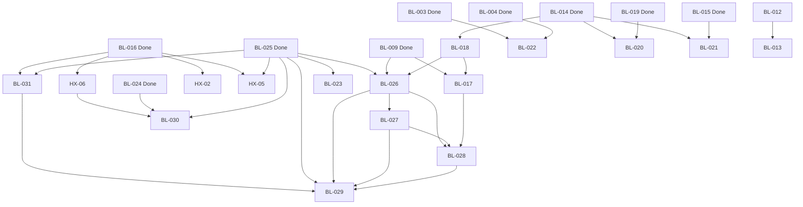

Title: Master Backlog System Implementation Plan
Document Type: Implementation Plan
Author: APC Codex
Created Date: 2026-02-23
Last Modified Date: 2026-02-23

# Master Backlog System Implementation Plan

> **For Claude:** REQUIRED SUB-SKILL: Use superpowers:executing-plans to implement this plan task-by-task.

**Goal:** Migrate LocusQ from a single-file backlog+runbook system to a layered catalog with master index, standardized individual runbook docs (with agent mega-prompts), and preserved annex specs.

**Architecture:** Three-tier layered catalog — master index (dashboard), individual runbook docs per backlog item (execution contracts with agent prompts), and existing annex plan specs (deep architecture, unchanged). All 34 items (17 open + 17 closed) get standardized runbook docs.

**Tech Stack:** Markdown documentation, Mermaid diagrams, shell validation scripts.

---

## Task 1: Create Directory and Templates

**Files:**
- Create: `Documentation/backlog/` (directory)
- Create: `Documentation/backlog/_template-runbook.md`
- Create: `Documentation/backlog/_template-closeout.md`
- Create: `Documentation/backlog/_template-intake.md`

**Step 1: Create directory**

```bash
mkdir -p Documentation/backlog
```

**Step 2: Write active-item runbook template**

Create `Documentation/backlog/_template-runbook.md` with metadata header, all 12 required sections from the design doc: Status Ledger, Effort Estimate, Objective, Scope & Non-Scope, Architecture Context, Implementation Slices table, Agent Mega-Prompt (skill-aware + standalone), Validation Plan, Risks & Mitigations, Failure & Rollback Paths, Evidence Bundle Contract, Closeout Checklist.

Template must include `[FILL]` markers for every field that varies per item.

**Step 3: Write closeout-item template**

Create `Documentation/backlog/_template-closeout.md` with the 6 lightweight closeout sections: Status Ledger (with completed date), Objective (past tense), What Was Built, Key Files, Evidence References, Completion Date.

**Step 4: Write intake template**

Create `Documentation/backlog/_template-intake.md` with: Origin (user/research/regression), Rough Description, Proposed Priority, Dependency Guesses, Next Step (triage or discard).

**Step 5: Commit**

```bash
git add Documentation/backlog/
git commit -m "docs: add backlog directory with runbook, closeout, and intake templates"
```

---

## Task 2: Create Master Index

**Files:**
- Create: `Documentation/backlog/index.md`

**Step 1: Write the master index**

Source data: `Documentation/backlog-post-v1-agentic-sprints.md` (current master backlog).

The index must contain these sections in order:

1. **Metadata header** (Title, Document Type, Author, Created/Modified dates)
2. **Purpose** — one paragraph stating this is the single backlog authority
3. **Canonical Contract** — 6 rules carried from current master (adapted to reference `Documentation/backlog/` instead of runbooks file)
4. **Layer Model** — table showing Master Index / Runbook Docs / Annex Specs / Archive roles and authority
5. **Dashboard Table** — all 34 items in priority order:

```markdown
| # | ID | Title | Priority | Status | Track | Depends On | Blocks | Runbook |
|--:|-----|-------|----------|--------|-------|------------|--------|---------|
```

Populate from the current Structured TODO Registry (17 open items) plus the Closed Archive (17 done items). Open items keep their current ordering (1-17). Closed items follow after, ordered by ID.

6. **Dependency Graph** — Mermaid diagram encoding ALL dependency relationships from the current "Dependency and Ordering Rules" section:



7. **Parallel Agent Tracks** — table of 7 tracks (A-G) with scope and skill routing, carried from current master.

8. **Intake Process** — 4-step process (Capture, Triage, Promote, Archive) from design doc.

9. **Definition of Ready** — 3 criteria from current master.

10. **Definition of Done** — 4 criteria from current master, updated to reference `Documentation/backlog/index.md` instead of the old file.

11. **Sync Contract** — ADR-0005 extended rules for status changes.

12. **Material Preservation Map** — backlog ID to annex spec mapping, carried from current master.

**Step 2: Validate structure**

Verify: metadata header present, all 34 items in dashboard table, Mermaid renders correctly, all links resolve.

**Step 3: Commit**

```bash
git add Documentation/backlog/index.md
git commit -m "docs: create master backlog index with dashboard, dependency graph, and governance"
```

---

## Task 3: Generate Closed-Item Closeout Runbooks (Batch 1: BL-001 through BL-008)

**Files:**
- Create: `Documentation/backlog/bl-001-readme-standards.md`
- Create: `Documentation/backlog/bl-002-physics-preset-reversion.md`
- Create: `Documentation/backlog/bl-003-timeline-transport.md`
- Create: `Documentation/backlog/bl-004-keyframe-gestures.md`
- Create: `Documentation/backlog/bl-005-preset-save-path.md`
- Create: `Documentation/backlog/bl-006-motion-trail-overlays.md`
- Create: `Documentation/backlog/bl-007-velocity-vector-overlays.md`
- Create: `Documentation/backlog/bl-008-rms-overlays.md`

**Step 1: For each item, create a closeout runbook using `_template-closeout.md`**

Source data for each item:
- **BL-001**: README standards and structure. Done 2026-02-21. Key files: `README.md`, `Documentation/standards.md`. Established metadata headers and folder placement rules.
- **BL-002**: Physics preset host reversion fix. Done 2026-02-21. Key files: `Source/PluginProcessor.cpp` (preset save/load path), `Source/PhysicsEngine.h`. Fixed host-stored physics state reverting on reload.
- **BL-003**: Timeline transport controls restore. Done 2026-02-21. Key files: `Source/KeyframeTimeline.cpp`, `Source/PluginEditor.cpp`, `Source/ui/public/js/index.js`. Restored play/pause/stop/scrub in production UI.
- **BL-004**: Keyframe editor gestures in production UI. Done 2026-02-21. Key files: `Source/KeyframeTimeline.cpp`, `Source/ui/public/js/index.js`. Full keyframe editing gestures (add/delete/drag/select).
- **BL-005**: Preset save host path fix. Done 2026-02-21. Key files: `Source/PluginProcessor.cpp`. Fixed preset file path resolution in host environments.
- **BL-006**: Motion trail overlays. Done 2026-02-21. Key files: `Source/ui/public/js/index.js`, `Source/SceneGraph.h`. Visual motion trail paths for emitters in viewport.
- **BL-007**: Velocity vector overlays. Done 2026-02-21. Key files: `Source/ui/public/js/index.js`, `Source/SceneGraph.h`. Arrow overlays showing emitter velocity direction/magnitude.
- **BL-008**: Audio-reactive RMS overlays. Done 2026-02-21. Key files: `Source/ui/public/js/index.js`, `Source/SceneGraph.h`, `Source/PluginProcessor.cpp`. RMS ring overlays on emitters responding to audio levels.

Each closeout runbook follows this structure:
```markdown
Title: BL-XXX <Title>
Document Type: Backlog Runbook (Closeout)
Author: APC Codex
Created Date: 2026-02-23
Last Modified Date: 2026-02-23

# BL-XXX: <Title>

## Status Ledger
| Field | Value |
|---|---|
| Priority | P0 |
| Status | Done |
| Completed | 2026-02-21 |
| Owner Track | Track <X> |

## Objective
<Past tense description of what was accomplished.>

## What Was Built
<2-4 bullet summary of key changes.>

## Key Files
- `Source/...`
- `Source/ui/...`

## Evidence References
- Production self-test baseline (part of initial P0 closeout cycle)
- `TestEvidence/build-summary.md` entries for 2026-02-21

## Completion Date
2026-02-21
```

**Step 2: Commit batch**

```bash
git add Documentation/backlog/bl-00[1-8]-*.md
git commit -m "docs: add closeout runbooks for BL-001 through BL-008"
```

---

## Task 4: Generate Closed-Item Closeout Runbooks (Batch 2: BL-009 through BL-025 + HX-01/03/04)

**Files:**
- Create: `Documentation/backlog/bl-009-steam-headphone-contract.md`
- Create: `Documentation/backlog/bl-010-fdn-expansion.md`
- Create: `Documentation/backlog/bl-011-clap-lifecycle.md`
- Create: `Documentation/backlog/bl-014-overlay-strict-closeout.md`
- Create: `Documentation/backlog/bl-015-all-emitter-rendering.md`
- Create: `Documentation/backlog/bl-016-transport-contract.md`
- Create: `Documentation/backlog/bl-019-physics-interaction-lens.md`
- Create: `Documentation/backlog/bl-024-reaper-host-automation.md`
- Create: `Documentation/backlog/bl-025-emitter-uiux-v2.md`
- Create: `Documentation/backlog/hx-01-shared-ptr-atomic.md`
- Create: `Documentation/backlog/hx-03-reaper-multi-instance.md`
- Create: `Documentation/backlog/hx-04-scenario-coverage.md`

**Step 1: For each item, create closeout runbook**

Source data:
- **BL-009**: Steam headphone contract closeout. Done 2026-02-23. Key files: `Source/SpatialRenderer.h`, `Source/PluginProcessor.cpp`. Established Steam Audio binaural rendering contract with deterministic headphone fallback.
- **BL-010**: FDN expansion promotion. Done 2026-02-23. Key files: `Source/FDNReverb.h`. Promoted 4x4 Hadamard FDN to production status.
- **BL-011**: CLAP lifecycle and CI/host closeout. Done 2026-02-23. Annex: `Documentation/plans/bl-011-clap-contract-closeout-2026-02-23.md`. Key files: `Source/PluginProcessor.cpp`, CMake config. Full CLAP adapter build/install/descriptor/validator evidence.
- **BL-014**: Listener/speaker/aim/RMS overlay strict closeout. Done 2026-02-24. Key files: `Source/ui/public/js/index.js`, `Source/SceneGraph.h`, `Source/PluginProcessor.cpp`. Deterministic overlay confidence lanes with strict evidence.
- **BL-015**: All-emitter realtime rendering closure. Done 2026-02-23. Key files: `Source/SpatialRenderer.h`, `Source/PluginProcessor.cpp`. Multi-emitter processing with slot tolerance.
- **BL-016**: Visualization transport contract closure. Done 2026-02-23. Key files: `Source/PluginProcessor.cpp`, `Source/ui/public/js/index.js`, `Documentation/scene-state-contract.md`. Lock-free scene snapshot cadence and transport state contract.
- **BL-019**: Physics interaction lens closure. Done 2026-02-23. Key files: `Source/PhysicsEngine.h`, `Source/ui/public/js/index.js`. Physics simulation with collision, drag, zero-g drift.
- **BL-024**: REAPER host automation plan. Done (baseline). Annex: `Documentation/plans/reaper-host-automation-plan-2026-02-22.md`. Key files: host integration scripts.
- **BL-025**: EMITTER UI/UX v2 deterministic closeout. Done 2026-02-24. Annex: `Documentation/plans/bl-025-emitter-uiux-v2-spec-2026-02-22.md`. Key files: `Source/ui/public/index.html`, `Source/ui/public/js/index.js`, `Source/PluginEditor.cpp`. Full EMITTER panel redesign with 5 slices.
- **HX-01**: shared_ptr atomic migration guard. Done 2026-02-23. Key files: `Source/SharedPtrAtomicContract.h`. Atomic shared_ptr contract enforcement.
- **HX-03**: REAPER multi-instance stability lane. Done 2026-02-23. Key files: validation scripts. Multi-instance host stability evidence.
- **HX-04**: Scenario coverage audit and drift guard. Done 2026-02-23. Key files: `Documentation/testing/hx-04-scenario-coverage-audit-2026-02-23.md`. Deterministic scenario audit with coverage matrix.

**Step 2: Commit batch**

```bash
git add Documentation/backlog/bl-009-*.md Documentation/backlog/bl-01[0-9]-*.md Documentation/backlog/bl-02[4-5]-*.md Documentation/backlog/hx-0[1,3,4]-*.md
git commit -m "docs: add closeout runbooks for BL-009 through BL-025 and HX-01/03/04"
```

---

## Task 5: Generate Open-Item Runbooks — In Validation Tier (BL-012, BL-013, BL-018, BL-022)

**Files:**
- Create: `Documentation/backlog/bl-012-qa-harness-tranche.md`
- Create: `Documentation/backlog/bl-013-hostrunner-feasibility.md`
- Create: `Documentation/backlog/bl-018-spatial-format-matrix.md`
- Create: `Documentation/backlog/bl-022-choreography-closeout.md`

**Step 1: Create each runbook using `_template-runbook.md` with all 12 sections**

Each must include:

**BL-012: QA Harness Tranche Closeout**
- Priority: P1 | Status: In Validation | Track D QA Platform
- Depends on: none | Blocks: BL-013
- Objective: Complete QA harness tranche closeout while preserving HX-04 embedded parity guard.
- Slices: Single validation tranche — rerun harness suite, embed HX-04 parity audit, capture evidence.
- Effort: Med / M
- Agent Mega-Prompt (skill-aware):
  ```
  /test BL-012: QA harness tranche closeout
  Load: $skill_test, $skill_testing, $skill_troubleshooting
  Objective: Rerun QA harness suite with HX-04 parity guard embedded. Capture tranche closeout evidence.
  Constraints: HX-04 parity check must remain green in every rerun. Do not modify harness test code.
  Validation: ctest --test-dir build -R harness && ./scripts/qa-standalone-calibration-binaural-multichannel-mac.sh
  Evidence: TestEvidence/bl012_harness_tranche_<timestamp>/status.tsv
  ```
- Agent Mega-Prompt (standalone fallback): Full context about LocusQ QA harness (ctest-based, 45+ tests, uses custom runner app), HX-04 parity guard (deterministic scenario audit per Documentation/testing/hx-04-scenario-coverage-audit-2026-02-23.md), and exact validation commands.
- Validation Plan: harness ctest lane, HX-04 scenario audit lane, docs freshness gate.
- Risks: Harness regression from environment drift | Mitigation: pin CMake/dependency versions.
- Failure path: If ctest fails, check known-issues.yaml, then run individual failing tests with verbose output.
- Evidence bundle: `TestEvidence/bl012_harness_tranche_<timestamp>/status.tsv`

**BL-013: HostRunner Feasibility Promotion**
- Priority: P1 | Status: In Validation | Track D QA Platform
- Depends on: BL-012 | Blocks: none
- Annex: `Documentation/plans/bl-013-hostrunner-feasibility-2026-02-23.md`
- Objective: Decide promotion from feasibility to sustained validation lane. VST3 backend passes; CLAP backend parity is the open risk.
- Slices: (A) Rerun feasibility probes, (B) Add CLAP backend probe if VST3 passes.
- Effort: Low / S per slice
- Agent prompts: Reference feasibility annex spec, exact repro commands from the spec (`ctest --test-dir build -R HostRunner`), and CLAP probe addition guidance.
- Validation: feasibility rerun + host test pass.
- Risks: CLAP backend may not have skeleton probe support yet.
- Evidence: `TestEvidence/bl013_hostrunner_<timestamp>/status.tsv`

**BL-018: Spatial Format Matrix Strict Closeout**
- Priority: P1 | Status: In Validation | Track A Runtime Formats
- Depends on: BL-014 (Done) | Blocks: BL-026, BL-017
- Objective: Promote spatial profile expansion with strict warning-free baseline.
- Slices: Single validation tranche — strict profile matrix lanes + docs freshness.
- Effort: Med / M
- Agent prompts: Reference `Documentation/spatial-audio-profiles-usage.md`, profile enum in `Source/SpatialRenderer.h`, and profile switching in `Source/PluginProcessor.cpp`.
- Skills: `$steam-audio-capi`, `$spatial-audio-engineering`, `$skill_docs`
- Validation: profile matrix lanes, warning-free evidence, docs freshness gate.
- Evidence: `TestEvidence/bl018_profile_matrix_<timestamp>/status.tsv`

**BL-022: Choreography Lane Closeout**
- Priority: P1 | Status: In Validation | Track C UX Authoring
- Depends on: BL-003, BL-004 (Done) | Blocks: none
- Objective: Finalize choreography pack with BL-025 regression guard.
- Slices: (A) Choreography-specific validation, (B) BL-025 regression guard rerun.
- Effort: Low / S
- Agent prompts: Reference timeline/keyframe systems, BL-025 self-test lane, production self-test.
- Skills: `$skill_test`, `$juce-webview-runtime`
- Validation: choreography lane + BL-025 regression guard.
- Evidence: `TestEvidence/bl022_choreography_<timestamp>/`

**Step 2: Commit batch**

```bash
git add Documentation/backlog/bl-01[2,3,8]-*.md Documentation/backlog/bl-022-*.md
git commit -m "docs: add runbooks for in-validation items BL-012, BL-013, BL-018, BL-022"
```

---

## Task 6: Generate Open-Item Runbooks — In Planning Tier P1 (BL-026, BL-031)

**Files:**
- Create: `Documentation/backlog/bl-026-calibrate-uiux-v2.md`
- Create: `Documentation/backlog/bl-031-tempo-token-scheduler.md`

**Step 1: Create BL-026 runbook**

- Priority: P1 | Status: In Planning | Track C UX Authoring
- Depends on: BL-025 baseline, BL-009/BL-018 diagnostics stable | Blocks: BL-027, BL-028, BL-029
- Annex: `Documentation/plans/bl-026-calibrate-uiux-v2-spec-2026-02-23.md` + `Documentation/plans/bl-026-calibrate-v1-v2-uiux-comparison-2026-02-23.md`
- Objective: Redesign CALIBRATE panel to support multi-topology monitoring profiles and calibration profile library.
- 5 Slices (A-E) with file targets from annex spec:
  - A: Topology profile selector + alias dictionary (`Source/PluginProcessor.cpp`, `Source/ui/public/index.html`, `Source/ui/public/js/index.js`)
  - B: Dynamic speaker row rendering per topology
  - C: Profile library save/recall
  - D: Validation diagnostic cards (pass/fail blocks)
  - E: Host integration + resize regression
- Effort: High / XL total; Med / M per slice
- Agent prompts per slice referencing exact code line numbers from annex spec.
- Skills: `$skill_design`, `$juce-webview-runtime`, `$threejs`, `$skill_plan`, `$skill_docs`
- Validation: `UI-P1-026A..E` lanes + host/manual checks + docs freshness gate.
- Risks: 4-channel routing ceiling, cross-panel coherence with BL-027.
- Evidence: `TestEvidence/bl026_calibrate_v2_<timestamp>/`

**Step 2: Create BL-031 runbook**

- Priority: P1 | Status: In Planning (spec complete) | Track B Scene/UI Runtime
- Depends on: BL-016, BL-025 (Done) | Blocks: BL-029
- Annex: `Documentation/plans/bl-031-tempo-locked-visual-token-scheduler-spec-2026-02-24.md`
- Objective: Implement host-tempo-synchronized visual timing contract with sample-stamped tokens.
- 4 Slices (A-D) from annex spec:
  - A: Audio-thread token scheduler (`Source/PluginProcessor.cpp`, new `Source/VisualTokenScheduler.h`)
  - B: Lock-free snapshot publication + atomic ordering
  - C: UI polling + bridge integration (`Source/PluginEditor.cpp`, `Source/ui/public/js/index.js`)
  - D: Deterministic tempo ramp tests
- Effort: High / L; Med / M per slice
- Agent prompts with C++ struct definitions from annex spec and atomic ordering rules.
- Skills: `$juce-webview-runtime`, `$reactive-av`, `$physics-reactive-audio`, `$skill_impl`
- Validation: `UI-P2-031A..D` rhythm-lock lanes + sequence monotonicity assertion.
- Risks: Host tempo info availability varies across AU/VST3/CLAP.
- Evidence: `TestEvidence/bl031_tempo_token_<timestamp>/`

**Step 3: Commit batch**

```bash
git add Documentation/backlog/bl-026-*.md Documentation/backlog/bl-031-*.md
git commit -m "docs: add runbooks for P1 planning items BL-026 and BL-031"
```

---

## Task 7: Generate Open-Item Runbooks — Hardening Tier (HX-02, HX-05, HX-06)

**Files:**
- Create: `Documentation/backlog/hx-02-registration-lock.md`
- Create: `Documentation/backlog/hx-05-payload-budget.md`
- Create: `Documentation/backlog/hx-06-rt-safety-audit.md`

**Step 1: Create HX-02 runbook**

- Priority: P1 | Status: Open | Track F Hardening
- Depends on: BL-016 (Done) | Blocks: none
- Objective: Audit and fix registration lock and memory-order contract expectations in SceneGraph and shared state paths.
- Slices: (A) Static analysis of atomic ordering in SceneGraph.h and SharedPtrAtomicContract.h, (B) Fix any found violations, (C) Regression validation.
- Effort: Med / M
- Skills: `$skill_impl`, `$skill_testing`, `$juce-webview-runtime`
- Validation: concurrency regression checks + smoke/acceptance sanity reruns.
- Risks: False positives from static analysis; memory-order changes can introduce subtle bugs.
- Evidence: `TestEvidence/hx02_registration_audit_<timestamp>/`

**Step 2: Create HX-05 runbook**

- Priority: P2 | Status: Open | Track F Hardening
- Depends on: BL-016, BL-025 (Done) | Blocks: none
- Objective: Enforce scene payload budget and throttle contract for UI responsiveness under high emitter counts.
- Slices: (A) Measure current payload sizes, (B) Define budget thresholds, (C) Implement throttle/drop policy, (D) Stress validation.
- Effort: Med / L
- Skills: `$skill_impl`, `$juce-webview-runtime`, `$skill_testing`
- Validation: high-emitter stress lane (8+ emitters) + cadence/payload assertions.
- Evidence: `TestEvidence/hx05_payload_budget_<timestamp>/`

**Step 3: Create HX-06 runbook**

- Priority: P1 | Status: Open | Track F Hardening
- Depends on: BL-016 (Done) | Blocks: BL-030
- Objective: Establish recurring RT-safety static-audit lane scanning processBlock() call paths for allocation/lock/blocking violations.
- Slices: (A) Write audit script (grep/AST-based), (B) CI integration, (C) Baseline run + report.
- Effort: Med / M
- Skills: `$skill_impl`, `$skill_testing`, `$skill_docs`
- Validation: audit script exit 0 on clean codebase + CI lane green + report artifact.
- Evidence: `TestEvidence/hx06_rt_audit_<timestamp>/`

**Step 4: Commit batch**

```bash
git add Documentation/backlog/hx-0[2,5,6]-*.md
git commit -m "docs: add runbooks for hardening items HX-02, HX-05, HX-06"
```

---

## Task 8: Generate Open-Item Runbooks — In Planning Tier P2 (BL-027, BL-028, BL-029, BL-030)

**Files:**
- Create: `Documentation/backlog/bl-027-renderer-uiux-v2.md`
- Create: `Documentation/backlog/bl-028-spatial-output-matrix.md`
- Create: `Documentation/backlog/bl-029-dsp-visualization.md`
- Create: `Documentation/backlog/bl-030-release-governance.md`

**Step 1: Create BL-027 runbook**

- Priority: P2 | Status: In Planning | Track C UX Authoring
- Depends on: BL-026 | Blocks: BL-028, BL-029
- Annex: `Documentation/plans/bl-027-renderer-uiux-v2-spec-2026-02-23.md`
- Objective: Redesign RENDERER panel to be profile-authoritative with requested/active/stage diagnostics.
- 5 Slices (A-E): profile selector, output/speaker dynamic rendering, Steam diagnostic card, Ambisonic diagnostic card, host integration.
- Effort: High / XL; Med / M per slice
- Skills: `$skill_design`, `$juce-webview-runtime`, `$threejs`, `$steam-audio-capi`, `$spatial-audio-engineering`
- Validation: `UI-P2-027A..E` lanes + renderer profile parity checks.
- Evidence: `TestEvidence/bl027_renderer_v2_<timestamp>/`

**Step 2: Create BL-028 runbook**

- Priority: P2 | Status: In Planning | Track A + Track C
- Depends on: BL-017, BL-026, BL-027 | Blocks: BL-029
- Annex: `Documentation/plans/bl-028-spatial-output-matrix-spec-2026-02-24.md`
- Objective: Enforce spatial output matrix legality (RendererDomain enum, 7 SOM rules, device profile contract, head tracking state model).
- 5 Slices from annex: RendererDomain enum + matrix enforcement, device profile contract, head tracking state, telemetry fields, integration validation.
- Effort: High / L
- Skills: `$spatial-audio-engineering`, `$steam-audio-capi`, `$skill_impl`
- Validation: matrix legality checks + domain/status parity lanes.
- Related ADRs: ADR-0006, ADR-0012.
- Evidence: `TestEvidence/bl028_output_matrix_<timestamp>/`

**Step 3: Create BL-029 runbook**

- Priority: P2 | Status: In Planning | Track B Scene/UI Runtime
- Depends on: BL-025, BL-026, BL-027, BL-028, BL-031 | Blocks: none
- Annex: `Documentation/plans/bl-029-dsp-visualization-and-tooling-spec-2026-02-24.md`
- Objective: Implement four visualization priorities — deterministic modulation visualizer, spectral-spatial hybrid room view, reflection ghost modeling, offline ML calibration assistant.
- 8 Slices (A-H) from annex spec.
- Effort: Very High / XL
- Skills: `$reactive-av`, `$threejs`, `$physics-reactive-audio`, `$juce-webview-runtime`, `$skill_impl`
- Validation: `UI-P2-029A..E` lanes + schema sync checks.
- Risks: Heaviest dependency chain; Slice H (ML) is aspirational.
- Evidence: `TestEvidence/bl029_dsp_viz_<timestamp>/`

**Step 4: Create BL-030 runbook**

- Priority: P2 | Status: In Planning | Track G Release/Governance
- Depends on: BL-024, BL-025 (Done), HX-06 | Blocks: none
- Objective: Operationalize recurring release/device-rerun governance checklist.
- Slices: (A) Release checklist template, (B) Device rerun matrix (DEV-01..DEV-06), (C) CI integration, (D) First execution.
- Effort: Med / M
- Skills: `$skill_docs`, `$skill_plan`, `$skill_test`, `$skill_ship`
- Validation: manual device rerun checklist + closeout sync checklist.
- Evidence: `TestEvidence/bl030_release_governance_<timestamp>/`

**Step 5: Commit batch**

```bash
git add Documentation/backlog/bl-02[7-9]-*.md Documentation/backlog/bl-030-*.md
git commit -m "docs: add runbooks for P2 planning items BL-027, BL-028, BL-029, BL-030"
```

---

## Task 9: Generate Open-Item Runbooks — Todo Tier (BL-017, BL-020, BL-021, BL-023)

**Files:**
- Create: `Documentation/backlog/bl-017-head-tracked-monitoring.md`
- Create: `Documentation/backlog/bl-020-confidence-masking.md`
- Create: `Documentation/backlog/bl-021-room-story-overlays.md`
- Create: `Documentation/backlog/bl-023-resize-dpi-hardening.md`

**Step 1: Create BL-017 runbook**

- Priority: P2 | Status: In Planning | Track E R&D Expansion
- Depends on: BL-009 (Done), BL-018 | Blocks: BL-028
- Annex: `Documentation/plans/bl-017-head-tracked-monitoring-companion-bridge-plan-2026-02-22.md`
- Objective: Deliver companion bridge for head-tracked headphone monitoring without violating RT constraints.
- 3 Slices (A-C) from annex: bridge receiver + lock-free snapshot, pose application in SpatialRenderer, companion app MVP.
- Effort: High / L
- Skills: `$skill_plan`, `$spatial-audio-engineering`, `$steam-audio-capi`
- Validation: synthetic bridge contract lane + non-regression on spatial lanes.
- Evidence: `TestEvidence/bl017_head_tracking_<timestamp>/`

**Step 2: Create BL-020 runbook**

- Priority: P2 | Status: Todo | Track E R&D Expansion
- Depends on: BL-014, BL-019 (Done) | Blocks: none
- Objective: Implement confidence/masking overlay mapping with deterministic data pipeline.
- Slices: (A) Define confidence data schema, (B) Implement overlay rendering, (C) Validation matrix.
- Effort: Med / M
- Skills: `$skill_plan`, `$reactive-av`, `$threejs`
- Validation: overlay mapping assertions + UI responsiveness checks.
- Evidence: `TestEvidence/bl020_confidence_overlay_<timestamp>/`

**Step 3: Create BL-021 runbook**

- Priority: P2 | Status: Todo | Track E R&D Expansion
- Depends on: BL-014, BL-015 (Done) | Blocks: none
- Objective: Implement adaptive room-story overlays on stable telemetry surfaces.
- Slices: (A) Room analysis telemetry mapping, (B) Overlay rendering, (C) Payload budget compliance.
- Effort: Med / M
- Skills: `$skill_plan`, `$reactive-av`, `$threejs`
- Validation: overlay correctness + payload budget guard checks.
- Evidence: `TestEvidence/bl021_room_story_<timestamp>/`

**Step 4: Create BL-023 runbook**

- Priority: P2 | Status: Todo | Track C UX Authoring
- Depends on: BL-025 (Done) | Blocks: none
- Objective: Harden resize/DPI behavior across hosts and display configurations.
- Slices: (A) Host resize matrix documentation, (B) Fix identified resize issues, (C) DPI scaling validation.
- Effort: Med / M
- Skills: `$juce-webview-runtime`, `$skill_testing`
- Validation: host resize matrix checks + control interaction regression checks.
- Evidence: `TestEvidence/bl023_resize_dpi_<timestamp>/`

**Step 5: Commit batch**

```bash
git add Documentation/backlog/bl-01[7]-*.md Documentation/backlog/bl-02[0,1,3]-*.md
git commit -m "docs: add runbooks for todo/planning items BL-017, BL-020, BL-021, BL-023"
```

---

## Task 10: Update Governance Docs and Archive Legacy

**Files:**
- Modify: `Documentation/README.md`
- Modify: `Documentation/standards.md`
- Move: `Documentation/runbooks/backlog-execution-runbooks.md` → archived or deprecated
- Modify: `Documentation/backlog-post-v1-agentic-sprints.md` (add deprecation notice)

**Step 1: Update `Documentation/README.md`**

- Add `Documentation/backlog/index.md` to Tier 0 canonical list
- Add `Documentation/backlog/*.md` (runbooks) to Tier 1 execution specs
- Move `Documentation/runbooks/backlog-execution-runbooks.md` to Tier 3 archived
- Move `Documentation/backlog-post-v1-agentic-sprints.md` to Tier 2 reference (superseded by index.md)

**Step 2: Update `Documentation/standards.md`**

- Update "Master Backlog Contract" section to reference `Documentation/backlog/index.md` as the single authority
- Add runbook template reference
- Add intake process reference

**Step 3: Add deprecation notice to `Documentation/backlog-post-v1-agentic-sprints.md`**

Add at top:
```markdown
> **DEPRECATED:** This file is superseded by `Documentation/backlog/index.md` as of 2026-02-23.
> Retained for historical reference only. Do not update this file.
```

**Step 4: Archive legacy runbook**

Move `Documentation/runbooks/backlog-execution-runbooks.md` to `Documentation/archive/2026-02-23-legacy-runbooks/backlog-execution-runbooks.md` with a README.md explaining the migration.

**Step 5: Commit**

```bash
git add Documentation/README.md Documentation/standards.md Documentation/backlog-post-v1-agentic-sprints.md Documentation/archive/2026-02-23-legacy-runbooks/ Documentation/runbooks/
git commit -m "docs: update governance surfaces for backlog system migration, archive legacy runbook"
```

---

## Task 11: Final Validation

**Step 1: Verify all files exist**

```bash
ls Documentation/backlog/ | wc -l
# Expected: 37 files (2 templates + 1 index + 34 runbooks)
```

**Step 2: Verify metadata compliance**

Check every file in `Documentation/backlog/` has required metadata header (Title, Document Type, Author, Created Date, Last Modified Date).

**Step 3: Verify link integrity**

Check that all annex spec links in runbooks resolve to existing files.

**Step 4: Verify master index completeness**

Confirm all 34 items appear in the dashboard table with correct status, priority, and dependency columns.

**Step 5: Run docs freshness gate**

```bash
./scripts/validate-docs-freshness.sh
```

**Step 6: Final commit if any fixes needed**

```bash
git add -A Documentation/backlog/
git commit -m "docs: fix backlog system validation issues"
```
