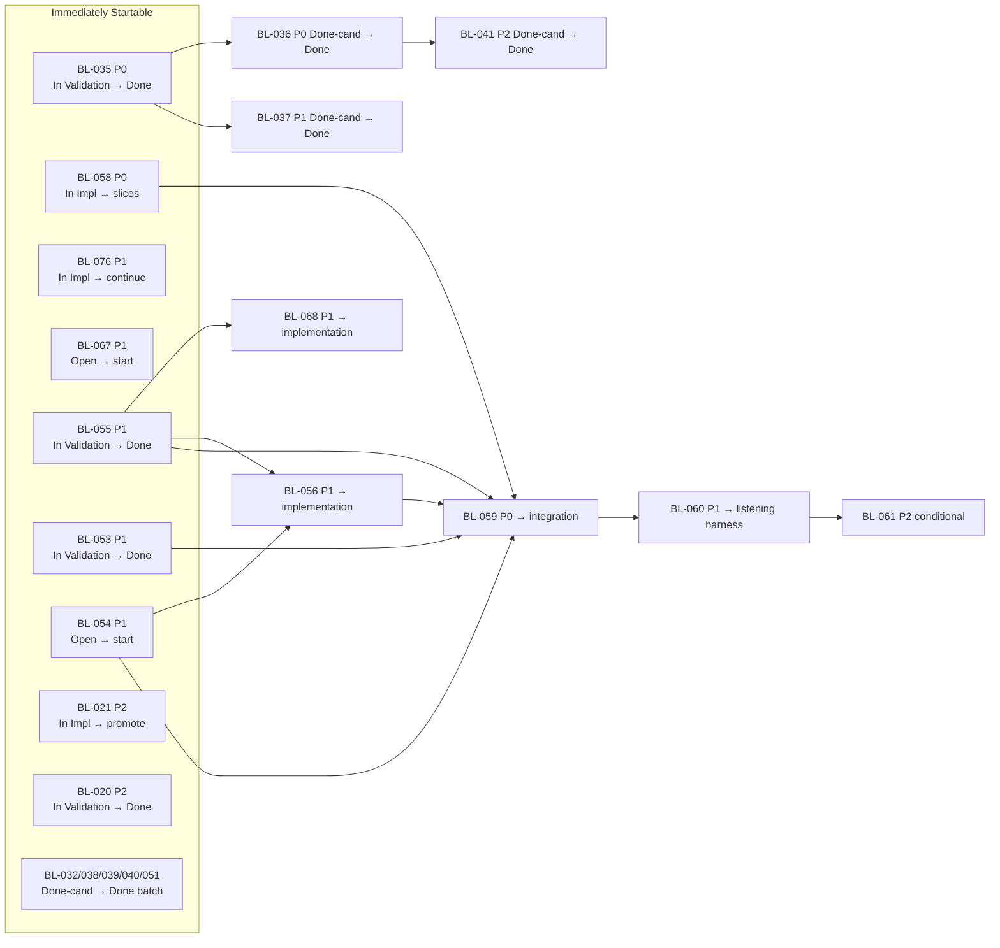

Title: LocusQ Backlog Completion Plan — Multi-Agent Parallel Execution
Document Type: Planning Report
Author: APC Codex
Created Date: 2026-03-05
Last Modified Date: 2026-03-05

# LocusQ Backlog Completion Plan — Multi-Agent Parallel Execution

> Authority: `Documentation/backlog/index.md` (canonical backlog state).
> Branch: `claude/backlog-completion-plan-2h1PJ`
> Session date: 2026-03-05

---

## 1. Incomplete Item Inventory

22 open items remain as of 2026-03-05. Grouped by execution posture.

### 1A — Done-Candidate (final promotion only, no implementation work)

| ID | Title | Priority | Track | Dependency Gate | Promotion Blocker |
|---|---|---|---|---|---|
| BL-032 | Source modularization of PluginProcessor/PluginEditor | P2 | F | — | None — promote immediately |
| BL-038 | Calibration threading and telemetry | P1 | E | BL-026 ✓, BL-034 ✓ | None — promote immediately |
| BL-039 | Parameter relay spec generation | P1 | B | BL-027 ✓, BL-032 Done-cand. | None — promote immediately |
| BL-040 | UI modularization and authority status UX | P1 | B | BL-027 ✓, BL-039 Done-cand. | None — promote immediately |
| BL-051 | Ambisonics and ADM roadmap | P3 | E | BL-046 ✓, BL-050 ✓ | None — promote immediately |
| BL-036 | DSP finite output guardrails | P0 | F | BL-035 (In Validation) | BL-035 must reach Done first |
| BL-037 | Emitter snapshot CPU budget | P1 | F | BL-035 (In Validation) | BL-035 must reach Done first |
| BL-041 | Doppler v2 and VBAP geometry validation | P2 | E | BL-036 (Done-candidate) | BL-036 must reach Done first |

### 1B — In Validation (owner promotion packet required)

| ID | Title | Priority | Track | Current Evidence | Next Action |
|---|---|---|---|---|---|
| BL-035 | RT lock-free registration | P0 | F | D8 PASS (`non_allowlisted=0`) | Run T2/T3 promotion replay → owner packet |
| BL-055 | FIR convolution engine | P1 | E | C4/C6 remediation PASS; follow-up PASS | Run T2/T3 promotion replay → owner packet |
| BL-053 | Head tracking orientation injection | P1 | E | Structural replay PASS; manual sync captured | Owner promotion packet → Done |
| BL-020 | Confidence/masking overlay mapping | P2 | E | C4 refresh PASS (`20260228T203021Z`) | Owner promotion packet → Done |

### 1C — In Implementation (active implementation work)

| ID | Title | Priority | Track | Current State | Unblocked? |
|---|---|---|---|---|---|
| BL-058 | Companion profile acquisition UI + HRTF matching | P0 | E | Wave 1 kickoff; QA harness authored | YES (BL-057 ✓) |
| BL-059 | CalibrationProfile integration handoff | P0 | E | Wave 1 kickoff; smoke harness upgraded | NO — blocked by BL-053, BL-054, BL-055, BL-056, BL-058 |
| BL-076 | SpatialRenderer decomposition and boundary guardrails | P1 | F | Wave 6 landed; contract+execute PASS 2026-03-05 | YES (BL-050 ✓, BL-069 ✓, BL-070 ✓) |
| BL-021 | Room-story overlays | P2 | E | C4 execute parity PASS; C4b non-interference PASS; owner intake pending | YES (deps Done) |
| BL-068 | Temporal effects core | P1 | E | In Implementation (runbook); index shows Open | PARTIAL (needs BL-055) |

### 1D — Open (not yet started or conditionally blocked)

| ID | Title | Priority | Track | Depends On | Ready? |
|---|---|---|---|---|---|
| BL-054 | PEQ cascade RT integration | P1 | E | BL-052 ✓ | YES |
| BL-067 | AUv3 app-extension lifecycle and host validation | P1 | A | BL-048 ✓, BL-073 ✓ | YES |
| BL-056 | Calibration state migration + latency | P1 | E | BL-054 (Open), BL-055 (In Validation) | NO — blocked |
| BL-060 | Phase B listening test harness | P1 | E | BL-059 (In Implementation) | NO — blocked |
| BL-061 | HRTF interpolation + crossfade | P2 | E | BL-060 gate pass | NO — conditional |

---

## 2. Dependency Critical Path



---

## 3. Parallel Session Wave Plan

### Wave 1 — Start Immediately (9 parallel sessions)

All Wave 1 sessions operate on disjoint code/evidence areas. **No session writes to `Documentation/backlog/index.md`, `status.json`, `TestEvidence/build-summary.md`, or `TestEvidence/validation-trend.md` directly** — those writes are deferred to the Wave 1 Governance Sync.

Every session must report `SHARED_FILES_TOUCHED: no` at handoff unless explicitly permitted below.

---

#### Session 1A — BL-035: RT Lock-Free Registration Final Promotion (P0)

**Owner Track:** F — Hardening
**Skills:** `skill_impl`, `skill_testing`, `skill_docs`
**Lane:** BL-035 exclusive
**Session Type:** Validation + Promotion

**Work:**
1. Run T2 candidate-gate replay (5 runs) for BL-035 lane.
2. If T2 green, escalate to T3 promotion-gate replay (10 runs).
3. Capture `TestEvidence/bl035_promotion_<timestamp>/` bundle: `status.tsv`, `rt_audit.tsv`, `promotion_decision.md`.
4. Advance BL-035 runbook Status Ledger to Done-candidate.
5. Report: `SHARED_FILES_TOUCHED: no`

**Promotion blocker unlocked when complete:** BL-036, BL-037 become promotable.

**Agent mega-prompt:**
```
You are working on BL-035 RT lock-free registration final promotion in LocusQ.
Branch: claude/backlog-completion-plan-2h1PJ
Runbook: Documentation/backlog/bl-035-rt-lock-free-registration.md
Evidence baseline: TestEvidence/bl035_slice_d8_owner_ready_20260228T203301Z/ (PASS)

Task: Run T2 (5 runs) then T3 (10 runs) promotion replay for BL-035. Capture evidence bundle
under TestEvidence/bl035_promotion_<timestamp>/. If all gates PASS (build/smoke/selftest/RT
non_allowlisted=0/docs), write promotion_decision.md and update the runbook Status Ledger to
Done-candidate. Report SHARED_FILES_TOUCHED: no. Do NOT edit index.md or status.json.
Skills: skill_impl, skill_testing, skill_docs
```

---

#### Session 1B — BL-058: Companion Profile Acquisition UI (P0)

**Owner Track:** E — R&D Expansion
**Skills:** `apple-spatial-companion-platform`, `skill_impl`, `skill_testing`
**Lane:** BL-058 exclusive
**Session Type:** Implementation

**Work:**
1. Read BL-058 runbook acceptance IDs and slice plan.
2. Implement next implementation slice: guided ear-photo capture UI (left ear + right ear + frontal frames).
3. Run contract/execute T1 replay (3 runs) to verify no regressions.
4. Capture evidence: `TestEvidence/bl058_<slice>_<timestamp>/`.
5. Update BL-058 runbook Status Ledger with slice progress.
6. Report: `SHARED_FILES_TOUCHED: no`

**Agent mega-prompt:**
```
You are working on BL-058 Companion Profile Acquisition UI + HRTF Matching in LocusQ.
Branch: claude/backlog-completion-plan-2h1PJ
Runbook: Documentation/backlog/bl-058-companion-profile-acquisition.md
Annex: Documentation/plans/2026-02-27-calibration-system-design.md

Task: Implement next BL-058 implementation slice. Read the runbook acceptance IDs and current
implementation state. Build the guided ear-photo capture UI (left/right/frontal). Run T1 replay
(3 runs), capture TestEvidence/bl058_<slice>_<timestamp>/, update runbook. Report
SHARED_FILES_TOUCHED: no. Do NOT edit index.md or status.json.
Skills: apple-spatial-companion-platform, skill_impl, skill_testing
```

---

#### Session 1C — BL-076: SpatialRenderer Decomposition Continuation (P1)

**Owner Track:** F — Hardening
**Skills:** `skill_impl`, `skill_testing`, `juce-webview-runtime`
**Lane:** BL-076 exclusive
**Session Type:** Implementation

**Work:**
1. Read BL-076 runbook to determine next extraction waves after Wave 6.
2. Continue decomposing `Source/SpatialRenderer.h` into `Source/spatial_renderer/*` modules.
3. Run contract+execute T1 replay (3 runs) verifying `non_allowlisted=0`.
4. Capture evidence: `TestEvidence/bl076_<wave>_<timestamp>/`.
5. Update BL-076 runbook Status Ledger.
6. Report: `SHARED_FILES_TOUCHED: no`

**Agent mega-prompt:**
```
You are working on BL-076 SpatialRenderer Decomposition in LocusQ.
Branch: claude/backlog-completion-plan-2h1PJ
Runbook: Documentation/backlog/bl-076-spatial-renderer-decomposition-and-boundary-guardrails.md
Annex: Documentation/plans/bl-076-spatial-renderer-decomposition-planning-packet-2026-03-02.md
Current state: Wave 6 complete (ambisonic IR contract helper extracted, PASS 2026-03-05).

Task: Continue with the next extraction wave(s) per the annex plan. Decompose remaining
SpatialRenderer.h sections into Source/spatial_renderer/* modules with boundary guardrails.
Run T1 replay (3 runs), verify non_allowlisted=0, capture TestEvidence/bl076_<wave>_<timestamp>/.
Update runbook Status Ledger. Report SHARED_FILES_TOUCHED: no. Do NOT edit index.md or status.json.
Skills: skill_impl, skill_testing
```

---

#### Session 1D — BL-067: AUv3 App-Extension Lifecycle First Slices (P1)

**Owner Track:** A — Runtime Formats
**Skills:** `auv3-plugin-lifecycle`, `skill_impl`, `skill_testing`
**Lane:** BL-067 exclusive
**Session Type:** Implementation

**Work:**
1. Read BL-067 runbook and annex spec (`Documentation/plans/bl-067-auv3-app-extension-lifecycle-and-host-validation-spec-2026-03-01.md`).
2. Implement first AUv3 lifecycle slice (app-extension boundary setup, state restoration, host validation harness).
3. Ensure execute evidence rows report zero `TODO` entries (BL-073 gate requirement).
4. Run T1 replay (3 runs), capture evidence: `TestEvidence/bl067_<slice>_<timestamp>/`.
5. Update BL-067 runbook Status Ledger.
6. Report: `SHARED_FILES_TOUCHED: no`

**Agent mega-prompt:**
```
You are working on BL-067 AUv3 App-Extension Lifecycle and Host Validation in LocusQ.
Branch: claude/backlog-completion-plan-2h1PJ
Runbook: Documentation/backlog/bl-067-auv3-app-extension-lifecycle-and-host-validation.md
Annex: Documentation/plans/bl-067-auv3-app-extension-lifecycle-and-host-validation-spec-2026-03-01.md
Gate: BL-073 execute-mode truthfulness gate is Done — zero TODO rows required in execute evidence.

Task: Implement the first BL-067 implementation slice per the annex spec. Zero TODO rows in
execute evidence is a hard requirement. Run T1 replay (3 runs), capture
TestEvidence/bl067_<slice>_<timestamp>/. Update runbook. Report SHARED_FILES_TOUCHED: no.
Do NOT edit index.md or status.json.
Skills: auv3-plugin-lifecycle, skill_impl, skill_testing
```

---

#### Session 1E — BL-055: FIR Convolution Engine Promotion (P1)

**Owner Track:** E — R&D Expansion
**Skills:** `skill_testing`, `skill_docs`, `hrtf-rendering-validation-lab`
**Lane:** BL-055 exclusive
**Session Type:** Validation + Promotion

**Work:**
1. Read BL-055 runbook. Baseline: C4/C6 remediation PASS, follow-up contract+execute PASS.
2. Run T2 (5 runs) candidate-gate replay for BL-055.
3. If T2 green, escalate to T3 (10 runs) promotion-gate replay.
4. Capture evidence bundle: `TestEvidence/bl055_promotion_<timestamp>/`.
5. Write promotion_decision.md. Update BL-055 runbook Status Ledger to Done-candidate.
6. Report: `SHARED_FILES_TOUCHED: no`

**Agent mega-prompt:**
```
You are working on BL-055 FIR Convolution Engine final promotion in LocusQ.
Branch: claude/backlog-completion-plan-2h1PJ
Runbook: Documentation/backlog/bl-055-fir-convolution-engine.md
Current state: In Validation (C4/C6 remediation landed; owner follow-up contract+execute PASS).

Task: Run T2 (5 runs) then T3 (10 runs) promotion replay for BL-055. Capture evidence bundle
under TestEvidence/bl055_promotion_<timestamp>/. If all gates PASS write promotion_decision.md
and update the runbook Status Ledger to Done-candidate. Report SHARED_FILES_TOUCHED: no.
Do NOT edit index.md or status.json.
Skills: skill_testing, skill_docs, hrtf-rendering-validation-lab
```

---

#### Session 1F — BL-053: Head Tracking Orientation Injection Promotion (P1)

**Owner Track:** E — R&D Expansion
**Skills:** `headtracking-companion-runtime`, `skill_testing`, `skill_docs`
**Lane:** BL-053 exclusive
**Session Type:** Validation + Promotion

**Work:**
1. Read BL-053 runbook. Baseline: structural replay PASS, manual operator sync captured.
2. Run T2 (5 runs) candidate-gate replay for BL-053.
3. If T2 green, run T3 (10 runs) promotion-gate replay.
4. Capture evidence: `TestEvidence/bl053_promotion_<timestamp>/`.
5. Write promotion_decision.md. Update BL-053 runbook Status Ledger to Done-candidate.
6. Report: `SHARED_FILES_TOUCHED: no`

**Agent mega-prompt:**
```
You are working on BL-053 Head Tracking Orientation Injection final promotion in LocusQ.
Branch: claude/backlog-completion-plan-2h1PJ
Runbook: Documentation/backlog/bl-053-head-tracking-orientation-injection.md
Current state: In Validation (structural lane + T1 replay PASS; manual operator sync captured;
owner promotion packet pending).

Task: Run T2 (5 runs) then T3 (10 runs) promotion replay for BL-053. Capture evidence bundle
under TestEvidence/bl053_promotion_<timestamp>/. If all gates PASS write promotion_decision.md
and update runbook Status Ledger to Done-candidate. Report SHARED_FILES_TOUCHED: no.
Do NOT edit index.md or status.json.
Skills: headtracking-companion-runtime, skill_testing, skill_docs
```

---

#### Session 1G — BL-054: PEQ Cascade RT Integration (P1)

**Owner Track:** E — R&D Expansion
**Skills:** `skill_impl`, `skill_testing`, `skill_docs`
**Lane:** BL-054 exclusive
**Session Type:** Implementation

**Work:**
1. Read BL-054 runbook and annex (`Documentation/plans/2026-02-27-calibration-system-design.md`).
2. Implement first BL-054 slice: PEQ biquad cascade wiring to RT audio thread.
3. Run T1 replay (3 runs) on contract+execute lane.
4. Capture evidence: `TestEvidence/bl054_<slice>_<timestamp>/`.
5. Update BL-054 runbook Status Ledger.
6. Report: `SHARED_FILES_TOUCHED: no`

**Agent mega-prompt:**
```
You are working on BL-054 PEQ Cascade RT Integration in LocusQ.
Branch: claude/backlog-completion-plan-2h1PJ
Runbook: Documentation/backlog/bl-054-peq-cascade-rt-integration.md
Annex: Documentation/plans/2026-02-27-calibration-system-design.md
Depends on: BL-052 (Done).

Task: Implement first BL-054 implementation slice (PEQ biquad cascade RT thread wiring) per
the runbook and annex. Run T1 replay (3 runs), capture TestEvidence/bl054_<slice>_<timestamp>/.
Update runbook. Report SHARED_FILES_TOUCHED: no. Do NOT edit index.md or status.json.
Skills: skill_impl, skill_testing
```

---

#### Session 1H — BL-021: Room-Story Overlays Owner Intake (P2)

**Owner Track:** E — R&D Expansion
**Skills:** `reactive-av`, `skill_testing`, `skill_docs`
**Lane:** BL-021 exclusive
**Session Type:** Promotion

**Work:**
1. Read BL-021 runbook. Baseline: C4 execute parity PASS, C4b non-interference PASS; owner intake pending.
2. Run T2 (5 runs) candidate-gate replay.
3. If T2 green, produce owner promotion packet.
4. Capture evidence: `TestEvidence/bl021_promotion_<timestamp>/`.
5. Update BL-021 runbook Status Ledger to Done-candidate or Done.
6. Report: `SHARED_FILES_TOUCHED: no`

**Agent mega-prompt:**
```
You are working on BL-021 Room-Story Overlays owner promotion in LocusQ.
Branch: claude/backlog-completion-plan-2h1PJ
Runbook: Documentation/backlog/bl-021-room-story-overlays.md
Current state: In Implementation (C4 execute-mode parity PASS; C4b non-interference PASS;
owner intake/promotion decision pending).

Task: Run T2 (5 runs) candidate-gate replay for BL-021. If green, produce owner promotion packet
and update runbook Status Ledger to Done-candidate. Capture TestEvidence/bl021_promotion_<timestamp>/.
Report SHARED_FILES_TOUCHED: no. Do NOT edit index.md or status.json.
Skills: reactive-av, skill_testing, skill_docs
```

---

#### Session 1I — BL-020: Confidence/Masking Overlay Promotion (P2)

**Owner Track:** E — R&D Expansion
**Skills:** `reactive-av`, `skill_testing`, `skill_docs`
**Lane:** BL-020 exclusive
**Session Type:** Promotion

**Work:**
1. Read BL-020 runbook. Baseline: C4 refresh PASS at `20260228T203021Z`; promotion review pending.
2. Run T2 (5 runs) candidate-gate replay.
3. If T2 green, produce owner promotion packet and advance to Done-candidate.
4. Capture evidence: `TestEvidence/bl020_promotion_<timestamp>/`.
5. Update BL-020 runbook Status Ledger.
6. Report: `SHARED_FILES_TOUCHED: no`

**Agent mega-prompt:**
```
You are working on BL-020 Confidence/Masking Overlay Mapping final promotion in LocusQ.
Branch: claude/backlog-completion-plan-2h1PJ
Runbook: Documentation/backlog/bl-020-confidence-masking.md
Current state: In Validation (C4 mode parity + exit semantics packets green; owner promotion
review pending).

Task: Run T2 (5 runs) candidate-gate replay for BL-020. If green, produce owner promotion packet,
advance runbook Status Ledger to Done-candidate. Capture TestEvidence/bl020_promotion_<timestamp>/.
Report SHARED_FILES_TOUCHED: no. Do NOT edit index.md or status.json.
Skills: reactive-av, skill_testing, skill_docs
```

---

### Wave 1 Governance Sync (serialized — one session, after all Wave 1 sessions complete)

**Owner:** G — Release/Governance
**Skills:** `skill_docs`, `documentation-hygiene-expert`
**Session Type:** Governance sync

**Pre-condition:** All Wave 1 sessions have reported `SHARED_FILES_TOUCHED: no` and provided PASS evidence bundles.

**Work (serial order within this single session):**
1. Promote BL-032 → Done: move runbook to `done/`, update index.md row, update status.json.
2. Promote BL-038 → Done: same procedure.
3. Promote BL-039 → Done: same procedure.
4. Promote BL-040 → Done: same procedure.
5. Promote BL-051 → Done: same procedure.
6. If BL-035 Wave 1A PASS: promote BL-035 → Done (move runbook, update index, status.json).
7. If BL-055 Wave 1E PASS: promote BL-055 → Done.
8. If BL-053 Wave 1F PASS: promote BL-053 → Done.
9. If BL-020 Wave 1I PASS: promote BL-020 → Done.
10. If BL-021 Wave 1H PASS: promote BL-021 → Done-candidate (or Done if full evidence).
11. Update `TestEvidence/build-summary.md` and `TestEvidence/validation-trend.md`.
12. Run `./scripts/validate-docs-freshness.sh` and `./scripts/export-backlog-summaries.py`.
13. Commit all governance changes with a single descriptive commit.
14. Push: `git push -u origin claude/backlog-completion-plan-2h1PJ`

**Blocked promotions deferred to Wave 2 Sync:**
- BL-036, BL-037 (blocked until BL-035 Done — resolved in this sync if 1A passed)
- BL-041 (blocked until BL-036 Done — resolved in Wave 2 Sync)

---

### Wave 2 — After Wave 1 Governance Sync (3–4 parallel sessions)

Preconditions after Wave 1 Sync:
- BL-035 Done, BL-053 Done, BL-055 Done (expected)
- BL-032, BL-038, BL-039, BL-040, BL-051 Done

#### Session 2A — BL-068: Temporal Effects Core (P1)

**Owner Track:** E — R&D Expansion
**Skills:** `temporal-effects-engineering`, `skill_impl`, `skill_testing`
**Lane:** BL-068 exclusive
**Precondition:** BL-055 Done (Wave 1 Sync), BL-073 Done

**Work:**
1. Read BL-068 runbook and annex spec (`Documentation/plans/bl-068-temporal-effects-core-spec-2026-03-01.md`).
2. Implement next BL-068 slice. Enforce zero `TODO` rows in execute evidence (BL-073 gate).
3. Run T1 replay (3 runs), capture evidence: `TestEvidence/bl068_<slice>_<timestamp>/`.
4. Update BL-068 runbook Status Ledger.
5. Report: `SHARED_FILES_TOUCHED: no`

**Agent mega-prompt:**
```
You are working on BL-068 Temporal Effects Core (delay/echo/looper/frippertronics) in LocusQ.
Branch: claude/backlog-completion-plan-2h1PJ
Runbook: Documentation/backlog/bl-068-temporal-effects-delay-echo-looper-frippertronics.md
Annex: Documentation/plans/bl-068-temporal-effects-core-spec-2026-03-01.md
Depends on: BL-050 (Done), BL-055 (Done after Wave 1), BL-073 (Done).
Gate: Zero TODO rows in execute evidence is a hard requirement (BL-073 gate).

Task: Implement next BL-068 implementation slice per runbook and annex. Enforce zero TODO rows.
Run T1 replay (3 runs), capture TestEvidence/bl068_<slice>_<timestamp>/. Update runbook.
Report SHARED_FILES_TOUCHED: no. Do NOT edit index.md or status.json.
Skills: temporal-effects-engineering, skill_impl, skill_testing
```

---

#### Session 2B — BL-056: Calibration State Migration + Latency (P1)

**Owner Track:** E — R&D Expansion
**Skills:** `skill_impl`, `skill_testing`, `skill_docs`
**Lane:** BL-056 exclusive
**Precondition:** BL-054 progressed (Wave 1G) + BL-055 Done (Wave 1 Sync)

**Work:**
1. Read BL-056 runbook and annex spec (`Documentation/plans/2026-02-27-calibration-system-design.md`).
2. Implement BL-056 first slice: state migration contract + latency measurement harness.
3. Run T1 replay (3 runs), capture evidence: `TestEvidence/bl056_<slice>_<timestamp>/`.
4. Update BL-056 runbook Status Ledger.
5. Report: `SHARED_FILES_TOUCHED: no`

**Agent mega-prompt:**
```
You are working on BL-056 Calibration State Migration + Latency Contract in LocusQ.
Branch: claude/backlog-completion-plan-2h1PJ
Runbook: Documentation/backlog/bl-056-calibration-state-migration-latency.md
Annex: Documentation/plans/2026-02-27-calibration-system-design.md
Depends on: BL-054 (progressed Wave 1G), BL-055 (Done after Wave 1 Sync).

Task: Implement first BL-056 slice (state migration contract + latency measurement harness).
Run T1 replay (3 runs), capture TestEvidence/bl056_<slice>_<timestamp>/. Update runbook.
Report SHARED_FILES_TOUCHED: no. Do NOT edit index.md or status.json.
Skills: skill_impl, skill_testing
```

---

#### Session 2C — BL-054 Continuation + BL-067 Continuation (parallel if file-disjoint)

BL-054 and BL-067 should continue their implementation slices started in Wave 1. These may run as extensions of their Wave 1 sessions (resumed agents) if context allows, or as fresh sessions using the same prompts with updated resume checkpoints.

**BL-054 Wave 1G resume:** Continue next PEQ implementation slice toward In Validation.
**BL-067 Wave 1D resume:** Continue next AUv3 lifecycle slice.

Both remain `SHARED_FILES_TOUCHED: no` until promotion.

---

### Wave 2 Governance Sync (serialized)

**Precondition:** Wave 2 sessions complete with PASS evidence.

**Work (serial):**
1. If BL-035 Done (from Wave 1 Sync): promote BL-036 → Done, BL-037 → Done.
2. Promote BL-041 → Done (BL-036 now Done).
3. Update BL-068 runbook status to In Implementation (first slice complete).
4. Update BL-056, BL-054 runbook statuses.
5. Update index.md, status.json, build-summary.md, validation-trend.md.
6. Run `./scripts/validate-docs-freshness.sh` and `./scripts/export-backlog-summaries.py`.
7. Commit + push.

---

### Wave 3 — After Wave 2 Governance Sync

#### Session 3A — BL-059: CalibrationProfile Integration Handoff (P0)

**Owner Track:** E — R&D Expansion
**Skills:** `skill_impl`, `skill_testing`, `apple-spatial-companion-platform`, `headtracking-companion-runtime`
**Lane:** BL-059 exclusive
**Precondition:** BL-053 Done, BL-054 In Validation+, BL-055 Done, BL-056 In Validation+, BL-058 In Validation+

**Work:**
1. Read BL-059 runbook and all annex calibration specs.
2. Implement CalibrationProfile.json end-to-end wiring: companion → plugin state, APVTS params, base64 SOFA blob.
3. Run T1 replay (3 runs) on contract+execute lane.
4. Verify: profile load/unload stable, SOFA swap atomic, APVTS updates on profile change.
5. Capture evidence: `TestEvidence/bl059_<slice>_<timestamp>/`.
6. Update BL-059 runbook. Report: `SHARED_FILES_TOUCHED: no`

**Agent mega-prompt:**
```
You are working on BL-059 CalibrationProfile Integration Handoff in LocusQ — the key P0 integration.
Branch: claude/backlog-completion-plan-2h1PJ
Runbook: Documentation/backlog/bl-059-calibration-profile-integration-handoff.md
Annex: Documentation/plans/2026-02-27-calibration-system-design.md
       Documentation/plans/2026-02-27-calibration-implementation-plan.md
       Documentation/plans/calibration-profile-schema-v1.md
Depends on: BL-052 (Done), BL-053 (Done), BL-054 (In Validation+), BL-055 (Done), BL-056 (In Validation+), BL-057 (Done), BL-058 (In Validation+).

Task: Implement CalibrationProfile.json wiring from companion to plugin state end-to-end.
Verify all acceptance IDs. Run T1 replay (3 runs), capture TestEvidence/bl059_<slice>_<timestamp>/.
Update runbook. Report SHARED_FILES_TOUCHED: no. Do NOT edit index.md or status.json.
Skills: skill_impl, skill_testing, apple-spatial-companion-platform, headtracking-companion-runtime
```

---

#### Session 3B — BL-076 Final Promotion (if not Done-candidate after Wave 1)

If BL-076 is still In Implementation after Wave 1C, continue decomposition and advance to In Validation. Run T2/T3 promotion replay and produce owner packet.

---

### Wave 4 — After Wave 3 Governance Sync

#### Session 4A — BL-060: Phase B Listening Test Harness (P1)

**Owner Track:** E — R&D Expansion
**Skills:** `perceptual-listening-harness`, `skill_impl`, `skill_testing`
**Lane:** BL-060 exclusive
**Precondition:** BL-059 Done (or Done-candidate with explicit gate decision)

**Agent mega-prompt:**
```
You are working on BL-060 Phase B Listening Test Harness in LocusQ.
Branch: claude/backlog-completion-plan-2h1PJ
Runbook: Documentation/backlog/bl-060-phase-b-listening-test-harness.md
Annex: Documentation/plans/2026-02-27-calibration-system-design.md
Depends on: BL-059 (Done), BL-071 (Done), BL-072 (Done).

Task: Implement Phase B listening test harness. Define test protocol, build evaluation
runner, capture baseline HRTF evaluation evidence. Run T1 replay. Capture evidence.
Update runbook. Report SHARED_FILES_TOUCHED: no.
Skills: perceptual-listening-harness, skill_impl, skill_testing
```

---

### Wave 5 — After Wave 4 Gate Decision

#### Session 5A — BL-061: HRTF Interpolation + Crossfade (P2, conditional)

**Precondition:** BL-060 gate PASS decision from owner.

**Agent mega-prompt:**
```
You are working on BL-061 HRTF Interpolation + Crossfade in LocusQ.
Branch: claude/backlog-completion-plan-2h1PJ
Runbook: Documentation/backlog/bl-061-hrtf-interpolation-crossfade.md
Depends on: BL-060 gate pass (confirmed by owner decision).

Task: Implement Phase C HRTF interpolation and crossfade per runbook. Run T1 replay.
Capture evidence. Update runbook. Report SHARED_FILES_TOUCHED: no.
Skills: hrtf-rendering-validation-lab, skill_impl, skill_testing
```

---

## 4. Parallel Session Safety Contract

Drawn from `Documentation/backlog/index.md §Parallel Session Safety Contract`:

| Rule | How enforced in this plan |
|---|---|
| One active writer per BL/HX at a time | Each session assigned exactly one BL lane; no session touches another BL's files |
| Parallel only when file-touch sets are disjoint | All Wave 1 sessions defer `index.md`, `status.json`, `build-summary.md`, `validation-trend.md` writes to the Wave 1 Governance Sync agent |
| Every handoff must include `SHARED_FILES_TOUCHED: no\|yes` | Mandatory field in every session handoff |
| Overlap detected mid-session → stop and re-sequence | Sessions must halt and report any unexpected overlap before continuing |
| Evidence must be repo-local under `TestEvidence/` | All evidence paths specified as `TestEvidence/<bl_id>_<slice>_<timestamp>/` |

### Governance File Ownership Matrix

| File | Wave 1 Sessions | Wave 1 Gov Sync | Wave 2 Sessions | Wave 2 Gov Sync | Later |
|---|---|---|---|---|---|
| `Documentation/backlog/index.md` | READ only | READ+WRITE | READ only | READ+WRITE | READ+WRITE per sync |
| `status.json` | READ only | READ+WRITE | READ only | READ+WRITE | READ+WRITE per sync |
| `TestEvidence/build-summary.md` | READ only | READ+WRITE | READ only | READ+WRITE | READ+WRITE per sync |
| `TestEvidence/validation-trend.md` | READ only | READ+WRITE | READ only | READ+WRITE | READ+WRITE per sync |
| BL-specific runbook (`bl-XXX-*.md`) | WRITE (owner session only) | Deferred moves | WRITE (owner session) | Deferred moves | — |
| `TestEvidence/bl<id>_*_<ts>/` | WRITE (owner session only) | READ for sync | WRITE (owner session) | READ for sync | — |
| `Source/*` | WRITE (impl sessions) | none | WRITE (impl sessions) | none | — |

---

## 5. Priority and Sequencing Summary

```
P0 CRITICAL PATH:
  BL-035 (Wave 1A) → Done → BL-036 (Wave 2 Sync) → Done
  BL-058 (Wave 1B) → In Validation →
  BL-059 (Wave 3A) → Done → BL-060 (Wave 4A) → Done

P1 PARALLEL TRACKS:
  BL-055 (Wave 1E) → Done → enables BL-068 (Wave 2A), BL-056 (Wave 2B)
  BL-053 (Wave 1F) → Done → gates BL-059 dependency
  BL-054 (Wave 1G) → In Validation → gates BL-056, BL-059
  BL-067 (Wave 1D) → In Implementation → continuation
  BL-076 (Wave 1C) → In Validation → Done

DONE-CANDIDATE BATCH (Wave 1 Gov Sync):
  BL-032 → Done
  BL-038 → Done
  BL-039 → Done
  BL-040 → Done
  BL-051 → Done

DONE-CANDIDATE PROMOTION (Wave 2 Gov Sync, after BL-035 Done):
  BL-036 → Done
  BL-037 → Done
  BL-041 → Done (after BL-036)

P2/P3 PROMOTION:
  BL-020 (Wave 1I) → Done
  BL-021 (Wave 1H) → Done-candidate → Done
  BL-061 (Wave 5A, conditional)
```

---

## 6. Estimated Wave Completion Order

| Wave | Sessions | Completion Criteria |
|---|---|---|
| Wave 1 (parallel) | 1A–1I (9 sessions) | All sessions PASS + SHARED_FILES_TOUCHED: no |
| Wave 1 Gov Sync | 1 serial session | index.md/status.json updated; docs freshness PASS; pushed |
| Wave 2 (parallel) | 2A–2C (3+ sessions) | All sessions PASS |
| Wave 2 Gov Sync | 1 serial session | BL-036/037/041 promoted; governance surfaces updated; pushed |
| Wave 3 | 1–2 sessions | BL-059 integration PASS |
| Wave 3 Gov Sync | 1 serial session | BL-059 in Validation or Done-candidate; pushed |
| Wave 4 | 1 session | BL-060 harness PASS |
| Wave 5 (conditional) | 1 session | BL-061 if gate pass |

---

## 7. Session Launch Instructions

To run Wave 1 as parallel agents:

1. **Launch each session 1A through 1I concurrently** in separate Claude Code sessions on branch `claude/backlog-completion-plan-2h1PJ`.
2. Each session uses the mega-prompt from its section above.
3. When a session finishes, collect its evidence path and `SHARED_FILES_TOUCHED` report.
4. **Only after all Wave 1 sessions are done** — launch the Wave 1 Governance Sync session.
5. Wave 1 Gov Sync commits and pushes to the branch.
6. Repeat pattern for Wave 2 and subsequent waves.

### Session Start Prompt Template

```
You are a LocusQ backlog worker.
Branch: claude/backlog-completion-plan-2h1PJ
Completion plan: Documentation/reports/2026-03-05-backlog-completion-plan.md

[Paste the session-specific mega-prompt from the plan above]

Before starting:
1. git fetch origin claude/backlog-completion-plan-2h1PJ && git checkout claude/backlog-completion-plan-2h1PJ
2. Read status.json and the assigned BL runbook.
3. Complete your work as specified.
4. End your session with: SHARED_FILES_TOUCHED: no (or yes + list of paths).
```

---

## 8. Risks and Follow-ups

| Risk | Probability | Mitigation |
|---|---|---|
| BL-035 T3 replay reveals new flake | Medium | Diagnose per-run before full re-sweep; 1 targeted repro |
| BL-059 integration has merge conflicts from parallel BL-054/BL-056 work | Medium | Sessions use disjoint source areas; only BL-059 session integrates |
| BL-068 / BL-067 zero-TODO-row gate hard fail | Low (BL-073 gate is Done) | Verify execute mode semantics before submitting |
| BL-060 gate FAIL → BL-061 blocked indefinitely | Low | BL-061 is P2 and explicitly conditional; not a release blocker |
| Governance sync merge conflicts in index.md | Low | Single writer per sync; sessions defer writes |
| BL-076 wave count larger than expected | Low | Each wave is incremental; can promote partial and continue |

---

## Validation Status

`not tested` — This is a planning document. Validation is performed per-session by each agent.

## Files Changed

- `Documentation/reports/2026-03-05-backlog-completion-plan.md` (this file, created)
