Title: LocusQ UI/UX Design Review
Document Type: Design Review Report
Author: APC Codex
Created Date: 2026-03-17
Last Modified Date: 2026-03-17

# LocusQ UI/UX Design Review

Refinement addendum:

- `Documentation/reports/2026-03-17-locusq-ui-ux-refinement-pass.md`

## Scope

This review covers:

- the main LocusQ plugin shell and its `CALIBRATE`, `EMITTER`, and `RENDERER` surfaces
- the Head-Tracking Companion monitor/dashboard and profile-acquisition flow
- UI scope discipline, feature-sprawl risk, and operator-confidence tuning

Method:

- repo design workflow and skill bundle review:
  - `skill_design`
  - `realtime-dimensional-visualization`
  - `juce-webview-runtime`
- current UI source inspection:
  - `Source/ui/public/index.html`
  - `Source/ui/src/index.ts`
  - `companion/Sources/LocusQHeadTrackingCompanion/main.swift`
- existing visual captures:
  - `Documentation/images/readme/locusq-state-calibrate.png`
  - `Documentation/images/readme/locusq-state-emitter.png`
  - `Documentation/images/readme/locusq-state-renderer.png`
- existing design/spec context:
  - `Design/`
  - `Documentation/plans/bl-017-head-tracked-monitoring-companion-bridge-plan-2026-02-22.md`
  - `Documentation/plans/bl-025-emitter-uiux-v2-spec-2026-02-22.md`
  - `Documentation/plans/bl-026-calibrate-uiux-v2-spec-2026-02-23.md`
  - `Documentation/plans/bl-027-renderer-uiux-v2-spec-2026-02-23.md`

Validation status: `not tested`

This is a design/UX analysis artifact. It does not claim runtime or build validation.

## Executive Diagnosis

LocusQ is strongest when it behaves like a single spatial instrument with one stable world and three focused operating questions:

1. `CALIBRATE`: Is the room or monitoring path trustworthy?
2. `EMITTER`: What is this source doing?
3. `RENDERER`: What is actually leaving the system?

That core is already present and is genuinely good.

The main UI risk is not weak design language. The main risk is **equal visual weight across too many controls**, especially once diagnostics, profile vocabulary, transport variants, and expert toggles sit beside primary actions.

The companion has the opposite success/failure split:

- it is already highly capable and unusually transparent
- but it launches as a **lab console first** instead of a **confidence tool first**

The right direction is not “add more UI.” The right direction is:

- make the primary task unmistakable
- demote advanced telemetry
- keep ownership boundaries strict between plugin and companion
- treat every new visible control as design debt unless it removes uncertainty faster than it adds it

## What Already Works Well

### Main App

- The persistent viewport is the best part of the product experience. It makes the plugin feel like one instrument instead of three disconnected pages.
- The dark studio palette with restrained gold accents already feels intentional and product-like.
- The mode model is strong. `CALIBRATE`, `EMITTER`, and `RENDERER` are understandable verbs, not abstract categories.
- The Emitter timeline gives the product a distinctive authoring identity instead of reading like a generic parameter editor.
- The existing design docs correctly emphasize continuity, adaptive rail behavior, and non-cinematic mode switching.

### Head-Tracking Companion

- The dashboard is information-rich and trust-oriented. It exposes enough state to debug real sessions instead of hand-waving failures.
- The 3D pose visualization is a good anchor because it turns hidden sensor state into something quickly legible.
- The readiness and send-gate model is fundamentally sound. It suggests a real operational workflow, not a toy monitor.
- Profile acquisition already has the bones of a serious operator tool: capture slots, match feedback, fallback logic, privacy framing, and apply/write control.

## Where The Experience Gets Too Loose

### Density Snapshot

Observed control density from current authored surfaces:

| Surface | Cards/Sections | Control Rows | Buttons | Selects | Toggles | Status Chips |
|---|---:|---:|---:|---:|---:|---:|
| LocusQ `CALIBRATE` rail | 5 | 16 | 8 | 7 | 0 | 10 |
| LocusQ `EMITTER` rail | 6 | 37 | 15 | 8 | 12 | 6 |
| LocusQ `RENDERER` rail | 9 | 29 | 11 | 7 | 20 | 14 |
| Companion dashboard | 5 telemetry sections | 73 metric rows | 11 capture buttons | n/a | 4 sync/axis buttons | 1 major status pill |

Interpretation:

- `EMITTER` is dense, but its density is mostly in service of authoring.
- `RENDERER` is the most clutter-prone because many controls are “watching state about state.”
- The companion has the highest total information load of all surfaces, which is acceptable only if advanced telemetry is not the first thing every operator must parse.

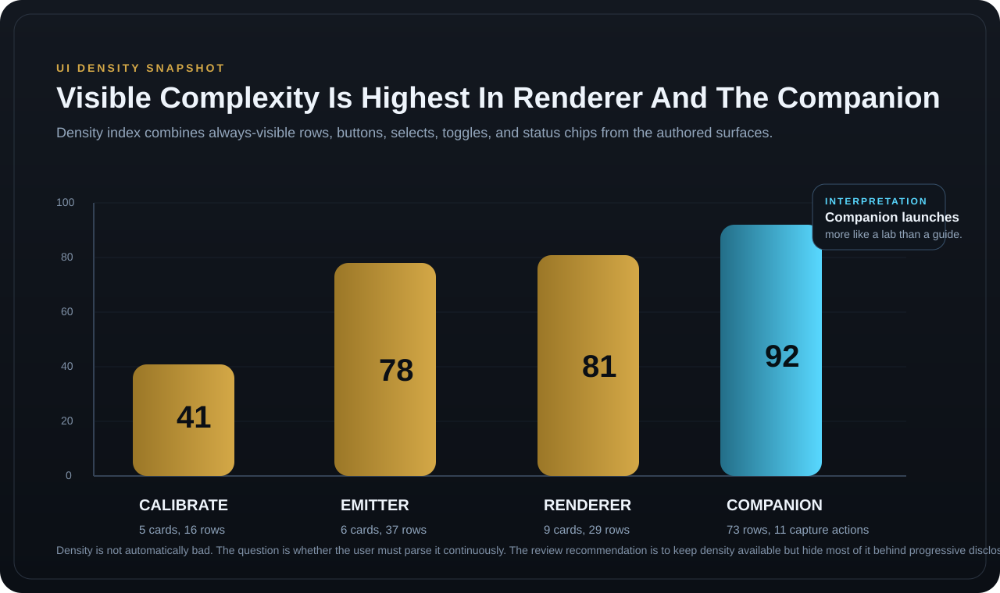

### Current-State Pressure Points

1. Too many micro-statuses compete at once.
2. Primary tasks and expert diagnostics share the same hierarchy tier.
3. Some copy is system-internal rather than operator-intent-first.
4. The plugin still reads slightly like “all capabilities are equally important.”
5. The companion asks users to parse a lot before it tells them the one thing they most need to know: “Can I trust this right now?”

## Surface-By-Surface Review

### LocusQ Main App

#### What to Preserve

- Viewport-first composition
- mode tabs as primary navigation
- right rail as the place for intent-specific controls
- emitter timeline as a mode-specific authoring strip
- the existing studio-console tone

#### What to Tighten

##### 1. Reduce Competing Status Grammar

Right now the shell often presents:

- mode
- scene status
- viewport lock
- room/profile state
- draft/final
- additional panel-local status chips

This is too many simultaneous “small truths.”

Recommendation:

- keep one global status band in the header
- allow only one secondary persistent shell badge besides it
- move the rest into the active rail card header or a compact details row

Best header order:

1. logo
2. mode tabs
3. one active session state pill
4. one structural trust badge
5. utility/settings

Suggested semantics:

- global pill = session/trust state
- structural badge = `Viewport Locked` or `Head Tracking Live`
- everything else moves downward

##### 2. Give Each Mode One Dominant Question

Each rail should visually answer one thing first:

- `CALIBRATE`: “Are we ready to measure, and what is this run targeting?”
- `EMITTER`: “What is selected, how is it moving, and what does it sound like?”
- `RENDERER`: “What output path is active, and is it direct or degraded?”

The easiest way to tighten scope is to refuse multi-purpose hero cards.

Rule:

- a top card can either set authority or show health
- it should not do both plus advanced diagnostics

##### 3. Collapse Diagnostics More Aggressively

The product benefits from rich diagnostics, but not from permanent diagnostic exposure.

Recommendation:

- default every “lab” diagnostic cluster closed
- preserve one-line summaries:
  - `Direct`
  - `Fallback Stereo`
  - `Steam Unavailable`
  - `Profile Pending`
- reveal detail only on demand

##### 4. Compress Renderer Above All

`RENDERER` is currently the place most likely to sprawl.

It should be the most trustable mode, not the busiest mode.

Recommendation:

- merge `Profile Authority` and `Output Summary` into a single top authority card
- keep `Spatialization` and `Room` as the only always-open editable cards beneath it
- move `Diagnostics` and `Scene Monitor` into drawers or tabs inside the rail

This keeps the mode from becoming a control attic.

##### 5. Clarify Copy Around Fallback and Authority

Use operator language before system language.

Examples:

| Current-style wording | Better operator wording |
|---|---|
| `rendererHeadphoneProfileRequested/Active` | `Requested Headphone Profile` / `Active Profile` |
| `fallback_stage` | `Why this output changed` |
| `spatial profile alias` | `Output format` |
| `authority` | `Control owner` |

### Head-Tracking Companion

#### What to Preserve

- the technical transparency
- the visualization panel
- the explicit readiness/sync/send-gate model
- profile acquisition as a first-class flow
- device and plugin-ingest trust reporting

#### What to Tighten

##### 1. Split The Companion Into `Focus` And `Lab`

This is the highest-value change in the whole review.

Today the companion behaves like a diagnostics cockpit. That is excellent for development and support, but it creates too much front-loaded reading for normal use.

Recommendation:

- default launch mode = `Focus`
- optional secondary mode or drawer = `Lab`

`Focus` should show only:

1. readiness
2. device identity
3. plugin ingest trust
4. center/sync
5. profile capture/apply
6. one compact visualization

`Lab` can keep:

- raw quaternion
- smoothed quaternion
- vector telemetry
- jitter, interval, seq gap
- full plugin ingest counters
- motion/stability internals

This one split would dramatically improve approachability without sacrificing power.

##### 2. Promote The Readiness Funnel

The companion should tell a clear story from top to bottom:

1. Are supported headphones connected?
2. Is motion ready?
3. Is sync required?
4. Is the send gate open?
5. Is the plugin ingest live?

That sequence should be visually obvious before any telemetry table.

##### 3. Turn Profile Acquisition Into A Guided Task

The profile-acquisition card is strong conceptually, but it is still presented like part of a telemetry surface.

Recommendation:

- treat capture as a guided 3-step flow with progress
- keep each capture slot as a visual tile, not just a row in a matrix
- show one match summary card after all three are loaded
- show fallback reason in plain language

Preferred copy:

- `Capture Left Ear`
- `Capture Right Ear`
- `Capture Front View`
- `Best Match`
- `Fallback Used Because Similarity Stayed Below Threshold`

##### 4. Reduce Button Noise

The current companion has many visible action buttons at once:

- view buttons
- sync
- axis flips
- three capture select buttons
- three capture clear buttons
- apply

Recommendation:

- keep view buttons lightweight
- group axis inversion under an `Orientation` disclosure
- replace `Select/Clear` row pairs with tile-based actions
- keep one strong apply button only when the flow is ready

##### 5. Keep The Visualization, But Make It More Supportive

The 3D head visualization is good, but it should support the task instead of competing with telemetry.

Improve it by:

- increasing the readability of “centered vs off-center”
- explicitly labeling sync state in the visualization panel
- reducing legend complexity in `Focus` mode
- showing fewer vector types by default

## Scope Discipline

This is the most important product-level recommendation.

LocusQ should protect its uniqueness by being a **trustable spatial authoring and monitoring instrument**, not a bundle of adjacent experiments.

### Core Promise

LocusQ plugin:

- author spatial scenes
- verify calibration and output authority
- hear and trust what is being rendered

Head-Tracking Companion:

- prove that head tracking is connected, centered, and trusted
- manage acquisition flows that belong to the device/operator boundary

### Hard Ownership Split

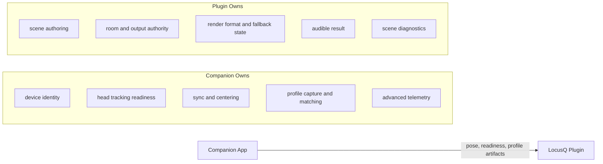

### Keep / Collapse / Extract / Defer

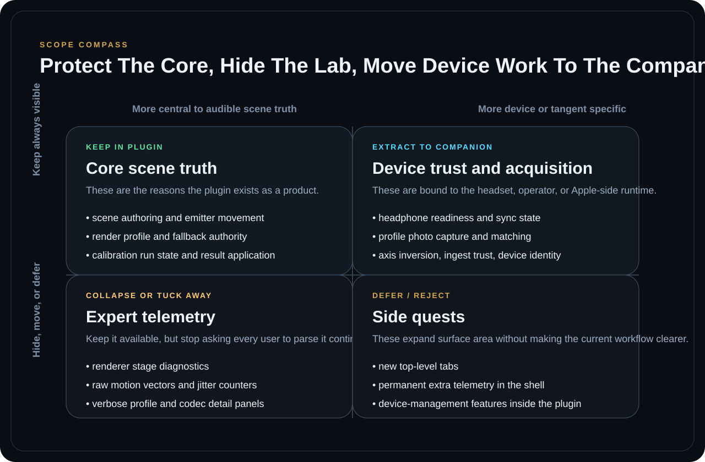

Interpretation:

- **Keep in plugin**: anything that directly affects scene authoring or audible render truth
- **Extract to companion**: anything device-bound, capture-bound, or trust-proving at the Apple/headset layer
- **Collapse**: deep telemetry that experts need, but normal operators should not parse continuously
- **Defer**: adjacent feature ideas that do not simplify a current workflow

### Anti-Bloat Rules

Adopt these as product rules:

1. No new always-visible control unless it removes a current ambiguity within five seconds.
2. No new top-level mode or panel without removing equal or greater existing complexity.
3. Diagnostics should summarize by default and explain on demand.
4. Device-bound capture or trust workflows belong in the companion, not the plugin.
5. If a feature does not clearly strengthen `Calibrate`, `Emitter`, `Renderer`, or `Trusted Head Tracking`, it is a side quest.

## Recommended UI Shape

### Main App

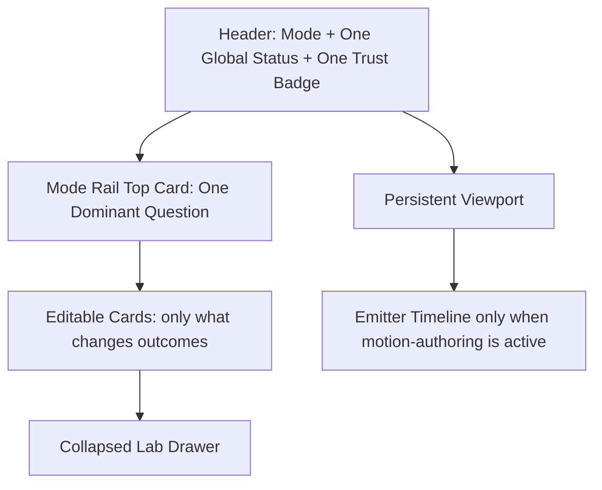

### Companion

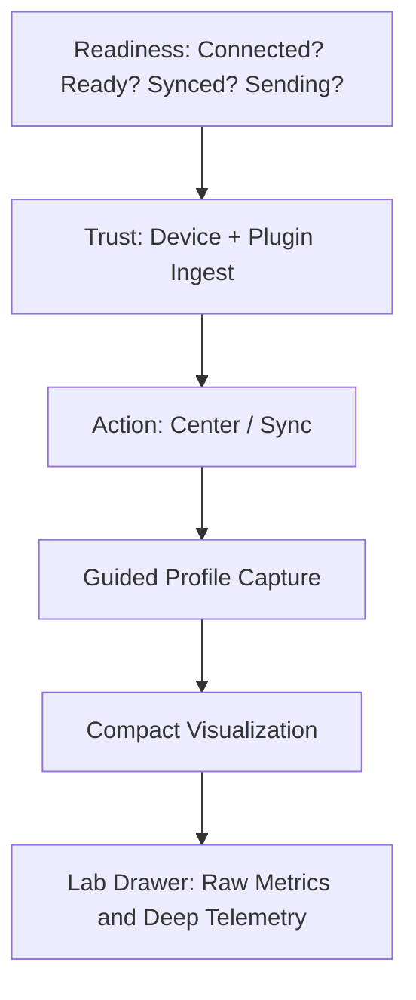

## Fine-Tuning And Polish Checklist

### Polish Now

| Priority | Surface | Change |
|---|---|---|
| P0 | Plugin shell | reduce header badge count to one status pill plus one trust badge |
| P0 | Renderer | merge authority and output summary into one top card |
| P0 | Companion | introduce `Focus` vs `Lab` split |
| P0 | Companion | promote readiness funnel above telemetry tables |
| P1 | Plugin copy | replace internal diagnostic language with operator language |
| P1 | Plugin rail | collapse advanced diagnostics by default across all modes |
| P1 | Companion capture flow | move from row matrix to guided visual tiles |
| P1 | Companion controls | hide axis inversion in disclosure unless needed |
| P2 | Plugin | add section memory only after the hierarchy simplification lands |
| P2 | Companion | add a lightweight onboarding checklist for first live session |

### Do Not Add Yet

- new top-level plugin tabs
- more permanent telemetry in the plugin header
- device-management flows inside the plugin
- extra visualization modes unless they replace an existing ambiguity
- more companion metrics on first launch

## Visual Review Bundle

### Current Main-App Captures

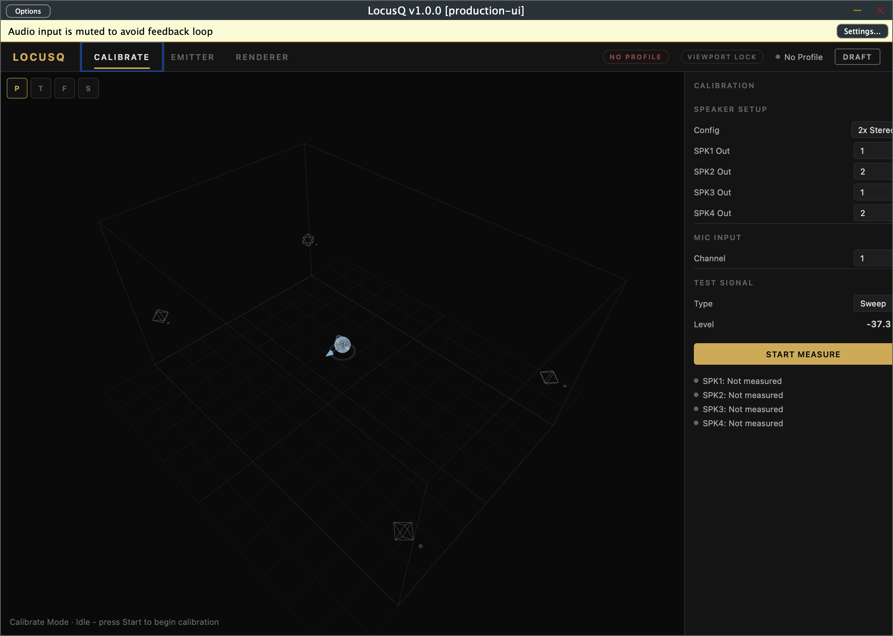

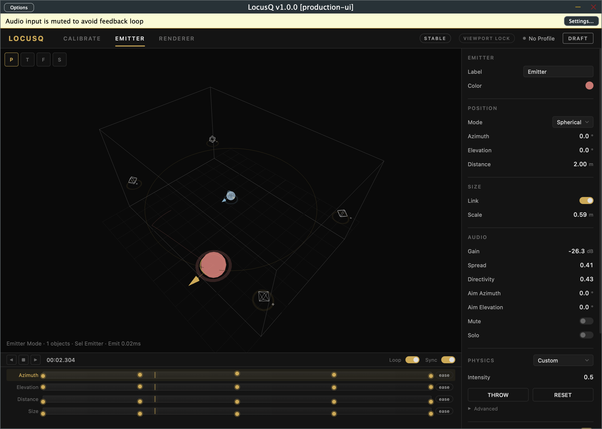

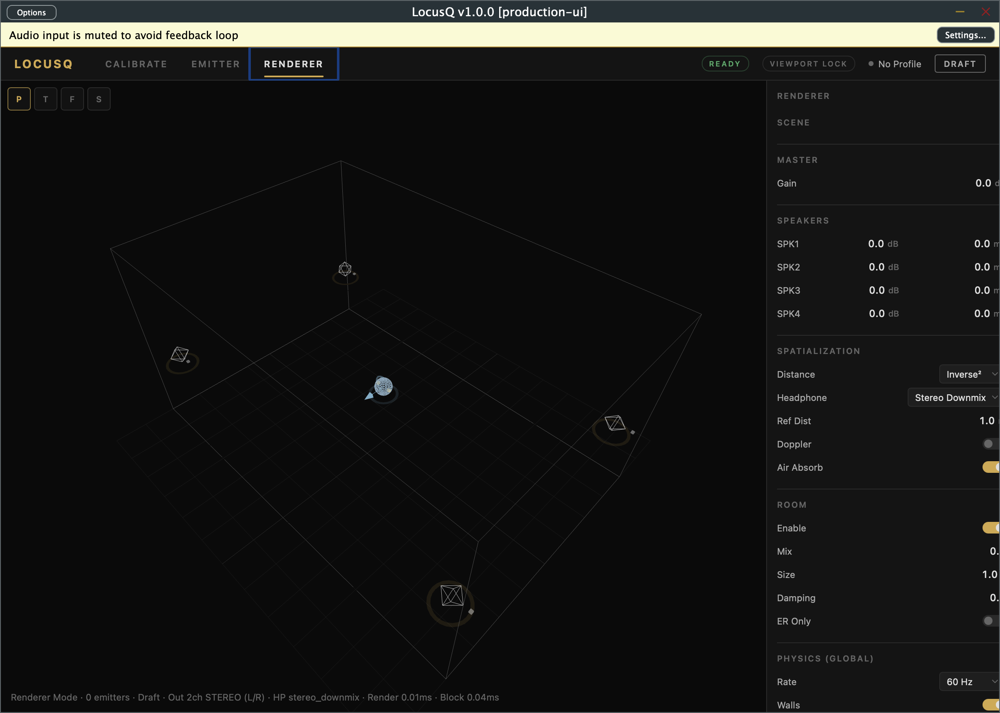

### Generated Prototype Board

Open the static prototype board here:

- `Documentation/reports/visuals/ui-ux-review-2026-03-17/review-prototype.html`

Rendered snapshot:

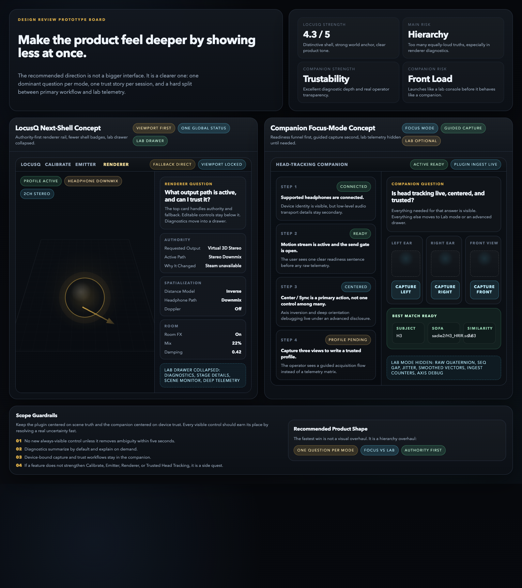

### Generated Wireframes

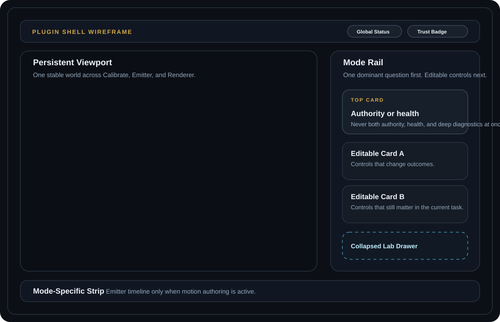

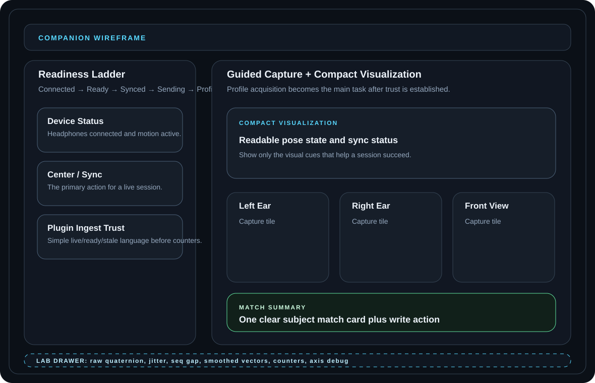

## Bottom Line

LocusQ does **not** need more interface ambition. It already has plenty.

It needs:

- stronger visual hierarchy
- fewer always-visible truths
- a harder split between primary workflow and expert telemetry
- stricter product ownership between plugin and companion

If you make only three changes, make these:

1. split the companion into `Focus` and `Lab`
2. compress renderer into authority-first plus lab-drawer
3. enforce one dominant question per mode, with all other information subordinate to it

That keeps the product feeling deep, but not bloated.
