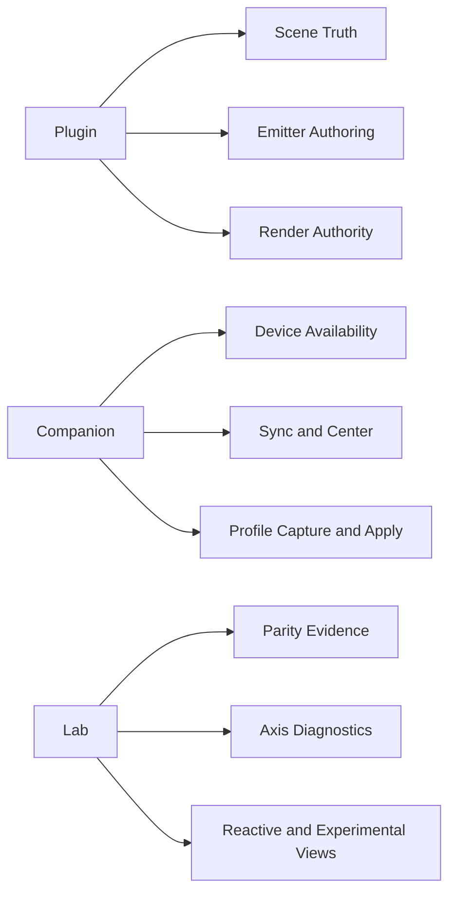
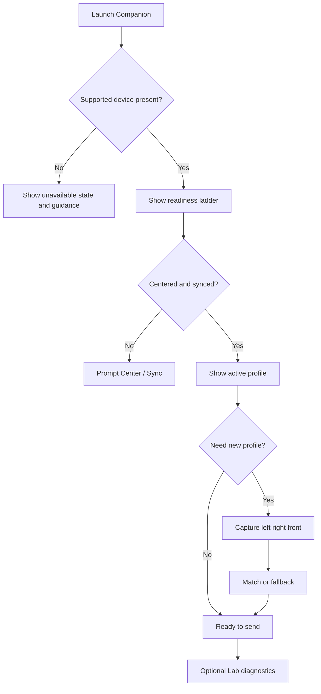

Title: LocusQ UI/UX Refinement Pass
Document Type: Design Review Addendum
Author: APC Codex
Created Date: 2026-03-17
Last Modified Date: 2026-03-17

# LocusQ UI/UX Refinement Pass

This addendum tightens the earlier review into a shipping-oriented refinement packet.

Baseline review:

- `Documentation/reports/2026-03-17-locusq-ui-ux-design-review.md`

This pass was informed by the following skill bundle, applied in this order:

1. `skill_design`
2. `audio-ui-visual-dna-designer`
3. `realtime-dimensional-visualization`
4. `juce-webview-runtime`
5. `threejs`
6. `headtracking-companion-runtime`
7. `apple-spatial-companion-platform`
8. `spatial-audio-engineering`
9. `steam-audio-capi`
10. `hrtf-rendering-validation-lab`
11. `perceptual-listening-harness`
12. `auv3-plugin-lifecycle`
13. `clap-plugin-lifecycle`
14. `reactive-av`
15. `physics-reactive-audio`
16. `simulation-behavior-audio-visual`
17. `temporal-effects-engineering`
18. `skill_dream`
19. `skill_plan`
20. `documentation-hygiene-expert`
21. `skill_docs`
22. `juce-webview-windows`
23. `playwright`
24. `imagegen`
25. `screenshot`

Validation status: `not tested`

This is a design and UX refinement artifact. It does not claim runtime, build, or listening-test execution in this pass.

## Review Status Legend

- `[KEEP]` strong and should remain central
- `[TIGHTEN]` useful but currently too noisy or too broad
- `[NEXT]` highest-value follow-up
- `[DEFERRED]` worth exploring only inside `Lab` or future backlog

## Priority Snapshot

| Area | Status | Priority | Notes |
|---|---|---|---|
| Plugin viewport-first shell | `[KEEP]` | high | This is still the product's best differentiator. |
| Renderer hierarchy | `[NEXT]` | highest | Merge trust into one authority card and demote diagnostics. |
| Companion first-run flow | `[NEXT]` | highest | Make `Focus` the default and move telemetry to `Lab`. |
| Requested vs active output language | `[NEXT]` | high | Critical for Steam/HRTF/fallback trust. |
| Cross-format UI parity | `[KEEP]` | high | AU/VST3/CLAP/AUv3 should feel like the same instrument. |
| Reactive/simulation visuals | `[TIGHTEN]` | medium | Keep valuable overlays; stop them from becoming product scope. |
| Temporal/simulation expansion | `[DEFERRED]` | medium | Extend existing authoring metaphors before adding new surfaces. |

## Refined Thesis

The main product question is no longer “what else can LocusQ show?”

It is:

**How quickly can LocusQ tell the operator what is true, what changed, and what still needs action?**

That leads to a tighter scope doctrine:

- the plugin owns **scene truth**
- the companion owns **device trust and profile acquisition**
- `Lab` owns **evidence, parity, and experiments**

If a feature does not strengthen one of those three jobs, it is a sprawl candidate.

## Visual DNA Recommendation

Recommended direction: `On-brand`

Working style name:

- `Spatial Atelier / Diagnostic Calm`

Why it fits:

- It preserves the current boutique studio tone.
- It gives live and fallback states clearer semantic colors.
- It supports dense spatial tooling without turning the product into a science dashboard.
- It remains plausible across `WKWebView`, `WebView2`, AU, VST3, CLAP, and AUv3.

Direction summary:

| Direction | Confidence | Risk | Complexity | Use |
|---|---|---:|---:|---|
| Conservative | high | low | low | Fast cleanup if the team wants minimal visual change |
| On-brand | highest | medium-low | medium | Best shipping candidate |
| Experimental | medium | medium-high | high | Future lab work for denser 4D and reactive storytelling |

## Plugin Scope Tightening

### 1. Make `RENDERER` The Trust Surface

`RENDERER` should not be the busiest mode. It should be the most trustworthy mode.

Refinement:

- promote one top authority card
- always show:
  - requested path
  - active path
  - fallback reason
  - control owner
- move parity counters, engine internals, and secondary summaries into a lab drawer

This is the single highest-value UI change in the plugin.

### 2. Reduce Header Competing Truths

Keep only:

- one session pill
- one structural trust badge

Everything else moves into the active card stack.

That immediately lowers shell anxiety and makes mode transitions feel cleaner.

### 3. Keep One Loud Question Per Mode

| Mode | Loud Question | What Should Be Quiet |
|---|---|---|
| `CALIBRATE` | Are we ready to measure and apply? | secondary routing minutiae |
| `EMITTER` | What is selected and how is it moving or sounding? | raw simulation internals |
| `RENDERER` | What is leaving the system right now? | parity and backend detail |

### 4. Keep Experiments Inside Existing Metaphors

Skill review across `reactive-av`, `physics-reactive-audio`, `simulation-behavior-audio-visual`, and `temporal-effects-engineering` points to the same conclusion:

- new behavior should extend the emitter timeline, overlays, or lab drawer
- it should not create new global modes

Good examples:

- new motion families inside `EMITTER`
- temporal repeat or loop behavior inside the existing timeline strip
- field overlays as optional viewport lenses

Bad examples:

- a new top-level `SIMULATION` mode
- a second diagnostic-only viewport
- format-specific pages for CLAP/AUv3/Steam internals

## Companion Scope Tightening

### 1. Default To `Focus`

The companion is currently capable, but it presents like a lab console first.

Refinement:

- default surface becomes `Focus`
- `Lab` becomes an explicit mode or drawer

`Focus` answers:

1. is the device supported and available?
2. is streaming safe to start?
3. do I need to center or sync?
4. which profile is active?
5. what capture step is next?

### 2. Preserve `Lab`, But Contain It

`Lab` still matters because the skill evidence is real:

- readiness gating
- stale-pose behavior
- axis sanity
- packet age
- matcher confidence

But none of that should obscure the first-run confidence path.

### 3. Keep The Privacy Contract Visible

The Apple-platform and profile-acquisition work should remain framed as:

- local processing
- no implicit network transfer
- explicit fallback when confidence is insufficient

That language belongs near capture, not hidden in docs only.

## Spatial Trust And Listening Language

The combined `steam-audio-capi`, `hrtf-rendering-validation-lab`, `spatial-audio-engineering`, and `perceptual-listening-harness` readout points to one UX rule:

**Never show a personalized or advanced render claim without also showing whether it is actually active.**

Minimum shipping contract:

| Field | Must Be Visible | Why |
|---|---|---|
| `Requested` | yes | what the operator asked for |
| `Active` | yes | what the system is really doing |
| `Why this changed` | yes when degraded | keeps fallback honest |
| `Profile source` | yes | distinguishes device/local/generic/profile paths |
| `Listening evidence` | lab only | useful for promotion confidence, not headline UI |

Copy guidance:

- say `Requested Headphone Profile`
- say `Active Render Path`
- say `Why this changed`
- avoid raw aliases, internal IDs, or compile/runtime jargon in the first layer

## Cross-Format And Runtime Guidance

| Surface | Recommendation |
|---|---|
| AU / VST3 / CLAP | keep one information architecture and one copy system |
| AUv3 | same shell, but with explicit limited-capability messaging where extension boundaries apply |
| `WKWebView` | preserve current boot shell and explicit startup/degraded states |
| `WebView2` | keep the same hierarchy and avoid backend-specific polish as a readability dependency |
| Browser preview | must remain good enough to review the shell and state hierarchy without native services |

Format-specific UI is almost always a smell here. Capability messaging can vary. Core structure should not.

## Scope Guardrails

Use this filter before adding anything new:

| Question | If `yes` | If `no` |
|---|---|---|
| Does it change scene truth? | plugin scope | probably lab or backlog |
| Does it change device trust or profile acquisition? | companion scope | probably plugin or backlog |
| Does it only explain evidence, parity, or internals? | lab drawer | not first-layer UI |
| Can it live inside an existing card, overlay, or timeline? | good candidate | likely sprawl |

## Mermaid Diagrams

### Scope Ownership

### Companion Focus Flow

## Visual Aid Index

- `Documentation/reports/visuals/ui-ux-refinement-2026-03-17/refinement-prototype.png`
- `Documentation/reports/visuals/ui-ux-refinement-2026-03-17/focus-lab-operating-model.svg`
- `Documentation/reports/visuals/ui-ux-refinement-2026-03-17/format-runtime-parity.svg`
- `Documentation/reports/visuals/ui-ux-refinement-2026-03-17/trust-state-ladder.svg`
- `Documentation/reports/visuals/ui-ux-refinement-2026-03-17/imagegen/locusq-plugin-concept.png`
- `Documentation/reports/visuals/ui-ux-refinement-2026-03-17/imagegen/locusq-companion-focus-concept.png`

## Recommended Next Slice

If this moves into implementation, the best first slice is:

1. compress the plugin header and `RENDERER` into the authority-card model
2. split the companion into `Focus` and `Lab`
3. wire the requested-versus-active language consistently across plugin and companion

That slice improves trust immediately without adding any new product surface area.
