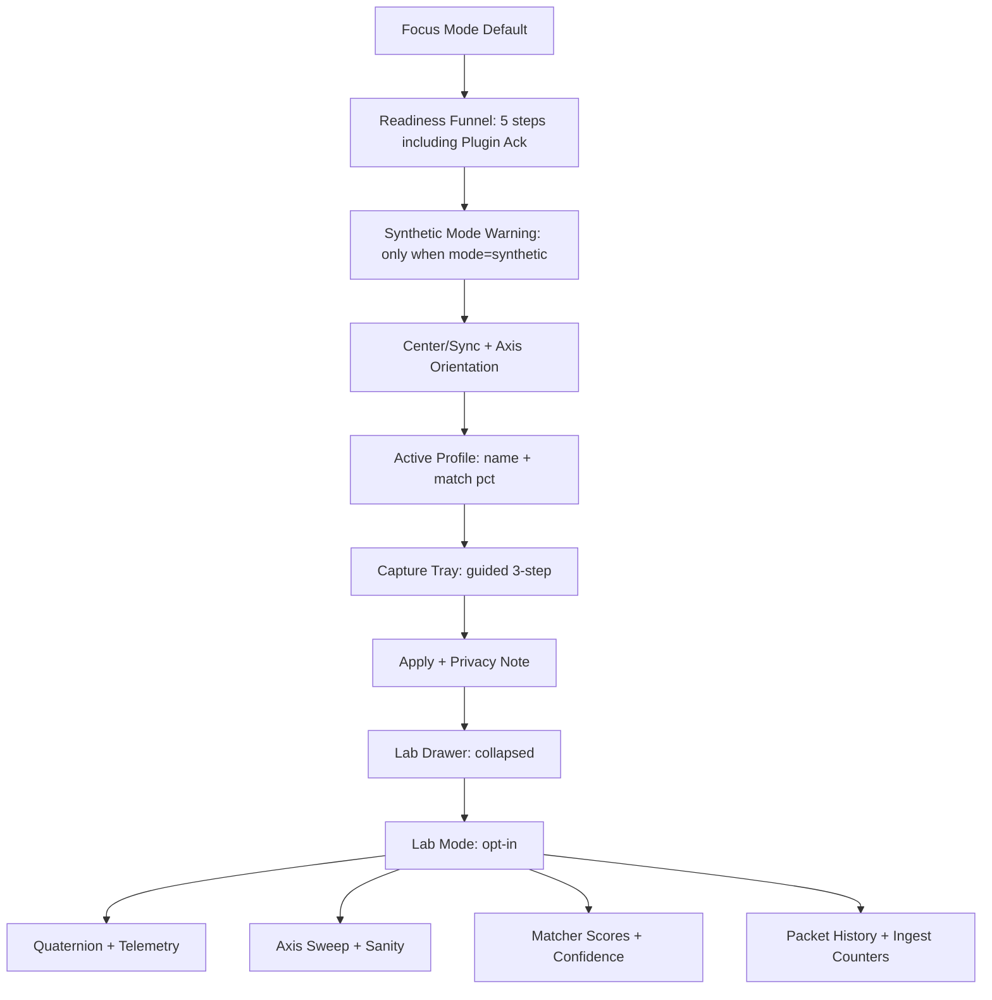

Title: LocusQ UI/UX Second-Opinion Review
Document Type: Design Review Report
Author: Claude Sonnet 4.6 (second-opinion pass)
Created Date: 2026-03-17
Last Modified Date: 2026-03-17

# LocusQ UI/UX Second-Opinion Review

Independent second-opinion review of:

- Main LocusQ plugin (WebView shell, CALIBRATE/EMITTER/RENDERER)
- Head-Tracking Companion (Swift CLI with monitor window)

Prior reviews inspected as inputs, not treated as truth:

- `Documentation/reports/2026-03-17-locusq-ui-ux-design-review.md`
- `Documentation/reports/2026-03-17-locusq-ui-ux-refinement-pass.md`

Sources inspected independently:

- `Source/ui/public/index.html` (lines 1–500 reviewed)
- `companion/Sources/LocusQHeadTrackingCompanion/main.swift` (lines 1–500 reviewed)
- `Documentation/reports/ui-ux-refinement-2026-03-17/design-tokens.json`
- `Documentation/reports/ui-ux-refinement-2026-03-17/visual-dna.json`
- `Documentation/reports/ui-ux-refinement-2026-03-17/component-specs.md`
- `Documentation/reports/ui-ux-refinement-2026-03-17/job-ticket.yaml`
- `status.json` (header, phase history, and notes)

Validation status: `not tested`

This is a design/UX analysis artifact. No builds, tests, or runtime checks were executed.

---

## Executive Diagnosis

The prior review did its job. It correctly identified the core problems: density in RENDERER, too many simultaneous status truths in the header, companion leading with telemetry instead of trust, and the need for a Focus/Lab split. The recommendations are structurally sound.

The prior review did not do enough of two things:

1. **It was too timid in some specific spots.** It recommended "merge" where it should have said "kill." It said "tighten" where it should have specified exactly which cards should disappear.

2. **It missed several concrete gaps** that only became visible by reading the actual source directly, not just the existing review docs. Three of these gaps are material:
   - The companion runs in `synthetic` mode by default and there is no visible warning in the current UI.
   - Design tokens diverge from the actual HTML CSS variables on four points.
   - Axis flip is assigned to Lab, but it is a first-run failure mode that breaks the product before experts get there.

Overall verdict: the prior review is a good foundation. This second opinion sharpens it in eight specific places and adds one scope item it completely missed.

---

## What Already Works Well

### Plugin

The plugin's core product identity is already strong:

- The persistent viewport is the product's best feature. It makes LocusQ feel like one instrument, not a page-based settings editor. This must be protected above all else.
- The dark studio palette with restrained gold accents is the right product tone. It feels intentional and boutique. Do not change it for novelty.
- CALIBRATE / EMITTER / RENDERER are genuinely good mode verbs. They name operator tasks, not system internals.
- The boot shell (`boot-shell`, `boot-shell-card`, `data-tone="warn/error"`) is already well-designed with explicit startup states, progress indication, and skeleton previews. The prior review undersold this. It should be preserved and documented as a product strength, not treated as background noise.
- The quality badge (`draft` / `final`) in the header is an interesting and underrated feature. It gives the operator a direct way to signal scene commit state. The prior review did not address it; this review recommends keeping it.
- The emitter's `authority-readonly` card state is a good precedent: when the operator does not own a parameter, the entire card gets a visible read-only treatment. This pattern should be extended consistently.

### Companion

- The companion's architecture is honest: it is a CLI tool with an optional monitor window (`--ui`). That is not a weakness. It is a scope guardrail. Resist the temptation to turn it into a full GUI app.
- The `ProfileAcquisitionSnapshot` includes a privacy string inline: `"Local-only processing. Selected images are decoded in memory and are never copied or uploaded."` This is already in the right place — near the data. Keep it there.
- The readiness state machine (`readinessState`, `sendGateOpen`, `syncRequired`) has the right operational concepts. Focus mode should be a UI projection of this machine, not a redesign of it.
- The profile acquisition approach (left ear / right ear / front view + matcher with explicit fallback threshold) is a real operator-facing flow, not a toy. It should be treated accordingly with guided UI, not raw diagnostic rows.

---

## Where I Agree With The Prior Review

| Prior Recommendation | Agreement Level | Note |
|---|---|---|
| Focus/Lab split for companion | Strong agree | The highest-value single change in the whole product |
| Authority card at top of RENDERER | Strong agree | Correct — Requested + Active + Why + Owner always visible |
| One loud question per mode | Strong agree | Plugin rail discipline is correct |
| Lab drawer for diagnostics | Strong agree | All parity, packet stats, engine internals behind drawer |
| Anti-bloat guardrails | Strong agree | The five rules are good and should become product rules |
| "Why this changed" in plain language | Strong agree | Critical — internal state names must not surface here |
| No new top-level mode without removing equal complexity | Strong agree | Non-negotiable scope rule |
| Profile capture as guided visual tiles, not matrix rows | Strong agree | Right UX model for this flow |
| Privacy framing near capture | Strong agree | Must remain explicit and near the action |
| AUv3 capability messaging honest, not hidden | Strong agree | Same UI structure, different Why+Owner copy |
| CLAP: no separate diagnostic worldview | Strong agree | One information architecture across all formats |

---

## Where I Disagree With The Prior Review

### 1. Axis Flip Belongs in Focus, Not Lab

The prior review recommends hiding axis inversion behind Lab. This is the wrong tier.

Axis flip (`gAxisFlipYaw`, `gAxisFlipPitch`, `gAxisFlipRoll`) is set with defaults (`yaw=false, pitch=false, roll=true`). An incorrect axis means head movements appear inverted in the spatial scene. This is a first-run failure mode that breaks the experience before the operator has even tried to use the product. Experts do not generally misread their own axis orientation. Beginners do.

Correction: axis orientation should appear in Focus mode as a compact "Orientation" subsection under Center/Sync — not as a hidden expert option. It can be brief. It does not need the full diagnostic view. But it must be reachable without entering Lab.

### 2. The Quality Badge Should Be Kept

The prior review did not address the `quality-badge` (draft/final button) in the header. This review treats its silence as implying it is expendable. That is wrong.

The draft/final toggle signals scene commit state — it is a direct operator affordance that communicates intentionality about the current work. It is more meaningful than most plugin controls. Keep it in the header. It is small and contextual when in `final` state.

Recommendation: keep quality badge. Consider making it contextually prominent only in `draft` state (dimmed when `final`).

### 3. Synthetic Mode Must Be Visible in Focus

The prior review does not mention `synthetic` mode anywhere. This is a material gap.

Looking at the companion source: `CompanionMode` has two cases — `synthetic` and `live`. The default is `synthetic`. Synthetic mode generates fake oscillating head movement (`yaw 35°, pitch 10°, roll 5°`) instead of reading from a real device. It is primarily used for testing, but an operator could inadvertently run it.

If the companion is running in synthetic mode, the UI must display a visible warning in Focus mode. An operator who cannot see this will think their AirPods are connected and working when they are not. This is a silent failure that the product currently has no defense against in the UI.

Required: a warning indicator in the Focus console whenever `mode=synthetic`. It does not need to be alarming — just visible.

### 4. RENDERER Tightening Must Be More Specific

The prior review says "merge authority and output summary into one top card." That is correct but insufficient. The product has 9 rail sections and 29 control rows in RENDERER mode. "Merge two of them" does not solve the problem.

Specific cards that should be eliminated from the default RENDERER view:

- Scene Monitor card: this is watching state about state. Move entirely to Lab.
- Secondary routing summary: fold into authority card `Owner` field.
- Parity counters: Lab only.
- Any card titled with engine-internal names (Steam, HRTF internals): Lab only.

What should remain by default in RENDERER:

1. Authority card (Requested / Active / Why / Owner) — always open
2. Spatialization card (Format selector + Engine indicator) — always open
3. Room card (Profile + Decay controls) — always open
4. Lab drawer (collapsed, one line, opens to everything else)

That is four items. Current is nine. The gap is the work.

### 5. Stale Pose Duration Belongs in Why Changed, Not Just Lab

The prior review treats stale pose detection as a diagnostic metric. The companion source has `readinessState` which includes disconnected/stale states. When head tracking pose goes stale (no data for N seconds), the active render path degrades. The operator needs to know this in the authority card, not just in Lab.

Required: when active render path differs from requested specifically because of a stale pose, the `Why Changed` field should show something like: `No pose received for 2.4 seconds` — not just `Fallback` or a system state name.

### 6. Plugin Ack Should Be the Fifth Readiness Step

The prior review's readiness funnel ends at "send gate open." That leaves the loop open. An operator who has completed four steps but is not receiving spatial rendering in their DAW has no UI feedback until they enter Lab.

Required: add `Plugin Ack` as the fifth readiness step in the Focus readiness funnel. The companion already receives acknowledgement packets (`pluginAckPort: 19766`). Surface the ack state in Focus mode.

### 7. Match Score Should Appear in Active Profile Summary

The prior review correctly says to show match score in the capture tray. But it misses the obvious companion placement: the active profile summary should also show the match percentage next to the profile name.

`Active: Personalized (Match 94%)` is more informative than just `Active: Personalized`.

### 8. Token Drift Is a Real Gap

The prior review built design tokens in `design-tokens.json` that diverge from the actual HTML on four measurable points:

| Token | Token Value | HTML Value |
|---|---|---|
| Background | `#06080B` | `#0A0A0A` |
| Header height | `44px` | `40px` |
| Primary font | `Avenir Next / IBM Plex Sans` | `Inter / -apple-system` |
| Base rail width | `348px` | `356px` |

None of these are critical individually. Together they indicate that the design token system is aspirational, not implemented. The review should either acknowledge this explicitly (and defer token adoption) or specify that these values need to be reconciled before the token system can be used as a reference.

---

## What the Previous Review Missed

| Item | Severity | Detail |
|---|---|---|
| Synthetic mode visibility | High | No UI warning when companion runs fake motion. Silent first-run failure. |
| Token drift | Medium | Design tokens diverge from HTML on 4 points. Both are "canonical" but contradict each other. |
| Axis flip tier | Medium | Assigned to Lab; should be in Focus as a first-run corrective. |
| Plugin ack in readiness funnel | Medium | Funnel stops at "sending" — leaves loop open. |
| Stale pose in authority card Why | Medium | Stale pose duration is diagnostic-only; should surface in Why Changed. |
| Quality badge valuation | Low | Not mentioned; treat as expendable. It is a product differentiator worth keeping. |
| Match score in active profile | Low | Capture tray gets score, active summary does not. |
| `readinessState: "disabled_disconnected"` | Low | Raw internal state string. Must not appear in operator-facing copy. |

---

## Plugin Tightening — What To Do Specifically

### RENDERER Mode

Current: 9 sections, 29 control rows.

Target: 4 default-visible items.

| Item | Action |
|---|---|
| Authority card | **Keep** — must be first and always open |
| Spatialization card | **Keep** — format selector is primary |
| Room card | **Keep** — room profile is primary |
| Scene Monitor card | **Kill from default** — move entirely to Lab |
| Secondary routing summary | **Kill from default** — fold into Authority card Owner field |
| Parity counters | **Kill from default** — Lab only |
| Steam/HRTF diagnostics | **Kill from default** — Lab only |
| Codec/engine internals | **Kill from default** — Lab only |
| Lab drawer | **Keep** — collapsed, one line |

### Header

Current: logo, mode tabs, scene-status chip, viewport-lock badge, room-profile indicator, quality-badge.

Target: logo, mode tabs, session pill, trust badge, quality badge.

Changes:

- Remove `room-profile` indicator from header. Room is a RENDERER rail concept, not a global header concept.
- Remove `viewport-lock` badge from header. This is contextual to EMITTER mode. Show it in the EMITTER rail, not the header.
- Keep `scene-status` as the session pill.
- Keep quality badge — it is small and product-meaningful.

### CALIBRATE Mode

The prior review called this out correctly. No additional changes from this review.

### EMITTER Mode

The prior review called this out correctly. One addition: move `viewport-lock` badge from the header into the EMITTER rail as a contextual indicator above the timeline strip. It only matters in EMITTER. It does not belong in a persistent header position.

---

## Companion Tightening — What To Do Specifically

### Focus Mode — Content Order

1. Readiness funnel (5 steps: Device → Motion → Synced → Sending → Plugin Ack)
2. Synthetic mode warning (visible only when mode=synthetic, always when active)
3. Center / Sync + axis orientation (compact, not just in Lab)
4. Active profile summary (name + match percentage)
5. Capture tray (guided 3-step tiles, available without entering Lab)
6. Apply button + privacy note
7. Lab drawer (collapsed, one line)

### Lab Mode — Content

- Raw quaternion and smoothed quaternion
- Yaw/pitch/roll breakdown with per-axis graph
- Axis sanity sweep
- Jitter, interval, seq gap
- Matcher scores and fallback confidence
- Packet history
- Plugin ingest counters
- Profile artifacts and debug details

Note: the `--bl058-profile-selftest` CLI capability is CI-only automation. It must never become a Lab UI surface for operators.

### Focus vs Lab — Hard Rule

A metric is in Lab if and only if it does not directly cause the operator to take a different action in the next 10 seconds. If knowing a metric now would change what the operator does right now, it belongs in Focus.

Application:
- Axis orientation → Focus (wrong axis breaks the session immediately)
- Raw quaternion → Lab (interesting, not immediately actionable)
- Plugin ack → Focus (missing ack means something is broken and needs action)
- Packet jitter → Lab (interesting for debugging, not immediately actionable)
- Synthetic mode → Focus (wrong mode means no real tracking, immediately actionable)
- Matcher confidence → Focus (shown as match %, not raw score)

---

## Anti-Bloat Scope Guardrails

These are augmented from the prior review. Keep all five from the prior review, plus:

6. **Synthetic mode warning is not a feature add — it is a transparency requirement.** Do not defer it.
7. **A metric moves from Lab to Focus only if knowing it immediately changes what the operator does.** If the answer is "they'd want to know eventually," it stays in Lab.
8. **New emitter behaviors extend the timeline strip or motion models — they do not create new rail cards.**
9. **The companion's selftest mode (`--bl058-profile-selftest`) is CI infrastructure — it must never surface in the operator UI.**
10. **Token drift between design-tokens.json and index.html is tracked and owned before the token system is used to drive implementation.**

---

## UI Hierarchy Recommendations

### Plugin

```mermaid
flowchart TD
    H[Header: Logo | Mode Tabs | Session Pill | Trust Badge | Quality Badge]
    V[Persistent Viewport]
    EM[Emitter Timeline: EMITTER mode only, shows viewport-lock badge contextually]
    R1[Authority Card: always open in RENDERER]
    R2[Spatialization Card: always open]
    R3[Room Card: always open]
    R4[Lab Drawer: collapsed, all diagnostics inside]

    H --> V
    H --> R1
    V --> EM
    R1 --> R2
    R2 --> R3
    R3 --> R4
```

### Companion



---

## Trust / Fallback / Render-Path Language

### Authority Card — Four Required Fields

Every state must populate all four fields. Never leave a field blank. Use explicit `n/a` when appropriate.

| Field | Always Visible | Copy Rules |
|---|---|---|
| `Requested` | Yes | What the operator asked for. Use product-facing name, not enum alias. |
| `Active` | Yes | What the system is actually doing. Color-coded: green=match, amber=degraded, red=failed. |
| `Why Changed` | Yes when Requested ≠ Active, show `n/a` when they match | Plain English only. Never internal IDs, state names, or enum strings. |
| `Owner` | Yes | Who is controlling this. Options: `Companion Profile`, `System Fallback`, `Host Constraint`, `Format Constraint`, `Operator Override`. |

### Concrete Copy Examples

| Do Not Use | Use Instead |
|---|---|
| `rendererHeadphoneProfileRequested/Active` | `Requested Headphone Profile` / `Active Profile` |
| `fallback_stage` | `Why this changed` |
| `disabled_disconnected` | `Device not connected` |
| `steam_unavailable` | `Spatial engine unavailable on this host` |
| `authority_companion_override` | `Owner: Companion Profile` |
| `mode_synthetic` | `Synthetic Mode Active — motion is simulated` |
| `bl058ProfileSelftestDir` (in any UI) | Not displayed — CI automation only |

---

## Cross-Format and Runtime UX Implications

| Surface | Finding |
|---|---|
| AUv3 | No UI architecture changes. Only `Why Changed` and `Owner` copy change to acknowledge extension-boundary limits. Never hide functions silently. |
| CLAP | Same information architecture as AU/VST3. `Owner` copy may read `Format Constraint` for CLAP-specific limitations. No separate UI worldview. |
| WKWebView | Boot shell already handles startup/degraded states well. Preserve boot states. |
| WebView2 | Must have identical information hierarchy. Do not rely on WKWebView-specific blur/blend behavior for core legibility. |
| Browser preview | Must remain coherent without native services. Authority card should show `Requested: (no session)` and `Active: Browser Preview Mode` rather than being empty. |
| Synthetic mode | CLI-controlled only today. UI must surface the mode state regardless. |

---

## Reactive / Simulation / Temporal — Are They Helping Or Hurting?

The existing skill bundle (`reactive-av`, `physics-reactive-audio`, `simulation-behavior-audio-visual`, `temporal-effects-engineering`) is sound as a research direction. None of it is scope creep yet because none of it has been added to the main product UX surface.

The risk point is when any of these goes from "lab experiment" to "new always-visible element." That is the moment the product adds complexity without removing it elsewhere.

Current posture:

| Feature Idea | Current Status | Recommendation |
|---|---|---|
| Motion trails in viewport | Optional overlay, not default | Keep as opt-in overlay, document the toggle |
| Velocity/force vectors in viewport | Optional overlay | Keep opt-in, add visible label when active |
| Temporal loop/repeat in timeline | Extends existing timeline | Acceptable expansion inside the timeline strip |
| Fluid/flocking simulation motion | No UI surface yet | Keep in backlog, extend emitter motion model only |
| Listening evidence display | Lab only (BL-060 blocked on real participants) | Lab only — do not promote until promotion criteria met |
| Physics-driven audio parameters | DSP backend only | Fine as DSP, must not create new rail cards |

The prior review was right to label these as bounded. This review agrees and adds: the correct question to ask before any of these lands in the default UI is **"which existing card does this extend, and which other control does it replace?"** If neither question has an answer, it stays in Lab.

---

## Ruthless Prioritization

### Keep

| Item | Rationale |
|---|---|
| Viewport-first composition | Best product differentiator |
| CALIBRATE / EMITTER / RENDERER mode model | Clear operator verbs |
| Dark studio palette with gold accents | Intentional and product-appropriate |
| Boot shell with explicit startup states | Already well-designed, preserve it |
| Draft/Final quality badge | Product differentiator, keep in header |
| Emitter timeline as mode-specific strip | Unique authoring identity |
| Companion profile acquisition with privacy framing | Core product capability |
| Five-step readiness funnel (with Plugin Ack) | Operational clarity |
| `authority-readonly` card state pattern | Good precedent, extend it |

### Tighten

| Item | Target |
|---|---|
| RENDERER: 9 sections → 4 default-visible | Kill Scene Monitor, routing, parity, internals from default |
| Header: 6 elements → 5 | Remove room-profile and viewport-lock from header |
| Companion Focus: add synthetic mode warning | First-run transparency requirement |
| Companion Focus: axis orientation visible | Move from Lab-only to Focus |
| Companion Focus: Plugin Ack as 5th step | Close the readiness loop |
| Authority card Why Changed: plain language only | Enforce no internal IDs |
| Active profile: show match percentage | `Personalized (94%)` not just `Personalized` |

### Defer

| Item | Why |
|---|---|
| Token system reconciliation | Useful but not blocking |
| Reactive field overlays | Core product not yet polished enough |
| Time-layered 4D history | Scope not justified yet |
| Onboarding checklist | Land Focus/Lab first |
| Section scroll memory | Post-hierarchy-simplification feature |
| Font system change to Avenir/IBM Plex | Current Inter is fine; change when token system is reconciled |

### Kill or Merge

| Item | Action |
|---|---|
| Scene Monitor as default RENDERER card | Kill from default — Lab only |
| `--bl058-profile-selftest` as any UI surface | Kill — CI infrastructure only |
| Raw state strings in operator copy | Kill — replace with plain English |
| Separate format-specific diagnostic worldviews | Kill — one information architecture across all formats |
| Separate diagnostic viewport | Kill — one viewport, optional overlays only |
| Any new top-level mode without removing equal complexity | Kill or defer |

---

## Scoring Against Prior Review Recommendations

| Prior Recommendation | Assessment | Score |
|---|---|---|
| Focus/Lab split for companion | Correct — this is the single highest-value change | 10/10 |
| Authority card at top of RENDERER | Correct direction, insufficient scope | 7/10 |
| One loud question per mode | Correct | 9/10 |
| Reduce competing header truths | Correct but needs specific call on quality badge and viewport-lock | 7/10 |
| Lab drawer for diagnostics | Correct | 9/10 |
| Guided profile capture tiles | Correct | 9/10 |
| Copy language cleanup | Correct — needs more specifics on synthetic mode and raw states | 7/10 |
| Anti-bloat rules | Correct — this review adds 5 more | 8/10 |
| Cross-format parity | Correct | 9/10 |
| Reactive/simulation bounded | Correct | 8/10 |

Overall prior review score: **8.3/10 — strong foundation with specific gaps.**

---

## Visual Aid Index

All visuals in `Documentation/reports/visuals/ui-ux-second-opinion-claude-2026-03-17/`:

| Visual | Description |
|---|---|
| `scope-boundary.svg` | Three-column scope map: Plugin, Boundary Rules, Companion — including synthetic mode callout |
| `companion-focus-lab-hierarchy.svg` | Companion Focus flow with 5 steps, synthetic warning, and annotation callouts against prior review |
| `render-trust-ladder.svg` | Five authority card scenarios: fully live, profile degraded, Steam unavailable, companion lost, AUv3 limited |
| `second-opinion-prototype.html` | Interactive prototype board showing plugin RENDERER + companion Focus mode, token drift table, disagree table, and prioritization grid |

---

## Changed Files

| File | Type | Action |
|---|---|---|
| `Documentation/reports/2026-03-17-locusq-ui-ux-second-opinion-claude.md` | Report | Created — this file |
| `Documentation/reports/visuals/ui-ux-second-opinion-claude-2026-03-17/scope-boundary.svg` | Visual | Created |
| `Documentation/reports/visuals/ui-ux-second-opinion-claude-2026-03-17/companion-focus-lab-hierarchy.svg` | Visual | Created |
| `Documentation/reports/visuals/ui-ux-second-opinion-claude-2026-03-17/render-trust-ladder.svg` | Visual | Created |
| `Documentation/reports/visuals/ui-ux-second-opinion-claude-2026-03-17/second-opinion-prototype.html` | Prototype | Created |
| `status.json` | State | Updated with second-opinion breadcrumb |

---

## Validation Status

`not tested`

This is a design and UX analysis artifact. No builds, tests, or runtime checks were executed. No production code was modified.

---

## Top 5 Takeaways

1. **Synthetic mode is a silent failure risk with no UI defense.** The companion defaults to fake motion. Fix this in Focus mode before any other change.
2. **RENDERER requires killing, not just merging.** Four cards survive by default. Five cards move to Lab. The prior review was not specific enough about this.
3. **Axis flip is a first-run problem, not an expert option.** Moving it to Lab means first-time users will have inverted tracking with no path to fix it without discovering Lab first.
4. **The prior review is an 8.3/10 foundation.** It is correct on the big things. It is too cautious on several specific calls. Follow it with these corrections applied.
5. **The boot shell and quality badge are product strengths already present.** Protect them.

---

## Top 3 Next Implementation Slices

**Slice 1: Companion Focus/Lab split with synthetic mode warning (highest ROI)**

- Default companion to Focus mode
- Add synthetic mode warning in Focus (visible when `mode=synthetic`)
- Move axis flip to Focus under Center/Sync
- Add Plugin Ack as fifth readiness step
- Move all dense telemetry to Lab

**Slice 2: Plugin RENDERER authority card + header cleanup**

- Implement authority card with Requested / Active / Why Changed / Owner
- Kill Scene Monitor, parity, routing summary from default view
- Remove room-profile and viewport-lock from header
- Move viewport-lock to EMITTER rail, contextual above timeline

**Slice 3: Copy language audit across both surfaces**

- Replace all raw state strings (`disabled_disconnected`, `fallback_stage`, `steam_unavailable`, etc.) with plain English
- Ensure Why Changed never shows internal identifiers
- Add match percentage to active profile display in companion Focus
- Confirm `--bl058-profile-selftest` logic has no UI surface
