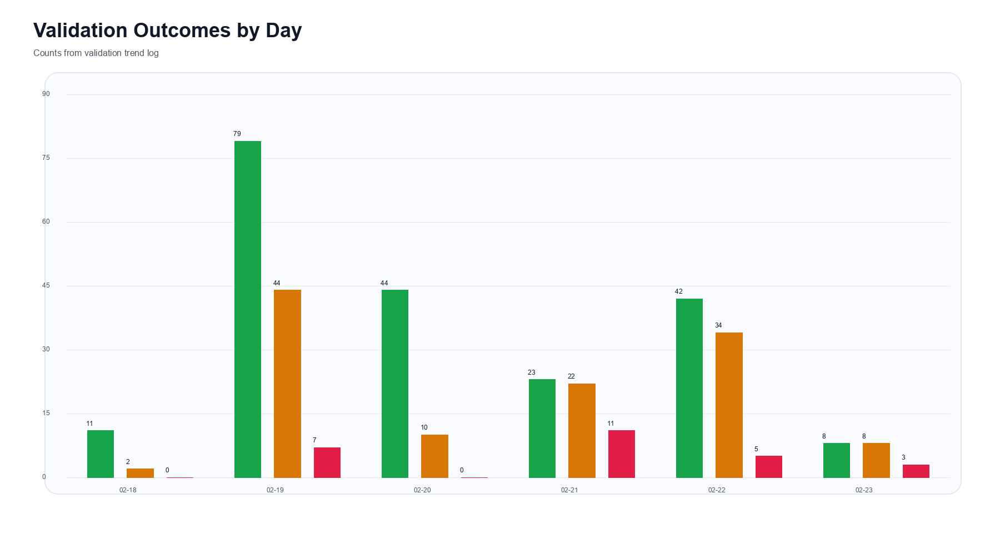
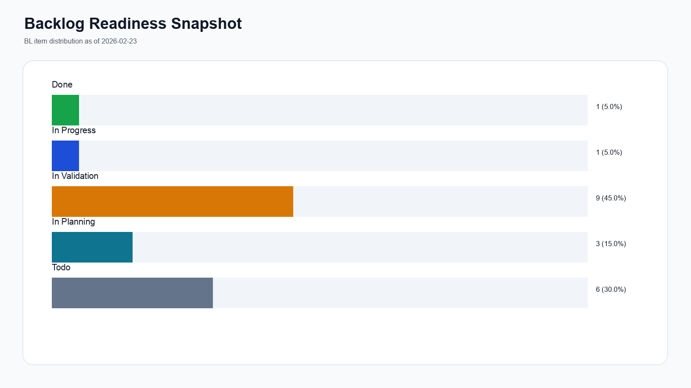
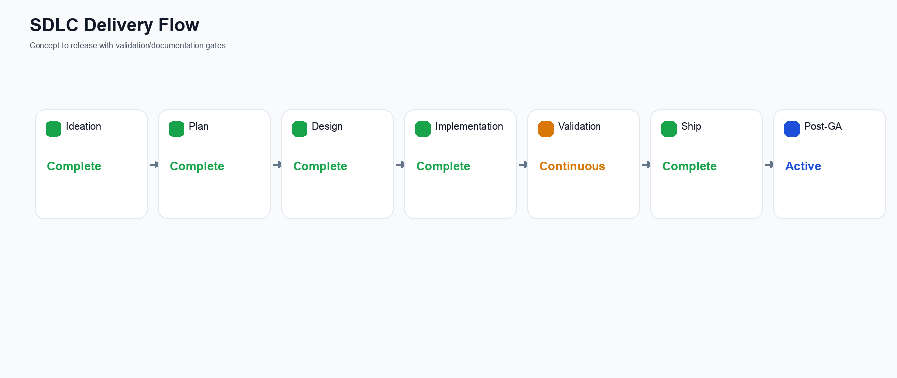
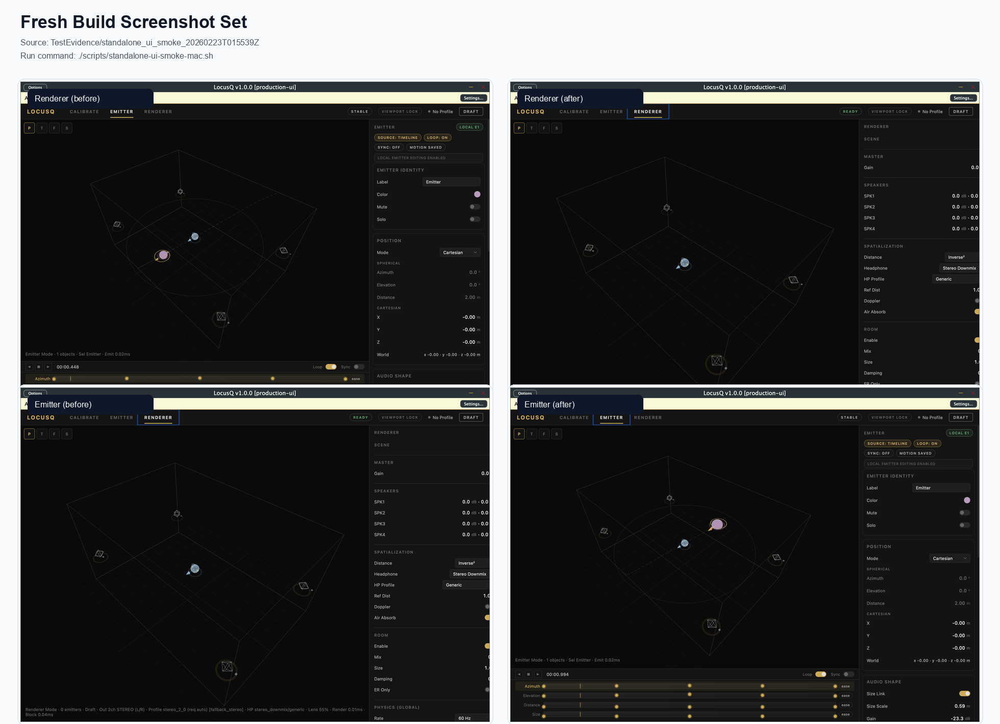
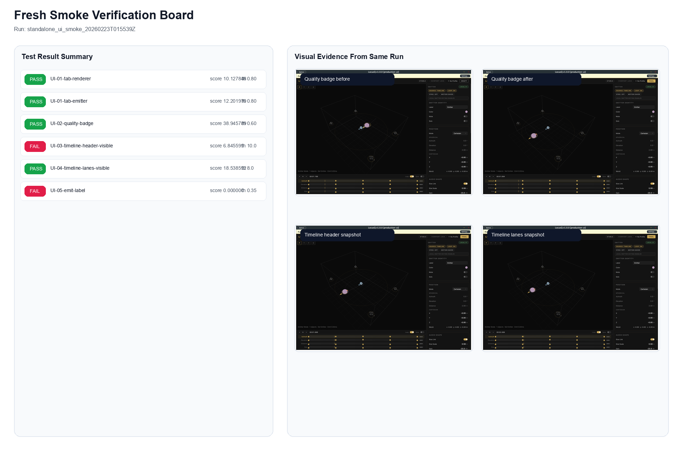

Title: LocusQ SDLC Delivery, Timeline, and Product Evolution Report
Document Type: Delivery Report
Author: APC Codex
Created Date: 2026-02-23
Last Modified Date: 2026-02-23

# LocusQ SDLC Delivery, Timeline, and Product Evolution Report

## Purpose
Provide one evidence-backed record of delivery progress across SDLC execution, timeline milestones, product feature evolution, validation trends, and next-phase readiness.

## Reporting Window
- Start: `2026-02-17T12:00:00Z`
- End: `2026-02-23T01:06:10Z`
- Elapsed: `5 days, 13:06:10`

## Core Metrics
| Metric | Value |
|---|---:|
| Commits since 2026-02-17 | `63` |
| Phase-history entries | `62` |
| Validation trend entries | `371` |
| Structured run ledgers (`status.tsv`) | `61` |
| Structured run outcomes | `48 pass`, `5 warn`, `8 fail` |
| Structured run pass rate | `78.7%` |

## Visual Analytics

## Fresh Screenshot Evidence (Aligned With HTML Brief)
- Source run: `TestEvidence/standalone_ui_smoke_20260223T015539Z`
- Run summary: `TestEvidence/standalone_ui_smoke_20260223T015539Z/summary.tsv`

## Feature Evolution
| Theme | Evolution |
|---|---|
| Host UI reliability | Iterative 2.7x recovery closed manual blocker rows in host validation |
| Real-time performance | Historical warnings tracked and resolved in allocation-free closeout |
| Spatial profile expansion | BL-009/BL-018 lanes now provide repeatable profile and contract checks |
| CLAP hardening | External validator fail corrected and rerun to all-pass outcome |
| UX continuity | BL-025 active closeout with BL-026 and BL-027 planning handoff |

## Evidence Hygiene and Preservation
A conservative keep policy was applied:
1. Keep all fail/warn/pending/unknown runs.
2. Keep all runs referenced by canonical docs.
3. Keep oldest/newest run per category for timeline continuity.
4. Archive-only action for candidate duplicate pass runs.

Completed archive outputs:
- `TestEvidence/archive/stale-evidence-2026-02-23.tar.gz`
- `TestEvidence/archive/stale-evidence-2026-02-23.sha256`
- `TestEvidence/archive/stale-evidence-2026-02-23-manifest.json`

Candidate review surface:
- `Documentation/reports/evidence-hygiene-candidates-2026-02-23.md`

## Data Package
- `Documentation/reports/data/sdlc-metrics-summary-2026-02-23.json`
- `Documentation/reports/data/validation-trend-entries-2026-02-23.json`
- `Documentation/reports/data/status-tsv-runs-2026-02-23.json`
- `Documentation/reports/data/evidence-hygiene-summary-2026-02-23.json`
- `Documentation/reports/data/evidence-hygiene-candidates-2026-02-23.json`
- `Documentation/reports/data/evidence-hygiene-runs-2026-02-23.json`
