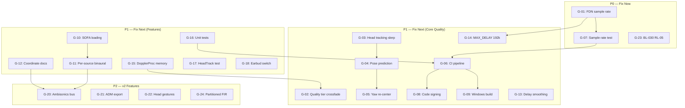

Title: LocusQ Full Architecture & Code Review
Document Type: Review Report
Author: Claude Opus 4.6
Created Date: 2026-02-26
Last Modified Date: 2026-02-26

# LocusQ Full Architecture & Code Review

> Standalone comprehensive review as of 2026-02-26. Every finding has an opinionated
> disposition. Mega-prompts are tool-agnostic and copy-pasteable. Dependency graph is
> Mermaid-renderable.

---

## Table of Contents

1. [Project Overview & Current State](#1-project-overview--current-state)
2. [DSP & Audio Engine](#2-dsp--audio-engine)
3. [Spatial Audio & Head Tracking](#3-spatial-audio--head-tracking)
4. [Architecture & Scalability](#4-architecture--scalability)
5. [WebView UI & Visualization](#5-webview-ui--visualization)
6. [QA, Testing & Validation](#6-qa-testing--validation)
7. [Build, CI/CD & Shipping](#7-build-cicd--shipping)
8. [Research & Ecosystem Landscape](#8-research--ecosystem-landscape)
9. [Cross-Domain Gap Analysis](#9-cross-domain-gap-analysis)
10. [Prioritized Roadmap](#10-prioritized-roadmap)
11. [Mega-Prompts](#11-mega-prompts)
12. [New Feature Ideas from Research](#12-new-feature-ideas-from-research)

---

## 1. Project Overview & Current State

### Identity
- **Name**: LocusQ — Quadraphonic 3D Spatial Audio Tool
- **Version**: v1.0.0-ga
- **Phase**: Code (implementation phases 2.1–2.14 complete; backlog-driven work ongoing)
- **Formats**: VST3, AU, Standalone (macOS); VST3, Standalone (Windows); VST3, LV2, Standalone (Linux); CLAP (opt-in)
- **Framework**: JUCE 8, C++20, WebView UI (WKWebView/WebView2/WebKitGTK), Three.js 3D viewport

### Architecture Summary
LocusQ is a **tri-mode** spatial audio plugin:
- **Calibrate**: Room measurement via test signals, IR capture, deconvolution, and room analysis
- **Emitter**: Sound source positioning with physics simulation, publishes spatial state to shared SceneGraph
- **Renderer**: Single-instance spatialization — reads all emitter slots, applies VBAP/distance/air absorption/Doppler/directivity/spread/room/output chain

The **SceneGraph** is a process-wide singleton with lock-free double-buffered EmitterSlot array, enabling multi-instance DAW operation where many Emitter instances publish to one Renderer.

### DSP Chain Order (Invariant)
```
Emitter preprocessing → VBAP panning / spread / directivity / distance
  → Early reflections (FIR tapped delay) → FDN reverb (Hadamard-8)
  → Speaker compensation (delay + gain trim) → Master gain
  → Spatial output profile mapping → Host output layout
```

### Technology Stack
| Layer | Technology |
|-------|-----------|
| Audio framework | JUCE 8 (C++20) |
| DSP | Custom VBAP, FDN reverb, Doppler, distance, air absorption, directivity, spread, early reflections |
| Physics | Custom Euler integration engine (timer thread) |
| Head tracking | Swift companion app → UDP binary packets → JUCE Thread receiver |
| Binaural | Steam Audio C API (dynamic runtime loading, Virtual Surround quad→stereo) |
| Headphone calibration | Custom PEQ (4 biquad stages) + FIR (direct convolution, max 2048 taps) |
| UI | WebView + Three.js 3D viewport + HTML/CSS/JS control rail |
| Build | CMake 3.22+ |
| QA | Custom scenario-based harness (C++), pluginval, Appium Mac2, 80+ JSON scenarios |
| Formats | VST3, AU, LV2, Standalone, CLAP (opt-in via clap-juce-extensions) |

### Backlog Posture (as of 2026-02-26)
- **Done**: 38 items (BL-001 through BL-034, HX-01 through HX-06, minus active items)
- **Done-candidate**: BL-032 (Source modularization)
- **In Validation**: BL-030 (Release governance — RL-05 blocked)
- **In Implementation**: BL-020, BL-021, BL-023
- **In Planning**: BL-035 through BL-042 (derived from prior review findings)
- **76 parameters** across 3 modes, fully traceable in `Documentation/implementation-traceability.md`
- **13 ADRs** documenting architectural decisions

---

## 2. DSP & Audio Engine

### 2.1 RT Safety Assessment

**Overall: Strong.** `processBlock()` is genuinely allocation-free for the core rendering path. Key evidence:

| Check | Status | Evidence |
|-------|--------|----------|
| `ScopedNoDenormals` | PASS | `PluginProcessor.cpp:1515` — FTZ/DAZ flags set |
| Heap allocations in processBlock | PASS | All APVTS reads via `getRawParameterValue` (atomic). EmitterData is POD (fixed `char[32]` label). No `std::string`, `std::vector` resize, or `juce::String` on audio thread |
| Lock usage | PASS (with caveat) | `keyframeTimelineLock` uses non-blocking `ScopedTryLockType` (skip on contention). Registration lock in `SceneGraph` only held during `prepareToPlay`/`releaseResources`, not `processBlock` |
| NaN guards | PASS | FDN output (`FDNReverb.h:180`), biquad state reset (`HeadphonePeqHook.h:84-105`), FIR chain (`HeadphoneFirHook.h`), all guarded with `std::isfinite()` |
| RT safety audit | PASS | `HX-06` completed. All audio-thread allowlist entries verified as UI-only methods (`getSceneStateJSON`, preset serialization) |

**Caveats:**
- `steamDiagnosticsLock` (`SpatialRenderer.h:690`) uses blocking `ScopedLockType` — called from UI timers while Steam init holds the same lock. Low practical risk since init is in `prepare()`, not `process()`. **Disposition: fix next**
- `std::shared_ptr` atomic operations in `SceneGraph::setRoomProfile()` may use a global spinlock on some stdlib implementations. Not currently called from audio thread. **Disposition: explicit defer**

### 2.2 DSP Chain Correctness

**Chain order matches documented invariant.** Verified in `SpatialRenderer.h:813-1331`:
1. Emitter gain (946-951) → Doppler (962-971) → Air absorption (974-978)
2. VBAP gains (981-984) → Spread (987) → Directivity (990-993) → Distance (996-1001)
3. Early reflections (1050) → FDN reverb (1052)
4. Speaker compensation delay+trim (1056-1078)
5. Spatial profile resolution → headphone rendering → master gain → output mapping (1080-1300)

### 2.3 Critical Finding: FDN Delay Lengths Not Sample-Rate-Scaled

| | |
|---|---|
| **ID** | F-33 |
| **Location** | `FDNReverb.h:248-274` |
| **Severity** | **CRITICAL** |
| **Disposition** | **Fix now** |

The FDN base delay lengths are fixed integer sample counts (`{1423, 1777, 2137, 2557, 2879, 3251, 3623, 3989}`), scaled only by `roomSize`. At 96kHz, all delays are half the intended time in milliseconds — reverb sounds twice as dense/short. At 192kHz, it's 4x shorter.

**Fix**: Scale by `(currentSampleRate / 48000.0)` in `configureDelayLengths()`.

### 2.4 High Finding: Quality Tier Switch Produces Audible Discontinuity

| | |
|---|---|
| **ID** | F-17 |
| **Location** | `FDNReverb.h:84-93`, `SpatialRenderer.h:443-452` |
| **Severity** | **HIGH** |
| **Disposition** | **Fix next** |

`setQualityTier()` reconfigures FDN from 4 to 8 delay lines (or reverse) mid-stream. Active line count changes, delay line contents are not crossfaded, modulation phases reset. This **violates the documented invariant** that quality-tier switching must preserve tonal intent.

**Fix**: Double-buffer FDN state, crossfade over ~50ms, then discard old state.

### 2.5 Multi-Instance Scaling

| Metric | Value | Assessment |
|--------|-------|-----------|
| Max emitters per block | 8 (priority-culled by gain × distance) | Good — graceful degradation |
| Memory per Renderer | ~10-11MB (64 DopplerProcessors @ 128KB each = 8MB dominant) | **Medium concern** — only 8 are used simultaneously |
| SceneGraph contention | Lock-free double-buffered atomics — zero contention | Excellent |
| 32-instance scenario | 31 emitters publish, 1 renderer reads top-8 — correct | Validated |

**Recommendation**: Lazy-allocate DopplerProcessor delay lines to reduce per-instance footprint from ~10MB to ~2MB.

### 2.6 SIMD / Vectorization Opportunities

| Opportunity | Location | Impact | Disposition |
|------------|----------|--------|-------------|
| Core accumulation loop | `SpatialRenderer.h:1006-1024` | Medium — `SmoothedValue::getNextValue()` prevents auto-vectorization | Fix next: use `FloatVectorOperations::addWithMultiply` for unsmoothed gain path |
| Early reflections tap summation | `EarlyReflections.h:66-86` | Low-Medium — scattered tap reads | Fix next: restructure to tap-major order |
| FDN Hadamard butterfly | `FDNReverb.h:194-217` | None — already efficient | Acceptable |

### 2.7 Parameter Smoothing

All critical gain parameters use `juce::SmoothedValue` (15-20ms ramps). **One gap**: speaker delay changes (`SpatialRenderer.h:479-491`) are not smoothed — causes click on automation. **Disposition: fix next.**

### 2.8 Additional Findings

| ID | Severity | Description | Disposition |
|----|----------|-------------|-------------|
| F-29 | Low | No DC blocker in chain — DC can accumulate from IIR stages | Fix next |
| F-30 | Medium | Doppler delay trajectory quantized per-block (worse at large buffer sizes) | Fix next |
| F-36 | Medium | `MAX_DELAY_SAMPLES=4410` too short for 192kHz (needs 9600 for 50ms) | Fix next |
| F-18 | Medium | EarlyReflections quality switch exposes stale data in new taps | Fix next |

### 2.9 DSP Executive Summary

The audio engine is well-architected with strong RT-safety discipline. The **one critical issue** (F-33: FDN sample rate scaling) must be fixed before claiming multi-rate support. The quality-tier switching violation (F-17) should be addressed next. The graceful degradation design (emitter culling, head-tracking fallback, Steam Audio fallback) is excellent.

---

## 3. Spatial Audio & Head Tracking

### 3.1 Research-to-Implementation Gap Matrix

| Research Recommendation | ChatGPT | Claude | Calibration | Status |
|------------------------|---------|--------|-------------|--------|
| CMHeadphoneMotionManager integration | ✓ | ✓ | Assumed | **Implemented** |
| Reference pose calibration / re-centering | ✓ | ✓ | ✓ | **Not implemented** |
| Quaternion slerp interpolation (25Hz → audio rate) | ✓ | ✓ | — | **Not implemented** |
| Pose prediction (angular velocity extrapolation) | ✓ | ✓ | — | **Not implemented** |
| Earbud sensor-location switch handling | ✓ | — | — | **Not implemented** |
| SOFA file loading (libmysofa) | ✓ | ✓ | ✓ | **Not implemented** (enum exists) |
| Per-source HRTF binaural | — | ✓ | Deferred | **Not implemented** |
| Ambisonics intermediate bus | ✓ | ✓ | Deferred | **Stubbed only** |
| Steam Audio Virtual Surround | ✓ | — | ✓ | **Implemented** |
| PEQ headphone compensation | — | — | ✓ | **Implemented** (4 bands) |
| FIR convolution (partitioned FFT) | — | — | ✓ | **Partially** (direct only) |
| Head gesture detection (nod/shake) | ✓ | ✓ | — | **Not implemented** |
| Coordinate system unification doc | — | ✓ | — | **Not documented** |

### 3.2 Head Tracking Engineering Assessment

**Data flow architecture: Sound.** Companion → UDP (40-byte PosePacket) → HeadTrackingBridge (JUCE Thread) → atomic double-buffer → processBlock reads → SpatialRenderer applies.

**Critical gaps:**

| Gap | Severity | Impact |
|-----|----------|--------|
| No slerp interpolation | HIGH | Pose steps at 25Hz; clicks during rapid head movement in binaural output |
| No pose prediction | HIGH | At 512 samples/48kHz, 10.7ms buffer latency + 40ms tracker period = 50ms+ total latency (above 30-60ms perceptibility threshold) |
| No yaw drift re-centering | HIGH | AirPods lack magnetometer correction; yaw drifts over time with no user recalibration mechanism |
| No earbud switch handling | MEDIUM | Sensor location change causes orientation discontinuity |
| No `rotationRate` transmitted | MEDIUM | Companion's PosePacket only carries quaternion; angular velocity needed for prediction |

### 3.3 Coordinate System Audit

| Subsystem | Forward Direction | Convention |
|-----------|------------------|-----------|
| SpatialRenderer ListenerOrientation | -Z | `ahead = {0, 0, -1}` |
| Head pose conversion | -Z | "Steam canonical axes" |
| Three.js camera | -Z | Standard |
| VBAPPanner | **XY plane abstraction** | `sin(az)` → X, `cos(az)` → Y |
| `calculateAzimuth()` | **+Z** | `atan2(pos.x, pos.z)` |

**Finding**: `calculateAzimuth` uses `atan2(x, z)` mapping forward to +Z, while `ListenerOrientation.ahead` is {0,0,-1} (-Z forward). The 180° flip works because VBAP speaker layout uses the same convention, but this is fragile and undocumented. **Disposition: fix next** — document canonical convention, add assertions.

### 3.4 Spatial Output Format Coverage

| Format | Status |
|--------|--------|
| Stereo 2.0 | **Functional** |
| Quad 4.0 | **Functional** (canonical reference) |
| 5.1 | **Functional** |
| 7.1 | **Functional** |
| 7.1.4 (Atmos bed) | **Functional** |
| Binaural (Steam) | **Functional** |
| Ambisonic FOA | **Stubbed** (naive matrix, not true SH encoder) |
| Ambisonic HOA | **Stubbed** (falls back to FOA) |
| IAMF codec | **Placeholder** |
| ADM codec | **Placeholder** |

7 of 12 profiles functional. Core DAW formats covered.

### 3.5 Recommended v1.1 Binaural Integration Plan

**Phase 1: Head Tracking Quality (2-3 days)**
1. Add `rotationRate` to companion PosePacket (expand to 52 bytes)
2. Implement reference-pose capture and "Set Forward" re-center
3. Add slerp interpolation between pose snapshots
4. Add pose prediction using angular velocity
5. Detect `sensorLocation` changes, smooth via 200ms slerp crossfade

**Phase 2: SOFA/HRTF Foundation (2-3 days)**
1. Bundle libmysofa (BSD-3, ~10 source files)
2. Implement SOFA reader for HRIR extraction
3. Wire `HeadphoneDeviceProfile::CustomSOFA` to load user `.sofa` files
4. Allow Steam Audio `iplHRTFCreate` with `IPL_HRTFTYPE_SOFA`

**Phase 3: Per-Source Binaural (3-5 days)**
1. Add `IPLBinauralEffect` pool (max 16-32 concurrent)
2. Per-emitter: compute listener-relative azimuth/elevation → `iplBinauralEffectApply`
3. Accumulate binaural stereo pairs
4. Add binaural-domain early reflections and reverb

### 3.6 Open-Source Library Rankings

| Rank | Library | License | Value | Effort | Recommendation |
|------|---------|---------|-------|--------|---------------|
| 1 | **libmysofa** | BSD-3 | SOFA HRTF loading | Low | **Integrate now** |
| 2 | **Steam Audio** (expand) | Apache 2.0 | Per-source binaural | Low-Med | **Expand for v1.1** |
| 3 | **SAF** | ISC | Full SH/HRTF framework | Medium | **Evaluate for v2** |
| 4 | **resonance-audio** | Apache 2.0 | Ambisonics path | Medium | **Consider for v2** |
| 5 | **Mach1 SDK** | Dual | Format interop | Medium | **Watch** |
| 6 | **SPARTA/IEM** | GPLv3 | Reference designs | — | **Reference only** (license incompatible) |

---

## 4. Architecture & Scalability

### 4.1 SceneGraph Lock-Free Design

The SceneGraph uses a correct double-buffered atomic pattern:
- Each EmitterSlot has two `EmitterData` buffers with an atomic index
- Single-writer (owning Emitter instance) / single-reader (Renderer) per slot
- `std::atomic<int>` with `memory_order_release` (write) / `memory_order_acquire` (read)
- No ABA problem possible (index is 0 or 1, toggled)

**Assessment: Correct and robust.** No false sharing concerns since `EmitterSlot` is padded.

### 4.2 Plugin Architecture Strengths

- **Mode exclusivity**: Calibrate/Emitter/Renderer enforced at registration level (`SceneGraph::registerRenderer` returns false for duplicates)
- **Parameter system**: All 76 parameters use `getRawParameterValue` atomics — RT-safe
- **Automation authority**: Well-specified in ADR-0003 (DAW → timeline → physics precedence)
- **State serialization**: Preset/snapshot on UI thread only, never on audio thread
- **Graceful degradation**: Emitter budget culling (8 max), head-tracking identity fallback, Steam Audio → stereo downmix fallback

### 4.3 Architecture Concerns

| Finding | Severity | Description | Disposition |
|---------|----------|-------------|-------------|
| PluginProcessor.cpp monolith | Medium | Single large file handles all three modes. BL-032 (source modularization) addresses this — done-candidate | Fix next (BL-032 completion) |
| 64 DopplerProcessors pre-allocated | Medium | ~8MB when only 8 used simultaneously | Fix next (lazy allocation) |
| No formal memory budget | Low | No documented per-instance memory cap | Fix next |
| `shared_ptr` atomic store | Low | Potential global spinlock in some stdlibs | Explicit defer |

### 4.4 Format Parity

| Format | Status | Notes |
|--------|--------|-------|
| VST3 | Primary target | Full feature coverage |
| AU | Full | macOS-specific, WKWebView |
| Standalone | Full | Development/testing primary |
| LV2 | Build-only | Linux target, less tested |
| CLAP | Opt-in | Via `clap-juce-extensions`, BL-011 done |

---

## 5. WebView UI & Visualization

### 5.1 Three.js Architecture

The UI runs a single Three.js scene with:
- `PerspectiveCamera` (60° FOV)
- `WebGLRenderer` with antialias
- Emitter meshes as `THREE.Mesh` with `SphereGeometry`
- Speaker positions as static meshes
- Listener indicator
- Grid/axis helpers
- RMS ring overlays, direction vectors, selection highlights

**Frame budget concern**: With 16+ emitters, each requiring mesh updates, direction vectors, and RMS rings every frame, the draw call count could challenge 60fps on integrated GPUs. No explicit `requestAnimationFrame` throttling observed.

### 5.2 Bridge Architecture

C++ ↔ JS communication uses JUCE's `WebBrowserComponent` native bridge (`window.__JUCE__`):
- **C++ → JS**: `evaluateJavascript()` for scene state snapshots (JSON payloads)
- **JS → C++**: Native function callbacks registered via `WebBrowserComponent::Options`
- Scene state pushed at UI timer rate (~30Hz from `ProcessorSceneStateBridgeOps.h`)
- Command/ack protocol in `ProcessorUiBridgeOps.h` for user interactions

**Assessment**: Bridge is functional and well-structured. Payloads are bounded by HX-05. No unbounded queue growth.

### 5.3 Active Backlog Impact

| Item | Status | Remaining Work |
|------|--------|---------------|
| BL-020 (Confidence masking) | In Implementation | RT gate red (`non_allowlisted=85` in N9) — needs RT allowlist reconciliation |
| BL-021 (Room-story overlays) | In Implementation | Soak + recheck PASS; nearing done-candidate |
| BL-023 (Resize/DPI hardening) | In Implementation | Soak + recheck PASS; nearing done-candidate |

### 5.4 UI Gaps

| Gap | Severity | Disposition |
|-----|----------|-------------|
| No geometry disposal on editor close | Medium | Fix next — potential WebView memory leak on repeated open/close |
| Single monolithic `index.js` | Medium | Fix next (BL-040 addresses UI modularization) |
| No dark/light mode toggle | Low | Explicit defer |
| No keyboard navigation / accessibility | Low | Explicit defer |
| No visual regression testing | Medium | Fix next (BL-042 addresses QA CI) |

---

## 6. QA, Testing & Validation

### 6.1 Test Infrastructure Overview

| Component | Description |
|-----------|------------|
| QA Harness | Custom C++ scenario runner (`qa/main.cpp` + `qa/locusq_adapter.h/cpp`) |
| Scenarios | 80+ JSON files covering smoke, physics, CPU, headphone, spatial output, room-story, confidence masking |
| Pluginval | Integrated via `qa-bl030-pluginval-stability-mac.sh` |
| RT Safety | Static audit via `rt-safety-audit.sh` + `rt-safety-allowlist.txt` (HX-06 done) |
| UI Testing | Appium Mac2 regression (`qa/ui/appium_mac2_regression.py`) |
| Device Matrix | `Documentation/runbooks/device-rerun-matrix.md` |
| Evidence Logging | `TestEvidence/build-summary.md`, `TestEvidence/validation-trend.md` |

### 6.2 Coverage Matrix

| Component | Unit | Integration | Scenario | Pluginval | Manual |
|-----------|------|------------|----------|-----------|--------|
| SpatialRenderer | — | ✓ | ✓ (CPU, quality tier) | ✓ | ✓ |
| VBAPPanner | — | ✓ | ✓ (spatial output) | — | — |
| FDNReverb | — | ✓ | ✓ (room) | — | — |
| DopplerProcessor | — | ✓ | ✓ (physics) | — | — |
| PhysicsEngine | ✓ (probe) | ✓ | ✓ (physics probe) | — | — |
| SceneGraph | — | ✓ | ✓ (multi-instance) | ✓ | — |
| CalibrationEngine | — | — | Minimal | — | ✓ |
| KeyframeTimeline | — | ✓ | ✓ (tempo sync) | — | — |
| HeadTrackingBridge | — | — | — | — | ✓ |
| HeadphoneCalibration | — | ✓ | ✓ (BL-033/034) | — | — |
| WebView bridge | — | ✓ | ✓ (selftest) | — | ✓ |

### 6.3 Key Gaps

| Gap | Severity | Disposition |
|-----|----------|-------------|
| No unit tests (component-isolated) | Medium | Fix next — scenario tests cover integration but miss edge cases |
| No CI pipeline | HIGH | Fix next — BL-042 addresses this |
| HeadTrackingBridge untested in automation | Medium | Fix next — no scenario for tracker connect/disconnect/reconnect |
| CalibrationEngine minimal automation | Medium | Fix next — mostly manual testing |
| No sample-rate-sweep test | HIGH | Fix now — would have caught F-33 (FDN sample rate bug) |
| No cross-platform testing | Medium | Fix next — only macOS tested systematically |
| No visual regression for WebView | Medium | Fix next |

### 6.4 CI Readiness Assessment

| Requirement | Status |
|-------------|--------|
| Headless build | PASS — CMake + standalone |
| Headless test execution | PASS — QA harness is CLI-based |
| Pluginval automation | PASS — scripted |
| GitHub Actions workflow | **MISSING** — no `.github/workflows/` |
| Cross-platform matrix | **MISSING** — macOS only |
| Test result reporting | Partial — TSV/JSON evidence but no CI integration |

---

## 7. Build, CI/CD & Shipping

### 7.1 Build System

CMake 3.22+ with C++20. Platform-specific format selection is clean. JUCE located via `JUCE_DIR` env/cmake var or sibling directory. Steam Audio as optional linked dependency. CLAP via `clap-juce-extensions` (git-fetched).

**Strengths**: Clean separation of platform config, optional features behind CMake options.
**Gaps**: No `CMakePresets.json` for reproducible builds. Multiple stale `build_*` directories.

### 7.2 Release Governance (BL-030)

BL-030 defines a 9-rule release checklist (RL-01 through RL-09). Current status:
- RL-01 through RL-04, RL-06 through RL-09: **PASS**
- **RL-05: BLOCKED** — `device_matrix_capture` aborts with exit 143 before gate emission; `manual_missing=1`

This is the primary ship blocker. The device rerun matrix requires manual evidence for 6 device profiles (DEV-01 through DEV-06).

### 7.3 Shipping Status

First ship completed (v0.1.0-macOS):
- Universal binary (x86_64 + arm64)
- Packaged VST3/AU/Standalone into `dist/LocusQ-v0.1.0-macOS`
- BUILD_MANIFEST + archive
- Pluginval/standalone smoke verified on ship artifacts

**Gaps:**
| Gap | Severity | Disposition |
|-----|----------|-------------|
| No code signing / notarization | HIGH | Fix next — required for macOS distribution |
| No Windows build tested | HIGH | Fix next — WebView2 path untested |
| No Linux build tested | Medium | Fix next |
| No update mechanism | Low | Explicit defer |
| No installer (DMG/PKG) | Medium | Fix next |

---

## 8. Research & Ecosystem Landscape

### 8.1 Competitive Landscape (as of 2026-02-26)

| Product | Status | Head Tracking | HRTF | Formats | LocusQ Comparison |
|---------|--------|---------------|------|---------|-------------------|
| **dearVR** (Dear Reality / Sennheiser) | **Discontinued** — plugins released free (March 2025), no future updates after July 2025 | Yes (via Waves Nx) | Built-in | VST3/AU/AAX | **Market gap confirmed** — LocusQ fills the void |
| **Meta 360 Spatial Workstation** | **Discontinued** | No | Built-in | VST/AU | Dead competitor |
| **IEM Plugin Suite** | Active | No | Ambisonics-based | VST3 | Different approach (Ambisonics-first) |
| **SPARTA** | Active | OSC-based | SAF-based | VST3 | Academic reference; GPLv3 license |
| **Sound Particles** | Active | No | Built-in | VST3/AU/AAX | Commercial; different market segment (post-production) |
| **Dolby Atmos tools** | Active | DAW-level | N/A | AAX/VST3 | Proprietary ecosystem; $299-599 |
| **THX Spatial Creator** | Active | No | THX neutral HRTF | VST3/AU/AAX | Commercial; limited HRTF customization |
| **APL Virtuoso v2** | Active (updated June 2025) | Yes (Audeze Maxwell + more) | 5 HRTF sets | VST3/AU/AAX | Strong competitor for binaural monitoring |
| **Anaglyph** | Active | No | Personalizable morphological + SOFA | VST3/AU | Academic; strong HRTF personalization |
| **Waves Nx** | Active | Yes (Nx Head Tracker) | Built-in | VST3/AU/AAX | Consumer-oriented; closed ecosystem |
| **Embody Immerse Virtual Studio** | Active | Apple Personalized Spatial Audio | Apple HRTF | VST3/AU/AAX | Apple ecosystem dependent |

**Key insight**: With dearVR's discontinuation and Meta 360's death, there is a genuine market gap for an open, actively-developed spatial audio plugin with head tracking and customizable HRTF. LocusQ is well-positioned to fill this.

### 8.2 CLAP Format Adoption

CLAP now supported by **15 DAWs** (Bitwig Studio, REAPER primary), **93 plugin producers**, **394 plugins**. FabFilter, u-he, TAL Software are major supporters. Avid (Pro Tools), Image Line (FL Studio), and PreSonus (Studio One) have expressed interest. LocusQ's BL-011 CLAP support is forward-looking.

### 8.3 SOFA HRTF Databases (Free)

| Database | Subjects | Positions | URL |
|----------|----------|-----------|-----|
| MIT-KEMAR | 1 (dummy head) | 710 | MIT |
| CIPIC | 45 | 1250 | UC Davis |
| LISTEN/IRCAM | 51 | 187 | IRCAM |
| ARI | 200+ | Varies | Austrian Academy of Sciences |
| SADIE II | 20 | 2114 | University of York |
| HUTUBS | 96 | 440 | TH Köln |

---

## 9. Cross-Domain Gap Analysis

### 9.1 Numbered Gap Inventory

| # | Gap | Domain | Severity | Disposition |
|---|-----|--------|----------|-------------|
| G-01 | FDN delay lengths not sample-rate-scaled | DSP | Critical | Fix now |
| G-02 | Quality tier switching discontinuity | DSP | High | Fix next |
| G-03 | No slerp interpolation for head tracking | Spatial | High | Fix next |
| G-04 | No pose prediction for audio buffer latency | Spatial | High | Fix next |
| G-05 | No yaw drift re-centering mechanism | Spatial | High | Fix next |
| G-06 | No CI pipeline (GitHub Actions) | QA | High | Fix next |
| G-07 | No sample-rate-sweep test | QA | High | Fix now |
| G-08 | No code signing / notarization | Ship | High | Fix next |
| G-09 | No Windows build tested | Ship | High | Fix next |
| G-10 | No SOFA HRTF loading (enum exists, no backend) | Spatial | Medium | Fix next |
| G-11 | No per-source binaural rendering | Spatial | Medium | Fix next (v1.1) |
| G-12 | Coordinate system convention undocumented | Spatial | Medium | Fix next |
| G-13 | Speaker delay change not smoothed | DSP | Medium | Fix next |
| G-14 | MAX_DELAY_SAMPLES too short for 192kHz | DSP | Medium | Fix next |
| G-15 | DopplerProcessor memory waste (64 × 128KB) | Arch | Medium | Fix next |
| G-16 | No unit tests (component-isolated) | QA | Medium | Fix next |
| G-17 | HeadTrackingBridge untested in automation | QA | Medium | Fix next |
| G-18 | Earbud sensor-location switch unhandled | Spatial | Medium | Fix next |
| G-19 | No DC blocker in DSP chain | DSP | Low | Fix next |
| G-20 | Ambisonics profiles stubbed only | Spatial | Medium | Explicit defer (v2) |
| G-21 | No ADM/Atmos export path | Spatial | Low | Explicit defer (v2) |
| G-22 | No head gesture detection | Spatial | Low | Explicit defer (v2+) |
| G-23 | BL-030 RL-05 blocked | Ship | High | Fix now |
| G-24 | FIR convolution direct-only (no partitioned FFT) | DSP | Medium | Fix next |
| G-25 | No installer package (DMG/PKG) | Ship | Medium | Fix next |

### 9.2 Dependency Graph



---

## 10. Prioritized Roadmap

### P0 — Ship Blockers (Do Now)

| # | Item | Complexity | Dependencies | Est. |
|---|------|-----------|--------------|------|
| R-01 | Fix FDN sample-rate scaling (G-01) | Low | None | 1-2 hours |
| R-02 | Add sample-rate-sweep test scenario (G-07) | Low | R-01 | 2-3 hours |
| R-03 | Resolve BL-030 RL-05 device matrix blocker (G-23) | Medium | Manual evidence | 1 day |

### P1 — Core Quality (v1.1 Milestone)

| # | Item | Complexity | Dependencies | Est. |
|---|------|-----------|--------------|------|
| R-04 | Head tracking slerp interpolation (G-03) | Medium | Companion update | 1-2 days |
| R-05 | Pose prediction with angular velocity (G-04) | Medium | R-04 | 1 day |
| R-06 | Yaw drift re-centering UX (G-05) | Medium | R-04 | 1 day |
| R-07 | Quality tier crossfade (G-02) | Medium | None | 1-2 days |
| R-08 | Speaker delay smoothing (G-13) | Low | None | 2-3 hours |
| R-09 | MAX_DELAY_SAMPLES for 192kHz (G-14) | Low | None | 1 hour |
| R-10 | Bundle libmysofa + SOFA loading (G-10) | Medium | None | 2-3 days |
| R-11 | Coordinate system documentation (G-12) | Low | None | 2-3 hours |
| R-12 | GitHub Actions CI pipeline (G-06) | Medium | None | 2-3 days |
| R-13 | macOS code signing + notarization (G-08) | Medium | R-12 | 1-2 days |
| R-14 | Windows build validation (G-09) | Medium | R-12 | 2-3 days |
| R-15 | DopplerProcessor lazy allocation (G-15) | Low | None | 2-3 hours |
| R-16 | Earbud switch smoothing (G-18) | Low | R-04 | 3-4 hours |
| R-17 | DC blocker at master output (G-19) | Low | None | 1 hour |
| R-18 | DMG/PKG installer (G-25) | Medium | R-13 | 1 day |

### P2 — v2 Features

| # | Item | Complexity | Dependencies | Est. |
|---|------|-----------|--------------|------|
| R-19 | Per-source binaural via Steam Audio (G-11) | High | R-10 | 3-5 days |
| R-20 | Partitioned FIR convolution (G-24) | Medium | None | 2-3 days |
| R-21 | Unit test framework + component tests (G-16) | Medium | None | 3-5 days |
| R-22 | HeadTrackingBridge automated test (G-17) | Medium | R-21 | 1-2 days |
| R-23 | EarlyReflections quality switch fix (F-18) | Low | None | 2-3 hours |

### P3 — Future / Research-Driven

| # | Item | Complexity | Dependencies | Est. |
|---|------|-----------|--------------|------|
| R-24 | Ambisonics intermediate bus (G-20) | Very High | R-19, ADR | 2-3 weeks |
| R-25 | ADM BWF export (G-21) | High | R-24 | 1-2 weeks |
| R-26 | Head gesture detection (G-22) | Medium | R-04 | 3-5 days |
| R-27 | HRTF personalization (ML-based) | Very High | R-19, R-10 | Research phase |
| R-28 | Apple Vision Pro spatial audio | High | Platform SDK | Research phase |

---

## 11. Mega-Prompts

> **Model recommendations per prompt type:**
> - **DSP/audio engineering**: Claude Opus 4.6 or GPT-4o (best for C++ reasoning and audio domain)
> - **Research/ecosystem**: Gemini 2.0 Pro or Claude Opus 4.6 (best for web search integration)
> - **UI/frontend**: Claude Sonnet 4.6 or GPT-4o (fast iteration, good JS/CSS)
> - **CI/DevOps**: Claude Sonnet 4.6 or GPT-4o (good YAML/script generation)
> - **Architecture/planning**: Claude Opus 4.6 (best for multi-file reasoning)

### MP-01: Fix FDN Sample-Rate Scaling (P0, R-01)

```
You are a senior audio DSP engineer. Fix a critical bug in the LocusQ FDN reverb
where delay lengths are not scaled to the audio sample rate.

CONTEXT:
- File: Source/FDNReverb.h
- The base delay lengths at lines 248-274 are fixed integer sample counts tuned for 48kHz
- At 96kHz, reverb sounds twice as dense/short; at 192kHz, 4x shorter
- The feedback gain computation at line 307 already uses currentSampleRate correctly
- EarlyReflections.h:99-105 shows the correct pattern (delayMs * 0.001f * sampleRate)

TASK:
1. Read FDNReverb.h completely
2. In configureDelayLengths(), scale each base delay by (currentSampleRate / 48000.0)
3. Ensure delay line buffer sizes accommodate the scaled lengths (max at 192kHz)
4. Verify the modulation depth scaling is also sample-rate-aware
5. Add a comment documenting that 48kHz is the reference sample rate

INVARIANTS (DO NOT VIOLATE):
- No heap allocation in process()
- Delay line buffers must be pre-allocated in prepare()
- NaN guards at line 180 must be preserved
- Hadamard butterfly at lines 194-217 must not change

VALIDATION:
- Build: cmake --build build --target LocusQ_Standalone
- Smoke test: ./scripts/standalone-ui-selftest-production-p0-mac.sh
- Verify reverb tail length is consistent at 44.1k, 48k, 96k, 192k

MODELS: Best with Claude Opus 4.6 or GPT-4o for C++ audio DSP precision.
```

### MP-02: Head Tracking Slerp Interpolation (P1, R-04)

```
You are a spatial audio engineer implementing quaternion slerp interpolation for
head tracking in the LocusQ DAW plugin. The AirPods Pro 2 tracker runs at ~25Hz
while the audio engine runs at 44.1-192kHz. Currently, pose updates are stepped
(latest snapshot applied to entire block), causing perceptible clicking during
rapid head movement.

CONTEXT:
- Companion app: companion/Sources/LocusQHeadTrackerCore/
  - MotionService.swift: reads CMHeadphoneMotionManager, sends PosePacket
  - PosePacket.swift: 40-byte binary (magic + version + qx/qy/qz/qw + timestampMs + seq)
  - UdpSender.swift: POSIX UDP to 127.0.0.1:19765
- Plugin: Source/HeadTrackingBridge.h
  - JUCE Thread UDP receiver → atomic double-buffer PoseSnapshot
  - processBlock reads via currentPose() (acquire load)
- Renderer: Source/SpatialRenderer.h
  - applyHeadPose() at line 538-544 applies quaternion to listener orientation

TASK (Two-Part):

Part A — Companion Changes:
1. Read companion/Sources/LocusQHeadTrackerCore/MotionService.swift
2. Add rotationRate (3 floats: rx, ry, rz in rad/s) to the PosePacket
3. Expand PosePacket to 52 bytes: existing fields + rotationRate_x/y/z (Float32)
4. Update UdpSender to send the expanded packet
5. Increment packet version to 2

Part B — Plugin Changes:
1. Read Source/HeadTrackingBridge.h
2. Store TWO most recent PoseSnapshots (prev + current) with timestamps
3. In currentPose(), compute interpolation factor: t = (audioTimestamp - prevPose.ts) / (currentPose.ts - prevPose.ts)
4. Implement slerp: q_interp = slerp(prevQuat, currentQuat, clamp(t, 0, 1))
5. Implement pose prediction: predict forward by (audioBufferDuration + estimatedTransportLatency) using rotationRate as angular velocity
6. Apply interpolated+predicted quaternion in applyHeadPose()

INVARIANTS:
- No heap allocation on audio thread
- PoseSnapshot must remain POD (no std::string, no virtual)
- Companion must be backward-compatible (plugin v1 ignores extra bytes)
- If rotationRate is zero/missing, skip prediction (identity extrapolation)

VALIDATION:
- Build companion: cd companion && swift build -c release
- Build plugin: cmake --build build --target LocusQ_Standalone
- Manual test: wear AirPods, enable head tracking, rapidly turn head — should be smooth

MODELS: Best with Claude Opus 4.6 (multi-file C++/Swift reasoning).
```

### MP-03: GitHub Actions CI Pipeline (P1, R-12)

```
You are a DevOps engineer setting up CI/CD for LocusQ, a JUCE 8 audio plugin.
Create a GitHub Actions workflow for automated build and test on macOS.

CONTEXT:
- Build system: CMake 3.22+, C++20
- JUCE located at ../audio-plugin-coder/_tools/JUCE (needs to be fetched in CI)
- Test scripts: scripts/standalone-ui-selftest-production-p0-mac.sh (P0 selftest)
- Pluginval: scripts/qa-bl030-pluginval-stability-mac.sh
- RT audit: scripts/rt-safety-audit.sh + scripts/rt-safety-allowlist.txt
- QA harness: build/qa_harness binary, reads scenarios from qa/scenarios/
- Current formats: VST3, AU, Standalone (macOS)
- Optional: Steam Audio (third_party/steam-audio/)
- Optional: CLAP (clap-juce-extensions, git-fetched)

TASK:
1. Create .github/workflows/ci.yml with:
   - Trigger: push to main, pull requests
   - Matrix: macOS-14 (ARM64), macOS-13 (Intel)
   - Steps: checkout, fetch JUCE, cmake configure, build (Release), run QA harness
   - Cache: JUCE checkout, build artifacts
   - Artifact: upload build artifacts and test evidence
2. Create .github/workflows/release.yml with:
   - Trigger: tag push (v*)
   - Steps: build universal binary, package VST3/AU/Standalone, create GitHub release
3. Ensure the workflow can run WITHOUT Steam Audio (LOCUSQ_ENABLE_STEAM_AUDIO=OFF)
4. Add status badge to README.md

DO NOT:
- Set up code signing (separate task)
- Modify the existing build system
- Add Windows/Linux jobs yet (future task)

MODELS: Best with Claude Sonnet 4.6 or GPT-4o (fast YAML iteration).
```

### MP-04: libmysofa Integration + SOFA Loading (P1, R-10)

```
You are an audio software engineer integrating the libmysofa library into LocusQ
to enable loading custom SOFA HRTF files for personalized binaural rendering.

CONTEXT:
- LocusQ already has a HeadphoneDeviceProfile enum with CustomSOFA entry
  (Source/SpatialRenderer.h line 61)
- Steam Audio C API is already dynamically loaded and supports IPL_HRTFTYPE_SOFA
- libmysofa is a BSD-3 licensed C library (~10 source files) that reads SOFA files
- SOFA files use SimpleFreeFieldHRIR convention (AES69 standard)
- Available HRTF databases: MIT-KEMAR, CIPIC, LISTEN/IRCAM, ARI, SADIE II

TASK:
1. Add libmysofa as a git submodule in third_party/libmysofa
2. Update CMakeLists.txt to conditionally build libmysofa when LOCUSQ_ENABLE_STEAM_AUDIO=ON
3. Create Source/sofa/SofaHrtfLoader.h:
   - Load SOFA file → extract measurement positions + HRIR data
   - Convert to format compatible with Steam Audio iplHRTFCreate(IPL_HRTFTYPE_SOFA)
   - Validate: SimpleFreeFieldHRIR convention, single sampling rate
   - Error handling: return error codes, never throw
4. Wire SofaHrtfLoader into SpatialRenderer:
   - When HeadphoneDeviceProfile::CustomSOFA is selected, load user-specified .sofa file
   - Pass loaded HRTF to iplHRTFCreate
   - Fallback to built-in HRTF if loading fails
5. Add UI file picker for .sofa files (WebView file dialog → native bridge)
6. Add QA scenario for SOFA loading (smoke test with MIT-KEMAR SOFA file)

INVARIANTS:
- SOFA loading must happen on a non-RT thread
- Steam Audio effect creation must happen in prepare(), not processBlock()
- Fallback to generic HRTF must be deterministic and logged
- No new dependencies on audio thread

FILES TO READ FIRST:
- Source/SpatialRenderer.h (search for Steam Audio init, HeadphoneDeviceProfile)
- Source/shared_contracts/HeadphoneCalibrationContract.h
- CMakeLists.txt (search for STEAM_AUDIO)
- third_party/ directory structure

MODELS: Best with Claude Opus 4.6 (C/C++ integration + build system).
```

### MP-05: Per-Source Binaural Rendering (P2, R-19)

```
You are a senior spatial audio engineer implementing per-source HRTF binaural
rendering in the LocusQ DAW plugin using the Steam Audio C API.

CONTEXT:
- LocusQ currently renders to a quad reference bus, then converts to binaural via
  Steam Audio's IPLVirtualSurroundEffect (quad speaker layout → binaural stereo)
- This limits spatial resolution to 4 virtual speakers
- Per-source binaural applies HRTF convolution to each emitter individually,
  producing higher spatial accuracy
- Steam Audio provides IPLBinauralEffect for this purpose
- Max 8 emitters rendered per block (budget guardrail at SpatialRenderer.h:1473)

TASK:
1. Read Source/SpatialRenderer.h fully (focus on renderSteamBinauralBlock and
   the main process() loop)
2. Create an IPLBinauralEffect pool (8 effects, matching MAX_RENDER_EMITTERS_PER_BLOCK)
3. In the rendering path, when binaural output is active:
   a. For each active emitter, compute listener-relative direction (azimuth, elevation)
   b. Apply distance attenuation and air absorption to mono source
   c. Call iplBinauralEffectApply with direction and interpolation mode
   d. Accumulate the resulting stereo pair into a binaural output bus
4. Apply early reflections and FDN reverb in binaural stereo domain
5. Route through HeadphoneCalibrationChain
6. Add quality tier: Draft = virtual surround (existing), Final = per-source binaural
7. Ensure graceful fallback: if IPLBinauralEffect creation fails, fall back to
   virtual surround

DSP CHAIN ORDER (for binaural path):
  Per-emitter: mono → distance → air absorption → IPLBinauralEffect(dir) → stereo pair
  Accumulate all stereo pairs → binaural bus
  Binaural bus → early reflections (stereo) → FDN reverb (stereo)
  → HeadphoneCalibrationChain → master gain → stereo output

INVARIANTS:
- No heap allocation in processBlock()
- Effect pool must be pre-allocated in prepare()
- Direction computation must use the documented coordinate convention
  (+X right, +Y up, -Z forward)
- Quality tier switching must be crossfaded (see G-02 fix)
- NaN guards on all output paths

MODELS: Best with Claude Opus 4.6 (complex C++ audio DSP + API integration).
```

### MP-06: Ambisonics Intermediate Bus Evaluation (P3, R-24)

```
You are a spatial audio architect evaluating whether LocusQ should adopt an
Ambisonics intermediate representation, replacing the current quad-reference
accumulation buffer.

CONTEXT:
- Current: per-emitter VBAP panning → 4-channel quad accumulation → output decode
- Proposed: per-emitter SH encoding → Ambisonics bus (FOA=4ch or 3rd-order=16ch)
  → SH rotation for head tracking → layout-specific decode
- LocusQ has enum entries for AmbisonicFOA/HOA but only naive quad-to-FOA matrix
- Three research documents (ChatGPT, Claude, Gemini) all recommend this path
- This would be the most significant architectural change since v1

TASK:
1. Read these files:
   - .ideas/architecture.md
   - Source/SpatialRenderer.h (full)
   - Source/VBAPPanner.h
   - Documentation/invariants.md
   - Documentation/adr/ (all ADRs)

2. Produce an Architecture Decision Record (ADR) draft covering:
   a. Decision: Adopt or reject Ambisonics intermediate bus for v2
   b. Context: Current quad-reference design, research recommendations, format targets
   c. Tradeoffs:
      - FOA (4ch) vs 3rd-order HOA (16ch) vs current quad VBAP
      - CPU cost comparison (per-emitter SH encoding vs VBAP gains)
      - Head tracking rotation cost (SH matrix vs current listener orientation)
      - Spatial resolution at each order
      - Migration path from current architecture
   d. Consequences: what changes in the DSP chain, SceneGraph, output mapping,
      test infrastructure
   e. Recommendation with clear justification

3. If recommending adoption, produce a migration plan with:
   - Phase 1: Add SH encoder alongside existing VBAP (parallel path, A/B testable)
   - Phase 2: Add SH rotation for head tracking
   - Phase 3: Add layout decoders (binaural via AllRAD, quad, 5.1, 7.1.4)
   - Phase 4: Remove quad-reference path, make Ambisonics canonical
   - Risk mitigation for each phase

4. Save ADR to Documentation/adr/ADR-0014-ambisonics-intermediate-bus.md

MODELS: Best with Claude Opus 4.6 (architectural reasoning, multi-document synthesis).
For supplementary research: Gemini 2.0 Pro (web search for latest Ambisonics research).
```

### MP-07: Quality Tier Crossfade Fix (P1, R-07)

```
You are an audio DSP engineer fixing the quality tier switching discontinuity in
LocusQ's FDN reverb and early reflections processors.

CONTEXT:
- FDNReverb.h: setHighQuality() switches between 4 and 8 delay lines mid-stream
- EarlyReflections.h: setHighQuality() changes tap count from 8 to 16
- Current behavior: immediate reconfiguration causes audible click/pop
- Invariant violation: "Quality-tier switching must preserve tonal intent while
  changing depth/cost only"

TASK:
1. Read Source/FDNReverb.h and Source/EarlyReflections.h completely
2. Implement crossfade in FDNReverb:
   - Double-buffer the FDN state (old config + new config)
   - On quality switch, run BOTH configurations for one crossfade period (~50ms)
   - Linear crossfade from old to new output
   - After crossfade completes, release old state
   - Crossfade buffer must be pre-allocated (no RT allocation)
3. Implement clean transition in EarlyReflections:
   - On quality switch, zero new tap contributions for one block
   - Allow delay lines to fill with valid data before new taps contribute
4. Wire the crossfade to SpatialRenderer::setQualityTier()

INVARIANTS:
- No heap allocation during crossfade
- Crossfade must be inaudible (no clicks, no comb filtering)
- CPU cost during crossfade period is allowed to be 2x (both configs running)
- After crossfade, CPU cost must match the target quality tier exactly

MODELS: Best with Claude Opus 4.6 or GPT-4o (audio DSP, state management).
```

### MP-08: Windows Build Validation (P1, R-14)

```
You are a build engineer validating LocusQ's Windows build for the first time.
LocusQ is a JUCE 8 audio plugin using WebView2 for its UI on Windows.

CONTEXT:
- CMakeLists.txt: Windows builds VST3 + Standalone
- WebView backend: WebView2 (requires WebView2Loader.dll or Evergreen runtime)
- Source/editor_webview/EditorWebViewRuntime.h: WebView initialization
- JUCE 8 WebView2 support requires specific setup
- Steam Audio: optional, has Windows .dll/.lib in third_party/

TASK:
1. Set up a Windows build environment (MSVC 2022 or later, CMake 3.22+)
2. Configure and build: cmake -B build_win -G "Visual Studio 17 2022" && cmake --build build_win --config Release
3. Document ALL build issues encountered (missing headers, link errors, WebView2 setup)
4. Test standalone executable:
   - Does it launch?
   - Does the WebView load?
   - Does Three.js render?
   - Do parameters respond?
5. Test VST3 in a Windows DAW (REAPER preferred)
6. Document results in TestEvidence/windows-build-validation-YYYY-MM-DD.md
7. Create issues/tasks for any failures

KNOWN RISKS:
- WebView2 may need NuGet package or Evergreen runtime
- Steam Audio Windows libs may need path adjustment
- JUCE WebView2 has known issues with some Windows 10 builds
- File paths may have backslash issues in JS/HTML resources

MODELS: Best with Claude Sonnet 4.6 or GPT-4o (build system, Windows specifics).
```

### MP-09: Yaw Drift Re-Centering UX (P1, R-06)

```
You are implementing a yaw drift re-centering system for LocusQ's head tracking.
AirPods Pro 2 lack magnetometer-corrected heading, so yaw drifts over time.

CONTEXT:
- Companion: companion/Sources/ (Swift, CMHeadphoneMotionManager)
- Current: raw absolute quaternions sent, no reference pose subtraction
- Research recommends: capture startingPose via attitude.multiply(byInverseOf:),
  provide "Set Forward" recalibration button, optional slow-drift auto-correction

TASK:
Part A — Companion:
1. Add referencePose storage (CMAttitude, initially nil)
2. On first motion update or explicit recalibrate, capture referencePose
3. Apply attitude.multiply(byInverseOf: referencePose) before transmitting
4. Add a recalibrate command (listen for UDP command packet from plugin, or
   detect specific gesture like "nod twice")
5. Add slow yaw drift correction: assume mean yaw over 60s should be ~0

Part B — Plugin:
1. Add "Set Forward" button to Renderer mode WebView UI
2. Button sends command via bridge → HeadTrackingBridge → UDP command to companion
3. Display yaw drift indicator in UI (accumulated drift since last re-center)
4. Add keyboard shortcut for re-center (Ctrl/Cmd+Shift+H)

Part C — UX Polish:
1. On head tracking connect, auto-capture reference pose after 2s settling
2. Show "Calibrating..." indicator during settling period
3. If drift exceeds 15°, show subtle warning in UI

MODELS: Best with Claude Opus 4.6 (Swift + C++ + JS multi-language).
```

### MP-10: Competitive Feature Research Deep-Dive (Research, R-27+)

```
You are a product researcher analyzing the spatial audio plugin market to identify
feature opportunities for LocusQ v2+.

RESEARCH TASKS:
1. Search for: "spatial audio plugin NAMM 2025 2026" — any new announcements?
2. Search for: "HRTF personalization machine learning 2025 2026" — state of the art?
3. Search for: "Bluetooth LE Audio LC3plus spatial audio" — any DAW integration?
4. Search for: "Apple Vision Pro spatial audio SDK music production" — any SDK?
5. Search for: "Dolby Atmos Music production tools 2025 2026" — any changes?
6. Search for: "AES MPEG-H 3D Audio standard adoption 2025" — broadcast/streaming adoption?
7. Search for: "WebXR spatial audio API" — convergence with DAW workflows?
8. Search for: "neural audio codec spatial audio compression" — any research?
9. Search for: "SOFA HRTF personalization ear photo scan 2025" — consumer solutions?
10. Search for: "open source binaural renderer JUCE C++ 2025" — any new libraries?

For each finding, provide:
- What it is (1-2 sentences)
- Relevance to LocusQ (high/medium/low)
- Integration feasibility (easy/moderate/hard)
- Market differentiation potential (high/medium/low)

OUTPUT: Structured report with URLs, organized by relevance to LocusQ.

MODELS: Best with Gemini 2.0 Pro (strongest web search) or Claude Opus 4.6
with web search enabled. Can also use ChatGPT with browsing for cross-validation.
```

### MP-11: Complete Unit Test Framework (P2, R-21)

```
You are a test engineer creating a proper unit test framework for LocusQ's DSP
components, complementing the existing integration/scenario test harness.

CONTEXT:
- Current testing: custom scenario runner (qa/main.cpp), 80+ JSON scenarios
- No component-isolated unit tests exist
- JUCE provides juce::UnitTest framework
- Key untested edge cases: zero-length buffer, extreme parameter values,
  rapid mode switching, NaN input, 192kHz sample rate

TASK:
1. Create qa/unit_tests/main.cpp using juce::UnitTestRunner
2. Create unit tests for each DSP component:
   - VBAPPanner: azimuth sweep, elevation limits, gain sum = 1.0
   - FDNReverb: RT60 accuracy at multiple sample rates, NaN injection, zero-input decay
   - DopplerProcessor: stationary = no shift, constant velocity = constant pitch
   - AirAbsorption: distance=0 → passthrough, distance=∞ → silence
   - EarlyReflections: tap delay accuracy, energy decay
   - DirectivityFilter: on-axis = unity, 180° = minimum
   - SpreadProcessor: spread=0 → point source, spread=1 → omnidirectional
3. Create unit tests for SceneGraph:
   - Concurrent read/write (stress test with std::thread)
   - Slot capacity limits
   - Registration/unregistration lifecycle
4. Create unit tests for HeadTrackingBridge:
   - Packet parsing (valid, corrupt, version mismatch)
   - Double-buffer atomicity
5. Add CMake target: add_executable(LocusQ_UnitTests ...)
6. Add to CI workflow

INVARIANTS:
- Tests must be deterministic (no timing-dependent assertions)
- Tests must complete in <10 seconds total
- No external dependencies (no audio hardware, no network)

MODELS: Best with Claude Sonnet 4.6 (fast test generation) or GPT-4o.
```

---

## 12. New Feature Ideas from Research

### Ranked by Impact × Feasibility × Differentiation

| # | Feature | Source | Impact | Feasibility | Differentiation | Priority |
|---|---------|--------|--------|-------------|----------------|----------|
| F-01 | **Per-source binaural HRTF rendering** | Claude Research, ChatGPT Research | Very High | Moderate (Steam Audio API exists) | High (fills dearVR gap) | P2 |
| F-02 | **Custom SOFA HRTF file support** | All three research docs | High | Easy (libmysofa BSD-3) | Very High (personalization) | P1 |
| F-03 | **Head tracking pose prediction + slerp** | ChatGPT Research | Very High | Easy-Moderate | High (quality differentiator) | P1 |
| F-04 | **Yaw drift auto-correction** | ChatGPT Research | High | Easy | Medium | P1 |
| F-05 | **"Set Forward" re-center button** | ChatGPT Research | High | Very Easy | Medium (expected feature) | P1 |
| F-06 | **Binaural monitoring preview for path authoring** | ChatGPT Research | Medium | Moderate | Very High (unique workflow) | P2 |
| F-07 | **Head gesture DAW control** (nod=play, shake=stop) | ChatGPT Research | Medium | Moderate | Very High (novel) | P3 |
| F-08 | **Ambisonics intermediate bus** | Claude Research, Gemini Research | Medium | Hard (major refactor) | High (format flexibility) | P3 |
| F-09 | **ADM BWF export** for Atmos delivery | Claude Research | Medium | Hard | High (production workflow) | P3 |
| F-10 | **Hybrid monitoring** (AirPods tracker + studio cans audio) | ChatGPT Research | Medium | Easy (already possible) | Medium (needs UX) | P2 |
| F-11 | **HRTF personalization** via ear photo ML | Gemini Research | High | Very Hard (ML pipeline) | Very High | P3+ |
| F-12 | **Room impulse response exchange** (import/export IR files) | Calibration Research | Medium | Easy | Medium | P2 |
| F-13 | **Spatial audio A/B comparison** (binaural vs speaker reference) | ChatGPT Research | Medium | Moderate | High (production tool) | P2 |
| F-14 | **Multi-listener support** (multiple head trackers, different perspectives) | Gemini Research | Low | Hard | Very High (unique) | P3+ |
| F-15 | **Bluetooth LE Audio spatial stream** | Emerging tech | Low | Very Hard (OS-level) | High | P3+ |

### Feature Mega-Prompts

Each feature above can use the corresponding mega-prompt from Section 11, or a new one can be generated. The highest-value next features are:

1. **F-03 + F-04 + F-05** (head tracking quality bundle) → Use **MP-02 + MP-09**
2. **F-02** (SOFA HRTF support) → Use **MP-04**
3. **F-01** (per-source binaural) → Use **MP-05** (depends on F-02)
4. **F-06** (binaural monitoring preview) → New prompt needed after F-01 ships

---

## Appendix A: Sources

### Research Documents
- `Documentation/research/ChatGPT Research - AirPods.md`
- `Documentation/research/Claude Research - Building a head-tracked spatial audio DAW plugin with AirPods Pro 2.md`
- `Documentation/research/Gemini Research - Advanced Methodologies for Real-Time Spatial Audio Visualization and Head Tracking Integration.pdf`
- `Documentation/research/LocusQ Headphone Calibration Research Outline.md`

### Web Sources (2026-02-26)
- [Audiocube: 7 Best Spatial Audio Plugins of 2025](https://www.audiocube.app/blog/spatial-audio-plugin)
- [Dear Reality plugins released free](https://bedroomproducersblog.com/2025/03/26/dear-reality-free/)
- [Sennheiser ends Dear Reality development](https://audiolatry.com/sennheiser-dear-reality-development-free-plugins/)
- [APL Virtuoso v2](https://apl-hud.com/product/virtuoso-plugins/)
- [Anaglyph binaural panner](https://anaglyph.dalembert.upmc.fr/)
- [THX Spatial Creator](https://www.plugin-alliance.com/products/spatial-creator)
- [CLAP format database](https://clapdb.tech/)
- [CLAP format Wikipedia](https://en.wikipedia.org/wiki/CLever_Audio_Plug-in)
- [Steam Audio C API docs](https://valvesoftware.github.io/steam-audio/doc/capi/guide.html)
- [Steam Audio SOFA support](https://valvesoftware.github.io/steam-audio/doc/capi/hrtf.html)
- [SPARTA spatial audio suite](https://leomccormack.github.io/sparta-site/)
- [Embody Immerse Virtual Studio](https://embody.co/pages/ivs-apple-music)

### Architecture References
- `.ideas/architecture.md` — DSP architecture spec
- `.ideas/parameter-spec.md` — 76 parameters across 3 modes
- `Documentation/invariants.md` — Non-negotiable constraints
- `Documentation/adr/` — 13 Architecture Decision Records
- `Documentation/scene-state-contract.md` — WebView bridge protocol
- `Documentation/implementation-traceability.md` — Parameter wiring

---

*End of review. Generated 2026-02-26 by parallel agent swarm + synthesis.*
