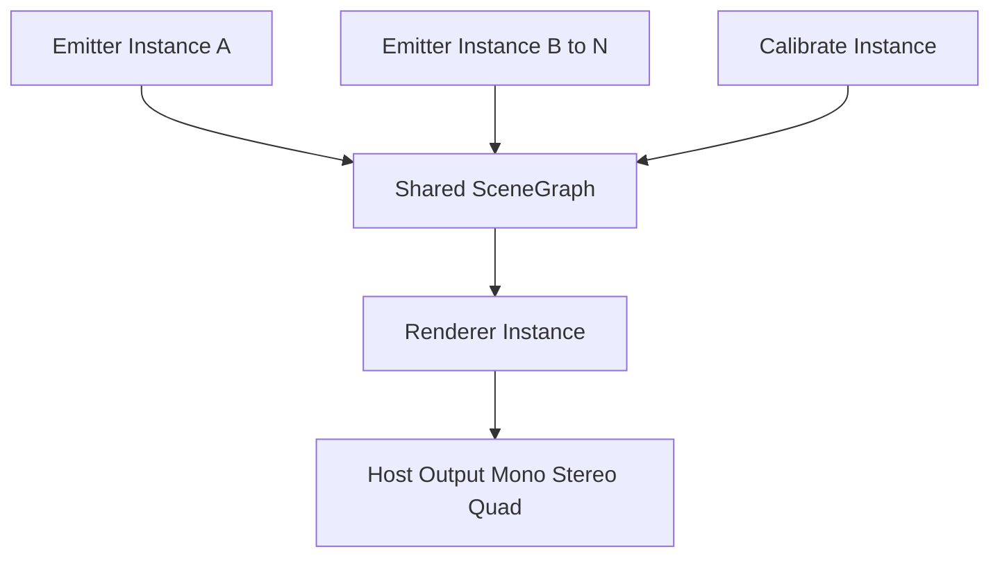
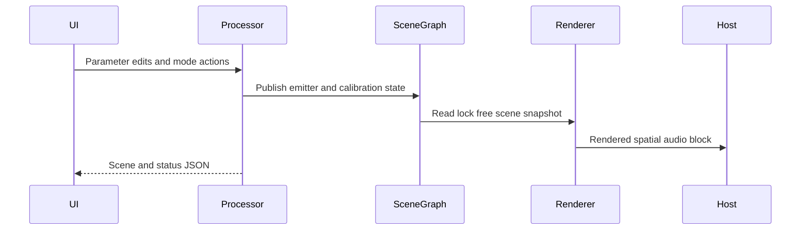
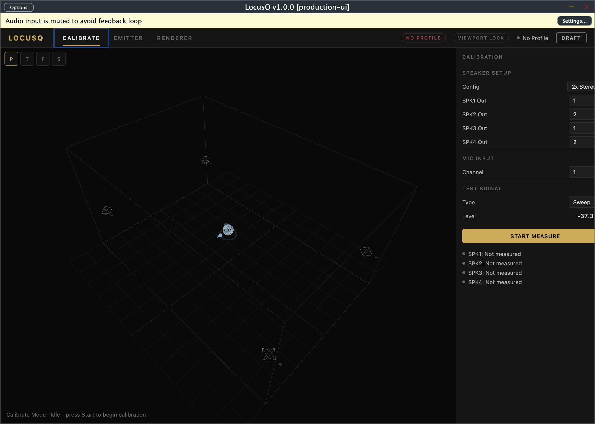
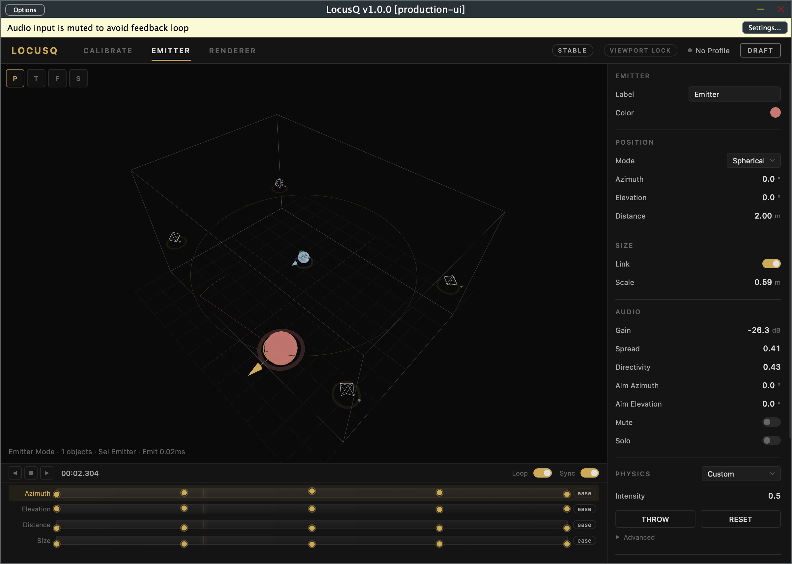
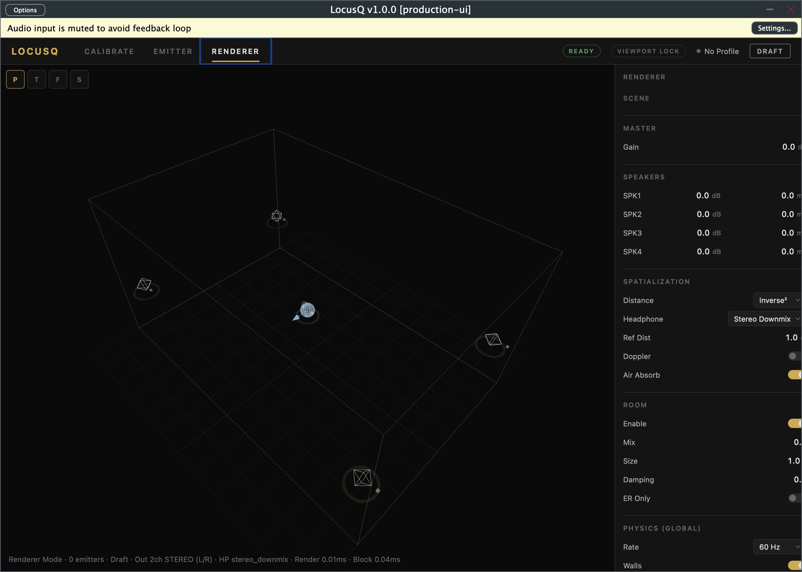

Title: LocusQ Root README
Document Type: Project README
Author: APC Codex
Created Date: 2026-02-19
Last Modified Date: 2026-02-25

# LocusQ

LocusQ is a JUCE 8 spatial-audio plugin for designing, animating, and rendering 3D sound scenes with a WebView-based UI and deterministic real-time behavior.

## What LocusQ Does

LocusQ uses a three-mode workflow:

- `CALIBRATE`: measure your room/speaker setup and generate a room profile.
- `EMITTER`: turn source tracks into spatial emitters with position, directivity, physics, and timeline automation.
- `RENDERER`: collect all active emitters, apply spatial rendering + room processing, and output to mono/stereo/quad layouts.

## Feature Overview

- Multi-instance spatial workflow with a shared scene graph inside the DAW process.
- WebView + Three.js UI for interactive 3D scene visualization.
- Positioning in spherical or cartesian coordinates.
- Physics-enabled motion (gravity, drag, collisions, velocity-based movement).
- Timeline/keyframe animation and preset save/load workflow.
- Spatial processing controls for distance, directivity, spread, doppler, and air absorption.
- Room rendering controls (reflections/room mix/size/damping).
- Output profiles for studio speakers and headphone workflows (including optional Steam Audio path).
- BL-018 strict spatial profile matrix closeout completed (mono/stereo/quad/5.1/7.1/binaural/ambisonic) with deterministic diagnostics evidence.
- BL-022 choreography lane closeout completed (`UI-P1-022` plus `UI-P1-025A..E` regression guard) with refreshed deterministic evidence.
- BL-013 HostRunner feasibility promotion is now Done with Slice D evidence (`TestEvidence/bl013_done_promotion_20260225T170341Z/status.tsv`).
- BL-030 release governance lanes include a dedicated CI workflow (`.github/workflows/release-governance.yml`) and owner replay confirms selftest/reaper/pluginval/docs lanes pass (`TestEvidence/owner_bl030_unblock_replay_20260225T170650Z/status.tsv`); release remains in validation pending `RL-05` and `RL-09`.
- Deterministic QA lanes and scripted validation workflows.

## Supported Platforms and Formats

- macOS: `VST3`, `AU`, `Standalone`
- Windows: `VST3`, `Standalone`
- Linux: `VST3`, `LV2`, `Standalone`

## Install and Setup

### Recommended (macOS)

1. Build and install plugin binaries:
   - `./scripts/build-and-install-mac.sh`
2. Optional: also install standalone app to `~/Applications`:
   - `LOCUSQ_INSTALL_STANDALONE=1 ./scripts/build-and-install-mac.sh`
3. Optional: enable/install CLAP during build:
   - `LOCUSQ_ENABLE_CLAP=1 LOCUSQ_INSTALL_CLAP=1 ./scripts/build-and-install-mac.sh`

Installed plugin locations:
- `~/Library/Audio/Plug-Ins/VST3/LocusQ.vst3`
- `~/Library/Audio/Plug-Ins/Components/LocusQ.component`
- `~/Library/Audio/Plug-Ins/CLAP/LocusQ.clap` (when CLAP is enabled)

### Build Prerequisites

- CMake `>= 3.22`
- C++20-capable toolchain
- JUCE checkout available via:
  - `JUCE_DIR`, or
  - sibling path `../audio-plugin-coder/_tools/JUCE`

## Quick Start Workflow

1. Open LocusQ in your DAW (or standalone).
2. In `CALIBRATE`, set mic/speaker routing and run measurement to establish room context.
3. Insert LocusQ on source tracks in `EMITTER` mode and shape each source:
   - position/size/directivity
   - gain/mute/solo
   - animation/physics behavior
4. Insert one `RENDERER` instance on your spatial bus/master and tune:
   - renderer quality and distance model
   - room + headphone profile settings
   - visualization overlays (trails, vectors, physics lens)
5. Save emitter presets and session state through your DAW project/preset flow.

## Architecture

### System Topology

### Runtime Data Flow

## Modes at a Glance

| Mode | Primary Goal | Typical Controls |
|---|---|---|
| `CALIBRATE` | Speaker/mic routing and room profiling | `cal_mic_channel`, `cal_spk*_out`, `cal_test_level`, `cal_test_type` |
| `EMITTER` | Per-source spatial authoring | position, size, gain, directivity, animation, physics |
| `RENDERER` | Final scene rendering and monitoring | quality, distance, room, headphone, visualization |

## UI Screenshots

### CALIBRATE

### EMITTER

### RENDERER

## Validation Commands

- Primary UI gate: `./scripts/ui-pr-gate-mac.sh`
- Production self-test lane: `./scripts/standalone-ui-selftest-production-p0-mac.sh`
- Host smoke lane: `./scripts/reaper-headless-render-smoke-mac.sh`
- Docs freshness gate: `./scripts/validate-docs-freshness.sh`

## Deep-Dive References

- Architecture and parameters:
  - `.ideas/architecture.md`
  - `.ideas/parameter-spec.md`
- Contracts and invariants:
  - `Documentation/invariants.md`
  - `Documentation/scene-state-contract.md`
  - `Documentation/adr/`
- Current state and release history:
  - `status.json`
  - `CHANGELOG.md`
